# Volvo V60 Owner's Manual

Converted from `V60-manual.pdf`. Image files are stored in the same folder as this Markdown file.

---

<!-- Page 1 -->

WEB EDITION
## OWNER'S MANUAL

---

<!-- Page 2 -->

---

<!-- Page 3 -->

## WELCOME TO THE WORLD-WIDE FAMILY OF VOLVO OWNERS.

We trust that you will enjoy many years of safe
driving in your Volvo, an automobile designed
with your safety and comfort in mind. We encour-
age you to familiarize yourself with the equipment
descriptions and operating instructions in this
manual.

We also urge you and your passengers to wear
seat belts at all times in this (or any other) vehicle.
And, of course, please do not operate a vehicle if

you may be affected by alcohol, medication or
any impairment that could hinder your ability to
drive.

Your Volvo is designed to meet all applicable fed-
eral safety and emission standards. If you have
any questions regarding your vehicle, please con-
tact your Volvo retailer or see the article "Contact-
ing Volvo" for information on getting in touch with
Volvo in the United States and Canada.

---

<!-- Page 4 -->

### Contents

## 2 01

01 Introduction

On-board owner's manual........................
11
Owner's information.................................. 13
Contacting Volvo....................................... 13
About this manual.....................................
14
Change of ownership................................
18
Crash event data....................................... 18
Volvo Structural Parts Statement.............. 19
Information on the Internet.......................
20
Volvo ID..................................................... 20
Open Source Software Notice..................
21
Volvo and the environment.......................
21
Important warnings...................................
22
Volvo On Call Roadside Assistance.......... 23
Technician certification.............................
## 24 02

02 Safety

Occupant safety........................................ 26
Recall information.....................................
26
Reporting safety defects........................... 27
Seat belts – general..................................
28
Seat belts – buckling/unbuckling..............
29
Seat belt reminder..................................... 30
Seat belts – pregnancy.............................
31
Supplemental Restraint System (SRS).....
31
Front airbags.............................................
33
Occupant Weight Sensor.......................... 36
Side impact protection (SIPS) airbags......
39
Inflatable Curtain (IC)................................
41
Whiplash Protection System (WHIPS)......
42
Crash mode – general information............ 44
Crash mode – starting the vehicle............
45
Crash mode – moving the vehicle............. 45
Child safety...............................................
46
Child restraints..........................................
47
Infant seats...............................................
49
Convertible seats......................................
51
Booster cushions......................................
54
ISOFIX/LATCH lower anchors..................
55
## Top tether anchors.................................... 56 02

Integrated booster cushion – general
information................................................
57
Integrated booster cushion – using..........
59
Integrated booster cushion – stowing......
60
Child safety locks...................................... 61

---

<!-- Page 5 -->

### Contents

* Option/accessory, for more information, see Introduction.
3
## 03

03 Instruments and controls

Instrument overview ................................. 63
Information displays – introduction........... 66
Eco Guide* and Power Meter*..................
69
Information displays – indicator symbols.
70
Information displays – warning symbols... 72
My Car – introduction...............................
74
Information displays – ambient tempera-
ture sensor................................................
75
Information displays – trip odometer and
clock.........................................................
76
Inserting/removing remote key.................
76
Ignition modes..........................................
77
Front seats................................................
78
Front seats – folding backrest*.................
79
Front seats – power seat..........................
79
Key memory – power driver's seat* and
door mirrors..............................................
81
Rear seats – head restraints.....................
82
Rear seats – folding backrest...................
84
Steering wheel..........................................
85
Electrically heated* steering wheel...........
86
Lighting panel...........................................
87
High/low beam headlights........................
88
Active high beams (AHB)*.........................
## 88 03

Tunnel detection (models with the rain
sensor* only).............................................
90
Active Bending Lights (ABL)*....................
90
Auxiliary lights*.......................................... 91
Instrument and "theater" lighting..............
91
Parking lights............................................
92
Rear fog lights...........................................
92
Hazard warning flashers...........................
93
Turn signals............................................... 93
Front interior lighting.................................
94
Rear interior lighting..................................
95
Home safe lighting....................................
95
Approach lighting...................................... 96
Windshield wipers.....................................
96
Rain sensor*..............................................
97
Windshield washer....................................
97
Tailgate wiper/washer...............................
98
Power windows......................................... 99
Power door mirrors.................................
100
Power door mirrors – automatic tilting/
retraction.................................................
101
Heated windshield*, rear window and
door mirror defrosters.............................
102
Interior rearview mirror............................
## 103 03

Digital compass*.....................................
103
Power moonroof* – introduction.............
104
Power moonroof* – operation.................
105

HomeLink® Wireless Control System* –
introduction.............................................
106

HomeLink® Wireless Control System* –
programming........................................... 107
Volvo Sensus..........................................
110
Information display – menu controls....... 111
Information display – menu overview.....
111
Information display – messages.............
112
Trip computer – introduction .................
113
Trip computer – functions, analog instru-
ment panel..............................................
114
Trip computer – functions, digital instru-
ment panel..............................................
117
Trip computer – Supplementary informa-
tion..........................................................
119
Trip computer – Trip statistics................
120

---

<!-- Page 6 -->

### Contents

4
* Option/accessory, for more information, see Introduction.
## 04

04 Climate

Climate – general information.................
122
Climate – sensors...................................
122
Air quality................................................
123
Interior Air Quality System (IAQS)*..........
123
Climate – menu settings.........................
124
Air distribution – general.........................
124
Electronic climate control (ECC).............
126
Heated seats...........................................
127
Temperature and blower control............
128
Automatic climate control.......................
128
Air conditioning.......................................
129
Max. defroster and electrically heated
windshield*.............................................. 129
Air distribution – function........................
130
Air distribution – recirculation.................
131
Air distribution – table.............................
## 132 05

05 Loading and storage

Storage spaces.......................................
135
Tunnel console........................................ 137
Tunnel console – 12-volt sockets...........
137
Glove compartment................................
138
Vanity mirror............................................ 138
12-volt socket in the cargo area*............
138
Loading – general...................................
139
Loading – roof load carriers....................
139
Load anchoring eyelets........................... 140
Grocery bag holder.................................
141
Cargo net – general information.............
141
Cargo area cover....................................
143
## Steel cargo grid....................................... 143 06

06 Locks and alarm

Remote key and key blade.....................
146
Remote key – loss................................... 146
Key memory............................................
147
Locking/unlocking confirmation.............. 147
Immobilizer (start inhibitor)...................... 148
Remote key – functions..........................
149
Remote key – range................................
150
Detachable key blade – general informa-
tion..........................................................
151
Detachable key blade – detaching/rein-
serting.....................................................
151
Detachable key blade – unlocking..........
152
Private locking........................................
152
Remote key – replacing the battery........
153
Keyless drive*– locking/unlocking..........
155
Keyless drive* – unlocking with key
blade.......................................................
156
Keyless drive* – key memory..................
156
Keyless drive* – messages.....................
157
Keyless drive* – antenna locations.........
158
Locking/unlocking – from the outside..... 159
Manual locking........................................
160
Locking/unlocking – from inside.............
160
Locking/unlocking – glove compartment 162

---

<!-- Page 7 -->

### Contents

* Option/accessory, for more information, see Introduction.
5
## 06

Locking/unlocking – tailgate...................
162
Alarm – general information....................
164
Alarm indicator........................................
165
Alarm – arming/disarming.......................
165
Alarm signal............................................
166
Alarm – turning off................................... 166
## Alarm-related functions........................... 166 07

07 Driver support

Active chassis* (Four C)..........................
169
Stability system – introduction................ 169
Stability system – operation.................... 170
Stability system – symbols and mes-
sages....................................................... 172
Adjustable steering force*.......................
174
Road Sign Information (RSI)* – introduc-
tion..........................................................
174
Road Sign Information (RSI) – operation
175
Road Sign Information (RSI) – limitations 175
Cruise control (CC) – introduction..........
176
Cruise control (CC) – engaging and set-
ting speed...............................................
176
Toggling between ACC and CC (stand-
ard Cruise Control).................................. 178
Cruise control (CC) – deactivating..........
178
Adaptive Cruise Control – introduction... 179
Adaptive Cruise Control – function.........
180
Adaptive Cruise Control – engaging.......
182
Adaptive Cruise Control – setting speed
183
Adaptive Cruise Control – setting time
interval..................................................... 184
Adaptive Cruise Control – deactivating..
184
Adaptive Cruise Control – passing
## another vehicle........................................ 186 07

Adaptive Cruise Control (ACC) – Queue
Assist......................................................
186
Radar sensor........................................... 188
Adaptive Cruise Control – limitations...... 188
Adaptive Cruise Control – symbols and
messages................................................
190
Adaptive Cruise Control – troubleshoot-
ing...........................................................
192
Distance Alert – introduction................... 193
Distance Alert – operation....................... 193
Distance Alert – limitations...................... 194
Distance Alert – symbols and messages
196
City Safety – introduction........................ 197
City Safety – function..............................
198
City Safety – operation............................ 199
City Safety – limitations..........................
199
City Safety – troubleshooting.................. 200
City Safety – symbols and messages.....
202
City Safety – Laser sensor......................
203
Collision warning – introduction.............. 204
Collision warning* – function................... 206
Collision warning* – operation................
207
Collision warning* – Cyclist detection..... 208
Collision warning* – Pedestrian detec-
tion..........................................................
209

---

<!-- Page 8 -->

### Contents

6
* Option/accessory, for more information, see Introduction.
## 07

Collision warning* – limitations...............
210
The camera’s limitations.........................
212
Collision warning – troubleshooting........ 213
Collision warning – symbols and mes-
sages....................................................... 215
Driver Alert System.................................
217
Driver Alert Control (DAC) – introduction
217
Driver Alert Control (DAC) – operation....
218
Driver Alert Control (DAC) – function......
218
Driver Alert Control (DAC) – limitations...
219
Driver Alert Control (DAC) – symbols and
messages................................................
220
Lane Departure Warning (LDW) – intro-
duction....................................................
222
Lane Departure Warning (LDW) – opera-
tion..........................................................
223
Lane Departure Warning (LDW) - limita-
tions........................................................
224
Lane Departure Warning (LDW) – sym-
bols and messages.................................
225
Lane Keeping Aid (LKA) – introduction...
227
Lane Keeping Aid (LKA) – operation.......
228
Lane Keeping Aid (LKA) – limitations......
230
Lane Keeping Aid (LKA) – symbols and
messages................................................
## 231 07

Park assist – introduction.......................
232
Park assist – function.............................. 232
Park assist – operation...........................
234
Park assist – limitations..........................
235
Park Assist Pilot (PAP)* – introduction....
236
Park Assist Pilot (PAP)* – function..........
236
Park Assist Pilot (PAP)* – operation........
237
Park Assist Pilot (PAP)* – limitations....... 239
Park Assist Pilot (PAP)* – symbols and
messages................................................
240
Park assist – troubleshooting.................. 240
Rear Park Assist Camera (PAC) – intro-
duction....................................................
241
Rear Park Assist Camera (PAC) – func-
tion..........................................................
241
Rear Park Assist Camera (PAC) – opera-
tion..........................................................
242
Rear Park Assist Camera (PAC) – guiding
and marker lines...................................... 243
Rear Park Assist Camera (PAC) – limita-
tions........................................................
245
BLIS* – introduction................................
245
BLIS* – function......................................
246
BLIS* – operation....................................
247
## BLIS* – Cross Traffic Alert (CTA)............. 247 07

BLIS* – limitations...................................
249
BLIS* – messages...................................
250

---

<!-- Page 9 -->

### Contents

* Option/accessory, for more information, see Introduction.
7
## 08

08 Starting and driving

Starting the engine.................................. 252
Switching off the engine.........................
254
Engine Remote Start (ERS)* – introduc-
tion..........................................................
254
Engine Remote Start (ERS)* – starting the
engine.....................................................
255
Engine Remote Start (ERS)* – switching
off the engine..........................................
255
Jump starting..........................................
256
Transmission – general information........
257
Transmission – positions........................
257
Transmission – Geartronic......................
259
Transmission – shiftlock override...........
261
Start/Stop – Hill Start Assist (HSA).........
262
Start/Stop – introduction........................
262
Start/Stop – function............................... 262
Start/Stop – Auto-stop exceptions.........
263
Start/Stop – Auto-start exceptions.........
264
Start/Stop – settings...............................
265
Start/Stop – symbols and messages......
266
ECO*.......................................................
267
All Wheel Drive (AWD).............................
269
Hill Descent Control (HDC) – introduc-
tion..........................................................
269
Hill Descent Control (HDC) – operation..
## 270 08

Brakes – general.....................................
271
Brakes – symbols ................................... 273
Anti-lock braking system (ABS)..............
273
Brake lights.............................................
273
Emergency Brake Assistance (EBA).......
274
Parking brake – general information.......
274
Parking brake – applying........................
275
Parking brake – releasing........................ 276
Parking brake – symbols and messages
277
Driving through water.............................. 278
Engine and cooling system.....................
279
Conserving electrical current..................
279
Before a long distance trip...................... 279
Driving in cold weather...........................
280
Refueling – fuel requirements.................
281
Refueling – octane rating........................
282
Refueling – opening/closing fuel filler
door......................................................... 283
Refueling – opening/closing fuel cap......
284
Emission controls.................................... 285
Economical driving.................................. 285
Towing a trailer.......................................
287
Trailer Stability Assist (TSA)....................
288
Towing the vehicle..................................
## 289 08

Towing eyelet..........................................
289
Towing by tow truck...............................
290

---

<!-- Page 10 -->

### Contents

8
* Option/accessory, for more information, see Introduction.
## 09

09 Wheels and tires

Tires – general information...................... 293
Tires – storage and age..........................
294
Tires – tread wear indicator....................
295
Tires – tire economy................................ 295
Changing a wheel – direction of rotation
296
Changing a wheel – removing wheel......
296
Changing a wheel – spare wheel............
299
Changing a wheel – accessing the spare
wheel....................................................... 300
Changing a wheel – installing a wheel....
300
Tire inflation – general information.......... 301
Tire inflation – checking pressure...........
302
Tire specifications...................................
303
Tire inflation – pressure table..................
305
Loading specifications............................
307
Loading specifications – load limit.......... 307
Tire specifications – terminology............
308
Tire specifications – Uniform Tire Quality
Grading...................................................
309
Snow chains............................................ 310
Snow tires/studded tires.........................
311
Tire pressure monitoring - introduction..
311
Tire Pressure Monitoring System (TPMS)
– general information..............................
## 312 09

Tire Pressure Monitoring System (TPMS)
– changing wheels..................................
313
Tire Pressure Monitoring System (TPMS)
– recalibrating.........................................
314
Tire Pressure Monitoring System (TPMS)
– activating/deactivating.........................
315
Tire Pressure Monitoring System (TPMS)
– messages.............................................
315
Tire Monitor - introduction......................
316
Calibrating Tire Monitor..........................
317
Tire Monitor status information...............
317
Tire Monitor – messages......................... 318
Self-supporting run flat tires (SST).......... 319
Tire sealing system* – general informa-
tion..........................................................
319
Tire sealing system* – overview..............
321
Tire sealing system* – sealing hole.........
322
Tire sealing system – checking inflation
pressure..................................................
324
Tire sealing system* – inflating tires........ 324
Tire sealing system* – sealing compound
container.................................................
## 325 10

10 Maintenance and servicing

Maintenance – introduction....................
327
Maintenance – owner maintenance........
328
Maintenance – hoisting...........................
329
Onboard Diagnostic System...................
330
Booking service and repairs ..................
330
Maintenance – opening/closing hood..... 332
Engine compartment – overview............
333
Engine compartment – engine oil...........
334
Engine compartment – coolant...............
336
Engine compartment – brake fluid..........
337
Engine compartment – power steering
fluid.........................................................
338
Bulbs – introduction................................
339
Bulbs – headlight housing....................... 340
Bulbs – cover..........................................
341
Bulbs – low beam, Halogen....................
342
Bulbs – high beam, Halogen...................
342
Bulbs – extra high beam.........................
343
Bulbs – front turn signals........................
344
Bulbs – taillight housing..........................
344
Bulbs – license plate lighting..................
345
Bulbs – cargo area lighting.....................
345
Bulbs – vanity mirror lighting..................
346
Bulbs – specifications.............................
346

---

<!-- Page 11 -->

### Contents

9
## 10

Wiper blades – service position..............
347
Wiper blades – windshield......................
348
Wiper blades – tailgate...........................
349
Engine compartment – washer fluid.......
349
Battery – symbols...................................
349
Battery – handling...................................
350
Battery – maintenance............................
351
Battery – changing..................................
352
Fuses – introduction...............................
354
Fuses – engine compartment.................
355
Fuses – glove compartment...................
359
Fuses – cargo area/trunk........................
362
Fuses – engine compartment cold zone
(Start/Stop only)......................................
363
Washing the car......................................
365
Automatic car wash................................
366
Polishing and waxing..............................
366
Cleaning the interior................................
367
Touching up paintwork...........................
## 369 11

11 Specifications

Label information....................................
372
Dimensions.............................................
375
Weights...................................................
378
Engine specifications..............................
380
Oil specifications..................................... 381
Oil volume...............................................
382
Coolant – specification and volume........ 383
Transmission oil – specification and vol-
umes.......................................................
383
Brake fluid – specification and volume...
383
Power steering – specification................
384
Washer fluid – specification and volume
384
Fuel tank volume – specification and vol-
ume.........................................................
384
Air conditioning – specification and vol-
ume.........................................................
385
Battery specifications.............................
386
Symbols – general information...............
387
Warning symbols....................................
387
Indicator symbols.................................... 388
Information symbols...............................
389
Information symbols – ceiling console.... 390
Information symbols – center console....
## 390 12

12 Index

Index.......................................................
392

---

<!-- Page 12 -->

INTRODUCTION

---

<!-- Page 13 -->

### 01 Introduction

01

}}

11

On-board owner's manual
The owner's manual can be displayed on the
center console screen and you can carry out
searches for the information that you require.

To open the owner's manual, press the MY
CAR button on the center console, press OK/
MENU and select Owner's manual.

For basic information, see "Infotainment -
operating the system." The following sections
also provide more detailed information.

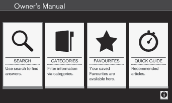

The on-board owner's manual start page

There are four ways of finding information
articles in the on-board owner's manual:
•
Searching: search for an article.
•
Categories: All of the articles are sorted
by category.
•
Favorites: Quick access to frequently
read articles.

•
Quick Guide: A selection of articles cov-
ering commonly used functions.

Select the symbol in the lower right-hand cor-
ner for additional information about the on-
board owner's manual.

NOTE
•
The on-board owner's manual cannot
be accessed while the vehicle is mov-
ing.
•
Specifications regarding your vehicle
are not found in the on-board informa-
tion. This information is listed in the
printed owner's manual.

Searching for information

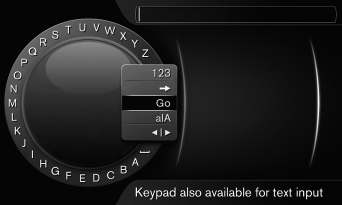

Searching using the text wheel

List of characters

Switching between character entry
modes (see the following table)

Surf history

Use the text wheel to enter a web address.

1.
Turn TUNE to the desired letter and press
OK/MENU to confirm. The number/letter
keys on the center console can also be
used.

2.
Continue to the next letter, etc. The
results of the search will be displayed in
the phone book.

---

<!-- Page 14 -->

||

### 01 Introduction

01

12

3.
To switch from letter entry mode to the
entry mode for numbers or special char-
acters, or to go view surf history, turn
TUNE to one of the selections (see the
explanation in the following table) in the
list for switching character entry mode (2)
and press OK/MENU.

123/A
BC

Toggle between letters and num-
bers by pressing OK/MENU.

=>
This leads to surf history. Turn
TUNE to select a web address
and press OK/MENU to go to the
website.

Go
Go to the website by pressing
OK/MENU.

a|A
Toggle between upper and lower
case letters by pressing OK/
MENU.

| | }
Switch from the text wheel to the
Address: field. Use TUNE to
move the cursor and erase char-
acters by pressing EXIT. Press
OK/MENU to return to the text
wheel.

The number/letter keys on the
center console can also be used
to edit the Address: field.

Press EXIT briefly to erase a single character.
Press and hold EXIT to erase all characters.

Pressing a number key on the center console
while the text wheel is displayed (see the pre-
vious illustration) will display a list of charac-
ters. Press the desired key repeatedly to
enter the desired letter and continue to the
next letter, etc.

To enter a number, press and hold the but-
ton.

Categories
The articles in the on-board owner's manual
are divided into main categories and sub-cat-
egories. The same article may be listed in
several applicable categories to help make
searches easier.

Turn TUNE to navigate in the category struc-
ture and press OK/MENU to open a category
(indicated by the
symbol) or an article
(indicated by the
symbol). Press EXIT to
return to the previous view.

Favorites
Articles that have been marked as favorites
can be found here. For information about
marking an article as a favorite, see "Navigat-
ing in an article" below.

Turn TUNE to navigate in the list of favorites
and press OK/MENU to open an article.
Press EXIT to return to the previous view.

Quick Guide
This is a selection of articles that will help you
become familiar with some of the vehicle's
most common functions. These articles can
also be found in their respective categories
but are listed here for quick access.

Turn TUNE to navigate in the Quick Guide
and press OK/MENU to open an article.
Press EXIT to return to the previous view.

Navigating in an article

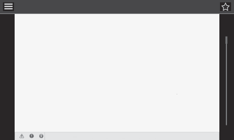

Home: Returns you to the owner's man-
ual start page.

Favorites: Add/remove an article from
the list of favorites. This can also be done
by pressing the FAV button on the center
console keypad.

Highlighted link: takes you to the linked
article.

Important information: if the article con-
tains warnings, cautions or notes, sym-

---

<!-- Page 15 -->

### 01 Introduction

01

13

bols for these types of information and
the number of such texts in the article will
be displayed here.
Turn TUNE to navigate among the links or
scroll in an article. When you have scrolled to
the beginning/end of an article, you can
return to the start page or a favorite by scroll-
ing one additional step up/down. Press OK/
MENU to activate a selection or highlighted
link. Press EXIT to return to the previous
view.

Related information
•
Information on the Internet (p. 20)

Owner's information
Your vehicle is equipped with a screen on
which you can display information about your
vehicle's features and functions. The printed
owner's manual supplements the on-board
information and contains important texts, the
latest updates and instructions that can be
useful in situations when it is not practical to
read the information on the screen.

Changing the language used for the on-board
information could mean that some of the
information displayed may not comply with
national or local statutes and regulations.

WARNING

The driver is always responsible for oper-
ating the vehicle in a safe manner and for
complying with current statutes and regu-
lations.

It is also essential to maintain and service
the vehicle according to Volvo's recom-
mendations as stated in the owner's infor-
mation and the service and warranty book-
let.

If the on-board information differs from the
printed owner's manual, the printed infor-
mation always takes precedence.

Contacting Volvo

In the USA:

Volvo Cars of North America, LLC

Customer Care Center

1 Volvo Drive,

P.O. Box 914

Rockleigh, New Jersey 07647

1-800-458-1552

www.volvocars.com/us

In Canada:

Volvo Cars of Canada

National Customer Service

9130 Leslie Street, Suite 101

Richmond Hill, Ontario L4B 0B9

1-800-663-8255

www.volvocars.com/ca

Related information
•
About this manual (p. 14)
•
Important warnings (p. 22)
•
Crash event data (p. 18)
•
Volvo Structural Parts Statement (p. 19)

---

<!-- Page 16 -->

### 01 Introduction

01

14

About this manual
Reading your owner's manual is a good way
to familiarize yourself with the features and
systems in your vehicle.

•
Before you operate your vehicle for the
first time, we recommend that you look
through the information found in the
chapters "Your Driving Environment" and
"During Your Trip."
•
Information contained in the balance of
the manual is extremely useful and should
be read after operating the vehicle for the
first time.
•
The manual is structured so that it can be
used for reference. For this reason, it
should be kept in the vehicle for ready
access.

On-board owner's manual
When the printed manual refers to the on-
board owner's manual, this pertains to the
information displayed on the center console
screen.

There are four ways of finding information
articles in the on-board owner's manual:
•
Searching: search for an article.
•
Categories: All of the articles are sorted
by category.
•
Favorites: Quick access to frequently
read articles.
•
Quick Guide: A selection of articles cov-
ering commonly used functions.

Select the symbol in the lower right-hand cor-
ner for additional information about the on-
board owner's manual.

NOTE
•
The on-board owner's manual cannot
be accessed while the vehicle is mov-
ing.
•
Specifications regarding your vehicle
are not found in the on-board informa-
tion. This information is listed in the
printed owner's manual.

The owner's manual in mobile devices

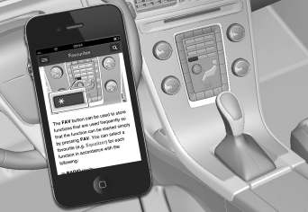

NOTE

The owner's manual mobile app can be
downloaded at www.volvocars.com.

The mobile app also contains videos and
searchable content, and provides easy
navigation between the various articles.

Footnotes
Certain pages of this manual contain informa-
tion in the form of footnotes at the bottom of
the page. This information supplements the
text that the footnote number refers to (a let-
ter is used if the footnote refers to text in a
table).

Display texts
There are several displays in the driver’s field
of vision that show messages generated by
various systems and functions in the vehicle.
These texts are indicated in the Owner’s
Manual by being in slightly larger type than
the surrounding text and are printed in gray,
(for example: Change doors unlock
setting).

Decals
There are various types of decals in the vehi-
cle whose purpose is to provide important
information in a clear and concise way. The
importance of these decals is explained as
follows, in descending order of importance.

---

<!-- Page 17 -->

### 01 Introduction

01

}}

15

Risk of injury

G031590

Black ISO symbols on a yellow warning back-
ground, white text/image on a black back-
ground. Decals of this type are used to indi-
cate potential danger. Ignoring a warning of
this type could result in serious injury or
death.

Risk of damage to the vehicle

G031592

White ISO symbols and white text/image on a
black or blue warning background and space
for a message. If the information on decals of
this type is ignored, damage to the vehicle
could result.

Information

G031593

White ISO symbols and white text/image on a
black background. These decals provide gen-
eral information.

NOTE

The decals shown in the Owner’s Manual
are examples only and are not intended to
be reproductions of the decals actually
used in the vehicle. The purpose is to give
an indication of how they look and their
approximate location in the vehicle. The
applicable information for your particular
vehicle can be found on the respective
decals in the vehicle.

---

<!-- Page 18 -->

||

### 01 Introduction

01

16

Types of lists used in the owner's
information

Procedures
Procedures (step-by-step instructions), or
actions that must be carried out in a certain
order, are arranged in numbered lists in this
manual.

If there is a series of illustrations associ-
ated with step-by-step instructions, each
step in the procedure is numbered in the
same way as the corresponding illustra-
tion.

Lists in which letters are used can be
found with series of illustrations in cases
where the order in which the instructions
are carried out is not important.

Arrows with or without numbers are used
to indicate the direction of a movement.

Arrows containing letters are used to indi-
cate movement.

If there are no illustrations associated with a
step-by-step list, the steps in the procedure
are indicated by ordinary numbers.

Position lists

Red circles containing a number are used
in general overview illustrations in which
certain components are pointed out. The
corresponding number is also used in the
position list's description of the various
components.

Bullet lists
Bullets are used to differentiate a number of
components/functions/points of information
that can be listed in random order.

For example:
•
Coolant
•
Engine oil

Continues on next page
} }This symbol can be found at the lower
right corner to indicate that the current topic
continues on the following page.

Continuation from previous page
|| This symbol can be found at the upper left
corner to indicate that the current topic is a
continuation from the previous page.

Options and accessories
Optional or accessory equipment described
in this manual is indicated by an asterisk.

Optional or accessory equipment may not be
available in all countries or markets. Please
note that some vehicles may be equipped dif-
ferently, depending on special legal require-
ments.

Contact your Volvo retailer for additional
information.

NOTE
•
Do not export your Volvo to another
country before investigating that coun-
try's applicable safety and exhaust
emission requirements. In some cases
it may be difficult or impossible to
comply with these requirements. Mod-
ifications to the emission control sys-
tem(s) may render your Volvo not certi-
fiable for legal operation in the U.S.,
Canada and other countries.
•
All information, illustrations and speci-
fications contained in this manual are
based on the latest product informa-
tion available at the time of publica-
tion. Please note that some vehicles
may be equipped differently, depend-
ing on special legal requirements.
Optional equipment described in this
manual may not be available in all mar-
kets.
•
Some of the illustrations shown are
generic and may not depict the exact
model for which this manual is
intended.
•
Volvo reserves the right to make model
changes at any time, or to change
specifications or design without notice
and without incurring obligation.

---

<!-- Page 19 -->

### 01 Introduction

01

17

WARNING

If your vehicle is involved in an accident,
unseen damage may affect its drivability
and safety.

WARNING

CALIFORNIA proposition 65

Engine exhaust, some of its constituents,
and certain vehicle components contain or
emit chemicals known to the state of Cali-
fornia to cause cancer, and birth defects
or other reproductive harm. In addition,
certain fluids contained in vehicles and
certain products of component wear con-
tain or emit chemicals known to the State
of California to cause cancer, and birth
defects or other reproductive harm.

WARNING

Certain components of this vehicle such as
air bag modules, seat belt pretensioners,
adaptive steering columns, and button cell
batteries may contain Perchlorate material.
Special handling may apply for service or
vehicle end of life disposal.

See www.dtsc.ca.gov/hazardouswaste/
perchlorate.

Shiftlock
When your vehicle is parked, the gear selec-
tor is locked in the P (Park) position. To
release the selector from this position, the

ignition must be in mode II (p. 77) or the
engine must be running. Depress the brake
pedal, press the button on the front side of
the gear selector and move the selector from
P (Park).

Anti-lock Brake System (ABS)
The ABS system performs a brief self-diag-
nostic test when the engine has been started
and driver releases the brake pedal. Another
automatic test may be performed when the
vehicle first reaches a speed of approximately
6 mph (10 km/h). The brake pedal will pulsate
several times and a sound may be audible
from the ABS control module. This is normal.

Fuel filler door
Press the button on the light switch panel
(see the illustration in Refueling – opening/
closing fuel filler door (p. 283)) when the vehi-
cle is at a standstill to unlock the fuel filler
door. It will relock when closed and there will
be an audible click.

Points to keep in mind
•
Do not export your Volvo to another
country before investigating that coun-
try's applicable safety and exhaust emis-
sion requirements. In some cases it may
be difficult or impossible to comply with
these requirements. Modifications to the
emission control system(s) may render
your Volvo not certifiable for legal opera-

tion in the U.S., Canada and other coun-
tries.
•
All information, illustrations and specifica-
tions contained in this manual are based
on the latest product information availa-
ble at the time of publication. Please note
that some vehicles may be equipped dif-
ferently, depending on special legal
requirements. Optional equipment descri-
bed in this manual may not be available in
all markets.
•
Some of the illustrations shown are
generic and may not depict the exact
model for which this manual is intended.
•
Volvo reserves the right to make model
changes at any time, or to change speci-
fications or design without notice and
without incurring obligation.

Related information
•
Information on the Internet (p. 20)
•
Volvo and the environment (p. 21)
•
Important warnings (p. 22)

---

<!-- Page 20 -->

### 01 Introduction

01

18

Change of ownership
When the vehicle changes owners, all per-
sonal settings should be reset to the factory
defaults.

To reset, press the MY CAR button in the
center console followed by OK/MENU and
select Settings
Reset to factory settings.

User data e.g., for apps, the web browser
and for personal settings in menus such as
the climate system and vehicle settings
should be reset to factory defaults.

For vehicles equipped with the optional Volvo
On Call with Sensus Connect (VOC), personal
settings stored in the vehicle should be
deleted, see Changing ownership of a vehicle
with Volvo On Call.

Related information
•
Volvo ID (p. 20)

Crash event data
This vehicle is equipped with an event data
recorder (EDR). The main purpose of an EDR
is to record, in certain crash or near crash-like
situations, such as an air bag deployment or
hitting a road obstacle, data that will assist in
understanding how a vehicle's systems per-
formed. The EDR is designed to record data
related to vehicle dynamics and safety sys-
tems for a short period of time, typically 30
seconds or less. The EDR in this vehicle is
designed to record such data as:

•
How various systems in your vehicle were
operating;
•
Whether or not the driver and passenger
safety belts were buckled/fastened;
•
How far (if at all) the driver was depress-
ing the accelerator and/or brake pedal;
and,
•
How fast the vehicle was traveling.

These data can help provide a better under-
standing of the circumstances in which
crashes and injuries occur.

NOTE

EDR data are recorded by your vehicle
only if a non-trivial crash situation occurs;
no data are recorded by the EDR under
normal driving conditions and no personal
data (e.g., name, gender, age, and crash
location) are recorded. However, other
parties, such as law enforcement, could
combine the EDR data with the type of
personally identifying data routinely
acquired during a crash investigation.

To read data recorded by an EDR, special
equipment is required, and access to the
vehicle or the EDR is needed. In addition to
the vehicle manufacturer, other parties, such
as law enforcement, that have the special
equipment, can read the information if they
have access to the vehicle or the EDR.

Furthermore, your vehicle is equipped with a
number of computers whose task is to con-
tinuously control and monitor the vehicle’s
operation. They can also register information
during normal driving conditions if they detect
a fault relating to the vehicle’s operation and
functionality. Some of the stored information
is required by technicians when carrying out
service and maintenance to enable them to
diagnose and rectify any faults that have
occurred in the vehicle and to enable Volvo to
fulfill legal and other regulatory requirements.
This information may be stored in the vehi-
cle’s computers for a certain period of time.

---

<!-- Page 21 -->

### 01 Introduction

01

}}

19

Volvo will not contribute to spreading the
above-mentioned information to third parties
without the consent of the vehicle’s owner.
However, due to national legal requirements
and regulations, Volvo may be compelled to
provide information of this type to authorities
such as law enforcement agencies or others
who may assert a legal right to obtain such
information.

Volvo and service and repair facilities with
agreements with Volvo have access to the
special technical equipment required in order
to read and interpret the information stored
by the vehicle’s computers. Volvo is responsi-
ble for ensuring that the information transmit-
ted to Volvo during service and maintenance
is stored and handled in a secure manner and
that this handling is done in accordance with
applicable legal requirements. For additional
information, contact:

For additional information, contact:

In the United States

Volvo Cars of North America, LLC

Customer Care Center

1 Volvo Drive, P.O. box 914

Rockleigh, New Jersey 07647

1-800-458-1552

www.volvocars.com/us

In Canada

Volvo Cars of Canada

National Customer Service

9130 Leslie Street

Richmond Hill, Ontario L4B 0B9

1-800-663-8255

www.volvocars.com/ca

Related information
•
Information on the Internet (p. 20)
•
Contacting Volvo (p. 13)

Volvo Structural Parts Statement
Volvo has always been and continues to be a
leader in automotive safety.

Volvo engineers and manufactures vehicles
designed to help protect vehicle occupants in
the event of a collision.

Volvos are designed to absorb the impact of
a collision. This energy absorption system
including, but not limited to, structural com-
ponents such as bumper reinforcement bars,
bumper energy absorbers, frames, rails,
fender aprons, A-pillars, B-pillars and body
panels must work together to maintain cabin
integrity and protect the vehicle occupants.

The supplemental restraint system including
but not limited to air bags, side curtain air
bags, and deployment sensors work together
with the above components to provide proper
timing for air bag deployment.

Due to the above, Volvo Cars of North Amer-
ica does not support the use of aftermarket,
alternative or anything other than original
Volvo parts for collision repair.

In addition Volvo does not support the use or
re-use of structural components from an
existing vehicle that has been previously
damaged. Although these parts may appear
equivalent, it is difficult to tell if the parts have
been previously replaced with non-OE parts
or if the part has been damaged as a result of
a prior collision. The quality of these used

---

<!-- Page 22 -->

||

### 01 Introduction

01

20
* Option/accessory, for more information, see Introduction.

parts may also have been affected due to
environmental exposure.

Related information
•
Important warnings (p. 22)
•
Information on the Internet (p. 20)
•
Contacting Volvo (p. 13)

Information on the Internet
Additional information regarding your vehicle
can be found at www.volvocars.com.

In order to read a QR code, a QR reader is
necessary, which is available as an app for a
number of different cell phones and can be
downloaded from the App Store or Google
Play.

QR code

Related information
•
About this manual (p. 14)
•
Contacting Volvo (p. 13)

Volvo ID
This is your personal ID that can be used to
access a number of services1

Creating a Volvo ID
To create a Volvo ID, provide your personal
email address and then follow the instructions
provided in the email that you will receive
from Volvo. This can be done from:
•
From an Internet-connected vehicle:
Enter your email address in the app that
requires a Volvo ID and follow the instruc-
tions provides or press the Internet con-
nect (
) button on the center console
and select Apps, Settings and follow the
instructions provided.
•
Volvo On Call (VOC*): download the latest
version of the VOC app and create a
Volvo ID on the start page.

1 These services vary and may be subject to change. Consult your Volvo retailer.

---

<!-- Page 23 -->

### 01 Introduction

01

}}

21

Open Source Software Notice
The systems in your Volvo contain certain
free/open source and other software.

This product uses certain free / open source
and other software originating from third
parties, that is subject to the GNU General
Public License version 2 and 3 (GPLv2/
GPLv3), GNU Lesser General Public License
version 3 (LGPLv3), The FreeType Project
License (“FreeType License”) and other
different and/or additional copyright licenses,
disclaimers and notices. The links how to
access the exact terms of GPLv2, GPLv3,
LGPLv3, and the other open source software
licenses, disclaimers, acknowledgements and
notices are provided to you below. Please
refer to the exact terms of the relevant
License, regarding your rights under said
licenses. Volvo Car Corporation (VCC) offers
to provide the source code of said free/open
source software to you for a charge covering
the cost of performing such distribution, such
as the cost of media, shipping and handling,
upon written request. Please contact your
nearest Volvo retailer.

This offer is valid for a period of at least three
(3) years from the date of the distribution of
this product by VCC / or for as long as VCC
offers spare parts or customer support.

Portions of this product uses software
copyrighted © v2.4.3/2010 The

FreeTypeProject (www.freetype.org). All rights
reserved.

This product includes software under
following licenses:

GPL v2 : http://www.gnu.org/licenses/old-
licenses/gpl-2.0.html
•
Linux kernel (merge between MontaVista
2.6.31 kernel and kernel from
L2.6.31_MX51_ER_1007 BSP)
•
uBoot (based on v2009.08)
•
busybox (based on version 1.13.2.)

GCC runtime library exception: http://
www.gnu.org/licenses/gcc-exception.html
•
libgcc_s.so.1

LGPL v3: http://www.gnu.org/licenses/
lgpl.html
•
Libc.so.6, libpthread.so.0, Librt.so.1

The FreeType Project License: http://
www.freetype.org/FTL.TXT
•
libfreetype.so.6 (version 2.4.3)

Related information
•
About this manual (p. 14)

Volvo and the environment
Volvo is committed to the well being of its
customers. As a natural part of this commit-
ment, we care about the environment in
which we all live. Concern for the environment
means an everyday involvement in reducing
our environmental impact.

Volvo's environmental activities are based on
a holistic view, which means we consider the
overall environmental impact of a product
throughout its complete life cycle. In this con-
text, design, production, product use, and
recycling are all important considerations. In
production, Volvo has partly or completely
phased out several chemicals including
CFCs, lead chromates, asbestos, and cad-
mium; and reduced the number of chemicals
used in our plants 50% since 1991.

Volvo was the first in the world to introduce
into production a three-way catalytic con-
verter with a Lambda sond, now called the
heated oxygen sensor, in 1976. The current
version of this highly efficient system reduces
emissions of harmful substances (CO, HC,
NOx) from the exhaust pipe by approximately
95 – 99% and the search to eliminate the
remaining emissions continues. Volvo is the
only automobile manufacturer to offer CFC-
free retrofit kits for the air conditioning system
of all models as far back as the 1975
model 240. Advanced electronic engine con-
trols and cleaner fuels are bringing us closer
to our goal. In addition to continuous environ-

---

<!-- Page 24 -->

||

### 01 Introduction

01

22

mental refinement of conventional gasoline-
powered internal combustion engines, Volvo
is actively looking at advanced technology
alternative-fuel vehicles.

When you drive a Volvo, you become our
partner in the work to lessen the car's impact
on the environment. To reduce your vehicle's
environmental impact, you can:
•
Maintain proper air pressure in your tires.
Tests have shown decreased fuel econ-
omy with improperly inflated tires.
•
Follow the recommended maintenance
schedule in your Warranty and Service
Records Information booklet.
•
Drive at a constant speed whenever pos-
sible.
•
See a trained and qualified Volvo service
technician as soon as possible for
inspection if the check engine (malfunc-
tion indicator) light illuminates, or stays
on after the vehicle has started.
•
Properly dispose of any vehicle-related
waste such as used motor oil, used bat-
teries, brake pads, etc.
•
When cleaning your vehicle, please use
genuine Volvo car care products. All
Volvo car care products are formulated to
be environmentally friendly.

FSC®

The FSC® (Forest Stewardship Council®)
symbol indicates that the wood pulp used in
this publication comes from FSC® certified
forests and other responsible sources.

Related information
•
Economical driving (p. 285)
•
Tires – tire economy (p. 295)

Important warnings
Please keep the following warnings in mind
when operating/servicing your vehicle.

Driver distraction
A driver has a responsibility to do everything
possible to ensure his or her own safety and
the safety of passengers in the vehicle and
others sharing the roadway. Avoiding distrac-
tions is part of that responsibility.

Driver distraction results from driver activities
that are not directly related to controlling the
vehicle in the driving environment. Your new
Volvo is, or can be, equipped with many fea-
ture-rich entertainment and communication
systems. These include hands-free cellular
telephones, navigation systems, and multi-
purpose audio systems. You may also own
other portable electronic devices for your own
convenience. When used properly and safely,
they enrich the driving experience. Improperly
used, any of these could cause a distraction.

For all of these systems, we want to provide
the following warning that reflects the strong
Volvo concern for your safety. Never use
these devices or any feature of your vehicle in
a way that distracts you from the task of driv-
ing safely. Distraction can lead to a serious
accident. In addition to this general warning,
we offer the following guidance regarding
specific newer features that may be found in
your vehicle:

---

<!-- Page 25 -->

### 01 Introduction

01

23

•
Never use a hand-held cellular telephone
while driving. Some jurisdictions prohibit
cellular telephone use by a driver while
the vehicle is moving.
•
If your vehicle is equipped with a naviga-
tion system, set and make changes to
your travel itinerary only with the vehicle
parked.
•
Never program your audio system while
the vehicle is moving. Program radio pre-
sets with the vehicle parked, and use
your programmed presets to make radio
use quicker and simpler.
•
Never use portable computers or per-
sonal digital assistants while the vehicle is
moving.

Accessory installation
•
We strongly recommend that Volvo own-
ers install only genuine, Volvo-approved
accessories, and that accessory installa-
tions be performed only by a trained and
qualified Volvo service technician.
•
Genuine Volvo accessories are tested to
ensure compatibility with the perform-
ance, safety, and emission systems in
your vehicle. Additionally, a trained and
qualified Volvo service technician knows
where accessories may and may not be
safely installed in your Volvo. In all cases,
please consult a trained and qualified
Volvo service technician before installing
any accessory in or on your vehicle.

•
Accessories that have not been approved
by Volvo may or may not be specifically
tested for compatibility with your vehicle.
Additionally, an inexperienced installer
may not be familiar with some of your
car's systems.
•
Any of your car's performance and safety
systems could be adversely affected if
you install accessories that Volvo has not
tested, or if you allow accessories to be
installed by someone unfamiliar with your
vehicle.
•
Damage caused by unapproved or
improperly installed accessories may not
be covered by your new vehicle warranty.
See your Warranty and Service Records
Information booklet for more warranty
information. Volvo assumes no responsi-
bility for death, injury, or expenses that
may result from the installation of non-
genuine accessories.

Related information
•
About this manual (p. 14)
•
Volvo Structural Parts Statement (p. 19)

Volvo On Call Roadside Assistance
Your new Volvo comes with a four year ON
CALL roadside assistance.

Additional information, features, and benefits
of this program are described in a separate
information package in your glove compart-
ment.

If you require assistance, dial:

In the U.S. 1-800-638-6586 (1-800-63-
VOLVO)

In Canada 1-800-263-0475

NOTE

Some vehicles may be equipped with
Volvo On Call with Sensus Connect,
which will allow access to the call center
and additional features directly from the
vehicle. This is in addition to the Volvo On
Call Roadside Assistance program men-
tioned above.

Volvo On Call with Sensus Connect will
be a customer pay subscription offer after
an initial complimentary trial period.

Related information
•
Information on the Internet (p. 20)

---

<!-- Page 26 -->

### 01 Introduction

01

24

Technician certification
In addition to Volvo factory training, Volvo
supports certification by the National Institute
for Automotive Service Excellence (A.S.E.).

Certified technicians have demonstrated a
high degree of competence in specific areas.
Besides passing exams, each technician
must also have worked in the field for two or
more years before a certificate is issued.
These professional technicians are best able
to analyze vehicle problems and perform the
necessary maintenance procedures to keep
your Volvo at peak operating condition.

---

<!-- Page 27 -->

SAFETY

---

<!-- Page 28 -->

### 02 Safety

02

26

Occupant safety
Safety is Volvo's cornerstone.

Volvo's concern for safety
Our concern for safety dates back to 1927
when the first Volvo rolled off the production
line. Three-point seat belts (a Volvo inven-
tion), safety cages, and energy-absorbing
impact zones were designed into Volvo vehi-
cles long before it was fashionable or
required by government regulation.

We will not compromise our commitment to
safety. We continue to seek out new safety
features and to refine those already in our
vehicles. You can help. We would appreciate
hearing your suggestions about improving
automobile safety. We also want to know if
you ever have a safety concern with your
vehicle. Call us in the U.S. at:
1-800-458-1552 or in Canada at:
1-800-663-8255.

Occupant safety reminders
How safely you drive doesn't depend on how
old you are but rather on:
•
How well you see.
•
Your ability to concentrate.
•
How quickly you make decisions under
stress to avoid an accident.

The following suggestions are intended to
help you cope with the ever changing traffic
environment.

•
Never drink and drive.
•
If you are taking any medication, consult
your physician about its potential effects
on your driving abilities.
•
Take a driver-retraining course.
•
Have your eyes checked regularly.
•
Keep your windshield and headlights
clean.
•
Replace wiper blades when they start to
leave streaks.
•
Take into account the traffic, road, and
weather conditions, particularly with
regard to stopping distance.
•
Never send text messages while driving.
•
Refrain from using or minimize the use of
a cell phone while driving.

Related information
•
Recall information (p. 26)
•
Reporting safety defects (p. 27)

Recall information
Information regarding recalls or other service
campaigns is available on our website at
www.volvocars.com/us/.

On our website, select the tab YOUR VOLVO
and the heading RECALL INFORMATION will
be displayed at the lower left side of the
screen. Enter your Vehicle Identification Num-
ber for your vehicle (found at the base of the
windshield). If your vehicle has any open
Recalls, they will be displayed on this page.

Volvo customers in Canada
For any questions regarding open recalls for
your vehicle, please contact your authorized
Volvo retailer. If your retailer is unable to
answer your questions, please contact Volvo
Customer Relations at 905 695-9626, Mon-
day through Friday, 8:30 A.M. to 5:00 P.M.
EST or by e-mail at vclcust@volvocars.com.
You may also write us at:

Volvo Cars of Canada

National Customer Service

9130 Leslie Street, Suite 101

Richmond Hill, Ontario L4B 0B9

Related information
•
Occupant safety (p. 26)
•
Reporting safety defects (p. 27)

---

<!-- Page 29 -->

### 02 Safety

02

27

Reporting safety defects
The following information will help you report
any perceived safety-related defects in your
vehicle.

Reporting safety defects in the U.S.
If you believe that your vehicle has a
defect which could cause a crash or
could cause injury or death, you
should immediately inform the
National Highway Traffic Safety
Administration (NHTSA) in addition
to notifying Volvo Cars of North
America, LLC. If NHTSA receives
similar complaints, it may open an
investigation, and if it finds that a
safety defect exists in a group of
vehicles, it may order a recall and
remedy campaign. However, NHTSA
cannot become involved in individ-
ual problems between you, your
retailer, or Volvo Cars of North
America, LLC. To contact NHTSA,
you may either call the Auto Safety
Hotline toll-free at

1-888-327-4236

(TTY: 1-800-424-9153) or write to:
NHTSA, U.S. Department of Trans-
portation, Washington D.C. 20590.

You can also obtain other informa-
tion about motor vehicle safety from:

http://www.safercar.gov

Volvo strongly recommends that if
your vehicle is covered under a
service campaign, safety or emis-
sion recall or similar action, it should
be completed as soon as possible.
Please check with your local retailer
or Volvo Cars of North America, LLC
if your vehicle is covered under
these conditions.

NHTSA can be reached at:

Internet:

http://www.nhtsa.gov

Telephone:

1-888-DASH-2-DOT
(1-888-327-4236).

Reporting safety defects in Canada
If you believe your vehicle has a defect that
could cause a crash or could cause injury or
death, you should immediately inform Trans-

port Canada in addition to notifying Volvo
Cars of Canada Corp.

Transport Canada can be contacted at:
1-800-333-0510

Teletypewriter (TTY): 613 990-4500

Fax: 1-819-994-3372

Mailing Address: Transport Canada - Road
Safety, 80 rue Noël, Gatineau, (Quebec) J8Z
0A1

Related information
•
Occupant safety (p. 26)
•
Recall information (p. 26)

---

<!-- Page 30 -->

### 02 Safety

02

28

Seat belts – general
Seat belts should always be worn by all occu-
pants of your vehicle. Children should be
properly restrained, using an infant, car, or
booster seat determined by age, weight and
height.

Volvo also believes no child should sit in the
front seat of a vehicle.

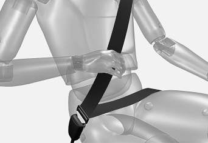

Adjusting the seat belt

Most states and provinces make it mandatory
for occupants of a vehicle to use seat belts.

Seat belt pretensioners
All seat belts are equipped with pretensioners
that reduce slack in the belts. These preten-
sioners are triggered in situations where the
front or side impact airbags deploy, and in
certain impacts from the rear. The front seat
belts also include a tension reducing device
which, in the event of a collision, limits the

peak forces exerted by the seat belt on the
occupant.

Seat belt maintenance
Check periodically that the seat belts are in
good condition. Use water and a mild deter-
gent for cleaning. Check seat belt mechanism
function as follows: attach the seat belt and
pull rapidly on the strap.

WARNING

Never use a seat belt for more than one
occupant. Never wear the shoulder portion
of the belt under the arm, behind the back
or otherwise out of position. Such use
could cause injury in the event of an acci-
dent. As seat belts lose much of their
strength when exposed to violent stretch-
ing, they should be replaced after any col-
lision, even if they appear to be undam-
aged.

WARNING
•
Never repair the belt yourself; have this
work done by a trained and qualified
Volvo service technician only.
•
Any device used to induce slack into
the shoulder belt portion of the three-
point belt system will have a detrimen-
tal effect on the amount of protection
available to you in the event of a colli-
sion.
•
The seat back should not be tilted too
far back. The shoulder belt must be
taut in order to function properly.
•
Do not use child safety seats or child
booster cushions/backrests in the
front passenger's seat. We also rec-
ommend that children who have out-
grown these devices sit in the rear
seat with the seat belt properly fas-
tened.

Related information
•
Seat belts – buckling/unbuckling (p. 29)
•
Seat belt reminder (p. 30)
•
Seat belts – pregnancy (p. 31)

---

<!-- Page 31 -->

### 02 Safety

02

}}

29

Seat belts – buckling/unbuckling
Seat belts should be used by all occupants in
the vehicle when it is in motion.

Buckling a seat belt
Pull the belt out far enough to insert the latch
plate into the receptacle until a distinct click
is heard. The seat belt retractor is normally
"unlocked" and you can move freely, provi-
ded that the shoulder belt is not pulled out
too far.

Adjusting seat belt height (front seat
belts only)

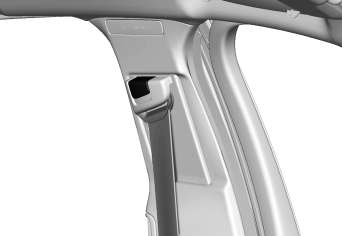

Adjusting seat belt height

The height of the shoulder section of the seat
belt must be correctly adjusted. Press the
button and move the upper seat belt anchor
to position it as high as possible so that the
shoulder section of the belt is across the seat
occupant's collarbone and not across the
throat.

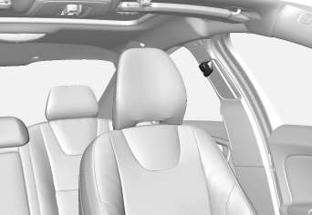

Correct height adjustment

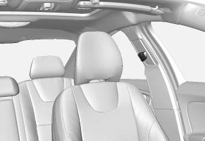

Incorrect height adjustment
Seat belt retractor
The seat belt retractor will lock up in the
following situations:
•
if the belt is pulled out rapidly
•
during braking and acceleration
•
if the vehicle is leaning excessively

•
when driving in turns
•
if the Automatic Locking Retractor/Emer-
gency Locking Retractor (ALR/ELR) is
activated

NOTE

Each seat belt (except for the driver's belt)
is equipped with the ALR/ELR function,
which is designed to help keep the seat
belt taut. ALR/ELR activates if the seat belt
is pulled out as far as possible. If this is
done, a sound from the seat belt retractor
will be audible, which is normal, and the
seat belt will be pulled taut and locked in
place. This function is automatically disa-
bled when the seat belt is unbuckled and
fully retracted.

See also Child restraints (p. 47) for informa-
tion about using a seat belt's ALR/ELR func-
tion to anchor a child seat.

When wearing the seat belt remember:
•
The belt should not be twisted or turned.
•
The lap section of the belt must be posi-
tioned low on the hips (not pressing
against the abdomen).
•
Make sure that the shoulder belt is rolled
up into its retractor and that the shoulder
and lap belts are taut.

Unbuckling the seat belt
To remove the seat belt, press the red section
on the seat belt receptacle. Before exiting the
vehicle, check that the seat belt retracts fully

---

<!-- Page 32 -->

||

### 02 Safety

02

30

after being unbuckled. If necessary, guide the
belt back into the retractor slot.

Related information
•
Seat belt reminder (p. 30)
•
Seat belts – pregnancy (p. 31)

Seat belt reminder
The seat belt reminder is intended to alert all
occupants of the vehicle that their seat belts
should be fastened before the vehicle begins
to move.

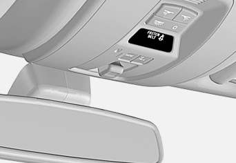

G017726

Seat belt reminder light in ceiling console

The seat belt reminder consists of an audible
signal, an indicator light near the rearview
mirror and a symbol in the instrument panel
that alert all occupants of the vehicle to fas-
ten their seat belts (p. 28). The indicator light
will be on for several seconds from the time
the ignition is switched on. There will also be
an audible signal if the driver's seat belt is not
fastened.

If the front seat belts are unbuckled while the
vehicle is in motion, the audible signal and
warning light will be active for a several sec-
onds.

Rear seats
The seat belt reminder in the rear seat has
two additional functions:
•
It provides information about which seat
belts are fastened in the rear seat. A mes-
sage will appear in the information display
when a belt is being used. This message
will disappear after several seconds or
can be erased by pressing the OK button
on the left steering wheel lever.
•
It also provides a reminder if one of the
occupants of the rear seat has unbuckled
his/her seat belt while the vehicle is in
motion. A visual and audible signal will be
given. These signals will stop when the
seat belt has been re-buckled or can be
stopped by pressing the OK button.
•
The message Unbelted in rear seat will
appear in the information display if one of
the rear doors has been opened.

The message in the information display can
always be accessed, even if it has been
erased, by pressing the OK button to display
stored messages.

Related information
•
Seat belts – pregnancy (p. 31)

---

<!-- Page 33 -->

### 02 Safety

02

}}

* Option/accessory, for more information, see Introduction.
31

Seat belts – pregnancy
The seat belt should always be worn during
pregnancy. However, it is crucial that it be
worn correctly.

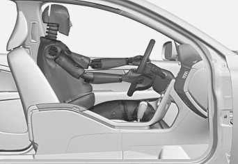

G020998

The diagonal section should wrap over the
shoulder then be routed between the breasts
and to the side of the belly. The lap section
should lay flat over the thighs and as low as
possible under the belly. It must never be
allowed to ride upward. Remove all slack
from the belt and ensure that it fits close to
the body without any twists.

As a pregnancy progresses, pregnant drivers
should adjust their seats and steering wheel
such that they can easily maintain control of
the vehicle as they drive (which means they
must be able to easily operate the foot pedals
and steering wheel). Within this context, they
should strive to position the seat with as large

a distance as possible between their belly
and the steering wheel.

Related information
•
Seat belts – buckling/unbuckling (p. 29)
•
Seat belt reminder (p. 30)
•
Child restraints (p. 47)

Supplemental Restraint System (SRS)
As an enhancement to the three-point seat
belts (p. 28), your Volvo is equipped with a
Supplemental Restraint System (SRS).

Models with an analog instrument panel

Models with an digital instrument panel*

Volvo's SRS consists of seat belt pretension-
ers, front airbags (p. 33), side impact air-

---

<!-- Page 34 -->

||

### 02 Safety

02

32

bags (p. 39), a front passenger occupant
weight sensor (p. 36), and inflatable cur-
tains (p. 41). All of these systems are moni-
tored by the SRS control module. An SRS
warning light in the instrument panel (see the
illustration) illuminates when the ignition is in
modes I or II, and will normally go out after
approximately 6 seconds if no faults are
detected in the system.

Where applicable, a text message will also be
displayed when the SRS warning light illumi-
nates. If this warning symbol is not function-
ing properly, the general warning symbol illu-
minates and a text message will be displayed.

See also Information displays – indicator
symbols (p. 70) and Information displays –
warning symbols (p. 72) for more informa-
tion about indicator and warning lights.

WARNING
•
If the SRS warning light stays on after
the engine has started or if it illumi-
nates while you are driving, have the
vehicle inspected by a trained and
qualified Volvo service technician as
soon as possible.
•
Never try to repair any component or
part of the SRS yourself. Any interfer-
ence in the system could cause mal-
function and serious injury. All work on
these systems should be performed by
a trained and qualified Volvo service
technician.

WARNING

If your vehicle has become flood-damaged
in any way (e.g., soaked carpeting/stand-
ing water on the floor of the vehicle), do
not attempt to start the vehicle or insert
the remote key into the ignition slot before
disconnecting the battery (see below). This
may cause airbag deployment which could
result in serious injury. Have the vehicle
towed to a trained and qualified Volvo
service technician for repairs.

Before attempting to tow the vehicle:

1.
Switch off the ignition for at least
10 minutes and disconnect the bat-
tery.

2.
Follow the instructions for manually
overriding the shiftlock system Trans-
mission – shiftlock override (p. 261).

Related information
•
Crash mode – general information
(p. 44)

---

<!-- Page 35 -->

### 02 Safety

02

}}

33

Front airbags
The front airbags supplement the three-point
seat belts (p. 28). For these airbags to provide
the protection intended, seat belts must be
worn at all times.

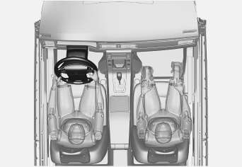

G018665

The front airbag system
The front airbag system includes gas genera-
tors surrounded by the airbags, and decelera-
tion sensors that activate the gas generators,
causing the airbags to be inflated with nitro-
gen gas.

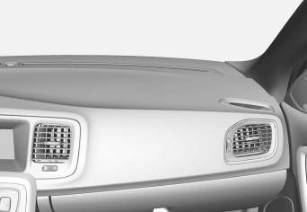

Location of the passenger's side front airbag

As the movement of the seats' occupants
compresses the airbags, some of the gas is
expelled at a controlled rate to provide better
cushioning. Both seat belt pretensioners also
deploy, minimizing seat belt slack. The entire
process, including inflation and deflation of
the airbags, takes approximately one fifth of a
second.

The location of the front airbags is indicated
by SRS AIRBAG embossed on the steering
wheel pad and above the glove compartment,
and by decals on both sun visors and on the
front and far right side of the dash.

The driver's side front airbag is folded and
located in the steering wheel hub.

The passenger's side front airbag is folded
behind a panel located above the glove com-
partment.

WARNING
•
The airbags in the vehicle are designed
to be a SUPPLEMENT to–not a
replacement for–the three-point seat
belts. For maximum protection, wear
seat belts at all times. Be aware that
no system can prevent all possible
injuries that may occur in an accident.
•
Never drive with your hands on the
steering wheel pad/airbag housing.
•
The front airbags are designed to help
prevent serious injury. Deployment
occurs very quickly and with consider-
able force. During normal deployment
and depending on variables such as
seating position, one may experience
abrasions, bruises, swellings, or other
injuries as a result from deployment of
one or both of the airbags.
•
When installing any accessory equip-
ment, make sure that the front airbag
system is not damaged. Any interfer-
ence in the system could cause mal-
function.

Front airbag deployment
•
The front airbags are designed to deploy
during certain frontal or front-angular col-
lisions, impacts, or decelerations,
depending on the crash severity, angle,
speed and object impacted. The airbags
may also deploy in certain non-frontal

---

<!-- Page 36 -->

||

### 02 Safety

02

34

collisions where rapid deceleration
occurs.
•
The SRS (p. 31) sensors, which trigger
the front airbags, are designed to react to
both the impact of the collision and the
inertial forces generated by it, and to
determine if the intensity of the collision is
sufficient for the seat belt pretensioners
and/or airbags to be deployed.

However, not all frontal collisions activate the
front airbags.
•
If the collision involves a nonrigid object
(e.g., a snow drift or bush), or a rigid,
fixed object at a low speed, the front air-
bags will not necessarily deploy.
•
Front airbags do not normally deploy in a
side impact collision, in a collision from
the rear or in a rollover situation.
•
The amount of damage to the bodywork
does not reliably indicate if the airbags
should have deployed or not.

WARNING

If any of the airbags have deployed:
•
Do not attempt to drive the vehicle.
Have it towed to a qualified repair
facility.
•
If necessary seek medical attentIon.

WARNING
•
Do not use child safety seats or child
booster cushions/backrests in the
front passenger's seat. We also rec-
ommend that occupants under 4 feet
7 inches (140 cm) in height who have
outgrown these devices sit in the rear
seat with the seat belt fastened1.
•
Never drive with the airbags deployed.
The fact that they hang out can impair
the steering of your vehicle. Other
safety systems can also be damaged.
•
The smoke and dust formed when the
airbags are deployed can cause skin
and eye irritation in the event of pro-
longed exposure.

Should you have questions about any com-
ponent in the SRS system, please contact a
trained and qualified Volvo service technician
or Volvo customer support:

In the USA

Volvo Cars of North America, LLC

Customer Care Center

1 Volvo Drive

P.O. Box 914

Rockleigh, New Jersey 07647

1-800-458-1552

www.volvocars.com/us

In Canada

Volvo Cars of Canada Corp.

National Customer Service

9130 Leslie Street, Suite 101

Richmond Hill, Ontario L4B 0B9

1-800-663-8255

www.volvocars.com/ca

1 See also the Occupant Weight Sensor information, (p. 36).

---

<!-- Page 37 -->

### 02 Safety

02

}}

35

NOTE
•
Deployment of front airbags occurs
only one time during an accident. In a
collision where deployment occurs,
the airbags and seat belt pretensioners
activate. Some noise occurs and a
small amount of powder is released.
The release of the powder may appear
as smoke-like matter. This is a normal
characteristic and does not indicate
fire.
•
Volvo's front airbags use special sen-
sors that are integrated with the front
seat buckles. The point at which the
airbag deploys is determined by
whether or not the seat belt is being
used, as well as the severity of the col-
lision.
•
Collisions can occur where only one of
the airbags deploys. If the impact is
less severe, but severe enough to
present a clear injury risk, the airbags
are triggered at partial capacity. If the
impact is more severe, the airbags are
triggered at full capacity.

Airbag decals

Airbag decal on the outside of both sun visors

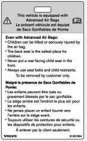

Passenger's side airbag decal

WARNING
•
Children must never be allowed in the
front passenger's seat.
•
Occupants in the front passenger's
seat must never sit on the edge of the
seat, sit leaning toward the instrument
panel or otherwise sit out of position.
•
The occupant's back must be as
upright as comfort allows and be
against the seat back with the seat
belt properly fastened.
•
Feet must be on the floor, e.g., not on
the dash, seat or out of the window.

---

<!-- Page 38 -->

||

### 02 Safety

02

36

WARNING
•
No objects or accessory equipment,
e.g. dashboard covers, may be placed
on, attached to, or installed near the
air bag hatch (the area above the glove
compartment) or the area affected by
airbag deployment.
•
There should be no loose articles,
such as coffee cups on the floor, seat,
or dashboard area.
•
Never try to open the airbag cover on
the steering wheel or the passenger's
side dashboard. This should only be
done by a trained and qualified Volvo
service technician.
•
Failure to follow these instructions can
result in injury to the vehicle occu-
pants.

Related information
•
Occupant Weight Sensor (p. 36)
•
Side impact protection (SIPS) airbags
(p. 39)
•
Inflatable Curtain (IC) (p. 41)
•
Supplemental Restraint System (SRS)
(p. 31)

Occupant Weight Sensor
The Occupant Weight Sensor (OWS) is
designed to meet the regulatory requirements
of Federal Motor Vehicle Safety Standard
(FMVSS) 208 and is designed to disable (will
not inflate) the passenger's side front airbag
under certain conditions.

2

2

G017724

Occupant Weight Sensor (OWS) indicator light

Disabling the passenger's side front
airbag
Volvo recommends that ALL occupants
(adults and children) shorter than 4 feet
7 inches (140 cm) be seated in the back seat
of any vehicle with a front passenger side air-
bag (p. 33), and be properly restrained for
their size and weight. For child safety recom-
mendations, see Child safety (p. 46).

The OWS works with sensors that are part of
the front passenger's seat and seat
belt (p. 28). The sensors are designed to

detect the presence of a properly seated
occupant and determine if the passenger's
side front airbag should be enabled (may
inflate) or disabled (will not inflate).

The OWS will disable (will not inflate) the pas-
senger's side front airbag when:
•
the front passenger's seat is unoccupied,
or has small/medium objects in the front
seat,
•
the system determines that an infant is
present in a rear-facing infant seat that is
installed according to the manufacturer's
instructions,
•
the system determines that a small child
is present in a forward-facing child
restraint that is installed according to the
manufacturer's instructions,
•
the system determines that a small child
is present in a booster seat,
•
a front passenger takes his/her weight off
of the seat for a period of time,
•
a child or a small person occupies the
front passenger's seat.

The OWS uses a PASSENGER AIRBAG OFF
indicator lamp which will illuminate and stay
on to remind you that the passenger's side
front airbag is disabled. The PASSENGER
AIRBAG OFF indicator lamp is located in the
overhead console, near the base of the rear-
view mirror.

---

<!-- Page 39 -->

### 02 Safety

02

}}

37

NOTE

When the ignition is switched on, the OWS
indicator light will go on for up to 10 sec-
onds while the system performs a self-
diagnostic test.

However, if a fault is detected in the system:
•
The OWS indicator light will stay on
•
The SRS warning light (p. 31) will come
on and stay on
•
The message Pass. Airbag OFF Service
urgent will be displayed in the informa-
tion display.

WARNING

If a fault in the system is detected and
indicated as described, be aware that the
passenger's side front airbag will not
deploy in the event of a collision. In this
case, the SRS system and Occupant
Weight Sensor should be inspected by a
trained and qualified Volvo service techni-
cian as soon as possible.

WARNING
•
Never try to open, remove, or repair
any components in the OWS system.
This could result in system malfunc-
tion. Maintenance or repairs should
only be carried out by an a trained and
qualified Volvo service technician.
•
The front passenger's seat should not
be modified in any way. This could
reduce pressure on the seat cushion,
which might interfere with the OWS
system's function.

Passeng-
er's seat
occu-
pancy sta-
tus

OWS
indicator
light sta-
tus

Passeng-
er's side
front air-
bag status

Seat unoc-
cupied

OWS indi-
cator light
lights up.

Passenger's
side front air-
bag disabled

Seat occu-
pied by low
weight
occupant/
objectA

OWS indi-
cator light
lights up

Passenger's
side front air-
bag disabled

Seat occu-
pied by
heavy occu-
pant/object

OWS indi-
cator light
is not lit

Passenger's
side front air-
bag enabled

A Volvo recommends that children always be properly
restrained in appropriate child restraints in the rear seats.
Do not assume that the passenger's side front airbag is
disabled unless the PASSENGER AIRBAG OFF indicator
lamp is lit. Make sure the child restraint is properly instal-
led. If there is any doubt as to the status of the passeng-
er's side front airbag, move the child restraint to the rear
seat.

The OWS is designed to enable (may inflate)
the passenger's side front airbag in the event
of a collision anytime the system senses that
a person of adult size is sitting properly in the
front passenger's seat. The PASSENGER
AIRBAG OFF indicator lamp will be off and
remain off.

---

<!-- Page 40 -->

||

### 02 Safety

02

38

If a person of adult size is sitting in the front
passenger's seat, but the PASSENGER AIR-
BAG OFF indicator lamp is on, it is possible
that the person isn't sitting properly in the
seat. If this happens:
•
Turn the vehicle off and ask the person to
place the seatback in an upright position.
•
Have the person sit upright in the seat,
centered on the seat cushion, with the
person's legs comfortably extended.
•
Restart the vehicle and have the person
remain in this position for about two
minutes. This will allow the system to
detect that person and enable the pas-
senger's frontal airbag.
•
If the PASSENGER AIRBAG OFF indica-
tor lamp remains on even after this, the
person should be advised to ride in the
rear seat.

This condition reflects limitations of the OWS
classification capability. It does not indicate
OWS malfunction.

Modifications
If you are considering modifying your vehicle
in any way to accommodate a disability, for
example by altering or adapting the driver's
or front passenger's seat(s) and/or airbag
systems, please contact Volvo at:

In the USA

Volvo Cars of North America, LLC

Customer Care Center

1 Volvo Drive

P.O. Box 914

Rockleigh, New Jersey 07647

1-800-458-1552

In Canada

Volvo Cars of Canada Corp.

National Customer Service

9130 Leslie Street, Suite 101

Richmond Hill, Ontario L4B 0B9

1-800-663-8255

WARNING
•
No objects that add to the total weight
on the seat should be placed on the
front passenger's seat. If a child is
seated in the front passenger's seat
with any additional weight, this extra
weight could cause the OWS system
to enable the airbag, which might
cause it to deploy in the event of a col-
lision, thereby injuring the child.
•
The seat belt should never be wrapped
around an object on the front pas-
senger's seat. This could interfere with
the OWS system's function.
•
The front passenger's seat belt should
never be used in a way that exerts
more pressure on the passenger than
normal. This could increase the pres-
sure exerted on the weight sensor by a
child, and could result in the airbag
being enabled, which might cause it to
deploy in the event of a collision,
thereby injuring the child.

---

<!-- Page 41 -->

### 02 Safety

02

}}

39

WARNING
•
Keep the following points in mind with
respect to the OWS system. Failure to
follow these instructions could
adversely affect the system's function
and result in serious injury to the occu-
pant of the front passenger's seat:
•
The full weight of the front seat pas-
senger should always be on the seat
cushion. The passenger should never
lift him/herself off the seat cushion
using the armrest in the door or the
center console, by pressing the feet on
the floor, by sitting on the edge of the
seat cushion, or by pressing against
the backrest in a way that reduces
pressure on the seat cushion. This
could cause OWS to disable the front,
passenger's side airbag.

WARNING
•
Do not place any type of object on the
front passenger's seat in such a way
that jamming, pressing, or squeezing
occurs between the object and the
front seat, other than as a direct result
of the correct use of the Automatic
Locking Retractor/Emergency Locking
Retractor (ALR/ELR) seat belt (Child
restraints (p. 47)).
•
No objects should be placed under the
front passenger's seat. This could
interfere with the OWS system's func-
tion.

Related information
•
Supplemental Restraint System (SRS)
(p. 31)

Side impact protection (SIPS) airbags
As an enhancement to the structural side
impact protection built into your vehicle, it is
also equipped with Side Impact Protection
System (SIPS) airbags.

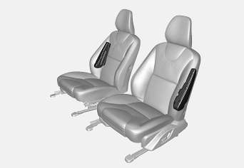

G032949

Location of the side impact (SIPS) airbags (front
seats only)

The SIPS airbag system is designed to help
increase occupant protection in the event of
certain side impact collisions. The SIPS air-
bags are designed to deploy only during cer-
tain side-impact collisions, depending on the
crash severity, angle, speed and point of
impact.

---

<!-- Page 42 -->

||

### 02 Safety

02

40

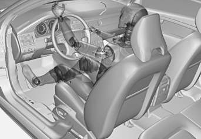

Driver's side SIPS airbag

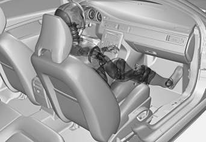

Passenger's side SIPS airbag

NOTE

SIPS airbag deployment (one airbag)
occurs only on the side of the vehicle
affected by the impact. The airbags are not
designed to deploy in all side impact situa-
tions.

Components in the SIPS airbag system
This SIPS airbag system consists of a gas
generator, the side airbag modules built into
the outboard sides of both front seat back-
rests, and electronic sensors/wiring.

WARNING
•
The SIPS airbag system is a supple-
ment to the structural Side Impact
Protection System and the three-point
seat belt system. It is not designed to
deploy during collisions from the front
or rear of the vehicle or in rollover sit-
uations.
•
The use of seat covers on the front
seats may impede SIPS airbag deploy-
ment.
•
No objects, accessory equipment or
stickers may be placed on, attached to
or installed near the SIPS airbag sys-
tem or in the area affected by SIPS air-
bag deployment.
•
Never try to open or repair any compo-
nents of the SIPS airbag system. This
should be done only by a trained and
qualified Volvo service technician.
•
In order for the SIPS airbag to provide
its best protection, both front seat
occupants should sit in an upright
position with the seat belt properly fas-
tened.
•
Failure to follow these instructions can
result in injury to the occupants of the
vehicle in the event of an accident.

---

<!-- Page 43 -->

### 02 Safety

02

}}

41

Related information
•
Supplemental Restraint System (SRS)
(p. 31)
•
Front airbags (p. 33)
•
Inflatable Curtain (IC) (p. 41)

Inflatable Curtain (IC)
The inflatable curtain is designed to help pro-
tect the heads of the occupants of the front
seats and the occupant of the outboard rear
seating positions in certain side impact colli-
sions.

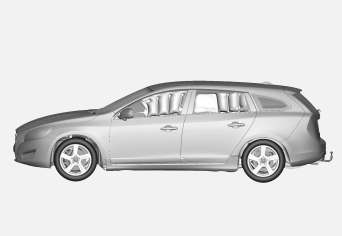

This system consists of inflatable curtains
located along the sides of the roof liners,
stretching from the center of both front side
windows to the rear edge of the rear side
door windows.

In certain side impacts, both the Inflatable
Curtain (IC) and the Side Impact Airbag Sys-
tem (p. 39) (SIPS airbag) will deploy. The IC
and the SIPS airbag deploy simultaneously.

NOTE

If the inflatable curtain deploys, it remains
inflated for approximately 6 seconds.

WARNING
•
The IC system is a supplement to the
Side Impact Protection System. It is
not designed to deploy during colli-
sions from the rear of the vehicle.
•
Never try to open or repair any compo-
nents of the IC system. This should be
done only by a trained and qualified
Volvo service technician.
•
Never hang heavy items from the ceil-
ing handles. This could impede
deployment of the Inflatable Curtain.
•
The cargo area and rear seat should
not be loaded to a level higher than
2 in. (5 cm) below the upper edge of
the rear side windows. Objects placed
higher than this level could impede the
function of the Inflatable Curtain.

---

<!-- Page 44 -->

||

### 02 Safety

02

42

WARNING

In order for the IC to provide its best pro-
tection, both front seat occupants and
both outboard rear seat occupants should
sit in an upright position with the seat belt
properly fastened; adults using the seat
belt and children using the proper child
restraint system. Only adults should sit in
the front seats. Children must never be
allowed in the front passenger seat, Child
safety (p. 46) for guidelines. Failure to
follow these instructions can result in injury
to the vehicle occupants in an accident.

Related information
•
Supplemental Restraint System (SRS)
(p. 31)
•
Front airbags (p. 33)
•
Child safety (p. 46)

Whiplash Protection System (WHIPS)
The WHIPS system consists of specially
designed hinges and brackets on the front
seat backrests designed to help absorb some
of the energy generated in a collision from the
rear (when the vehicle is rear-ended).

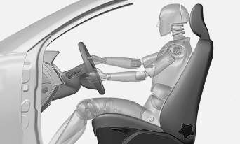

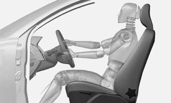

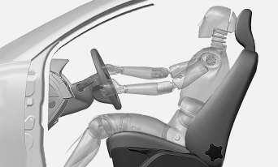

In the event of a rear-end collision, the hinges
and brackets of the front seat backrests are
designed to change position slightly to allow
the backrest/head restraint to help support
the occupant's head before moving slightly

---

<!-- Page 45 -->

### 02 Safety

02

}}

43

rearward. This movement helps absorb some
of the forces that could result in whiplash.

WARNING
•
The WHIPS system is designed to
supplement the other safety systems
in your vehicle. For this system to
function properly, the three-point seat
belt must be worn. Please be aware
that no system can prevent all possible
injuries that may occur in an accident.
•
The WHIPS system is designed to
function in certain collisions from the
rear, depending on the crash severity,
angle and speed.

WARNING
•
Occupants in the front seats must
never sit out of position. The occu-
pant's back must be as upright as
comfort allows and be against the seat
back with the seat belt properly fas-
tened.
•
If your vehicle has been involved in a
rear-end collision, the front seat back-
rests must be inspected by a trained
and qualified Volvo service technician,
even if the seats appear to be undam-
aged. Certain components in the
WHIPS system may need to be
replaced.
•
Do not attempt to service any compo-
nent in the WHIPS system yourself.

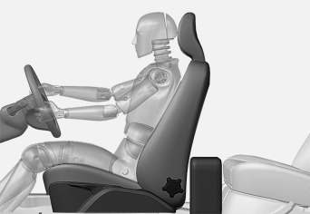

WARNING
•
Boxes, suitcases, etc. wedged behind
the front seats could impede the func-
tion of the WHIPS system.
•
If the rear seat backrests are folded
down, cargo must be secured to pre-
vent it from sliding forward against the
front seat backrests in the event of a
collision from the rear. This could
interfere with the action of the WHIPS
system.

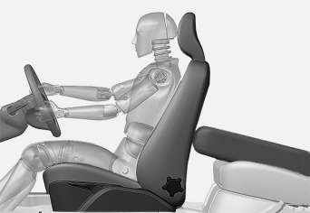

WARNING

Any contact between the front seat back-
rests and the folded rear seat or a rear-
facing child seat could impede the function
of the WHIPS system. If the rear seat is
folded down, the occupied front seats
must be adjusted forward so that they do
not touch the folded rear seat.

---

<!-- Page 46 -->

||

### 02 Safety

02

44
* Option/accessory, for more information, see Introduction.

Related information
•
Seat belts – general (p. 28)

Crash mode – general information
After a collision, the functionality of some of
the vehicle's systems may be reduced as a
safety precaution.

Warning symbol: analog instrument panel

Warning symbol: digital instrument panel*

If the vehicle has been involved in a collision,
the text Safety mode See manual may
appear in the information display.

NOTE

This text can only be shown if the display
is undamaged and the vehicle's electrical
system is intact.

Crash mode is a feature that is triggered if
one or more of the safety systems (e.g.
front (p. 33) or side airbags (p. 39), an inflat-
able curtain (p. 41), or one or more of the seat
belt pretensioners) has deployed. The colli-
sion may have damaged an important func-
tion in the vehicle, such as the fuel lines, sen-
sors for one of the safety systems, the brake
system, etc.

---

<!-- Page 47 -->

### 02 Safety

02

45

WARNING
•
Never attempt to repair the vehicle
yourself or to reset the electrical sys-
tem after the vehicle has displayed
Safety mode See manual. This could
result in injury or improper system
function.
•
Restoring the vehicle to normal operat-
ing status should only be done by a
trained and qualified Volvo service
technician.
•
After Safety mode See manual has
been displayed, if you detect the odor
of fuel vapor, or see any signs of fuel
leakage, do not attempt to start the
vehicle. Leave the vehicle immediately.

Related information
•
Crash mode – starting the vehicle
(p. 45)
•
Crash mode – moving the vehicle
(p. 45)

Crash mode – starting the vehicle
If Crash mode has been set Crash
mode (p. 44)) and damage to the vehicle is
minor and there is no fuel leakage, you may
attempt to start the engine.

To do so:

1.
Remove the remote key from the ignition
slot and open the driver's door. If a mes-
sage is displayed that the ignition is on,
press the start button.

2.
Close the driver's door and reinsert the
remote key in the ignition slot.

3.
Try to start the vehicle.

WARNING

If the message Safety mode See manual
is still displayed, the vehicle should not be
driven and must be towed. Concealed
faults may make the vehicle difficult to
control.

Related information
•
Crash mode – general information (p. 44)
•
Crash mode – moving the vehicle
(p. 45)

Crash mode – moving the vehicle
If the message Normal mode appears after
an attempt has been made to start the engine,
Starting the vehicle after a crash (p. 45), the
vehicle may be moved carefully from its pres-
ent position, if for example, it is blocking traf-
fic. It should, however, not be moved farther
than is absolutely necessary.

WARNING

Even if the vehicle appears to be drivable
after Crash mode has been set, it should
not be driven or towed (pulled by another
vehicle). There may be concealed damage
that could make it difficult or impossible to
control. The vehicle should be transported
on a flatbed tow truck to a trained and
qualified Volvo service technician for
inspection/repairs.

Related information
•
Crash mode – general information (p. 44)

---

<!-- Page 48 -->

### 02 Safety

02

46

Child safety
Children should always be seated safely when
traveling in the vehicle.

General information
Volvo recommends the proper use of restraint
systems (p. 47) for all occupants including
children. Remember that, regardless of age
and size, a child should always be properly
restrained in a vehicle.

Your vehicle is also equipped with ISOFIX/
LATCH attachments (p. 55), which make it
more convenient to install child seats.

Some restraint systems for children are
designed to be secured in the vehicle by lap
belts or the lap portion of a lap-shoulder belt.
Such child restraint systems can help protect
children in vehicles in the event of an acci-
dent only if they are used properly. However,
children could be endangered in a crash if the
child restraints are not properly secured in the
vehicle. Failure to follow the installation
instructions for your child restraint can result
in your child striking the vehicle's interior in a
sudden stop.

Holding a child in your arms is NOT a suitable
substitute for a child restraint system. In an
accident, a child held in a person's arms can
be crushed between the vehicle's interior and
an unrestrained person. The child could also
be injured by striking the interior, or by being
ejected from the vehicle during a sudden
maneuver or impact. The same can also hap-

pen if the infant or child rides unrestrained on
the seat. Other occupants should also be
properly restrained to help reduce the chance
of injuring or increasing the injury of a child.

All states and provinces have legislation gov-
erning how and where children should be car-
ried in a vehicle. Find out the regulations
existing in your state or province. Recent
accident statistics have shown that children
are safer in rear seating positions than front
seating positions when properly restrained. A
child restraint system can help protect a child
in a vehicle. Here's what to look for when
selecting a child restraint system:

It should have a label certifying that it meets
applicable Federal Motor Vehicle Safety
Standards (FMVSS 213) – or in Canada,
CMVSS 213.

Make sure the child restraint system is
approved for the child's height, weight and
development – the label required by the
standard or regulation, or instructions for
infant restraints, typically provide this infor-
mation.

In using any child restraint system, we urge
you to carefully look over the instructions that
are provided with the restraint. Be sure you
understand them and can use the device
properly and safely in this vehicle. A misused
child restraint system can result in increased
injuries for both the infant or child and other
occupants in the vehicle.

When a child has outgrown the child safety
seat, you should use the rear seat with the
standard seat belt fastened. The best way to
help protect the child here is to place the
child on a cushion so that the seat belt is
properly located on the hips (see Booster
cushions (p. 54) for illustration). Legislation
in your state or province may mandate the
use of a child seat or cushion in combination
with the seat belt, depending on the child's
age and/or size. Please check local regula-
tions.

A specially designed and tested booster
cushion and backrest can be obtained from
your Volvo retailer.

USA: for children weighing 33 – 80 lbs. (15 –
36 kg) and 38 – 54 inches (97 – 137 cm) in
height

Canada: for children weighing 40 – 80 lbs.
(18 – 36 kg) and 40 – 54 inches (102 –
137 cm) in height

---

<!-- Page 49 -->

### 02 Safety

02

}}

47

WARNING
•
Do not use child safety seats or child
booster cushions/backrests in the
front passenger's seat. We also rec-
ommend that children under 4 feet
7 inches (140 cm) in height who have
outgrown these devices sit in the rear
seat with the seat belt fastened.
•
On hot days, the temperature in the
vehicle interior can rise very quickly.
Exposure to these high temperatures
for even a short period of time can
cause heat-related injury or death.
Small children are particularly at risk.

Child seat should always be registered. See
Child restraints (p. 47) for more information.

Volvo's recommendations
Why does Volvo believe that no child should
sit in the front seat of a car? It's quite simple
really. A front airbag (p. 33) is a very powerful
device designed, by law, to help protect an
adult.

Because of the size of the airbag and its
speed of inflation, a child should never be
placed in the front seat, even if he or she is
properly belted or strapped into a child safety
seat. Volvo has been an innovator in safety
for over seventy-five years, and we'll continue
to do our part. But we need your help. Please
remember to put your children in the back
seat, and buckle them up.

Volvo has some very specific
recommendations:
•
Always wear your seat belt (p. 28).
•
Airbags are a SUPPLEMENTAL safety
device which, when used with a three-
point seat belt can help reduce serious
injuries during certain types of accidents.
Volvo recommends that you do not dis-
connect the airbag system in your vehi-
cle.
•
Volvo strongly recommends that every-
one in the vehicle be properly restrained.
•
Volvo recommends that ALL occupants
(adults and children) shorter than 4 feet
7 inches (140 cm) be seated in the back
seat of any vehicle with a front passenger
side airbag.
•
Drive safely!

Related information
•
Infant seats (p. 49)
•
Convertible seats (p. 51)
•
Booster cushions (p. 54)
•
Integrated booster cushion – general
information (p. 57)
•
Child safety locks (p. 61)
•
Top tether anchors (p. 56)

Child restraints
Suitable child restraints should always be
used when children travel in the vehicle.

Child restraint systems

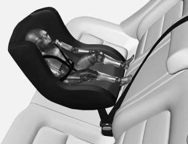

G022840

Infant seat

There are three main types of child restraint
systems: infant seats (p. 49), convertible
seats (p. 51), and booster cush-
ions (p. 54). They are classified according to
the child's age and size.

The following section provides general infor-
mation on securing a child restraint using a
three-point seat belt (p. 28). Refer to ISOFIX/
LATCH lower anchors (p. 55) and Top tether
anchors (p. 56) for information on securing
a child restraint using ISOFIX/LATCH lower
anchors and/or top tether anchorages.

---

<!-- Page 50 -->

||

### 02 Safety

02

48

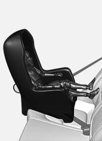

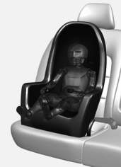

G022847

Convertible seat

WARNING

A child seat should never be used in the
front passenger seat of any vehicle with a
front passenger airbag – not even if the
"Passenger airbag off" symbol near the
rear-view mirror is illuminated (on vehicles
equipped with Occupant Weight Sensor). If
the severity of an accident were to cause
the airbag to inflate, this could lead to seri-
ous injury or death to a child seated in this
position.

G023269

Booster cushion

WARNING

Always refer to the child restraint manufac-
turer's instructions for detailed information
on securing the restraint.

WARNING
•
When not in use, keep the child
restraint system secured or remove it
from the passenger compartment to
help prevent it from injuring passen-
gers in the event of a sudden stop or
collision.
•
A small child's head represents a con-
siderable part of its total weight and its
neck is still very weak. Volvo recom-
mends that children up to age 4 travel,
properly restrained, facing rearward. In
addition, Volvo recommends that chil-
dren should ride rearward facing,
properly restrained, as long as possi-
ble.

Automatic Locking Retractor/
Emergency Locking Retractor (ALR/
ELR)
To make child seat installation easier, each
seat belt (except for the driver's belt) is equip-
ped with a locking mechanism to help keep
the seat belt taut.

---

<!-- Page 51 -->

### 02 Safety

02

}}

49

When attaching the seat belt to a child
seat:
1.
Attach the seat belt to the child seat
according to the child seat manufactur-
er's instructions.

2.
Pull the seat belt out as far as possible.

3.
Insert the seat belt latch plate into the
buckle (lock) in the usual way.

4.
Release the seat belt and pull it taut
around the child seat.

A sound from the seat belt retractor will be
audible at this time and is normal. The belt
will now be locked in place. This function is
automatically disabled when the seat belt is
unlocked and the belt is fully retracted.

WARNING

Do not use child safety seats or child
booster cushions/backrests in the front
passenger's seat. We also recommend
that children who have outgrown these
devices sit in the rear seat with the seat
belt properly fastened.

Child restraint registration and recalls
Child restraints could be recalled for safety
reasons. You must register your child
restraint to be reached in a recall. To stay
informed about child safety seat recalls, be
sure to fill out and return the registration card
that comes with new child restraints.

Child restraint recall information is readily
available in both the U.S. and Canada. For
recall information in the U.S., call the U.S.
Government's Auto Safety Hotline at
1-800-424-9393 or go to http://www-
odi.nhtsa.dot.gov/cars/problems/recalls/
register/childseat/index.cfm. In Canada, visit
Transport Canada's Child Safety website at
http://www.tc.gc.ca/roadsafety/childsafety/
menu.htm.

Related information
•
Child safety locks (p. 61)
•
Integrated booster cushion – general
information (p. 57)

Infant seats
Suitable child restraints should always be
used when children (depending on their age/
size) are seated in the vehicle.

Securing an infant seat with a seat belt

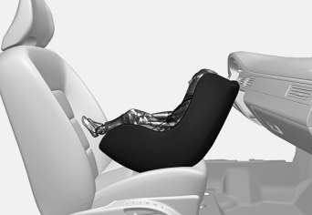

G022844

Do not place the infant seat in the front passeng-
er's seat

NOTE

Refer to (p. 55) and (p. 56) for infor-
mation on securing a child restraint using
ISOFIX/LATCH lower anchors and/or top
tether anchorages.

1.
Place the infant seat in the rear seat of
the vehicle.

2.
Attach the seat belt to the infant seat
according to the manufacturer's instruc-
tions.

---

<!-- Page 52 -->

||

### 02 Safety

02

50

G023270

Positioning the seat belt through the infant seat

WARNING
• An infant seat must be in the rear-facing
position only.
• The infant seat should not be positioned
behind the driver's seat unless there is
adequate space for safe installation.

WARNING

A child seat should never be used in the
front passenger seat of any vehicle with a
front passenger airbag – not even if the
"Passenger airbag off" symbol near the
rear-view mirror is illuminated (on vehicles
equipped with Occupant Weight Sensor). If
the severity of an accident were to cause
the airbag to inflate, this could lead to seri-
ous injury or death to a child seated in this
position.

3.
Fasten the seat belt by inserting the latch
plate into the buckle (lock) until a distinct
click is audible.

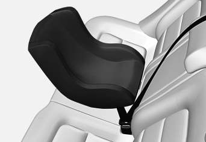

G023271

Fasten the seat belt

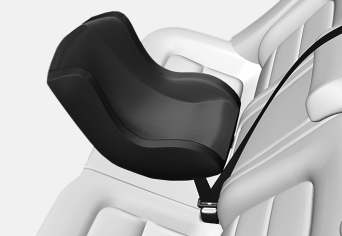

G022846

Pull out the shoulder section of the seat belt

4.
Pull the shoulder section of the seat belt
out as far as possible to activate the
belt's automatic locking function.

---

<!-- Page 53 -->

### 02 Safety

02

}}

51

NOTE

The locking retractor will automatically
release when the seat belt is unbuckled
and allowed to retract fully.

5.
Press the infant seat firmly in place, let
the seat belt retract and pull it taut. A
sound from the seat belt retractor's auto-
matic locking function will be audible at
this time and is normal. The seat belt
should now be locked in place.

G022850

Ensure that the seat is securely in place

6.
Push and pull the infant seat along the
seat belt path to ensure that it is held
securely in place by the seat belt.

WARNING

It should not be possible to move the child
restraint (child seat) more than 1 in.
(2.5 cm) in any direction along the seat belt
path.

The infant seat can be removed by unbuck-
ling the seat belt and letting it retract com-
pletely.

Related information
•
Child safety (p. 46)
•
Child restraints (p. 47)
•
Convertible seats (p. 51)
•
Integrated booster cushion – general
information (p. 57)
•
ISOFIX/LATCH lower anchors (p. 55)
•
Top tether anchors (p. 56)

Convertible seats
Suitable child restraints should always be
used when children (depending on their age/
size) are seated in the vehicle.

Securing a convertible seat with a seat
belt

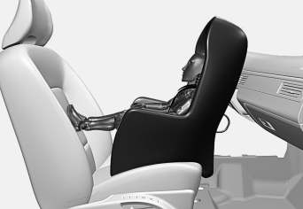

G018630

Do not place the convertible seat in the front
passenger's seat

NOTE

Refer to (p. 55) and (p. 56) for informa-
tion on securing a child restraint using
ISOFIX/LATCH lower anchors and/or top
tether anchorages.

Convertible seats can be used in either a for-
ward or rearward-facing position, depending
on the age and size of the child.

---

<!-- Page 54 -->

||

### 02 Safety

02

52

G022847

Route the seat belt through the convertible seat

WARNING

Always use a convertible seat that is suita-
ble for the child's age and size. See the
convertible seat manufacturer's recom-
mendations.

1.
Place the convertible seat in the rear seat
of the vehicle.

WARNING
• A small child's head represents a con-
siderable part of its total weight and its
neck is still very weak. Volvo recom-
mends that children up to age 4 travel,
properly restrained, facing rearward. In
addition, Volvo recommends that chil-
dren should ride rearward facing, prop-
erly restrained, as long as possible.
• Convertible child seats should be instal-
led in the rear seat only.
• A rear-facing convertible seat should
not be positioned behind the driver's
seat unless there is adequate space for
safe installation.

2.
Attach the seat belt to the convertible
seat according to the manufacturer's
instructions.

G022848

Fasten the seat belt

3.
Fasten the seat belt by inserting the latch
plate into the buckle (lock) until a distinct
click is audible.

4.
Pull the shoulder section of the seat belt
out as far as possible to activate the
belt's automatic locking function.

---

<!-- Page 55 -->

### 02 Safety

02

53

NOTE

The locking retractor will automatically
release when the seat belt is unbuckled
and allowed to retract fully.

5.
Press the convertible seat firmly in place,
let the seat belt retract and pull it taut. A
sound from the seat belt retractor's auto-
matic locking function will be audible at
this time and is normal. The seat belt
should now be locked in place.

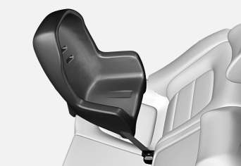

G022849

Pull out the shoulder section of the seat belt

6.
Push and pull the convertible seat along
the seat belt path to ensure that it is held
securely in place by the seat belt.

WARNING

It should not be possible to move the child
restraint (child seat) more than 1 in.
(2.5 cm) in any direction along the seat belt
path.

The convertible seat can be removed by
unbuckling the seat belt and letting it retract
completely.

G022850

Ensure that the seat is securely in place

WARNING

A child seat should never be used in the
front passenger seat of any vehicle with a
front passenger airbag – not even if the
"Passenger airbag off" symbol near the
rear-view mirror is illuminated. If the
severity of an accident were to cause the
airbag to inflate, this could lead to serious
injury or death to a child seated in this
position.

Related information
•
Child safety (p. 46)
•
Child restraints (p. 47)
•
Infant seats (p. 49)
•
Integrated booster cushion – general
information (p. 57)
•
ISOFIX/LATCH lower anchors (p. 55)
•
Top tether anchors (p. 56)

---

<!-- Page 56 -->

### 02 Safety

02

54

Booster cushions
Booster cushions should be properly posi-
tioned in the vehicle.

Securing a booster cushion

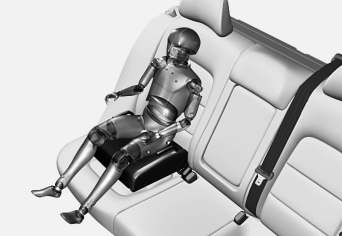

G022851

Position the child correctly on the booster cush-
ion

Booster cushions are recommended for chil-
dren who have outgrown convertible
seats (p. 51).

1.
Place the booster cushion in the rear seat
of the vehicle.

2.
With the child properly seated on the
booster cushion, attach the seat belt to or
around the cushion according to the
manufacturer's instructions.

3.
Fasten the seat belt by inserting the latch
plate into the buckle (lock) until a distinct
click is audible.

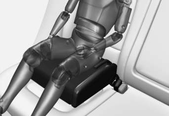

G022852

Positioning the seat belt

4.
Ensure that the seat belt is pulled taut
and fits snugly around the child.

WARNING
•
The hip section of the three-point seat
belt must fit snugly across the child's
hips, not across the stomach.
•
The shoulder section of the three-point
seat belt should be positioned across
the chest and shoulder.
•
The shoulder belt must never be
placed behind the child's back or
under the arm.

Related information
•
Child safety (p. 46)
•
Child restraints (p. 47)
•
Infant seats (p. 49)
•
Convertible seats (p. 51)
•
ISOFIX/LATCH lower anchors (p. 55)
•
Top tether anchors (p. 56)

---

<!-- Page 57 -->

### 02 Safety

02

}}

55

ISOFIX/LATCH lower anchors
Lower anchors for ISOFIX/LATCH-equipped
child seats are located in the rear, outboard
seats, hidden below the backrest cushions.

Using the ISOFIX/LATCH lower child
seat anchors

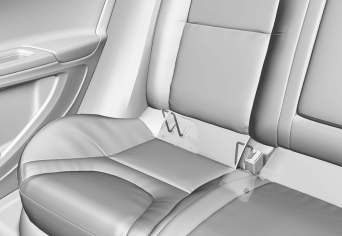

Symbols on the seat back upholstery mark
the ISOFIX/LATCH anchor positions as
shown. To access the anchors, kneel on the
seat cushion and locate the anchors by feel.
Always follow your child seat manufacturer's
installation instructions, and use both ISOFIX/
LATCH lower anchors and top teth-
ers (p. 56) whenever possible.

To access the anchors
1.
Put the child restraint in position.

2.
Kneel on the child restraint to press down
the seat cushion and locate the anchors
by feel.

3.
Fasten the attachment on the child
restraint's lower straps to the ISOFIX/
LATCH/LATCH lower anchors.

4.
Firmly tension the lower child seat straps
according to the manufacturer's instruc-
tions.

WARNING

Volvo's ISOFIX/LATCH anchors conform to
FMVSS/CMVSS standards. Always refer to
the child restraint system's manual for
weight and size ratings.

NOTE
•
The rear seat's center position is not
equipped with ISOFIX/LATCH lower
anchors. When installing a child
restraint in this position, attach the
restraint's top tether strap (if it is so
equipped) to the top tether anchorage
point and secure the restraint with the
vehicle's center seat belt.
•
Always follow your child seat manufac-
turer's installation instructions, and
use both ISOFIX/LATCH lower anchors
and top tethers whenever possible.

G018631

Fasten the attachment correctly to the ISOFIX/
LATCH lower anchors

WARNING
•
Be sure to fasten the attachment cor-
rectly to the anchor (see the illustra-
tion). If the attachment is not correctly
fastened, the child restraint may not
be properly secured in the event of a
collision.
•
The ISOFIX/LATCH lower child
restraint anchors are only intended for
use with child seats positioned in the
outboard seating positions. These
anchors are not certified for use with
any child restraint that is positioned in
the center seating position. When
securing a child restraint in the center
seating position, use only the vehicle's
center seat belt.

---

<!-- Page 58 -->

||

### 02 Safety

02

56

Related information
•
Child safety (p. 46)
•
Infant seats (p. 49)
•
Convertible seats (p. 51)
•
Integrated booster cushion – general
information (p. 57)

Top tether anchors
Your Volvo is equipped with child restraint top
tether anchorages in the rear seat. They are
located on the rear side of the backrests.

Child restraint anchorages

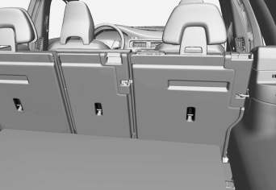

Securing a child seat
1.
Place the child restraint on the rear seat.

2.
Route the top tether strap under the head
restraint and attach it to the anchor.

3.
Attach lower tether straps to the lower
ISOFIX/LATCH anchors. If the child
restraint is not equipped with lower tether
straps, or the restraint is used in the cen-
ter seating position, follow instructions for
securing a child restraint using the Auto-
matic Locking Retractor seat belt (see
Child restraints (p. 47)).

4.
Firmly tension all straps.

Refer also to the child seat manufacturer's
instructions for information on securing the
child seat.

NOTE

On models equipped with the optional
cargo area cover, this cover should be
removed before a child seat is attached to
the child restraint anchors.

WARNING
•
Always refer to the recommendations
made by the child restraint manufac-
turer.
•
Volvo recommends that the top tether
anchors be used when installing a for-
ward-facing child restraint.
•
Never route a top tether strap over the
top of the head restraint. The strap
should be routed beneath the head
restraint.
•
Child restraint anchorages are
designed to withstand only those
loads imposed by correctly fitted child
restraints. Under no circumstances are
they to be used for adult seat belts or
harnesses. The anchorages are not
able to withstand excessive forces on
them in the event of collision if full har-
ness seat belts or adult seat belts are
installed to them. An adult who uses a
belt anchored in a child restraint
anchorage runs a great risk of suffer-

---

<!-- Page 59 -->

### 02 Safety

02

}}

57

ing severe injuries should a collision
occur.
•
Do not install rear speakers that
require the removal of the top tether
anchors or interfere with the proper
use of the top tether strap.

Related information
•
Child safety (p. 46)
•
Infant seats (p. 49)
•
Convertible seats (p. 51)
•
Integrated booster cushion – general
information (p. 57)
•
ISOFIX/LATCH lower anchors (p. 55)

Integrated booster cushion – general
information
The booster cushions are designed to raise
the child higher so that the shoulder strap
crosses over the child's collarbone, not over
the neck.

Integrated two-stage booster cushion2

Volvo's optional integrated booster cushions
are located in the outboard seating positions.
These booster cushions have been specially
designed to help safeguard children in the
rear seat. They should be stowed (p. 60)
(folded down into the seat cushion) when not
in use. When using an integrated booster
cushion (p. 59), the child must be secured
with the vehicle's three-point seat belt.

Use these booster cushions only
with children whose weight is
between:
•
Stage 1: 48 – 80 lbs (22 – 36 kg)
•
Stage 2: 33 – 55 lbs (15 – 25 kg)
and whose height is between:
•
Stage 1: 45 – 55 in. (115 –
140 cm)
•
Stage 2: 37 – 47 in. (95 – 120 cm)

In Canada, Transport Canada's
weight recommendation is 40 –
80 lbs (18 – 36 kg).

If using a booster cushion does not result in
proper positioning of the shoulder strap, then
the child should be placed in a properly
secured child restraint (see (p. 47) ). The
shoulder belt must never be placed behind
the child's back or under the arm.

Correct seating position: child's head is below
the head restraint and the shoulder belt is across
the collarbone

2 Canada only: This cushion may be referred to as a built-in booster cushion.

---

<!-- Page 60 -->

||

### 02 Safety

02

58

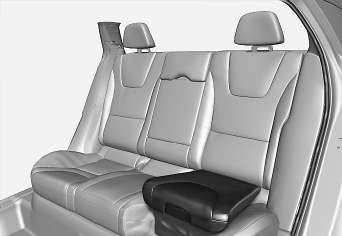

Incorrect seating position: the child's head is
above the head restraint and the shoulder belt is
not across the collarbone

Before driving, check that:
•
The integrated two-stage booster cushion
is set in the correct position according to
the child's height and weight (see the
table below) and is locked in position.

Stage 1
Stage 2

Weight
48 – 80 lbs

22 – 36 kg

33 – 55 lbs

15 – 25 kg

Height
45 – 55 in.

115 – 140 cm

37 – 47 in.

95 – 120 cm

•
That the seat belt (p. 28) is properly posi-
tioned and is taut.
•
The shoulder section of the seat belt is
across the child's collarbone, not over the
neck.
•
The lap section of the seat belt is across
the child's hips and not the abdomen.

WARNING

DEATH or SERIOUS INJURY can
occur
Follow all instructions on the
booster cushion and in the vehi-
cle's owner's manual.
MAKE SURE THE BOOSTER
CUSHION IS SECURELY
LOCKED BEFORE THE CHILD IS
SEATED.
•
In the event of a collision while the
integrated booster cushion was occu-
pied, the entire booster cushion and
seat belt must be replaced. The
booster cushion should also be
replaced if it is badly worn or damaged
in any way. This work should be per-
formed by a trained and qualified
Volvo service technician only.

Related information
•
Child safety (p. 46)
•
Infant seats (p. 49)
•
Convertible seats (p. 51)
•
Booster cushions (p. 54)

---

<!-- Page 61 -->

### 02 Safety

02

59

Integrated booster cushion – using
The Integrated booster cushion (p. 57) in the
rear seat can be folded up in two stages,
depending on the child's height and weight.

Stage 1

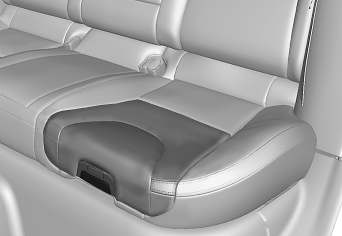

Pull the handle (1) forward and upward (2)
to release the booster cushion.

Press the booster cushion rearward to
lock it in position.

Stage 2

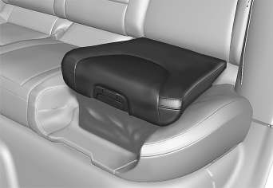

With the booster cushion in the stage 1
position, press the button (see the arrow
in illustration 1).

Lift the front edge of the booster cushion
and press it rearward toward the backrest
to lock it in position.

WARNING

DEATH or SERIOUS INJURY can
occur
Follow all instructions on the
booster cushion and in the vehi-
cle's owner's manual.
MAKE SURE THE BOOSTER
CUSHION IS SECURELY
LOCKED BEFORE THE CHILD IS
SEATED.
•
In the event of a collision while the
integrated booster cushion was occu-
pied, the entire booster cushion and
seat belt must be replaced. The
booster cushion should also be
replaced if it is badly worn or damaged
in any way. This work should be per-
formed by a trained and qualified
Volvo service technician only.

Related information
•
Integrated booster cushion – stowing
(p. 60)

---

<!-- Page 62 -->

### 02 Safety

02

60

Integrated booster cushion – stowing
The integrated booster cushion (p. 57) can be
folded down completely (stowed) from either
the stage 1 or stage 2 positions.

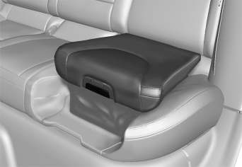

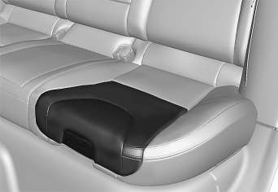

NOTE

The booster cushion cannot be moved
from the stage 2 (upper) position to the
stage 1 (lower) position. It must first be
folded down completely to the stowed
position, and then adjusted to stage 1.

Pull the handle forward to release the
booster cushion.

Press down on the center of the booster
cushion to return it to the stowed posi-
tion.

NOTE

The booster cushion must be in the
stowed position before the rear seat back-
rests are folded down.

CAUTION

Be sure there are no loose objects under
the booster cushion before it is stowed.

WARNING

DEATH or SERIOUS INJURY can
occur
Follow all instructions on the
booster cushion and in the vehi-
cle's owner's manual.
MAKE SURE THE BOOSTER
CUSHION IS SECURELY
LOCKED BEFORE THE CHILD IS
SEATED.
•
In the event of a collision while the
integrated booster cushion was occu-
pied, the entire booster cushion and
seat belt must be replaced. The
booster cushion should also be
replaced if it is badly worn or damaged
in any way. This work should be per-
formed by a trained and qualified
Volvo service technician only.

Related information
•
Integrated booster cushion – using (p. 59)

---

<!-- Page 63 -->

### 02 Safety

02

* Option/accessory, for more information, see Introduction.
61

Child safety locks
Power child safety locks* help prevent chil-
dren from inadvertently opening one of the
rear doors or windows from inside the vehicle.

Manual child safety locks

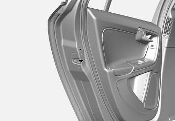

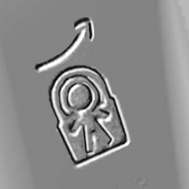

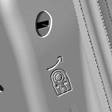

Child safety locks – rear doors
The controls are located on the rear door
jambs. Use the remote control's key blade or
a screwdriver to adjust these controls.

The rear doors can only be opened from
the outside when the slot is in the hori-
zontal position.

The rear doors can be opened from the
inside when the slot is in the vertical posi-
tion.

Power child safety locks and
disengaging rear door windows*

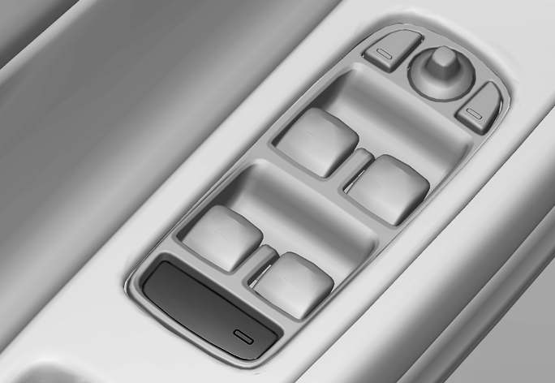

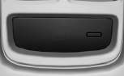

Driver's door control panel

The power child safety locks can be acti-
vated/deactivated when the remote key is in
mode I (p. 77) or higher. Activation/deacti-
vation can be done up to 2 minutes after the
engine has been switched off (if no door has
been opened).

To activate the child safety locks:

1.
Put the ignition in mode I or higher, or
start the engine.

2.
Press the button on the driver's door con-
trol panel (see the illustration).
> Rear child locks Activated will be
displayed in the instrument panel and
the indicator light in the button will illu-
minate when the function is activated.

When the child safety locks are activated:

•
The rear door windows can only be
opened from the driver's door control
panel
•
The rear doors cannot be opened from
the inside

The child safety locks' current setting is
stored when the engine is switched off. If
these locks were activated when the engine
was switched off, they will also be active
when the engine is restarted.

Related information
•
Detachable key blade – general informa-
tion (p. 151)
•
Locking/unlocking – from inside (p. 160)

---

<!-- Page 64 -->

INSTRUMENTS AND CONTROLS

---

<!-- Page 65 -->

### 03 Instruments and controls

03

}}

63

Instrument overview
This overview shows the location of the
instrument panel and center console displays,
and controls/buttons/switches.

---

<!-- Page 66 -->

||

### 03 Instruments and controls

03

64

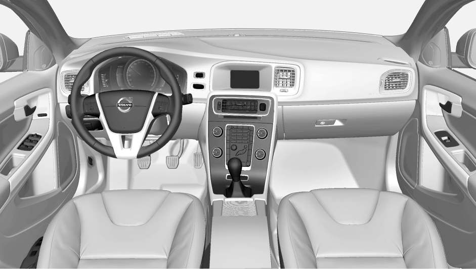

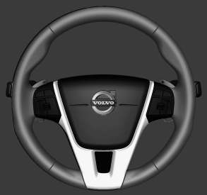

---

<!-- Page 67 -->

### 03 Instruments and controls

03

* Option/accessory, for more information, see Introduction.
65

Function
See

Controls for menus
and messages, turn
signals, high/low
beams, trip computer

(p. 74),
(p. 93),
(p. 87),
(p. 113)

Paddles for manually
shifting gears*

(p. 259)

Cruise control
(p. 176)

Horn, airbag
(p. 85),
(p. 33)

Main instrument
panel

(p. 66)

Infotainment system/
Bluetooth hands-free
controls

Sensus Info-
tainment
supplement

START/STOP
ENGINE button

(p. 76)

Ignition slot
(p. 76)

Display for infotain-
ment system func-
tions and menus

(p. 111),
Sensus Info-
tainment
supplement

Door handle
-

Function
See

In-door control pan-
els (power windows,
mirrors, central lock-
ing button)

(p. 99),
(p. 100),
(p. 160)

Hazard warning
flashers

(p. 93)

Controls for the info-
tainment system and
menus

(p. 74),
(p. 126),
Sensus Info-
tainment
supplement

Climate system con-
trols

(p. 126)

Gear selector
(p. 257)

Controls for active
chassis (Four-C)*

(p. 169)

Wipers and washers
(p. 96),
(p. 97)

Steering wheel
adjustment

(p. 85)

Hood opening control
(p. 332)

Parking brake
(p. 274)

Function
See

Power seat* adjust-
ment controls

(p. 79)

Lighting panel, but-
tons for opening fuel
filler door and
unlocking the tailgate

(p. 87),
(p. 283),
(p. 162)

Related information
•
Information displays – ambient tempera-
ture sensor (p. 75)
•
Information displays – trip odometer and
clock (p. 76)

---

<!-- Page 68 -->

### 03 Instruments and controls

03

66
* Option/accessory, for more information, see Introduction.

Information displays – introduction
The displays show information on some of the
vehicle's functions, such as cruise control, the
trip computer and messages. The information
is shown with text and symbols.

Information displays: analog instrument panel

Information displays: digital instrument panel*

More detailed information can be found in the
descriptions of the functions that use the
information displays.

Gauges and indicators: analog
instrument panel

Fuel gauge: When the indicator shows
one white marking1, a yellow indicator
light will illuminate to indicate a low fuel
level. See also Trip computer – introduc-
tion (p. 113) and Refueling – fuel require-
ments (p. 281) for additional information.

Eco meter: Indicates how economically
the vehicle is being driven. The higher the
needle moves on the scale, the more
economically the vehicle is being driven.

Speedometer

Tachometer: Shows engine speed in
thousands of revolutions per minute (rpm)

Gear indicator: Shows the currently
selected gear

Gauges and indicators: digital
instrument panel*
Different themes (display alternatives) can be
selected for the digital instrument panel:
•
Elegance
•
Eco
•
Performance

To change themes, press the OK button on
the left steering wheel lever and use the
thumb wheel to scroll to Themes. Press OK
to confirm your choice.

1
When the message Distance to empty fuel tank: shows "----", the marker turns red

---

<!-- Page 69 -->

### 03 Instruments and controls

03

}}

* Option/accessory, for more information, see Introduction.
67

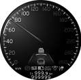

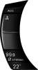

Theme Elegance: gauges and indicators

Fuel gauge. When the indicator shows
one white marking, a yellow indicator light
will illuminate to indicate a low fuel level.
See also Trip computer – introduction
(p. 113) and Refueling – fuel require-
ments (p. 281) for additional information.

Coolant temperature gauge

Speedometer

Tachometer (engine speed in thousands
of revolutions per minute (rpm))

Gear indicator: Shows the currently
selected gear

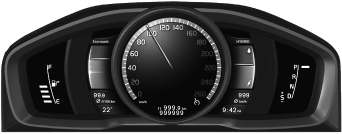

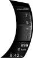

Theme Eco: gauges and indicators

Fuel gauge. When the indicator shows a
white marking, a yellow indicator light will
illuminate to indicate a low fuel level. See
also Trip computer – introduction (p. 113)
and Refueling – fuel requirements
(p. 281) for additional information.

Eco Guide (see Eco Guide* and Power
Meter* (p. 69))

Speedometer

Tachometer (engine speed in thousands
of revolutions per minute (rpm))

Gear indicator: Shows the currently
selected gear

Theme Performance: gauges and indicators

Fuel gauge. When the indicator shows a
white marking, a yellow indicator light will
illuminate to indicate a low fuel level. See
also Trip computer – introduction (p. 113)
and Refueling – fuel requirements
(p. 281) for additional information.

Coolant temperature gauge

Speedometer

Tachometer (shows engine speed in
thousands of revolutions per minute
(rpm))

Power Meter (see Eco Guide* and Power
Meter* (p. 69)).

Gear indicator: Shows the currently
selected gear

---

<!-- Page 70 -->

||

### 03 Instruments and controls

03

68

Indicator and warning symbols

Indicator and warning symbols: analog instru-
ment panel

Indicator symbols

Indicator and warning symbols

Warning symbols

Indicator and warning symbols: digital instrument
panel

Indicator symbols

Indicator and warning symbols

Warning symbols

Function check
All indicator and warning symbols light up in
ignition mode II or when the engine is started.
When the engine has started, all the symbols
should go out except the parking brake sym-
bol, which only goes out when the brake is
disengaged.

If the engine does not start or if the function
check is carried out in ignition mode II, all
symbols go out after 5 seconds except the
malfunction indicator light, which may indi-
cate a fault in the vehicle's emissions system,
and the symbol for low oil pressure.

Some of the symbols shown may not be
available in all markets or models.

Related information
•
Instrument overview (p. 63)
•
Information displays – indicator symbols
(p. 70)
•
Information displays – warning symbols
(p. 72)

---

<!-- Page 71 -->

### 03 Instruments and controls

03

}}

* Option/accessory, for more information, see Introduction.
69

Eco Guide* and Power Meter*
Eco guide and Power guide are two gauges in
the instrument panel that help improve driving
economy.

The vehicle also stores driving-related statis-
tics in the form of a bar graph, see Trip com-
puter – Trip statistics (p. 120).

Introduction

To display or remove these functions from the
instrument panel, select the "Eco" theme (see
Information displays – introduction (p. 66)).

Driving statistics are also stored and can be
displayed in the form of a bar chart (see Trip
computer – Trip statistics (p. 120)).

Eco Guide
This gauge gives an indication of how eco-
nomically the vehicle is being driven.

Current (instantaneous) reading

Average

Current (instantaneous) reading
This is the current level of economical driving;
the higher the reading, the more economically
the vehicle is being driven.

This value is calculated based on the vehi-
cle's speed, engine speed (rpm), engine load
and brake use.

The optimal speed range is between approxi-
mately 30–50 mph (50–80 km/h), preferably at
as low rpm as possible. The markers fall
when the brake or accelerator pedal is
pressed.

If the current reading is very low, the red field
in the gauge will illuminate after a slight delay,
indicating low driving economy.

Average
The average reading changes gradually
according to changes in the current reading
to indicate how economically the vehicle has
been driven recently. The higher the average
reading, the more economically the vehicle
has been driven.

Power Meter
This gauge indicates the engine power that
has been utilized and the amount of power
remaining.

Available power

Utilized power

---

<!-- Page 72 -->

||

### 03 Instruments and controls

03

70
* Option/accessory, for more information, see Introduction.

Available power
The smaller, upper indicator shows the
engine's available power2. The higher the
reading on the scale, the greater the amount
of power remaining in the current gear.

Utilized power
The larger, lower indicator shows the amount
of engine power that has been utilized2. The
higher the reading on the scale, the greater
the amount of power that is being utilized.

The larger the gap between the two indica-
tors, the greater the amount of power remain-
ing.

Information displays – indicator
symbols
The indicator symbols alert the driver when
certain functions are activated, that a system
is actively working or that a fault may have
occurred in a system or function.

Symbol
Description

Fault in the Active Bending
Light (ABL)*system

Malfunction indicator light

Anti-lock brake system (ABS)

Rear fog lights on

Stability system

The stability system's Sport
mode is activated

Low fuel level

Information symbol, read the
text displayed in the instrument
panel

High beam indicator

Symbol
Description

Left turn signal indicator

Right turn signal indicator

Tire pressure monitoring sensor
(TPMS)A

The Eco function is on.

TheStart/Stop function is active
(the engine has auto-stopped)

A Option in Canada

Fault in the Active Bending Light (ABL)
system
This symbol will illuminate if there is a fault in
the ABL system. See Active Bending Lights
(ABL)* (p. 90) for more information about
this system.

2
Depending on rpm

---

<!-- Page 73 -->

### 03 Instruments and controls

03

}}

* Option/accessory, for more information, see Introduction.
71

Malfunction Indicator Light
As you drive, a computer called On-Board
Diagnostics II (OBDII) monitors your vehicle's
engine, transmission, electrical and emission
systems.

The malfunction indicator light will illuminate if
the computer senses a condition that poten-
tially may need correcting. When this hap-
pens, please have your vehicle checked by a
trained and qualified Volvo service technician
as soon as possible.

A malfunction indicator light may have many
causes. Sometimes, you may not notice a
change in your car's behavior. Even so, an
uncorrected condition could hurt fuel econ-
omy, emission controls, and drivability.
Extended driving without correcting the cause
could even damage other components in
your vehicle.

This light may illuminate if the fuel filler cap is
not closed tightly or if the engine was running
while the vehicle was refueled.

Anti-lock Brake System (ABS)
If the warning light comes on, there may be a
malfunction in the ABS system (the standard
braking system will still function). Check the
system by:

1.
Stopping in a safe place and switching off
the ignition.

2.
Restart the engine.

3.
If the warning light goes off, no further
action is required.

If the indicator light remains on, the vehicle
should be driven to a trained and qualified
Volvo service technician for inspection, see
Brakes – general (p. 271) for additional infor-
mation.

Rear fog lights
This symbol indicates that the rear fog lights
are on.

Stability system
This indicator symbol flashes when the stabil-
ity system is actively working to stabilize the
vehicle, see Stability system – introduction
(p. 169) for more detailed information.

Stability system - Sport mode
This symbol illuminates to indicate that the
stability system's Sport mode has been acti-
vated to help provide maximum tractive force,
for example when driving with snow chains,
or driving in deep snow or loose sand.

Low fuel level
When this light comes on, the vehicle should
be refueled as soon as possible. See Refuel-
ing – fuel requirements (p. 281) for informa-
tion about fuel and refueling.

Information symbol
The information symbol lights up and a text
message is displayed to provide the driver
with necessary information about one of the
vehicle's systems. The message can be
erased and the symbol can be turned off by

pressing the OK button (see Information dis-
play – menu controls (p. 111) for information)
or this will take place automatically after a
short time (the length of time varies, depend-
ing on the function affected).

The information symbol may also illuminate
together with other symbols.

High beam indicator
This symbol illuminates when the high beam
headlights are on, or if the high beam flash
function is used.

Left turn signal indicator

Right turn signal indicator

NOTE
•
Both turn signal indicators will flash
when the hazard warning flashers are
used.
•
If either of these indicators flash faster
than normal, the direction indicators
are not functioning properly.

Tire pressure monitoring system
(TPMS)*
This symbol illuminates to indicate that tire
pressure in one or more tires is low, see Tire
Pressure Monitoring System (TPMS) – general
information (p. 312) for detailed information.

Eco* function on
The symbol will illuminate when the Eco func-
tion is activated.

---

<!-- Page 74 -->

||

### 03 Instruments and controls

03

72
* Option/accessory, for more information, see Introduction.

Start/stop*
The symbol illuminates when the engine has
auto-stopped.

Related information
•
Information displays – introduction (p. 66)
•
Information displays – warning symbols
(p. 72)

Information displays – warning
symbols
The warning lights alert the driver that an
important function is activated or that a seri-
ous fault has occurred.

Symbol
Description

Low oil pressureA

Parking brake appliedB

SRS airbags

Seat belt reminder

Generator not charging

Fault in the brake system

Warning symbol, read the text
displayed in the instrument
panel

A Certain engines do not use this symbol to indicate low oil
pressure. On these models, a text message will be dis-
played on the instrument panel instead, see Engine com-
partment – engine oil (p. 334).
B The symbol is Park only on models with the optional digital
instrument panel.

Low oil pressure
If the light comes on while driving, stop the
vehicle, stop the engine immediately, and
check the engine oil level. Add oil if neces-

sary. If the oil level is normal and the light
stays on after restart, have the vehicle towed
to the nearest trained and qualified Volvo
service technician.

Parking brake applied
This symbol flashes while the brake is being
applied and then glows steadily when the
parking brake has been set.

See Parking brake – general information
(p. 274) for more information about using the
parking brake.

Airbags – SRS
If this light comes on while the vehicle is
being driven, or remains on for longer than
approximately 10 seconds after the vehicle
has been started, the SRS system's diagnos-
tic functions have detected a fault in a seat
belt lock or pretensioner, a front airbag, side
impact airbag, and/or an inflatable curtain.
Have the system(s) inspected by a trained
and qualified Volvo service technician as
soon as possible.

See Supplemental Restraint System (SRS)
(p. 31) for more information about the airbag
system.

Seat belt reminder
This symbol comes on for approximately
6 seconds if the driver has not fastened his or
her seat belt.

---

<!-- Page 75 -->

### 03 Instruments and controls

03

}}

73

Generator not charging
This symbol comes on during driving if a fault
has occurred in the electrical system. Contact
an authorized Volvo workshop.

Engine temperature
Engine overheating can result from low oil or
coolant levels, towing or hard driving at high
heat and altitude, or mechanical malfunction.
Engine overheating will be signaled with text
and a red warning triangle in the middle of the
instrument display. The exact text will depend
on the degree of overheating. It may range
from High engine temp Reduce speed to
High engine temp Stop engine. If appropri-
ate, other messages, such as Coolant level
low, Stop safely will also be displayed. If
your engine does overheat so that you must
stop the engine, always allow the engine to
cool before attempting to check oil and cool-
ant levels.

See Engine compartment – coolant (p. 336)
for more information.

Fault in brake system
If this symbol lights, the brake fluid level may
be too low. Stop the vehicle in a safe place
and check the level in the brake fluid reser-
voir, see Engine compartment – brake fluid
(p. 337). If the level in the reservoir is below
MIN, the vehicle should be transported to an
authorized Volvo workshop to have the brake
system checked.

If the
and
symbols come on
at the same time, there may be a fault in the
brake force distribution system.

1.
Stop the vehicle in a safe place and turn
off the engine.

2.
Restart the engine.
•
If both symbols extinguish, continue driv-
ing.
•
If the symbols remain on, check the level
in the brake fluid reservoir, see Engine
compartment – brake fluid (p. 337). If the
brake fluid level is normal but the sym-
bols are still lit, the vehicle can be driven,
with great care, to an authorized Volvo
workshop to have the brake system
checked.
•
If the level in the reservoir is below MIN,
the vehicle should be transported to an
authorized Volvo workshop to have the
brake system checked.

WARNING
•
If the fluid level is below the MIN mark
in the reservoir or if a warning mes-
sage is displayed in the text window:
DO NOT DRIVE. Have the vehicle
towed to a trained and qualified Volvo
service technician and have the brake
system inspected.
•
If the
and
symbols
are on at the same time, there is a risk
of reduced vehicle stability.

Warning symbol
The red warning symbol lights up to indicate
a problem related to safety and/or drivability.
A message will also appear in the instrument
panel. The symbol remains visible until the
fault has been rectified but the text message
can be cleared with the OK button, see Infor-
mation display – menu controls (p. 111). The
warning symbol can also come on in conjunc-
tion with other symbols.

Action:

1.
Stop in a safe place. Do not drive the
vehicle further.

2.
Read the information on the display.
Implement the action in accordance with
the message in the display. Clear the
message using OK.

---

<!-- Page 76 -->

||

### 03 Instruments and controls

03

74

Reminder – doors not closed
If one of the doors is not closed properly, the
information or warning symbol illuminates
(depending on the vehicle's speed), a graphic
will be displayed in instrument panel and an
explanatory text message3 will also be dis-
played in the instrument panel. Stop the vehi-
cle in a safe place as soon as possible and
close the door.

If the vehicle is driven at a speed
lower than approximately 5 mph
(7 km/h), the information symbol illu-
minates.

If the vehicle is driven at a speed
higher than approximately 5 mph
(7 km/h), the warning symbol illumi-
nates.

If the hood is not closed properly, the warn-
ing symbol illuminates, a graphic will be dis-
played in instrument panel and an explana-
tory text message3 will also be displayed in
the instrument panel. Stop the vehicle in a
safe place as soon as possible and close the
hood.

If the tailgate is not closed properly, the
information symbol illuminates and a graphic
will be displayed in instrument panel. Stop
the vehicle in a safe place as soon as possi-
ble and close the tailgate.

Related information
•
Information displays – introduction (p. 66)
•
Information displays – indicator symbols
(p. 70)

My Car – introduction
The MY CAR menu system provides access
to menus for operating many of the vehicle's
functions, such as setting the clock, door mir-
rors, lock and alarm settings, etc.

Some of the features or functions are stand-
ard; others are optional and vary according to
model/market.

Operation
Use the buttons on the center console or the
steering wheel keypad to navigate in the
menus.

3
Text message applies only to models with the optional digital instrument panel

---

<!-- Page 77 -->

### 03 Instruments and controls

03

* Option/accessory, for more information, see Introduction.
75

The center console control panel and the steer-
ing wheel keypad. The illustration is generic and
the appearance/location of the buttons may vary.

MY CAR: opens the MY CAR menu sys-
tem.

OK/MENU: Press the button on the cen-
ter console or the thumb wheel on the
steering wheel keypad to select a menu
alternative or to store a selected function
in the system's memory.

TUNE: Turn this control on the center
console or the thumb wheel on the steer-
ing wheel keypad to navigate up/down in
a menu.

EXIT

EXIT functions
Depending on which function the cursor is
pointing to and the menu level, briefly press-
ing EXIT will result in:
•
An in-coming phone call will be rejected
•
The current function will be cancelled
•
Characters entered will be erased
•
The most recent selection will be cancel-
led
•
Go back/up in the menu system

Pressing and holding EXIT takes you to the
normal view for MY CAR. If you are already in
normal view, this will take you to the main
source menu.

Menu selections and paths
Please consult your Sensus Infotainment sup-
plement for a description of the MY CAR
menu selections and paths.

Information displays – ambient
temperature sensor

Location of the ambient temperature sensor, A:
digital instrument panel*, B: analog instrument
panel

NOTE

When the ambient temperature is between
23° and 36 °F (–5° and +2 °C), a snowflake
symbol will be displayed next to the tem-
perature. This symbol serves as a warning
for possible slippery road surfaces. Please
note that this symbol does not indicate a
fault with your vehicle.

At low speeds or when the vehicle is not
moving, the temperature readings may be
slightly higher than the actual ambient
temperature.

Related information
•
Information displays – introduction (p. 66)

---

<!-- Page 78 -->

### 03 Instruments and controls

03

76
* Option/accessory, for more information, see Introduction.

Information displays – trip odometer
and clock
The trip odometers T1 and T2 and clock are
displayed in the instrument panel.

Trip odometers

Trip odometer4

Odometer display

Turn the thumb wheel on the left steering
wheel lever to display the desired trip odome-
ter.

Press and hold the RESET button on the left
steering wheel lever for at least 1 second to
reset the selected trip odometer5.

Clock

Clock, digital instrument panel*

Display6

Setting the clock
The clock can be set in the MY CAR menu
system. See My Car – introduction (p. 74) for
additional information about these menus.

Go to Settings
System options
Time
settings. Set Auto time to ON (check the
box) and select the correct time zone under
Location.

Related information
•
Information displays – introduction (p. 66)

Inserting/removing remote key
The remote key is used to start the engine or
to use various electrical functions without
starting the engine.

Inserting and removing the remote key

Ignition slot with remote key and START/STOP
ENGINE button.

Inserting the remote key7

Holding the end of the remote key with the
base of the key blade, insert the remote key
into the ignition slot as shown in the illustra-
tion and press it in as far as possible.

CAUTION

Foreign objects in the ignition slot can
impair function or cause damage.

4
The trip odometer will be displayed differently in analog and digital instrument panels
5
Models with a digital information panel: press and hold RESET for more than approximately 4 seconds to reset all trip computer information
6
Models with an analog instrument panel: the time will be displayed in the center of the instrument panel
7
Not necessary in vehicles with the optional keyless drive.

---

<!-- Page 79 -->

### 03 Instruments and controls

03

}}

* Option/accessory, for more information, see Introduction.
77

Removing the remote key
The remote key can be removed from the
ignition slot by pulling it out.

Related information
•
Ignition modes (p. 77)

Ignition modes
The vehicle's ignition has 3 modes: 0, I, and II
that can be used without starting the engine.
The following table shows examples of which
functions are available in the respective
modes.

NOTE

To access ignition modes I or II without
starting the engine, the brake pedal must
not be depressed.

Mode
Function

0
The odometer, clock and tem-
perature gauge are illuminated.
Power seats* can be adjusted
and the infotainment system can
be used for a limited time (to min-
imize battery drain, see the Sen-
sus Infotainment Supplement).

I
The Moonroof*, power windows,
12-volt sockets in the passenger
compartment, navigation sys-
tem*, climate system blower,
windshield wipers can be used.

II
The headlights/taillights illumi-
nate. Warning/indicator lights illu-
minate for 5 seconds. Other sys-
tems are activated. However, the
heated seats* and heated rear
window function can only be acti-
vated when the engine is running.
Mode II should only be used for
very short periods to help avoid
draining the battery.

Ignition modes

Ignition mode 0
–
The vehicle is unlocked.

---

<!-- Page 80 -->

||

### 03 Instruments and controls

03

78
* Option/accessory, for more information, see Introduction.

Ignition mode I
–
With the remote key fully pressed into the
ignition slot8, press START/STOP
ENGINE briefly.

Ignition mode II
–
With the remote key fully pressed into the
ignition slot8, press START/STOP
ENGINE for approximately 2 seconds.

Returning to mode 0
To return to mode 0 from mode II or I, press
START/STOP ENGINE briefly.

Starting and stopping the engine
See Starting the engine (p. 252) and Switch-
ing off the engine (p. 254) for information on
starting the engine and switching it off.

Emergency towing
See Towing the vehicle (p. 289) for important
information about the remote key when the
vehicle is being towed.

Related information
•
Inserting/removing remote key (p. 76)

Front seats
The front seats can be adjusted in a number
of ways to help provide the most comfortable
seating position.

Raise/lower the seat, pump up/down.

Front-rear adjustment: lift the bar and
move the seat to the position of your
choice.

Raise/lower front edge of seat cushion,
pump up/down.

Backrest tilt: turn the control to adjust the
angle of the backrest.

Electronic lumbar support*. Press the
button to adjust.

Control panel for power seat*, see Front
seats – power seat (p. 79).

WARNING
•
Do not adjust the seat while driving.
The seat should be adjusted so that
the brake pedal can be depressed
fully. In addition, position the seat as
far rearward as comfort and control
allow.
•
Check that the seat is securely locked
into position after adjusting.

Related information
•
Front seats – power seat (p. 79)
•
Rear seats – folding backrest (p. 84)
•
Rear seats – head restraints (p. 82)

8
Not necessary in vehicles with the optional keyless drive.

---

<!-- Page 81 -->

### 03 Instruments and controls

03

}}

* Option/accessory, for more information, see Introduction.
79

Front seats – folding backrest*10

The front passenger's seat backrest can be
folded down to make it easier to transport
long objects.

The front passenger seat backrest can be
folded to a horizontal position to make room
for a long load. Fold the backrest as follows:

Move the seat as far back and down as
possible.

Adjust the backrest to an upright position.

Lift the catches on the rear of the back-
rest.

Without releasing the catches, push the
backrest forward.

Move the seat as far forward as possible
so that the head restraint slides under the
glove compartment.

Return the seat to its upright position in the
reverse order.

WARNING
•
When transporting long objects, cover
sharp edges on the load to help pre-
vent injury to occupants. Secure the
load to help prevent shifting during
sudden stops.
•
When the seat's backrest is returned
to the upright position, push and pull it
to be sure that it is securely locked in
this position.

Related information
•
Front seats (p. 78)
•
Front seats – power seat (p. 79)
•
Rear seats – folding backrest (p. 84)
•
Rear seats – head restraints (p. 82)

Front seats – power seat12

The power seat(s) can be adjusted for a short
period after unlocking the door with the
remote control without the key in the ignition
slot. Seat adjustment is normally made when
the ignition is on and can always be made
when the engine is running.

Power seat

Power seat adjustment controls

Front edge of seat cushion up/down

Raise/lower the seat

Seat forward/rearward

Backrest tilt

Electronic lumbar support*

10 The front passenger's seat backrest on models equipped with the optional sport seat cannot be folded down
12 Optional on certain models

---

<!-- Page 82 -->

||

### 03 Instruments and controls

03

80
* Option/accessory, for more information, see Introduction.

Operation

NOTE
•
Only one of the power seat's controls
can be used at the same time.
•
The power seats have an overload
protector that activates if a seat is
blocked by any object. If this occurs,
switch off the ignition (key in posi-
tion 0) and wait for a short period
before operating the seat again.

Power seat memory function

Power seat memory buttons

Button for storing a position

Button for storing a position

Button for storing a position

M (memory) button

Programming the seat's memory
Three different seating and door mirror posi-
tions can be stored in the driver seat's mem-
ory.

The following example explains how button
(1) can be programmed. Buttons (2) and (3)
are programmed in the same way.

To program (store) a seat and door mirror
position in button (1):

1.
Move the seat (and door mirrors) to the
desired positions using the seat and mir-
ror adjustment controls.

2.
Press and hold down the M (memory)
button (4).

3.
With the memory button depressed,
press button (1) briefly to store the cur-
rent position for the seat/mirrors.

To move the seat and mirrors to the posi-
tion that they were in when a button was
programmed:

–
Press and hold down button (1) until the
seat and mirrors stop moving.

NOTE

As a safety precaution, the seat will stop
automatically if the button is released
before the seat has reached the preset
position.

Heated seats*
See Heated seats (p. 127).

Related information
•
Front seats (p. 78)
•
Rear seats – folding backrest (p. 84)
•
Rear seats – head restraints (p. 82)

---

<!-- Page 83 -->

### 03 Instruments and controls

03

}}

* Option/accessory, for more information, see Introduction.
81

Key memory – power driver's seat*
and door mirrors
Each remote key has a memory that enables it
to store (remember) the position of the power
driver's seat and door mirrors when the vehi-
cle is locked with that remote key.

Remote key memory and the power
driver's seat* and door mirrors13

The key memory has to be activated for each
of the remote keys used in the vehicle as
follows:

1.
Insert a remote key in the ignition slot.

2.
Go into the MY CAR menu and go to
Settings
Car settings
Car key
memory

3.
To activate the remote key memory fea-
ture, press ENTER (check the box).
> The remote key is now ready to store
the position of the power driver's seat
and door mirrors.

Repeat this procedure for each of the vehi-
cle's remote keys.

See My Car – introduction (p. 74) for a
description of the menu system.

Storing the positions of the power
driver's seat/mirrors in the remote key
1.
Move the seat and door mirrors to the
desired position using the seat and mirror
adjustment controls.

2.
Exit the vehicle and lock the doors with
the remote key (or close the driver's door
and press the lock button on the door
handle with the remote key in your pos-
session on vehicles with the optional key-
less drive).
> The positions of the power driver's
seat and door mirrors are now stored
in the remote key's memory.

NOTE

The remote key's memory feature and the
power driver's seat memory function (the
settings made using the buttons on the
side of the seat, see the section "Power
seat memory function" in Front seats –
power seat (p. 79)) work independently of
each other.

13 This information also applies to vehicles with the optional keyless drive.

---

<!-- Page 84 -->

||

### 03 Instruments and controls

03

82

Returning the seat/mirrors to the stored
positions
To move the seat and door mirrors to the
position stored in the remote key:

1.
Unlock the driver's door with the same
remote key (the one used to lock the
doors). For models equipped with the
optional keyless drive, you must have the
same remote key in your possession.

2.
Open the driver's door within 2 minutes.

The driver's seat and door mirrors will auto-
matically move to the position in which you
left them (if the vehicle has been unlocked
with one of the other keys and new seat/
mirror adjustments have been made).

NOTE
•
The seat will move to this position
even if someone else has moved it to a
different position and locked the vehi-
cle with a different remote key.
•
This feature will work in the same way
with all of the remote keys that you
use with your vehicle.

Emergency stop

WARNING
•
Because the driver's seat can be
adjusted with the ignition off, children
should never be left unattended in the
vehicle.
•
Movement of the seat can be STOP-
PED at any time by pressing any but-
ton on the power seat control panel.
•
Do not adjust the seat while driving.
The seat should be adjusted so that
the brake pedal can be depressed
fully. In addition, position the seat as
far rearward as comfort and control
allow.
•
The seat rails on the floor must not be
obstructed in any way when the seat is
in motion.

Related information
•
Remote key – functions (p. 149)

Rear seats – head restraints
The rear seat head restraints can be folded
down. The center head restraint can be
raised/lowered according to the passenger's
height.

Rear center head restraint

---

<!-- Page 85 -->

### 03 Instruments and controls

03

}}

83

The center head restraint should be adjusted
according to the passenger's height. The
restraint should be carefully adjusted to sup-
port the occupant's head.
•
Pull the head restraint up as required.
•
To lower, press and hold the button
(located at the center, between the back-
rest and the head restraint) while pressing
the head restrain down carefully.

WARNING

The center rear seat head restraint should
only be in its lowest position when this
seat is NOT occupied. When the center
position is occupied, the head restraint
should be correctly adjusted to the pas-
senger’s height. The upper edge of the
head restraint should be at least on a level
with the upper-most point of the seat
occupant's ear.

Manually folding down the rear seat's
outboard head restraints

•
Pull the handle closest to the head
restraint to fold it down.
•
To return the head restraint to the upright
position, push it up until it clicks into
place.

NOTE
•
The head restraint must be returned to
the upright position manually.
•
The outboard head restraints cannot
be folded down on models that are not
equipped with this button.

CAUTION

The rear head restraints should not be
kept folded down for prolonged periods.
This could result in pressure marks in
leather upholstery.

WARNING

For safety reasons, no one should be
allowed to sit in the outboard rear seat
positions if the head restraints are folded
down. If these positions are occupied, the
head restraints should be in the upright
(fixed) position.

Automatically folding down the rear
seat’s outboard head restraints

1.
The ignition must be in mode II.

2.
Press the button to lower the rear head
restraints for improved visibility.

---

<!-- Page 86 -->

||

### 03 Instruments and controls

03

84

NOTE
•
The head restraint must be returned to
the upright position manually.
•
The outboard head restraints cannot
be folded down on models that are not
equipped with this button.

CAUTION

The rear head restraints should not be
kept folded down for prolonged periods.
This could result in pressure marks in
leather upholstery.

WARNING

For safety reasons, no one should be
allowed to sit in the outboard rear seat
positions if the head restraints are folded
down. If these positions are occupied, the
head restraints should be in the upright
(fixed) position.

Related information
•
Front seats (p. 78)
•
Front seats – power seat (p. 79)
•
Rear seats – head restraints (p. 82)

Rear seats – folding backrest
The rear seat head restraints and backrests
can be folded down. The center head
restraint can be raised/lowered according to
the passenger's height.

Folding down the rear seat backrests
The three sections of the rear seat backrest
can be folded down in different combinations
to make it easier to transport long objects.
•
The left (driver's side) section can be
folded down separately.
•
The center section can be folded down
separately.
•
The right (passenger's side) section can
only be folded down together with the
center section.
•
All three sections can be folded down
together.

CAUTION

To help avoid damage to the upholstery,
there should be no objects on the rear seat
and the seat belt should not be buckled
when the backrest is folded down.

Release and lower the center head
restraint (see Rear seats – head restraints
(p. 82)) if the center and/or right section of
the backrest is to be lowered. The out-
board head restraints fold down automat-
ically.

Pull up the backrest release control on
the respective section(s) (
) and fold the
section(s) down. A red indicator (
)
shows that the backrest is not locked in
the upright position.

---

<!-- Page 87 -->

### 03 Instruments and controls

03

}}

* Option/accessory, for more information, see Introduction.
85

NOTE

It may be necessary to move the front
seats forward or put their backrests in a
more upright position before folding down
the rear seat backrests.

WARNING
•
When one or more sections of the
backrest is returned to the upright
position, check that it is properly
locked in place by pushing and pulling
it. The red indicators should also not
be visible.
•
Return the outboard head restraints to
the upright position.
•
Long loads should always be securely
anchored to help avoid injury in the
event of a sudden stop.
•
Always turn the engine off and apply
the parking brake when loading/
unloading the vehicle.
•
Place the transmission in the Park (P)
position to help prevent inadvertent
movement of the gear selector.
•
On hot days, the temperature in the
vehicle interior can rise very quickly.
Exposure of people to these high tem-
peratures for even a short period of
time can cause heat-related injury or
death. Small children are particularly at
risk.

Related information
•
Front seats (p. 78)
•
Front seats – power seat (p. 79)
•
Rear seats – head restraints (p. 82)

Steering wheel
The steering wheel can be adjusted to various
positions and has controls for the horn, cruise
control*, menus, the infotainment system and
Bluetooth®-connected cell phone.

Adjusting

G021138

Adjusting the steering wheel

Lever for releasing/locking the steering
wheel

Possible positions

To adjust the steering wheel's height and
reach:

1.
Pull the lever toward you to release the
steering wheel.

2.
Adjust the steering wheel to the position
that suits you.

---

<!-- Page 88 -->

||

### 03 Instruments and controls

03

86
* Option/accessory, for more information, see Introduction.

3.
Push back the lever to lock the steering
wheel in place. If the lever is difficult to
push into place, press the steering wheel
lightly at the same time as you push the
lever.

WARNING

Never adjust the steering wheel while driv-
ing.

With the optional speed-dependent power
steering the level of steering force can be
adjusted, see Active chassis* (Four C)
(p. 169).

Keypads and steering wheel paddles*

Steering wheel keypads and paddles*

Cruise control, see Cruise control (CC) –
introduction (p. 176). Adaptive cruise

control*, see Adaptive Cruise Control –
introduction (p. 179).

Paddles for manually shifting gears (Gear-
tronic), see Transmission – Geartronic
(p. 259).

Infotainment system controls, see Sensus
Infotainment supplement.

Horn

Horn

–
Press the steering wheel hub to sound
the horn.

Related information
•
Electrically heated* steering wheel
(p. 86)

Electrically heated* steering wheel
The steering wheel can be heated electrically.

Button for steering wheel heating

With the engine running, press this button
once to begin warming the steering wheel
(press again to switch off). The indicator light
in the button will illuminate when the function
is active.

This function can also be started automati-
cally (the setting can be activated/deactivated
in the MY CAR menu) if the vehicle is cold
and the ambient temperature is below
approximately 50° F (10° C).

---

<!-- Page 89 -->

### 03 Instruments and controls

03

87

Lighting panel
The lighting panel is used to control the day-
time running lights, parking lights, etc., and to
adjust the instrument panel lighting and "the-
ater" lighting (p. 91).

Lighting panel overview

Thumb wheel for adjusting display, instru-
ment and "theater" lighting (see Instru-
ment and "theater" lighting (p. 91))

Rear fog lights (see Rear fog lights
(p. 92))

Headlight switch

Volvo recommends using the
posi-
tion whenever possible.

Headlight switch positions
Daytime running lights function as follows:

With the headlight switch in the
position:
•
In the US: the daytime running lights will
be off
•
In Canada: the daytime running lights will
be on

With the headlight switch in the
16

position and the ignition in mode II or if the
engine is running (see Ignition modes (p. 77))
•
In the US: the daytime running lights will
be off
•
In Canada: the daytime running lights will
be on

With the headlight switch in the
posi-
tion:
•
The daytime running lights will be on (the
low beam headlights will automatically
switch on in dark conditions)

US models only: The daytime running lights
in
mode can be switched on or off in
the MY CAR menu system under Settings
Car settings
Light settings
Daytime
running lights.

NOTE

The use of daytime running lights is rec-
ommended in the United States and is
mandatory in Canada.

With the headlight switch in the
posi-
tion:
•
The daytime running lights will be off and
the low beam headlights will be on

16 The parking lights will be on in this position, even if the ignition is switched off.

---

<!-- Page 90 -->

### 03 Instruments and controls

03

88
* Option/accessory, for more information, see Introduction.

High/low beam headlights
When the engine is started, the low beams
are activated automatically if the headlight
control is in position
.

Headlight switch and steering wheel lever

High beam flash

Toggle between high and low beams

Continuous high beam headlights
With the headlight switch in the
(in dark
conditions only, when the daytime running
lights have automatically switched off and the
low beam headlights have switched on) or

position:
•
Pull the lever toward the steering wheel to
position 2 and release it to toggle
between low and high beams.

High beam flash
Pull the lever toward the steering wheel to
position 1. The high beams come on until the
lever is released.

Related information
•
Active Bending Lights (ABL)* (p. 90)
•
Active high beams (AHB)* (p. 88)
•
Lighting panel (p. 87)
•
Tunnel detection (models with the rain
sensor* only) (p. 90)

Active high beams (AHB)*
AHB uses a camera at the upper edge of the
windshield to detect the headlights of oncom-
ing vehicles or the taillights of a vehicle
directly ahead. When this happens, the head-
lights will automatically switch from high
beams to low beams. When the camera no
longer detects the headlights/taillights of
other vehicles, your headlights will switch
back to high beams after several seconds.

To activate AHB:
•
Turn the headlight control to the
position.

The feature will begin functioning if the engine
has been running for at least 20 seconds and
the vehicle's speed is at least 12 mph
(20 km/h).

Headlight switch in the AUTO position

---

<!-- Page 91 -->

### 03 Instruments and controls

03

89

Switch AHB on or off by pulling the left steer-
ing wheel lever rearward (toward the steering
wheel) as far as possible and releasing it. If
AHB is switched off while the high beams are
on, the headlights will change to low beams.

Models with an analog instrument panel
When AHB is activated, the
symbol will
illuminate in the instrument panel. The high
beam indicator (
) in the instrument panel
will also illuminate when the high beams are
on.

Models with a digital instrument panel
When AHB is activated,
will illuminate
as a white symbol in the instrument panel.
When the high beams are on, the symbol will
change to blue.

NOTE
•
Keep the windshield in front of the
camera free of ice, snow, dirt, etc.
•
Do not mount or in any way attach
anything on the windshield that could
obstruct the camera.

If Active high beam Temporary
unavailable Switch manually is displayed in
the instrument panel, switching between high
and low beams will have to be done man-
ually. However, the light switch can remain in
the
position. The same applies if
Windscreen Sensors blocked is displayed
and the
symbol is displayed. The
symbol will go out when these messages are
displayed.

AHB may be temporarily unavailable (e.g., in
heavy fog or rain). When AHB becomes active
again or if the sensors in the windshield are
no longer obscured, the messages will disap-
pear and the
symbol will illuminate.

CAUTION

In the following situations, it may be nec-
essary to switch between high and low
beams manually:
•
In heavy fog or rain
•
In blowing snow or slush
•
In bright moonlight
•
In freezing rain
•
In areas with dim street lighting
•
When oncoming vehicles have dim
front lighting
•
If there are pedestrians on or near the
road
•
If there are reflective objects, such as
signs, near the road
•
When oncoming vehicles' lights are
obscured by e.g., fences, bushes, etc.
•
When there are vehicles on connecting
roads
•
At the top of hills or in dips in the road
•
In sharp curves

See The camera’s limitations (p. 212) for
more information about the camera's limita-
tions.

Related information
•
High/low beam headlights (p. 88)
•
Lighting panel (p. 87)

---

<!-- Page 92 -->

### 03 Instruments and controls

03

90
* Option/accessory, for more information, see Introduction.

Tunnel detection (models with the rain
sensor* only)
For models without automatic low beams,
tunnel detection activates the low beams
when the vehicle enters a tunnel. The low
beams are switched off approx. 20 seconds
after the vehicle leaves the tunnel.

The rain sensor reacts to the change in light-
ing conditions when, for example, the vehicle
enters a tunnel and the tunnel detection fea-
ture will then activate the low beam head-
lights. The low beams will be switched off
approx. 20 seconds after the vehicle leaves
the tunnel.

The rain sensor does not have to be activated
for tunnel detection to function.

Related information
•
Lighting panel (p. 87)
•
High/low beam headlights (p. 88)

Active Bending Lights (ABL)*
With ABL activated, the headlight beams
adjust laterally to help light up a curve
according to movements of the steering
wheel (see the right-pointing beam in the fol-
lowing illustration).

Headlight pattern with the Active Bending Light
function deactivated (left) and activated (right)

ABL is activated automatically17 when the
engine is started.

The function can be deactivated/reactivated
in the MY CAR menu system under My V60

Active Bending Lights or under Settings
Car settings
Light settings
Active
Bending Lights.

See My Car – introduction (p. 74) for a
description of the menu system.

NOTE

This function is only active in twilight or
dark conditions, and only when the vehicle
is in motion.

If a fault should occur in the system, the sym-
bol will illuminate and a message will be dis-
played as shown in the table.

Symbol
Display
Explanation

Headlamp
failure
Service
required

The system is
not functioning
properly and
should be
inspected/
repaired by a
trained and
qualified Volvo
service techni-
cian.

17 The factory default setting is on.

---

<!-- Page 93 -->

### 03 Instruments and controls

03

* Option/accessory, for more information, see Introduction.
91

Cornering lights18

Models equipped with ABL also have front
cornering lights that temporarily provide extra
light to the front left or right of the vehicle at
low speeds when making a sharp turn (for
example, when turning into a parking space)
or when the turn signals are used.

This feature is activated when:
•
High or low beam headlights are on

and
•
The vehicle's speed is below
20 mph (30 km/h)

The feature is also activated when the vehicle
is backing up.

The cornering lights are deactivated when the
vehicle's speed exceeds approx. 25 mph
(40 km/h).

Related information
•
Lighting panel (p. 87)
•
High/low beam headlights (p. 88)
•
Active high beams (AHB)* (p. 88)

Auxiliary lights*
If the vehicle is fitted with auxiliary lights, the
driver can use the MY CAR menu system to
choose to deactivate and turn these lights on
and off along with the high beam headlights.

The auxiliary lights must be connected to the
vehicle's electrical system, which should only
be done by a trained and authorized Volvo
service technician. See My Car – introduction
(p. 74) for more information about the menu
system.

Instrument and "theater" lighting

Instrument lighting
Illumination of the display and instrument
lights will vary, depending on ignition mode.

The display lighting is automatically subdued
in darkness and the sensitivity is set with the
thumb wheel.

The intensity of the instrument lighting is
adjusted with the thumb wheel.

"Theater" lighting
When the overhead courtesy lighting has
gone out and the engine is running, several
LEDs located near the roof console illuminate
to provide faint lighting for the occupants of
the front seats. This lighting goes out just
after the overhead courtesy lighting when the
vehicle is locked.

Related information
•
Lighting panel (p. 87)
•
Front interior lighting (p. 94)
•
Rear interior lighting (p. 95)
•
Ignition modes (p. 77)

18 Certain models only

---

<!-- Page 94 -->

### 03 Instruments and controls

03

92

Parking lights

Turn the headlight switch to the
posi-
tion (the license plate lighting comes on at the
same time).

Headlight switch in the parking light position

Canadian models: If the ignition is in position
II or the engine is running, the daytime run-
ning lights will also be on.

With the headlight switch in this position, the
parking lights will remain on even when the
ignition is switched off.

In dark ambient lighting conditions, the rear
parking lights also illuminate when the tailgate
is opened to alert anyone traveling behind
your vehicle. This happens regardless of the
position that the headlight control is in or
which mode the ignition is in.

Related information
•
Lighting panel (p. 87)

Rear fog lights
The rear fog lights are considerably brighter
than the normal taillights and should be used
only when conditions such as fog, rain, snow,
smoke or dust reduce visibility for other vehi-
cles to less than 500 ft. (150 meters).

The rear fog lights will only function in combi-
nation with the high/low beam headlights.

–
Press the button to switch the rear fog
lights on/off.
> The rear fog light indicator symbol

on the instrument panel and the
light in the button illuminate when the
rear fog lights are switched on.

NOTE
•
The rear fog lights are considerably
brighter than the normal taillights and
should be used only when conditions
such as fog, rain, snow, smoke or dust
reduce visibility for other vehicles to
less than 500 ft. (150 meters).
•
Condensation may form temporarily on
the inside of the lenses of exterior
lights such as headlights, fog lights, or
taillights. This is normal and the lights
are designed to withstand moisture.
Normally, condensation will dissipate
after the lights have been on for a
short time.

Related information
•
Lighting panel (p. 87)

---

<!-- Page 95 -->

### 03 Instruments and controls

03

}}

93

Hazard warning flashers
The hazard warning flasher should be used to
indicate that the vehicle has become a traffic
hazard.

When the function is activated, both turn sig-
nal indicators in the instrument panel will
flash.

Location of the hazard warning flasher button

–
To activate the flashers, press the button
in the center dash. Press the button again
to turn off the flashers.

NOTE
•
Regulations regarding the use of the
hazard warning flasher may vary,
depending on where you live.
•
The hazard warning flashers will be
activated automatically if an airbag
deploys.

Related information
•
Turn signals (p. 93)

Turn signals
The turn signals are controlled by the left
steering wheel lever.

Turn signals

When changing lanes

The driver can automatically flash the turn
signals 3 times by moving the turn signal
lever up or down to the first position and
releasing it.

When turning

Move the lever as far up or down as pos-
sible to start the turn signals. The turn signals
will be cancelled automatically by the move-
ment of the steering wheel, or the lever can
be returned to its initial position by hand.

---

<!-- Page 96 -->

||

### 03 Instruments and controls

03

94
* Option/accessory, for more information, see Introduction.

NOTE
•
This automatic flashing sequence can
be interrupted by immediately moving
the lever in the opposite direction.
•
If the turn signal indicator flashes
faster than normal, check for a
burned-out turn signal bulb.

Related information
•
Hazard warning flashers (p. 93)

Front interior lighting
The lighting in the front part of the passenger
compartment is controlled with the buttons in
the ceiling console.

G021149

Light switches, front roof lighting

Drivers side front reading light, on/off

Passenger's side front reading light,
on/off

Overhead courtesy lighting.

Switch (3) has three positions for all passen-
ger compartment lighting:
•
Off: right side depressed, automatic light-
ing off.
•
Neutral position: automatic lighting is
on.
•
On – left side depressed, passenger
compartment lighting on.

Overhead courtesy lighting
The passenger compartment lighting is
switched on and off automatically when but-
ton (3) is in the neutral position.

The lighting comes on and remains on for
30 seconds if:
•
the vehicle is unlocked from the outside
with the key or remote control
•
the engine is switched off and the ignition
is in mode 0.

The lighting switches off when:
•
the engine is started
•
the vehicle is locked from the outside.

The lighting comes on and remains on for two
minutes if one of the doors is open.

The passenger compartment lighting can be
switched on and off manually within
30 minutes after the vehicle has been
unlocked.

If the lighting is switched on manually and the
vehicle is locked, the courtesy lighting will
switch off automatically after one minute.

Courtesy lights/door step lighting*
The courtesy lights/door step lighting switch
on/off automatically when one of the front
doors is opened/closed.

Glove compartment lighting
The glove compartment lighting switches
on/off automatically when the lid is opened/
closed.

---

<!-- Page 97 -->

### 03 Instruments and controls

03

95

Related information
•
Rear interior lighting (p. 95)

Rear interior lighting
The lights are switched on or off by pressing
each respective button.

G021150

Rear reading lights

Cargo area lighting
The cargo area lighting comes on automati-
cally when the tailgate is opened.

Related information
•
Front interior lighting (p. 94)

Home safe lighting
When you leave your vehicle at night, you can
make use of the home safe lighting function
to illuminate the area in front of the vehicle.

This function illuminates the headlights, park-
ing lights, lights in the door mirrors, license
plate lights, front ceiling lighting and footwell
lighting. These lights will remain on for 30 19,
60 or 90 seconds. The time interval can be
set in MY CAR under Settings
Car
settings
Light settings
Home safe
light duration. See My Car – introduction
(p. 74) for a description of the menu system.

1.
Remove the key from the ignition slot to
put the ignition in mode 0 (see Ignition
modes (p. 77) for information about the
ignition modes).

2.
Pull the turn signal lever as far as possible
towards the steering wheel and release it.

3.
Exit the vehicle and lock the doors.

Related information
•
Approach lighting (p. 96)

19 Factory setting

---

<!-- Page 98 -->

### 03 Instruments and controls

03

96
* Option/accessory, for more information, see Introduction.

Approach lighting
Approach lighting activates the parking lights,
door mirror lights, license plate lighting, dome
lighting and door step lighting when you
approach the vehicle.

This function is activated by pressing the
approach light button on the remote key (see
the illustration in Remote key – functions
(p. 149)).

The time interval for this lighting can be set
by pressing MY CAR and going to Car
settings
Light settings
Approach light
duration. See My Car – introduction (p. 74)
for a description of the menu system.

Related information
•
Home safe lighting (p. 95)

Windshield wipers
Move the lever toward the steering wheel to
start the windshield and headlight washers.
After the lever is released the wipers make
several extra sweeps.

Windshield wipers and washers

Rain sensor* on/off

Thumb wheel sensitivity/frequency

CAUTION
•
Use ample washer fluid when washing
the windshield. The windshield should
be thoroughly wet when the wipers are
in operation.
•
Before using the wipers, ice and snow
should be removed from the wind-
shield/rear window. Be sure the wiper
blades are not frozen in place.

Windshield wipers off

Move the lever to position 0 to
switch off the windshield wipers.

Single sweep

Move the lever upward from posi-
tion 0 to sweep the windshield one
stroke at a time for as long as the
lever is held up.

Intermittent wiping

With the lever in this position, you
can set the wiper interval by twisting
the thumb wheel upward to increase
wiper speed or downward to decrease the
speed.

Continuous wiping

The wipers operate at normal
speed.

The wipers operate at high speed.

Windshield wiper service position
The windshield wipers must be in the service
position before the wiper blades can be
cleaned or replaced. See Wiper blades –
service position (p. 347) for additional infor-
mation.

Related information
•
Engine compartment – washer fluid
(p. 349)
•
Washer fluid – specification and volume
(p. 384)

---

<!-- Page 99 -->

### 03 Instruments and controls

03

}}

* Option/accessory, for more information, see Introduction.
97

Rain sensor*
The rain sensor automatically regulates wiper
speed according to the amount of water on
the windshield.

The sensitivity of the rain sensor can be
adjusted moving the thumb wheel up (the
wipers will sweep the windshield more fre-
quently) or down (the wipers will sweep the
windshield less frequently).

NOTE

The wipers will make an extra sweep each
time the thumb wheel is adjusted upward.

When the rain sensor is activated, the symbol

will illuminate in the instrument panel.

Activating and setting the sensitivity
When activating the rain sensor, the vehicle
must be running or in ignition mode II and the
windshield wiper lever must be in position 0
or in the single sweep position.

Activate the rain sensor by pressing the but-
ton
. The windshield wipers will make
one sweep.

Press the lever up for the wipers to make an
extra sweep. The rain sensor returns to active
mode when the stalk is released back to
position 0.

Deactivating
Deactivate the rain sensor by pressing the
button
or press the lever down to
another wiper position.

The rain sensor is automatically deactivated
when the key is removed from the ignition
slot or five minutes after the ignition has been
switched off.

CAUTION

The rain sensor should be deactivated
when washing the car in an automatic car
wash, etc. If the rain sensor function is left
on, the wipers will start inadvertently in the
car wash and could be damaged.

Windshield washer
Move the lever toward the steering wheel to
start the windshield and headlight washers.
After the lever is released the wipers make
several extra sweeps.

Washing function

Heated washer nozzles*
The washer nozzles are heated automatically
in cold weather to help prevent the washer
fluid from freezing.

High-pressure headlight washing*
High-pressure headlight washing consumes a
large quantity of washer fluid. To save fluid,
the headlights are washed using two alterna-
tives:
•
Low/high beam headlights on. The
headlights will be washed the first time
the windshield is washed. Thereafter, the
headlights will only be washed once for

---

<!-- Page 100 -->

||

### 03 Instruments and controls

03

98

every five times the windshield is washed
within a 10-minute period.
•
Parking lights on. Optional Active Bend-
ing Lights will be washed once for every
five times the windshield is washed. Nor-
mal halogen headlights will not be
washed.

CAUTION
•
Use ample washer fluid when washing
the windshield. The windshield should
be thoroughly wet when the wipers are
in operation.
•
When approx. 1 US quart (1 liter) of
washer fluid remains in the reservoir,
the headlights will no longer be
washed. A text message will also be
displayed to remind the driver to fill the
washer fluid reservoir.

Related information
•
Engine compartment – washer fluid
(p. 349)
•
Washer fluid – specification and volume
(p. 384)

Tailgate wiper/washer
The tailgate wiper operates at two speeds:
intermittent and continuous.

Move the lever forward to start the tailgate
washer.

Intermittent wiping

Normal (continuous) wiping

NOTE

The rear wiper is equipped with a cut-off
function, which means that it will not oper-
ate if its electric motor overheats. The
wiper will function again after a cool-down
period (30 seconds or longer, depending
on the heat of the motor and ambient tem-
perature conditions).

Tailgate wiper and reverse gear
If the windshield wipers are on and the trans-
mission is put into reverse gear, the tailgate
wiper will go into intermittent wiping func-
tion20. This function is deactivated when a dif-
ferent gear is selected.

NOTE

On vehicles with the optional rain sensor,
the tailgate wiper will be activated when
reverse is selected, if the rain sensor is
activated and it is raining.

If the tailgate wiper is in the normal (continu-
ous) wiping mode, selecting different gears
will not affect its function.

Related information
•
Engine compartment – washer fluid
(p. 349)
•
Washer fluid – specification and volume
(p. 384)

20 Consult your Volvo retailer if you would like to have this function deactivated.

---

<!-- Page 101 -->

### 03 Instruments and controls

03

}}

99

Power windows
All power windows can be operated using the
control panel in the driver's door. The control
panels in the other doors only operate the
window in the respective doors.

Driver's door control panel

Switch for disengaging rear door power
window buttons

Rear door window controls

Front door window controls.

WARNING
•
Always remove the ignition key when
the vehicle is unattended to put the
ignition in mode 0 (see Ignition modes
(p. 77) for information about the igni-
tion modes).
•
Never leave children unattended in the
vehicle.
•
Make sure that the windows are com-
pletely unobstructed before they are
operated.

Operating

Operating the power windows

Manual up/down

Auto up/down.

For the power windows to function, the igni-
tion must be in at least mode I. When the

vehicle has been running, the power windows
can be operated for several minutes after the
remote key has been removed from the igni-
tion slot, or until a door has been opened.

NOTE
•
Movement of the windows will stop if
they are obstructed in any way.
•
To reduce buffeting wind noise if the
rear windows are opened, also open
the front windows slightly.

Manual up/down
–
Move one of the controls up/down
slightly.
> The power windows move up/down as
long as the control is held in position.

Auto up/down
–
Move one of the controls up/down as far
as possible and release it.
> The window will open or close com-
pletely.

Resetting
If the battery has been disconnected, the
auto open function must be reset so that it
will work properly.

1.
Gently raise the front section of the but-
ton to close the window and hold it for
one second.

2.
Release the button briefly.

---

<!-- Page 102 -->

### 03 Instruments and controls

03

100
* Option/accessory, for more information, see Introduction.

3.
Raise the front section of the button again
for one second.

Power door mirrors
The control on the driver's door is used to
adjust the position of the door mirrors.

Door mirror controls

Adjusting
1.
Press the L button for the left door mirror
or the R button for the right door mirror.
The light in the button comes on.

2.
Adjust the position with the joystick in the
center.

3.
Press the L or R button again. The light
should no longer be on.

WARNING

Objects seen in the mirrors may appear
further away than they actually are.

Retractable power door mirrors*
The mirrors can be retracted for parking/driv-
ing in narrow spaces:

1.
Press down the L and R buttons at the
same time.

2.
Release them after approximately one
second. The mirrors automatically stop in
the fully retracted position.

Fold out the mirrors by pressing down the L
and R buttons at the same time. The mirrors
automatically stop in the fully extended posi-
tion.

Storing the position*
The mirror positions are stored in the key
memory when the vehicle has been locked
with the remote key. When the vehicle is
unlocked with the same remote control the
mirrors and the driver's seat adopt the stored
positions when the driver's door is opened.

The function can be activated/deactivated in
MY CAR under Settings
Car settings
Car key memory
Personal settings in
key memory. See My Car – introduction
(p. 74) for a description of the menu system.

---

<!-- Page 103 -->

### 03 Instruments and controls

03

}}

* Option/accessory, for more information, see Introduction.
101

Tilting the door mirrors when parking*
The door mirrors can be tilted down to help
give the driver a better view along the sides of
the vehicle, for example when parallel park-
ing.

To activate this function, select reverse gear
and press the L or R mirror control button to
tilt the mirror down.

The function can be activated/deactivated in
MY CAR under Settings
Car settings
Side mirror settings
Tilt left mirror or Tilt
right mirror. See My Car – introduction
(p. 74) for a description of the menu system.

The door mirror will reset to its normal posi-
tion:
•
after 10 seconds when reverse is disen-
gaged and the car remains stopped.
•
immediately when reverse is disengaged
and the vehicle's forward speed exceeds
approximately 6 mph (10 km/h).
•
immediately if you press the correspond-
ing L or R button again.
•
when the engine is turned off.
•
when the side mirrors are folded in.

NOTE

Only one mirror can be tilted down at a
time.

Home safe and approach lighting
The light on the door mirrors comes on when
approach lighting or home safe lighting is
selected, see Approach lighting (p. 96) and
Home safe lighting (p. 95).

Related information
•
Interior rearview mirror (p. 103)
•
Heated windshield*, rear window and
door mirror defrosters (p. 102)
•
Power door mirrors – automatic tilting/
retraction (p. 101)

Power door mirrors – automatic
tilting/retraction
The control on the driver's door is used to
adjust the position of the door mirrors.

Automatically tilting the door mirrors
when parking
The door mirrors can tilt down automatically
to help give the driver a better view along the
sides of the vehicle, for example when paral-
lel parking. When the transmission is no
longer in reverse, the mirrors will automati-
cally return to their original position.

This function can be activated/deactivated in
MY CAR under Settings
Car settings
Side mirror settings
In reverse gear tilt
left mirror or In reverse gear tilt right
mirror. See My Car – introduction (p. 74) for
information about the MY CAR menu system.

Automatic retraction when locking
When the vehicle is locked/unlocked with the
remote key the door mirrors are automatically
retracted/extended.

The function can be activated/deactivated in
MY CAR under Settings
Car settings
Side mirror settings
Retract side mirrors
when locking. See My Car – introduction
(p. 74) for a description of the menu system.

---

<!-- Page 104 -->

||

### 03 Instruments and controls

03

102
* Option/accessory, for more information, see Introduction.

Resetting to neutral
Mirrors that have been moved out of position
by an external force must be electrically reset
to the neutral position for electric retracting/
extending to work.
•
Retract the mirrors with the L and R but-
tons.
•
Fold them out again with the L and R but-
tons.

The mirrors are now reset in neutral position.

Related information
•
Interior rearview mirror (p. 103)
•
Heated windshield*, rear window and
door mirror defrosters (p. 102)

Heated windshield*, rear window and
door mirror defrosters
The heating function is used to defrost/de-ice
the windshield and/or the rear window and
door mirrors.

Max. defroster/heated windshield (1), rear win-
dow and door mirror defroster (2)

Press button (1) to defrost/de-ice the wind-
shield and/or button (2) to defrost the rear
window and door mirrors. The indicator lights
in the respective buttons indicate that the
function is active. Switch the function off
when then windshield/rear window/mirrors
have cleared to help avoid battery drain. The
heating function will also switch off automati-
cally after a certain amount of time.

Auto-defrosting for the rear window and door
mirrors (if the vehicle is started when the
ambient temperature is below 45 °F (7 °C)
can be selected in MY CAR under Settings

Climate settings
Automatic rear
defroster. See My Car – introduction (p. 74)
for a description of the menu system.

---

<!-- Page 105 -->

### 03 Instruments and controls

03

}}

* Option/accessory, for more information, see Introduction.
103

Interior rearview mirror
The interior rearview mirror has an auto-dim
function that helps reduce glare from follow-
ing vehicle's headlights.

Auto-dim function
The interior rearview mirror’s auto-dim func-
tion is controlled by two sensors: one point-
ing forward (located on the forward-facing
side of the mirror, which monitors the amount
of ambient light) and one pointing rearward
(located on the side of the mirror facing the
driver at the upper edge, which senses the
strength of following vehicles' headlights),
and work together to help eliminate glare.21

NOTE

Obstructing the forward sensor with e.g.,
parking stickers, transponders, etc., or the
rear sensor by loading the cargo area or
the rear seat in such a way that light is
prevented from reaching the sensor will
reduce the auto-dim function in the interior
rearview mirror and optional auto-dim
function in the door mirrors.

Related information
•
Power door mirrors (p. 100)

Digital compass*
The rear-view mirror has an integrated display
that shows the compass direction in which
the vehicle is traveling.

Operation

Rearview mirror with compass.

Eight different directions are shown with the
abbreviations: N (north), NE (north east), E
(east), SE (southeast), S (south), SW (south-
west), W (west) and NW (northwest).

The compass is displayed automatically when
the vehicle is started or in ignition mode II. To
switch the compass on/off use a pen, paper-
clip or similar object and press in the button
on the underside of the mirror.

Calibration
North America is divided into 15 magnetic
zones and the compass will need to be cali-
brated if the vehicle is driven into a new one
(see the magnetic zones on the map in the
following section "Selecting a magnetic
zone"). To do so:

1.
Stop the vehicle in a large open area,
safely out of traffic and away from steel
structures and high-tension electrical
wires.

2.
Start the vehicle.

NOTE
• For best calibration results, switch off
all electrical equipment in the vehicle
(climate system, windshield wipers,
audio system, etc.) and make sure that
all doors are closed.
• Calibration may not succeed or be
incorrect if the vehicle's electrical
equipment is not switched off.

3.
Using a pen, paperclip or similar object,
press and hold the button on the under-
side of mirror for approx. 6 seconds until
C is displayed in the mirror.

21 The auto-dim function is also available as an option on the door mirrors.

---

<!-- Page 106 -->

||

### 03 Instruments and controls

03

104
* Option/accessory, for more information, see Introduction.

4.
Press and hold the button for 3 seconds
until the number of the current magnetic
zone is displayed.

5.
Press the button repeatedly until the
number of the desired magnetic zone
(1-15) is displayed. See the magnetic
zones on the map in the following section
"Selecting a magnetic zone").

6.
Wait until C is again displayed in the mir-
ror.

7.
Drive slowly in a circle at a speed of no
more than 6 mph (10 km/h) until a direc-
tion is displayed. This indicates that cali-
bration is complete.

8.
Drive around in a circle an additional two
times to fine-tune the calibration.

9.
Vehicles with an electrically heated
windshield:* if C is displayed when the
heating function is activated, perform
step 7 with the heating function on. See
also Max. defroster and electrically
heated windshield* (p. 129) for additional
information about the heated windshield.

Repeat the calibration procedure if neces-
sary.

Selecting a magnetic zone

15

14

13

12

11
9
8

7
6

5

4

3

2

1

10

G018632

Magnetic zones.

The earth is divided into 15 magnetic zones.
The correct zone must be selected for the
compass to work correctly.

1.
Put the ignition in mode II.

2.
Using a pen or similar object, press and
hold the button on the rear side of mirror
for at least 3 seconds. The number for the
current area will be shown.

3.
Press the button repeatedly until the
number for the required geographic area
(1 – 15) is shown.

4.
The display will revert to showing the
compass direction after several seconds.

Power moonroof* – introduction
The moonroof controls are located in the ceil-
ing console near the rearview mirror.

The moonroof's sun visor opens automatically
but has to be closed manually.

There is a wind blocker in the moonroof's
front edge.

The moonroof controls are located in the ceil-
ing console near the rearview mirror. The
moonroof can be opened vertically and hori-
zontally. The vehicle's ignition must be in
mode I or II for the moonroof to be operated.

CAUTION
•
Remove ice and snow before opening
the moonroof.
•
Do not operate the moonroof if it is
frozen closed.
•
Never place heavy objects on the
moonroof.

Visor
The moonroof features a sliding visor. The
visor slides open automatically when the
moonroof is opened, and must be closed
manually.

---

<!-- Page 107 -->

### 03 Instruments and controls

03

}}

* Option/accessory, for more information, see Introduction.
105

Wind blocker

The moonroof is equipped with a wind
blocker that folds up when the moonroof is
open.

Power moonroof* – operation
The moonroof controls are located in the ceil-
ing console near the rearview mirror.

The moonroof's sun visor opens automatically
but has to be closed manually.

There is a wind blocker in the moonroof's
front edge.

Sliding moonroof

G017823

Sliding moonroof, forward/rearward

Opening, automatic

Opening, manual

Closing, manual

Closing, automatic

Automatic opening
–
Pull the switch as far back as possible (to
the position for automatic opening) and
release it to automatically fully slide open
the moonroof.

Manual opening
–
Pull the switch back to the first stop (the
position for manual opening) and hold it
until the moonroof has opened to the
position of your choice.

Manual closing
–
Push the switch forward to the first stop
(the position for manual closing) and hold
it until the moonroof has closed to the
position of your choice, or has closed
completely.

---

<!-- Page 108 -->

||

### 03 Instruments and controls

03

106
* Option/accessory, for more information, see Introduction.

Automatic closing
–
Push the switch as far forward as possi-
ble (the position for automatic closing)
and release it to automatically close the
moonroof.

WARNING
•
During manual closing, if the moonroof
is obstructed, immediately open it
again.
•
Never open or close the moonroof if it
is obstructed in any way.
•
Never allow a child to operate the
moonroof.
•
Never leave a child alone in a vehicle.
•
When leaving the vehicle, ensure that
the ignition is in mode 0 (see Ignition
modes (p. 77) for information about the
various ignition modes) to disable the
moonroof. Never leave the remote key
in the vehicle.
•
Never extend any object or body part
though the open moonroof, even if the
vehicle's ignition is completely
switched off.

Tilt position

G028900

Tilt position, raised at the rear edge

Open by pressing the rear edge of the
control upward.

Close by pulling the rear edge of the con-
trol downward and hold it until the moon-
roof has closed completely.

HomeLink® Wireless Control System*
– introduction

The HomeLink22 Wireless Control System
provides a convenient way to replace up to
three hand-held radio-frequency (RF) trans-
mitters used to activate devices such as gate
operators, garage door openers, entry door
locks, security systems, even home lighting.
Additional information can be found on the
Internet at www.homelink.com or by phoning
the hotline at 1–800–355–3515.

22 HomeLink and the HomeLink house are registered trademarks of Johnson Controls, Inc.

---

<!-- Page 109 -->

### 03 Instruments and controls

03

}}

* Option/accessory, for more information, see Introduction.
107

WARNING
•
If you use HomeLink to open a garage
door or gate, be sure no one is near
the gate or door while it is in motion.
•
When programming a garage door
opener, it is advised to park outside of
the garage.
•
Do not use HomeLink with any garage
door opener that lacks safety stop and
reverse features as required by U.S.
federal safety standards (this includes
any garage door opener model manu-
factured before April 1, 1982). A
garage door that cannot detect an
object - signaling the door to stop and
reverse - does not meet current U.S.
federal safety standards. For more
information, contact HomeLink at:
www.homelink.com.

Retain the original transmitter of the RF
device you are programming for use in other
vehicles as well as for future HomeLink pro-
gramming. It is also suggested that upon the
sale of the vehicle, the programmed Home-
Link buttons be erased for security purposes.
Refer to “Resetting HomeLink Buttons” in
HomeLink® Wireless Control System* – pro-
gramming (p. 107).

Using HomeLink
To operate, simply press and hold the pro-
grammed HomeLink button until the trained

device begins to operate (this may take sev-
eral seconds). Activation will now occur for
the trained device (i.e., garage door opener,
gate operator, security system, entry door
lock, home/office lighting, etc.). For conven-
ience, the hand-held transmitter of the device
may also be used at any time. In the event
that there are still programming difficulties or
questions, contact HomeLink at:
www.homelink.com or by phoning the hotline
at 1–800–355–3515.

NOTE

If the ignition is switched off, HomeLink
will function for 30 minutes after the driv-
er's door has been opened.

HomeLink® Wireless Control System*
– programming

The HomeLink23 Wireless Control System
provides a convenient way to replace up to
three hand-held radio-frequency (RF) trans-
mitters used to activate devices such as gate
operators, garage door openers, entry door
locks, security systems, even home lighting.
Additional information can be found on the
Internet at www.homelink.com or by phoning
the hotline at 1–800–355–3515.

NOTE

Some vehicles may require the ignition to
be switched on or be in the “accessories”
position for programming and/or operation
of HomeLink. It is also recommended that
a new battery be placed in the hand-held
transmitter of the device being pro-
grammed to HomeLink for quicker training
and accurate transmission of the radio-fre-
quency signal. The HomeLink buttons
must be reset first. When this has been
completed, Homelink is in learning mode
so that you can perform programming.

1.
Position the end of your hand-held trans-
mitter 1–3 inches (5–14 cm) away from
the HomeLink button you wish to pro-
gram while keeping the indicator light in
view.

---

<!-- Page 110 -->

||

### 03 Instruments and controls

03

108

2.
Simultaneously press and hold both the
chosen HomeLink and hand-held trans-
mitter buttons until the HomeLink indica-
tor light changes from a slow to a rapidly
blinking light. Now you may release both
the HomeLink and hand-held transmitter
buttons.

NOTE

Some devices may require you to replace
this Programming Step 2 with procedures
noted in the “Gate Operator / Canadian
Programming” section. If the HomeLink
indicator light does not change to a rapidly
blinking light after performing these steps,
contact HomeLink at www.homelink.com
or by phoning the hotline at
1–800–355–3515.

3.
Firmly press, hold for five seconds and
release the programmed HomeLink but-
ton up to two separate times to activate
the door. If the door does not activate,
press and hold the just-trained HomeLink
button and observe the indicator light.
• If the indicator light stays on con-
stantly, programming is complete
and your device should activate when
the HomeLink button is pressed and
released.
• If the indicator light blinks rapidly for
two seconds and then turns to a
constant light continue with “Pro-
gramming” steps 4-6 to complete the
programming of a rolling code equip-
ped device (most commonly a garage
door opener).

4.
At the garage door opener receiver
(motor-head unit) in the garage, locate
the “learn” or “smart” button. This can
usually be found where the hanging
antenna wire is attached to the motor-
head unit.

5.
Firmly press and release the “learn” or
“smart” button. (The name and color of
the button may vary by manufacturer.)
There are 30 seconds to initiate step 6.

6.
Return to the vehicle and firmly press,
hold for two seconds and release the pro-
grammed HomeLink button. Repeat the
“press/hold/release” sequence a second
time, and, depending on the brand of the
garage door opener (or other rolling code
equipped device), repeat this sequence a
third time to complete the programming
process.

HomeLink should now activate your rolling
code equipped device.

23 HomeLink and the HomeLink house are registered trademarks of Johnson Controls, Inc.

---

<!-- Page 111 -->

### 03 Instruments and controls

03

109

Gate Operator/Canadian Programming
Canadian radio-frequency laws require trans-
mitter signals to “time-out” (or quit) after sev-
eral seconds of transmission – which may not
be long enough for HomeLink to pick up the
signal during programming. Similar to this
Canadian law, some U.S. gate operators are
designed to “time-out” in the same manner.

If you live in Canada or you are having diffi-
culties programming a gate operator or
garage door opener by using the “Program-
ming” procedures, replace “Programming
HomeLink” step 2 with the following:
•
Continue to press and hold the HomeLink
button while you press and release -
every two seconds (“cycle”) your hand-
held transmitter until the HomeLink indi-
cator light changes from a slow to a rap-
idly blinking light. Now you may release
both the HomeLink and hand-held trans-
mitter buttons.

Proceed with “Programming” step 3 to com-
plete.

Resetting HomeLink Buttons
Use the following procedure to reset (erase
programming) from the three HomeLink but-
tons (individual buttons cannot be reset but
can be “reprogrammed” as outlined in the fol-
lowing section):

1.
Press and hold the two outer HomeLink
buttons until the indicator light begins to
flash.

2.
Release both buttons.
> HomeLink is now in the training (or
learning) mode and can be pro-
grammed at any time beginning with
“Programming” - step 1.

Reprogramming a Single HomeLink
Button
To program a device to HomeLink using a
HomeLink button previously trained, follow
these steps:

1.
Press and hold the desired HomeLink
button. DO NOT release the button.

2.
The indicator light will begin to flash after
20 seconds. Without releasing the Home-
Link button, proceed with “Programming”
- step 1.

For questions or comments, contact Home-
Link at: www.homelink.com or phone 1–800–
355–3515.

This device complies with FCC rules part 15
and Industry Canada (IC) RSS-210. Operation
is subject to the following two conditions: (1)
This device may not cause harmful interfer-
ence, and (2) This device must accept any
interference that may be received including

interference that may cause undesired opera-
tion.

NOTE

The transmitter has been tested and com-
plies with FCC and IC rules. Changes or
modifications not expressly approved by
the party responsible for compliance could
void the user’s authority to operate the
device.24

24 The term “IC:” before the certification/registration number only signifies that Industry Canada technical specifications were met.

---

<!-- Page 112 -->

### 03 Instruments and controls

03

110
* Option/accessory, for more information, see Introduction.

Volvo Sensus
Volvo Sensus is the core of the contact inter-
face with your vehicle. Sensus provides infor-
mation, entertainment and offers access to
functions that make owning and operating a
Volvo easier.

Volvo Sensus is the operating system in your
vehicle and it enables you to interact intui-
tively with the vehicle’s various features and
functions, including accessing the Internet,
when it suits you.

Volvo Sensus uses the center console screen
to display information and menus, and to
offer a user interface that enables you to
make personalized settings for e.g., vehicle,
infotainment and climate system functions.

The buttons on the center console or the
steering wheel keypad are used to activate/
deactivate functions and change numerous
settings.

Pressing the MY CAR button on the center
console displays all of the settings related to

driving and operating the vehicle, such as
City Safety, lock and alarm functions, auto-
matic blower speed, setting the clock, etc.

Pressing the source buttons on the center
console (RADIO, MEDIA, TEL,
, NAV* and
CAM*, etc.) make it possible to select e.g.,
AM or FM radio, play a CD or DVD, use the
Bluetooth® hands-free feature, the navigation
system* or the park assist camera*.

See your on-board owner’s manual or the
separate printed supplements for detailed
information about the functionality offered by
Volvo Sensus.

Center console control panel

Volvo Navigation System (VNS)* – NAV:
see the separate VNS manual for operat-
ing instructions.

Infotainment (RADIO, MEDIA, TEL)

Vehicle-related settings - MY CAR.

Internet connected vehicle.

Climate system.

Park assist camera - CAM*.

Related information
•
My Car – introduction (p. 74)
•
Climate – general information (p. 122)
•
Rear Park Assist Camera (PAC) – intro-
duction (p. 241)

---

<!-- Page 113 -->

### 03 Instruments and controls

03

* Option/accessory, for more information, see Introduction.
111

Information display – menu controls
The controls on the left steering wheel lever
are used to access the menus (p. 111) that
are displayed in the instrument panel (p. 66).
The menus displayed depend on the current
ignition mode (p. 77).

Analog Instrument panel and menu controls

Digital Instrument panel* and menu controls

OK: access to the list of mes-
sages (p. 112) and message confirma-
tion.

Thumb wheel: browse among menus and
options in the list of functions.

RESET: reset the active function. Used in
certain cases to select/activate a func-
tion, see the explanation under each
respective function.
The menus shown on the information displays
in the instrument panel are controlled with the
left lever. The menus displayed depend on
ignition mode. Press OK to erase a message
and return to the menus.

Information display – menu overview
The menus displayed depend on the current
ignition mode (p. 77).

The following menu alternatives may vary,
depending on the equipment installed in the
vehicle.

Analog instrument panel
Digital speed

Trip comp. opt.

Service status

Messages (##)25

Digital instrument panel*
Settings

Themes

Contrast mode/Color mode

Service status

Messages

Trip computer reset

Related information
•
Information displays – introduction (p. 66)
•
Information display – menu controls
(p. 111)
•
Information display – messages (p. 112)

25 Number of messages in parentheses

---

<!-- Page 114 -->

### 03 Instruments and controls

03

112

Information display – messages
The controls on the left steering wheel lever
are used to scroll among messages displayed
in the instrument panel and to confirm selec-
tions.

When information, indicator or warning sym-
bols illuminate, an explanatory message will
be displayed in the instrument panel.

When a warning (p. 72), information (p. 70) or
indicator symbol (p. 70) comes on, a corres-
ponding message appears in the information
panel. An error message is stored in a mem-
ory list until the fault is rectified.

Press OK to acknowledge and scroll among
the messages.

NOTE

If a warning message appears while you
are using the trip computer, the message
must be read and confirmed by pressing
OK before the previous activity can be
resumed.

Message
Description

Stop
engineA

Stop and switch off the
engine as soon as possi-
ble. Serious risk of dam-
age. Contact an author-
ized Volvo workshop.

Stop safelyA
Stop and switch off the
engine. Serious risk of
damage. Contact an
authorized Volvo work-
shop.

Service
urgentA

Have the vehicle checked
by an authorized Volvo
workshop immediately.

Service
requiredA

Have the vehicle checked
by an authorized Volvo
workshop as soon as pos-
sible.

See man-
ualA

Read the owner's manual.

Book time
for mainte-
nance

Time to book service at an
authorized Volvo retailer.

Message
Description

Time for
regular
mainte-
nance

Time for regular service at
an authorized Volvo work-
shop. The timing is deter-
mined by the number of
miles driven, number of
months since the last
service, engine running
time.

Mainte-
nance over-
due

If the service intervals are
not followed, the warranty
does not cover any dam-
aged parts. Contact an
authorized Volvo work-
shop for service.

Temporarily
OFFA

A function has been tem-
porarily switched off and
is reset automatically while
driving or after starting
again.

Low battery
Power save
mode

The audio system is
switched off to save cur-
rent. Charge the battery.

A There will also be a system-specific part of this message

---

<!-- Page 115 -->

### 03 Instruments and controls

03

113

Related information
•
Information displays – introduction (p. 66)
•
Information display – menu overview
(p. 111)
•
Information display – menu controls
(p. 111)

Trip computer – introduction
The content and appearance of the trip com-
puter varies depending on whether the vehi-
cle is equipped with an Analog or Digital
instrument panel.

Analog information display and controls

Digital information displays and controls

The instrument panel illuminates as soon as
the vehicle is unlocked and trip computer set-
tings can be made. If none of the trip com-
puter's controls are used within 30 seconds
after the driver's door has been opened, the
instrument panel lighting will go out and the
trip computer cannot be used again until:
•
the ignition is put in mode II26

•
the engine is started

NOTE

If a warning message appears while you
are using the trip computer, this message
must be acknowledged in order to return
to the trip computer function. Acknowl-
edge a message by pressing OK.

Related information
•
Trip computer – functions, analog instru-
ment panel (p. 114)
•
Trip computer – functions, digital instru-
ment panel (p. 117)
•
Trip computer – Supplementary informa-
tion (p. 119)
•
Trip computer – Trip statistics (p. 120)

26 See Ignition modes (p. 77) for information about the various ignition modes.

---

<!-- Page 116 -->

### 03 Instruments and controls

03

114

Trip computer – functions, analog
instrument panel

Information display and controls

OK–press to access the trip computer's
functions or acknowledge/confirm/erase
a message

Thumb wheel–turn to access the list of
trip computer information headings and
to scroll among the alternatives

RESET–press to cancel/reset/exit a func-
tion after a selection has been made
The trip computer has two different menu
groups:
•
Trip computer functions
•
Trip computer information headings in the
instrument panel

Functions
To open and make settings in the trip com-
puter functions:

1.
Ensure that none of the trip computer
controls are being used in a command
sequence; reset them by pressing RESET
twice.

2.
Press OK to open the list of functions.

3.
Use the thumb wheel to scroll among the
functions and select/confirm your choice
by pressing OK.

4.
After completing your selection, exit by
pressing RESET twice.

The following table lists the analog trip com-
puter's functions:

---

<!-- Page 117 -->

### 03 Instruments and controls

03

}}

115

Function
Description

Digital speed

– km/h

– mph

– None

This displays the vehicle's speed digitally in the center of the instrument panel
•
Open by pressing OK, scroll using the thumb wheel, confirm by pressing OK and exit by pressing
ENTER.

Trip comp. opt.

– Distance to empty

– Fuel consumption

– Average speed

– Trip odometer T1 and total dist.

– Trip odometer T2 and total dist.

Selections among the trip computer information headings are made here. The symbols that have already
been selected have a check mark and are displayed in white. Those not selected are not checked and
are displayed in gray:

1.
Open the function by pressing OK and scroll to the desired heading using the thumb wheel.

2.
Confirm by pressing OK. The symbol will change colors from gray to white and will be checked.

3.
Continue this procedure or exit by pressing RESET.

Service status
Shows the number of months and mileage until the next scheduled service.

Messages (##)
For additional information, see Information display – menu controls (p. 111).

Information headings
Any of the information headings in the follow-
ing table can be displayed. To do so:

1.
Ensure that none of the trip computer
controls are being used in a command
sequence; reset them by pressing RESET
twice.

2.
Turn the thumb wheel to begin display-
ing the information headings. Stop on the
desired heading.

3.
See the table for an explanation of the
heading or the actions that can be taken.

---

<!-- Page 118 -->

||

### 03 Instruments and controls

03

116

Information headings in the instrument
panel

Description

Trip odometer T1 and total dist.
•
Press and hold RESET to reset trip odometer T1.

Trip odometer T2 and total dist.
•
Press and hold RESET to reset trip odometer T2.

Distance to empty
See Distance to empty in Trip computer – Supplementary information (p. 119).

Fuel consumption
Current fuel consumption.

Average speed
Press and hold RESET to reset Average speed.

-
No information will be displayed. This also indicates the beginning/end of the list of information
headings.

Scroll among the trip computer information
headings at any time by turning the thumb
wheel until the desired heading is displayed.

Related information
•
Trip computer – introduction (p. 113)
•
Trip computer – functions, digital instru-
ment panel (p. 117)
•
Trip computer – Supplementary informa-
tion (p. 119)
•
Trip computer – Trip statistics (p. 120)

---

<!-- Page 119 -->

### 03 Instruments and controls

03

}}

* Option/accessory, for more information, see Introduction.
117

Trip computer – functions, digital
instrument panel

Information displays and controls

OK–press to access the trip computer's
functions or to activate a selection

Thumb wheel–turn to access the list of
trip computer information headings and
to scroll among the alternatives

RESET–press to cancel/reset/exit a func-
tion after a selection has been made
The trip computer has two different menu
groups:
•
Trip computer functions
•
Trip computer information headings in the
instrument panel

Functions
To open and make settings in the trip com-
puter functions:

1.
Ensure that none of the trip computer
controls are being used in a command
sequence; reset them by pressing RESET
twice.

2.
Press OK to open the list of functions.

3.
Use the thumb wheel to scroll among the
functions and select/confirm your choice
by pressing OK.

4.
After completing your selection, exit by
pressing RESET twice.

The following table lists the digital trip com-
puter's functions:

Function
Description

Trip computer reset

– Average fuel consumption

– Average speed

NOTE: This function does not reset the trip odometers, see Trip computer – Supplementary information
(p. 119) for a description of how this is done.

Messages
For additional information, see Information display – menu controls (p. 111).

Themes
Set the way in which information is displayed in the instrument panel, see Information displays – intro-
duction (p. 66).

Settings*
Select Auto On or Off.

---

<!-- Page 120 -->

||

### 03 Instruments and controls

03

118

Function
Description

Contrast mode/Color mode
Adjust the instrument panel's contrast and color.

Service status
Shows the number of months and mileage until the next scheduled service.

Information headings
Three trip computer headings can be dis-
played at the same time; one in each of the
displays (see the previous illustration). One of
the combinations of information headings in
the following table can be displayed. To do
so:

1.
Ensure that none of the trip computer
controls are being used in a command
sequence; reset them by pressing RESET
twice.

2.
Turn the thumb wheel to begin display-
ing the combinations of information head-
ings. Stop on the desired combination.

3.
See the table for an explanation of the
heading or the actions that can be taken.

Scroll among the combinations of trip com-
puter information headings at any time by
turning the thumb wheel until the desired
combination is displayed.

Heading combinations
Description

Average fuel consump-
tion

Trip odometer T1 + mile-
age

Average speed
•
Press and hold RESET to reset trip odometer T1.

Current fuel consumption
Trip odometer T2 + mile-
age

Distance to empty
•
Press and hold RESET to reset trip odometer T2.

Current fuel consumption
Mileage
mph<>km/h
Change between mph<>km/h – see "Digital speed display" in Trip
computer – Supplementary information (p. 119).

-
No trip computer informa-
tion displayed

-
No information will be displayed. This also indicates the begin-
ning/end of the list of information headings.

Scroll among the trip computer information
headings at any time by turning the thumb
wheel until the desired heading is displayed.

Related information
•
Trip computer – introduction (p. 113)
•
Trip computer – functions, analog instru-
ment panel (p. 114)

•
Trip computer – Supplementary informa-
tion (p. 119)
•
Trip computer – Trip statistics (p. 120)

---

<!-- Page 121 -->

### 03 Instruments and controls

03

* Option/accessory, for more information, see Introduction.
119

Trip computer – Supplementary
information
General information for both Analog and Digi-
tal trip computer functions.

Average fuel consumption
Fuel consumption since the last time this
function was reset.

Average speed
The vehicle's average speed since the last
time this function was reset.

Current fuel consumption
Current fuel consumption is calculated
approximately once a second. When the vehi-
cle is moving at low speed, fuel consumption
is displayed per unit of time. At higher
speeds, it is displayed in terms of distance.

Miles or kilometers can be displayed, see the
heading "Changing units".

Distance to empty
This function shows the approximate dis-
tance that can be driven on the fuel remaining
in the tank. When Distance to empty shows
"----", there is very little useable fuel remain-
ing in that tank; refuel as soon as possible.
The calculation is based on average fuel con-
sumption during the last 20 miles (30 km) of
driving and the amount of fuel remaining in
the tank (the accuracy of this figure may vary
if your driving style changes). An economical

driving style will generally increase this dis-
tance.

See Economical driving (p. 285) for informa-
tion about driving economically.

Digital speed display*
Speed is expressed in the unit not used by
the instrument panel's speedometer e.g., if
the normal speedometer is in mph, the trip
computer will display in the speed in km/h
and vice versa.

Resetting an analog instrument panel

Trip odometer(s) and average speed
1.
Display trip odometer T1 or T1, or Aver-
age speed.

2.
Press and hold RESET until selected
function is reset.

Each trip computer heading must be reset
individually.

Resetting a digital instrument panel

Trip odometer
1.
Turn the thumb wheel to select the com-
bination of headings containing the trip
odometer to be reset.

2.
Press and hold RESET until selected trip
odometer is reset.

Average speed and fuel consumption
1.
Select Trip computer reset and press
OK.

2.
Select one of the following alternatives
using the thumb wheel and press OK:
• mpg
• mph
• Reset both

3.
Finish by pressing RESET.

Changing units
To change the unit (miles/km) used to meas-
ure distance and speed, go to MY CAR
Settings
System options
Distance
and fuel units.

NOTE

In addition to changing units in the trip
computer, this also changes the units used
in the Volvo Navigation System (VNS)*.

Related information
•
Trip computer – introduction (p. 113)
•
Trip computer – functions, analog instru-
ment panel (p. 114)
•
Trip computer – functions, digital instru-
ment panel (p. 117)
•
Trip computer – Trip statistics (p. 120)

---

<!-- Page 122 -->

### 03 Instruments and controls

03

120
* Option/accessory, for more information, see Introduction.

Trip computer – Trip statistics
Trip information from previous trips regarding
average fuel consumption and average speed
is stored and can be displayed in the form of
a bar chart.

Function

Trip statistics27

Each bar represents a driving distance of
1 mile or 10 miles, depending on the current
scale; the bar at the far right shows the value
for the current mile/10 miles.

Use TUNE to change between 1 mile and
10 miles; the marker at the right will also
change according to the scale selected.

Settings
Settings can be made in the MY CAR menu
system as follows:

MY CAR
My V60
Trip statistics:
•
Start new trip: press ENTER to erase all
pervious statistics. Exit the menu by
pressing EXIT.
•
Reset for every driving cycle: select by
pressing ENTER. Exit the menu by press-
ing EXIT.

Selecting Reset for every driving cycle era-
ses all trip statistics automatically if the igni-
tion is switched off for at least 4 hours. When
the engine is restarted, new statistics will be
stored.

To get new statistics if the engine is restarted
before 4 hours have elapsed, the existing
ones have to be erased manually by selecting
Start new trip.

For additional information, see Information
display – menu controls (p. 111).

See also the information about Eco Guide in
Eco Guide* and Power Meter* (p. 69).

Related information
•
Trip computer – introduction (p. 113)
•
Trip computer – functions, analog instru-
ment panel (p. 114)
•
Trip computer – functions, digital instru-
ment panel (p. 117)
•
Trip computer – Supplementary informa-
tion (p. 119)

27 The illustration is generic; certain details may vary from model to model

---

<!-- Page 123 -->

CLIMATE

---

<!-- Page 124 -->

### 04 Climate

04

122
* Option/accessory, for more information, see Introduction.

Climate – general information
The vehicle is equipped with Electronic Cli-
mate Control (ECC) (p. 126) that cools, heats
or dehumidifies the air in the passenger com-
partment.

Air conditioning

NOTE
•
The air conditioning can be switched
off, but to ensure the best possible cli-
mate comfort in the passenger com-
partment and to prevent the windows
from misting, it should always be on.
•
In warm weather, a small amount of
water may accumulate under the car
when it has been parked. This water is
condensation from the A/C system
and is normal.

Side windows and moonroof
To ensure that the air conditioning works
optimally, the side windows, and the optional
moonroof should be closed.

Fog on the inside of the windows
The defroster function (p. 129) should be
used to remove fog or mist from the inside of
the windows. Keeping the windows clean
with a commercially available window wash-
ing spray will also help prevent fogging or
misting.

Temporary shut-off of the air
conditioning
The air conditioning (p. 129) is momentarily
disengaged during full acceleration or when
driving uphill with a trailer. This may result in
a temporary increase in cabin temperature.

Ice and snow
Always keep the air intake grille at the base of
the windshield free of snow.

Climate system maintenance
Special tools and equipment are required to
maintain and carry out repairs on the climate
system. Work of this type should only be
done by a trained and qualified Volvo service
technician.

Refrigerant
Volvo cares about the environment. The air
conditioning system in your car contains a
CFC-free refrigerant – R134a. This substance
will not deplete the ozone layer. The air con-
ditioning system contains 1.76 lbs (800 g) of
R134a. The systems uses PAG oil.

Related information
•
Climate – sensors (p. 122)
•
Climate – menu settings (p. 124)

Climate – sensors
The climate system utilizes a number of sen-
sors to help regulate the temperature and
humidity level in the passenger compartment.

Sensor location
•
The sunlight sensor is located on the top
side of the dashboard.

NOTE

The sunlight sensor monitors which side of
the car that is most exposed to sunlight.
This can mean that the temperature may
differ between the right and left-side air
vents, even if the temperatures set for both
sides of the passenger compartment are
the same.

•
The temperature sensor for the passen-
ger compartment is located below the cli-
mate control panel.
•
The outside (ambient) temperature sensor
is located on the door mirror.
•
The humidity sensor* is located in the
interior rearview mirror.

NOTE

Do not cover or block the sensors with
clothing or other objects.

Related information
•
Climate – general information (p. 122)

---

<!-- Page 125 -->

### 04 Climate

04

}}

* Option/accessory, for more information, see Introduction.
123

Air quality
The passenger compartment has been
designed to be pleasant and comfortable,
even for people with asthma and contact
allergies.

Passenger compartment filter
Replace the cabin air filter with a new one at
the recommended intervals. Please refer to
your Warranty and Service Records Informa-
tion booklet, or consult a trained and qualified
Volvo service technician for these intervals.
The filter should be replaced more often when
driving under dirty and dusty conditions. The
filter cannot be cleaned and therefore should
always be replaced with a new one.

NOTE

There are different types of cabin air filters.
Ensure that the correct type is installed.

Interior Air Quality System (IAQS)
A multifilter helps reduce gases and particles
in the incoming air, thereby reducing the lev-
els of odors and contaminants entering the
vehicle. The air quality sensor detects
increased levels of contaminants in the out-
side air. When the air quality sensor detects
contaminated outside air, the air intake closes
and the air inside the passenger compart-
ment is recirculated, i.e., no outside air enters
the vehicle. The filter also cleans recirculated
passenger compartment air.

NOTE

Contact your Volvo retailer for IAQS air fil-
ter replacement intervals.

Materials used in the cabin
The materials used in the cabin have been
developed to help minimize the amount of
dust and make the cabin easier to keep
clean. All floor mats can be easily removed
for cleaning. Use car cleaning products rec-
ommended by Volvo. See also the informa-
tion in Cleaning the interior (p. 367).

Related information
•
Climate – general information (p. 122)
•
Interior Air Quality System (IAQS)*
(p. 123)
•
Climate – menu settings (p. 124)

Interior Air Quality System (IAQS)*
The Air Quality System (IAQS) consists of a
multifilter and an air quality sensor. The filter
helps remove gases and particles from the
incoming air, thereby reducing the amounts of
odors and contaminants entering the vehicle.

The air quality (p. 123) sensor detects
increased levels of contaminants in the out-
side air. When the air quality sensor detects
contaminated outside air, the air intake closes
and the air inside the passenger compart-
ment is recirculated, i.e., no outside air enters
the vehicle. The filter also cleans recirculated
passenger compartment air. When the
AUTO (p. 128) button is depressed the air
quality sensor is always engaged.

Activate or deactivate this function in Climate
settings
Interior air quality system.

NOTE
•
The air quality sensor should always
be engaged in order to obtain the best
air in the passenger compartment.
•
Recirculation is limited in cold weather
to avoid fogging.
•
If the insides of the windows start fog-
ging, disengage the air quality sensor.
Use the defroster function to increase
airflow to the front, side, and rear win-
dows.

---

<!-- Page 126 -->

||

### 04 Climate

04

124
* Option/accessory, for more information, see Introduction.

Related information
•
Climate – general information (p. 122)
•
Max. defroster and electrically heated
windshield* (p. 129)

Climate – menu settings
The default settings for four of the climate
system's (p. 122) functions can be changed in
the menu system.

•
Blower speed (p. 128) in automatic
mode (p. 128).
•
Recirculation timer (p. 131) for passenger
compartment air.
•
Automatic rear window defrost-
ing (p. 102).
•
The optional Interior Air Quality Sys-
tem (p. 123) (IAQS).

The functions can also be returned to factory
settings in the menu system.

See My Car – introduction (p. 74) for a
description of the menu system.

Related information
•
Electronic climate control (ECC) (p. 126)

Air distribution – general
The incoming air is distributed through a
number of different vents in the passenger
compartment.

Air distribution is fully automatic in AUTO
mode (p. 128).

If desired, air distribution can be controlled
manually, see Air distribution – function
(p. 130).

---

<!-- Page 127 -->

### 04 Climate

04

* Option/accessory, for more information, see Introduction.
125

Air vents in the dashboard

Open

Closed

Horizontal airflow

Vertical airflow

Direct the outer air vents toward the side win-
dows to defrost.

Air vents in the door pillars

Closed

Open

Horizontal airflow

Vertical airflow

Direct the outer air vents toward the side win-
dows to defrost.

Direct the vents into the passenger compart-
ment to help maintain the desired tempera-
ture in the rear seat.

Related information
•
Climate – general information (p. 122)
•
Air distribution – table (p. 132)
•
Air distribution – recirculation (p. 131)
•
Max. defroster and electrically heated
windshield* (p. 129)

---

<!-- Page 128 -->

### 04 Climate

04

126
* Option/accessory, for more information, see Introduction.

Electronic climate control (ECC)
ECC (Electronic Climate Control) helps main-
tain the selected temperature in the passen-
ger compartment and the temperature can be

set separately on the driver's and passenger's
sides.
The AUTO function (p. 128) automatically
regulates the temperature, air conditioning,
blower speed, recirculation and air distribu-
tion.

Temperature control (p. 128), driver's
side

Heated driver's seat* (p. 127)

Defroster (maximum effect), electrically
heated windshield* (p. 129)

Blower (p. 128)

Manual air distribution (p. 124)—floor

Manual air distribution—dashboard air
vents

Manual air distribution—defroster

Heated rear window and door mir-
rors (p. 102)

Heated front passenger's seat* (p. 127)

Temperature control (p. 128), passeng-
er's side

Recirculation (p. 131)

AUTO (p. 128)

A/C (p. 129) on/off

Related information
•
Climate – general information (p. 122)

---

<!-- Page 129 -->

### 04 Climate

04

* Option/accessory, for more information, see Introduction.
127

Heated seats
The front seat heating has three levels to
increase comfort for the driver and passenger
in cold weather.

The rear outboard seat heating has three lev-
els to increase comfort for the passengers in
cold weather.

Heated front seats*

The current seat temperature setting is shown in
the center console display

Press the lower section of
the button repeatedly until
the desired number of indi-
cator lights illuminate:

Highest heat level – three
indicator lights.

Medium heat level – two indicator lights.

Lowest heat level – one indicator light.

If no indicator lights are illuminated, the seat
heating is switched off.

Seat heating will automatically switch off
when the engine is switched off.

Starting the seat heating automatically
This setting starts heating the driver's seat (at
the highest level) automatically when the
engine is started if the ambient temperature is
below approx. 50° F (10° C).

Activate/deactivate this function in the
MY CAR menu system, under Settings
Climate settings
Auto start driver seat
heater.

Heated rear seats*

Heat control for the outboard seating posi-
tions is done in the same way as for the front
seats.

Related information
•
Climate – general information (p. 122)
•
Electronic climate control (ECC) (p. 126)

---

<!-- Page 130 -->

### 04 Climate

04

128

Temperature and blower control
When the vehicle is started, the most recent
setting is resumed.

The blower should always be activated to
help avoid condensation and fogging on the
windows.

Temperature control
The temperatures on the
driver and passenger sides
can be set separately.

NOTE

Heating or cooling cannot be speeded up
by selecting a higher/lower temperature
than the actual temperature required.

Blower control
Turn the control clockwise to
increase or counterclockwise
to decrease the blower
speed. If AUTO (p. 128) is
selected, blower speed will
be regulated automatically
and this will override manual
adjustment.

NOTE

If the blower is turned off completely, the
air conditioning is disengaged, which may
result in fogging on the windows.

Related information
•
Climate – general information (p. 122)
•
Electronic climate control (ECC) (p. 126)
•
Air conditioning (p. 129)
•
Climate – sensors (p. 122)

Automatic climate control
The Auto function automatically controls tem-
perature (p. 128), air conditioning (p. 129),
blower speed (p. 128), recirculation (p. 131)
and air distribution (p. 124).

If you select one or more
manual functions, the other
functions continue to be
controlled automatically. The
air quality (p. 123) sensor is
engaged and all manual set-
tings are switched off when
AUTO is pressed. The display shows AUTO
CLIMATE.

Blower speed in automatic mode can be set
under Climate settings
Automatic blower
adjustment. Choose between Low, Normal
or High.

NOTE

Selecting the lowest blower speed may
increases the risk of fog forming on the
windows.

Related information
•
Climate – general information (p. 122)

---

<!-- Page 131 -->

### 04 Climate

04

}}

* Option/accessory, for more information, see Introduction.
129

Air conditioning
The air conditioning function cools and dehu-
midifies the air in the passenger compart-
ment.

When the indicator light in
the button is on, the air con-
ditioning is controlled auto-
matically. This cools/heats
and dehumidifies the incom-
ing air. When the indicator
light in the button is off, the
air conditioning is disengaged. Other func-
tions are still controlled automatically. When
maximum defroster (p. 129) is selected, the
air conditioning system is set for maximum
blower speed and dehumidifies the cabin as
quickly as possible.

Related information
•
Climate – general information (p. 122)
•
Automatic climate control (p. 128)

Max. defroster and electrically heated
windshield*
The heated windshield and max. defroster
functions are used to clear the windshield and
front side windows of condensation and ice
as quickly as possible.

The selected settings are shown in the center
console display

Electrical heating*

Max. defroster

Models without an electrically heated wind-
shield
•
Press the button once to start
defrosting/de-icing the windshield and
front side windows. The indicator light (2)
in the defroster button illuminates when
the function is active.
•
Press the button twice to switch off the
defroster (the indicator light will switch
off).

Models with an electrically heated wind-
shield*
•
If this feature is switched off, press the
button once to start heating the wind-
shield1. Symbol (1) will illuminate in the
center console display.
•
Press the button twice to start both the
defroster and the windshield heating.
Symbols (1) and (2) will illuminate in the
center console display.
•
If these features are on, press the button
to switch them off. The symbols will no
longer be displayed.

1 If a "C" appears in the rear-view mirror when the button is pressed, the compass* has to be recalibrated, see Digital compass* (p. 103).

---

<!-- Page 132 -->

||

### 04 Climate

04

130
* Option/accessory, for more information, see Introduction.

NOTE
•
Triangular areas at the far sides of the
windshield are not heated electrically
and will take slightly longer to
defrost/de-ice.
•
The heated windshield may affect the
performance/range of e.g., transpond-
ers used to automatically pay highway
tolls or other communication equip-
ment.

The following occurs when the defroster/
windshield heating functions have been acti-
vated:
•
Blower speed increases automatically
and the air conditioning (p. 129) will
switch on (if not already on and if the pas-
senger compartment blower is not turned
off) to dehumidify the air in the passenger
compartment. Air conditioning can be
switched off by pressing the AC button.
•
Recirculation (p. 131) will not function
while defrost is engaged.

The climate system will return to its previous
settings when the defroster/windshield heat-
ing function is switched off.

See also Heated windshield*, rear window
and door mirror defrosters (p. 102) for addi-
tional information.

Related information
•
Climate – general information (p. 122)
•
Automatic climate control (p. 128)

Air distribution – function
The air distribution function consists of three
buttons.

Manual air distribution—defroster

Manual air distribution—dashboard air
vents

Manual air distribution—floor

When a button is pressed, the corresponding
figure will appear in the display with an arrow
indicating which manual air flow has been
selected (see the following illustration). See
also the air distribution chart (p. 132).

---

<!-- Page 133 -->

### 04 Climate

04

131

Air distribution is shown in the center console
display

Related information
•
Climate – general information (p. 122)
•
Air distribution – general (p. 124)
•
Air distribution – recirculation (p. 131)

Air distribution – recirculation
Recirculation can be used to shut out exhaust
fumes, smoke, etc., from the passenger com-
partment.

The air in the passenger
compartment is then recircu-
lated, i.e., no air from outside
the car is taken into the car
when this function is acti-
vated. The indicator light in
the button will illuminate
when recirculation is selected.

If the air in the car recirculates for too long,
there is a risk of condensation forming on the
insides of the windows, especially in winter.

Timer
The timer function minimizes the risk of fog-
ging, or stale air when the recirculation func-
tion is selected by automatically switching off
the function after a certain length of time,
depending on the ambient temperature. Acti-
vate/deactivate the function under Climate
settings
Recirculation timer. See My Car
– introduction (p. 74) for a description of the
menu system.

NOTE

When Defroster is selected, recirculation is
always deactivated.

Related information
•
Climate – general information (p. 122)
•
Air distribution – general (p. 124)
•
Air distribution – function (p. 130)
•
Air distribution – table (p. 132)

---

<!-- Page 134 -->

### 04 Climate

04

132

Air distribution – table
Air distribution (p. 124) is selected using the
buttons in the center console climate panel.

Air distribution
Use
Air distribution
Use

Air to windows. Some air
flows from the dashboard air
vents. The air is not recircula-
ted. Air conditioning is always
engaged.

To remove de-fog/de-
ice the front side win-
dows and windshield
quickly.

Air to the floor and
windows. Some air
flows from the dash-
board air vents.

To ensure comfortable
conditions and good de-
fogging in cold or humid
weather.

Air to windshield and side win-
dows. Some air flows from the
air dashboard vents.

In cold or humid
weather (blower
speed should be
moderate to high).

Air to floor and from
dashboard air vents.

In sunny weather with
cool outside tempera-
tures.

Airflow to windows and from
dashboard air vents.

To ensure good com-
fort in warm, dry
weather.

Air to floor. Some air
flows to the dashboard
air vents and windows.

To warm or cool the
feet.

Airflow to the head and chest
from the dashboard air vents.

To ensure efficient
cooling in warm
weather.

Airflow to windows,
from dashboard air
vents and to the floor.

To cool the feet or pro-
vide warmer air to the
upper body in cold
weather or hot, dry
weather.

---

<!-- Page 135 -->

### 04 Climate

04

* Option/accessory, for more information, see Introduction.
133

Related information
•
Climate – general information (p. 122)
•
Air distribution – function (p. 130)
•
Max. defroster and electrically heated
windshield* (p. 129)

---

<!-- Page 136 -->

LOADING AND STORAGE

---

<!-- Page 137 -->

### 05 Loading and storage

05

}}

135

Storage spaces
The following is an overview of the storage
compartments in the passenger compart-
ment.

---

<!-- Page 138 -->

||

### 05 Loading and storage

05

136
* Option/accessory, for more information, see Introduction.

Compartment in door panel

Storage pocket on the front edge of the
front seat cushions

Glove compartment (p. 138)

Storage compartment

Storage compartment (p. 137), 12-volt
socket (p. 137) and AUX input/USB con-
nector

Rear seat cup holders

Storage pocket

Related information
•
Vanity mirror (p. 138)
•
12-volt socket in the cargo area* (p. 138)

---

<!-- Page 139 -->

### 05 Loading and storage

05

* Option/accessory, for more information, see Introduction.
137

Tunnel console
The tunnel console is located between the
front seats.

Storage compartment (for CDs, etc.)
under armrest, AUX input/USB connec-
tor.

Includes cup holder for driver and pas-
senger, 12-volt socket (p. 137) and a
small storage compartment.

Related information
•
Storage spaces (p. 135)

Tunnel console – 12-volt sockets
The electrical sockets can be used for 12-volt
accessories such as cell phone chargers and
coolers. For the socket to supply current, the
ignition must be in at least mode I (p. 77). The
sockets are located between the cup holders
in the tunnel console and on the rear side of
the tunnel console (p. 137) for rear seat pas-
sengers.

12-volt socket in the front tunnel console

12-volt socket in the rear center console

The maximum current consumption is 10A
(120W) if only one of the 12-volt sockets in
the passenger compartment is in use. If both
the front and rear sockets are used at the
same time, the maximum current consump-
tion per socket is 7.5A (90W).

The auxiliary sockets can also be used to
power a cigarette lighter. Accessory cigarette
lighters and ashtrays can be purchased from
your Volvo retailer.

WARNING

Always keep the sockets covered when
not in use.

Related information
•
Storage spaces (p. 135)
•
12-volt socket in the cargo area* (p. 138)

---

<!-- Page 140 -->

### 05 Loading and storage

05

138
* Option/accessory, for more information, see Introduction.

Glove compartment
The glove compartment provides a lockable
storage compartment for small items.

The owner's manual and maps can be kept
here. There are also holders for pens and fuel
cards. The glove compartment can be locked
manually with the key blade, see Locking/
unlocking – glove compartment (p. 162).

Related information
•
Storage spaces (p. 135)

Vanity mirror
The vanity mirrors are located on the upper
side of the sun visors.

Vanity mirror with lighting

The light comes on automatically when the
cover is lifted.

Related information
•
Storage spaces (p. 135)
•
Bulbs – vanity mirror lighting (p. 346)

12-volt socket in the cargo area*
The 12-volt socket can be used e.g., to con-
nect the tire sealing system's compressor
(certain models) and other 12-volt accesso-
ries.

Fold down the cover to access the electrical
socket.

NOTE

The 12-volt socket in the cargo area pro-
vides electrical current even when the igni-
tion is switched off. Using the socket while
the engine is not running will drain the bat-
tery.

Related information
•
Storage spaces (p. 135)
•
Tunnel console – 12-volt sockets (p. 137)

---

<!-- Page 141 -->

### 05 Loading and storage

05

}}

139

Loading – general
The load carrying capacity of your vehicle is
determined by factors such as the number of
passengers, the amount of cargo, the weight
of any accessories that may be installed, etc.

To increase loading space, the rear seat
backrests can be folded down, see Rear
seats – folding backrest (p. 84).

When loading the cargo area, keep the fol-
lowing in mind:
•
Load objects in the cargo area against
the backrest whenever possible.
•
Unstable loads can be secured to the
load anchoring eyelets with straps or web
lashings to help keep them from shifting.
•
Stop the engine and apply the parking
brake when loading or unloading long
objects. The gear selector can be
knocked out of position by long loads,
which could set the vehicle in motion.

WARNING
•
Stop the engine, put the gear selector
in P, and apply the parking brake
when loading or unloading long
objects.
•
The vehicle's driving characteristics
may change depending on the weight
and distribution of the load.
•
A 44-pound (20 kg) object produces a
force of 2,200 pounds (1,000 kg) in a
head-on collision at 30 mph (50 km/h).
•
The cargo area and rear seat should
not be loaded to a level higher than
2 in. (5 cm) below the upper edge of
the rear side windows. Objects placed
higher than this level could impede the
function of the Inflatable Curtain.

Related information
•
Load anchoring eyelets (p. 140)
•
Steel cargo grid (p. 143)
•
Loading – roof load carriers (p. 139)

Loading – roof load carriers

Using load carriers
Load carriers are available as Volvo accesso-
ries. Observe the following points when in
use:
•
To avoid damaging your vehicle and to
achieve maximum safety when driving,
we recommend using the load carriers
that Volvo has developed especially for
your vehicle.
•
Volvo-approved removable roof racks are
designed to carry the maximum allowable
roof load for this vehicle: 220 lbs (100 kg).
For non-Volvo roof racks, check the man-
ufacturer's weight limits for the rack.
•
Never exceed the rack manufacturer's
weigh limits and never exceed the maxi-
mum rated roof load of 220 lbs (100 kg).
•
Avoid single-point loads. Distribute loads
evenly.
•
Place heavier cargo at the bottom of the
load.
•
Secure the cargo correctly with appropri-
ate tie-down equipment.
•
Check periodically that the load carriers
and load are properly secured.
•
Remember that the vehicle's center of
gravity and handling change when you
carry a load on the roof.

---

<!-- Page 142 -->

||

### 05 Loading and storage

05

140

•
The vehicle's wind resistance and fuel
consumption will increase with the size of
the load.
•
Drive smoothly. Avoid rapid starts, fast
cornering and hard braking.

Related information
•
Loading – general (p. 139)
•
Load anchoring eyelets (p. 140)

Load anchoring eyelets
The load anchoring eyelets on both sides of
the vehicle are used to fasten straps, etc., to
help anchor items in the cargo area.

WARNING

The two upper hooks shown in the illustra-
tion are for holding grocery bags only.
They are not intended for anchoring heavy
objects.

WARNING
•
Cover sharp edges on long loads to
help prevent injury to occupants.
Secure the load to help prevent shift-
ing during sudden stops.
•
Always secure large and heavy objects
with a seat belt or cargo retaining
straps.
•
Always secure the load to help prevent
it from moving in the event of sudden
stops.
•
Switch off the engine, apply the park-
ing brake and put the gear selector in
P when loading and unloading the
vehicle.

Related information
•
Loading – general (p. 139)

---

<!-- Page 143 -->

### 05 Loading and storage

05

}}

141

Grocery bag holder
The grocery bag holder holds shopping bags
in place.

Grocery bag holder under the floor of the cargo
area

The grocery bag holder holds shopping bags
in place.

1.
Open the hatch in the floor of the cargo
area.

2.
Secure the shopping bags with the strap.

Related information
•
Loading – general (p. 139)

Cargo net – general information
The cargo net helps protect passengers from
objects in the cargo area in the event of a
sudden stop or hard braking.

Storage compartment for the cargo net

Two cassettes containing nylon cargo nets
are stored in a compartment under the cargo
area floor.

Attaching the cassette(s)

The two-sections of the net are attached to
the rear side of the rear seat backrest. The
cassettes have different widths, and the wid-
est section should be mounted on the right
side (seen from the rear of the vehicle).

1.
Fold down the rear seat backrests.

2.
Align the cassette’s mounting rail above
the mounting brackets on the backrest

.

3.
Slide the cassette onto the mounting
brackets
.

4.
Return the backrest to the upright posi-
tion.

---

<!-- Page 144 -->

||

### 05 Loading and storage

05

142

Using the net(s)

G018246

With the backrests upright
The net is pulled up from the cassette and
locks in position after approximately 1
minute.

Pull up the right side of the net by grasp-
ing its strap.

Insert the net’s rod in the retaining
bracket on the right side near the ceiling
and press it forward. It will click into
place.

Extend the left section of the rod and
insert it in the bracket on the left side of
the cargo compartment. Press it forward
until it clicks into place.

Pull up the left side of the cargo net and
secure it on the rod.

NOTE
•
The net can be fastened in the same
way if the rear seat backrests are
folded down. In this case, use the
retaining brackets near the ceiling,
above the front seats.
•
The front passenger's seat backrest
can also be folded down for carrying
long objects.

Removing the cargo net cassettes
1.
Retract the net(s) in the reverse order.

2.
Fold the entire rear seat backrest down.

3.
Slide the cassettes outward until they
release from the mounting brackets.

WARNING
•
When not in use, return the cassettes
to their storage compartment under
the cargo area floor.
•
Objects in the cargo area should be
securely anchored, even if the cargo
net is correctly installed and in use.

Using the cargo net with the cargo area
cover

Straps for pulling up the net

The cargo net(s) can also be pulled up from
the backrest when the cargo area cover is
pulled out.

The straps for pulling up the cargo net are
located at the arrows in the illustration. Follow
the same procedure as for using the nets with
the backrests upright.

---

<!-- Page 145 -->

### 05 Loading and storage

05

}}

143

Cargo area cover
The cargo area cover can be used to conceal
objects in the cargo area.

Use
•
Pull the cover over the cargo and hook it
into the holes in the rear cargo area pil-
lars.
•
To retract (roll up) the cover, release it
from the holes and guide it toward the
rear seat backrest.

Installing the cover
1.
Press the end piece on one side of the
cargo area cover into the retaining
bracket in the side panel of the cargo
area
.

2.
Do the same on the opposite side
.

3.
Press both sides of the cover until they
click into place
. The red mark will no
longer be visible.

4.
Check that both ends of the cover are
securely locked in place.

Removing the cover
1.
Press one of the end pieces of the cover
inward.

2.
Pull the cover carefully upward and out-
ward. The other end will release automati-
cally from its retaining bracket.

Folding down the cargo area cover's
rear flap
The cargo area cover's rear flap points hori-
zontally when the cover is retracted (rolled
up). To fold it down:

–
Pull the flap slightly rearward past its sup-
ports and fold it down.

NOTE

On models equipped with this cover, it
should be removed before a child seat is
attached to the child restraint anchors.

Related information
•
Loading – general (p. 139)

Steel cargo grid
Your vehicle can be equipped with a steel grid
that helps prevent objects in the cargo area
from moving forward into the passenger com-
partment.

Folding the grid up/down
Grasp the lowering edge of the grid and pull it
rearward/upward, or push it downward/
forward.

NOTE

If the steel grid is to be used with the
optional cargo area cover, the grid must
be folded down before the cargo area
cover is put in place.

---

<!-- Page 146 -->

||

### 05 Loading and storage

05

144

Installing the steel cargo grid
For information about the necessary tools
and procedures for installing/removing the
steel cargo grid, please refer to the assembly
instructions1 that were included when the grid
was purchased.

Related information
•
Cargo area cover (p. 143)

1 Assembly instruction no. 30756681.

---

<!-- Page 147 -->

LOCKS AND ALARM

---

<!-- Page 148 -->

### 06 Locks and alarm

06

146

Remote key and key blade
Two remote keys are provided with your vehi-
cle. They enable you to unlock the doors and
tailgate, and also function as ignition keys to
start the vehicle or operate electrical compo-
nents. The remote keys contain detachable
metal key blades for manually locking or
unlocking the driver's door and the glove
compartment. The visible ends of these key
blades are unique to make it easier to identify
"your" remote key. Up to six remotes can be
programmed for use on the same vehicle.

WARNING

Never leave the remote key in the ignition
slot if children are to remain in the vehicle.

For more information on the various ignition
modes, see Ignition modes (p. 77).

Related information
•
Remote key – functions (p. 149)
•
Remote key – functions (p. 149)
•
Remote key – range (p. 150)

Remote key – loss
If either of the remote keys (p. 146) is lost, the
other should be taken with the vehicle to a
Volvo retailer. As an anti-theft measure, the
code of the lost remote key must be erased
from the system.

NOTE

Additional or duplicate remote control keys
can be obtained from any authorized Volvo
retailer.

You can also obtain additional or duplicate
remote control keys from certain inde-
pendent repair facilities and locksmiths
that are qualified to make remote control
keys. Each key must be programmed to
work with your vehicle.

California Only:

A list of independent repair facilities and/or
locksmiths known to Volvo that can cut
and code replacement keys can be found:
•
on the Volvo website at
http://www.volvocars.com/us/keys
•
by calling Volvo Customer Care at
1-800-458-1552

The number of registered keys for the vehicle
can be found by pressing MY CAR and going
into Settings
Information
Number of
keys. For a description of the menu system,
see My Car – introduction (p. 74).

USA-5WK49264

FCC ID:KR55WK49264 + Siemens VDO
5WK49236

FCC ID:KR55WK49236, 5WK49266

FCC ID:KR55WK49266 + Siemens VDO
5WK49233

FCC ID:KR55WK49233

This device complies with part 15 of the FCC
rules and RSS-210. Operation is subject to
the following conditions: (1) This device may
not cause harmful interference, and (2) this
device must accept any interference
received, including interference that may
cause undesired operation.

Canada-5WK49264

IC:267T-5WK49264 + Siemens VDO
5WK49236

IC:267T-5WK49236, 5WK49266

IC:267T-5WK49266 + Siemens VDO
5WK49233

IC:267T-5WK49233

Operation is subject to the following condi-
tions: (1) this device may not cause interfer-
ence, and (2) this device must accept any
interference, including interference that may
cause undesired operation of the device.

Related information
•
Remote key – functions (p. 149)

---

<!-- Page 149 -->

### 06 Locks and alarm

06

}}

* Option/accessory, for more information, see Introduction.
147

Key memory
The memory in the remote key makes it possi-
ble to store certain personal settings.

The position of the side door mirrors, power
driver's seat* and the selected instrument
panel theme1 are stored in the remote keys
when the vehicle is locked. The next time the
driver's door is unlocked with the same
remote key and the door is opened within
2 minutes, the power driver's seat and side
door mirrors will automatically move to the
position that they were in when the doors
were most recently locked with the same
remote key. If the seat/mirrors have not been
readjusted since the vehicle was locked, they
will already be in the position stored in that
particular remote key and will not move. For
more information on this feature, see Front
seats – power seat (p. 79).

This feature can be activated or deactivated
in the vehicle's menu by pressing MY CAR
and going into Settings
Car settings
Car key memory. For a description of the
menu system, see My Car – introduction
(p. 74).

NOTE

If the vehicle is locked with the remote key
or is left unlocked for more than 30
minutes, the key memory function will be
deactivated.

To reactivate the key's memory:
•
Press the unlock button on the remote
key.

For information regarding vehicles with the
optional keyless drive, see Keyless drive*–
locking/unlocking (p. 155).

Related information
•
Locking/unlocking confirmation (p. 147)

Locking/unlocking confirmation
Settings can be made in the menu system for
audible and visual confirmation when the
vehicle has been locked or unlocked. With
these functions activated, the following will
occur when the vehicle is locked/unlocked:

Locking confirmation
•
The turn signals flash once, an audible
signal sounds and the door mirrors will
fold* in.

Confirmation will only be given when all doors
and the tailgate are properly closed and
locked.

NOTE

If you do not receive confirmation when
locking the vehicle, check whether a door
or the tailgate is ajar, or if this feature has
been turned off in the menu.

Unlocking confirmation
•
The turn signals will flash twice and the
door mirrors will fold* out.

1 Optional digital instrument panel only

---

<!-- Page 150 -->

||

### 06 Locks and alarm

06

148

Making a setting
Different alternatives for locking/unlocking
confirmation can be selected in the menus by
pressing MY CAR on the center console con-
trol panel.
•
To activate visual confirmation: go to
Settings
Car settings
Light
settings and select Door lock
confirmation light and/or Unlock
confirmation light by pressing OK/
MENU.
•
To activate audible confirmation: go to
Settings
Car settings
Lock
settings and select Audible
confirmation by pressing OK/MENU.

For a description of the menu system, see My
Car – introduction (p. 74).

Lock indicator

Lock/alarm indicator light

A flashing indicator light at the base of the
windshield verifies that the vehicle is locked.

Related information
•
Locking/unlocking – from the outside
(p. 159)
•
Locking/unlocking – from inside (p. 160)
•
Locking/unlocking – tailgate (p. 162)

Immobilizer (start inhibitor)
The immobilizer is a start inhibitor that helps
prevent unauthorized persons from starting
the engine.

Each of the keys supplied with your vehicle
contains a coded transponder. The code in
the key is transmitted to an antenna in the
ignition slot where it is compared to the code
stored in the start inhibitor module. The vehi-
cle will start only with a properly coded key. If
you misplace a key, take the other keys to a
trained and qualified Volvo service technician
for reprogramming as an anti-theft measure.
The following messages (which may appear in
the instrument panel display) are related to
the immobilizer:

---

<!-- Page 151 -->

### 06 Locks and alarm

06

}}

* Option/accessory, for more information, see Introduction.
149

Message
Meaning

Insert car
key

Remote key not recognized
during start. Try to start the
vehicle again.

Car key
not found

Vehicles with keyless drive*
only. Remote key not recog-
nized during start. Try to
start the vehicle again.

If the problem continues,
insert the remote key into the
ignition slot and try to start
the vehicle again.

Immobil-
izer Try
start
again

Remote key fault during
start. Contact an authorized
Volvo workshop.

CAUTION

Never use force when inserting the remote
key in the ignition slot. The vehicle cannot
be started if the transponder is damaged.

USA–FCC ID: LTQWFS 125VO

This device complies with part 15 of the FCC
rules. Operation is subject to the following
condition: (1) This device may not cause
harmful interference, and (2) this device must
accept any interference received, including

interference that may cause undesired opera-
tion.

Canada–IC: 3659A-WFS125VO

Operation is subject to the following condi-
tions: (1) this device may not cause interfer-
ence, and (2) this device must accept any
interference, including interference that may
cause undesired operation of the device.

For information on starting the vehicle, see
Starting the engine (p. 252).

Remote key – functions
The remote key is used e.g., to unlock the
doors and start the engine.

Remote key

Lock

Unlock

Approach lighting

Tailgate unlock

Panic alarm

Buttons on the remote

Lock – Press the Lock button on the
remote once to lock all doors and the tailgate.
The turn signals will flash once to confirm
locking.

Unlock – Press the Unlock button on the
remote once to unlock the driver's door.

---

<!-- Page 152 -->

||

### 06 Locks and alarm

06

150
* Option/accessory, for more information, see Introduction.

After a short pause, press the Unlock button
a second time within 10 seconds to unlock
the other doors and the tailgate.

This function can be changed so that all
doors unlock at the same time by pressing
My Car and going to Settings
Car
settings
Lock settings
Change doors
unlock setting. For a description of the menu
system, see My Car – introduction (p. 74).

Approach lighting – As you approach
the vehicle, press the button on the remote
key to light the interior lighting, parking lights,
license plate lighting and the lights in the door
mirrors*.

These lights will switch off automatically after
30, 60 or 90 seconds. For a description of the
menu system, see My Car – introduction
(p. 74).

Unlock tailgate – Press the button twice
within several seconds to disarm the alarm
system (the alarm indicator light on the dash-
board will go out), and unlock only the tail-
gate.

NOTE

As an added safety precaution, the parking
lights will come on automatically for a
short period when the tailgate has been
opened.

After closing, the tailgate will not automati-
cally relock. Press Lock to relock it and rearm
the alarm.

For information on opening the tailgate from
the passenger compartment, see Locking/
unlocking – tailgate (p. 162)

Panic alarm – This button can be used
to attract attention during emergency situa-
tions.

To activate the panic alarm, press and hold
this button for at least 3 seconds or press it
twice within 3 seconds. The turn signals and
horn will be activated. The panic alarm will
stop automatically after 2 minutes and
45 seconds.

To deactivate, wait approximately 5 seconds
and press the button again.

The Panic alarm button will not unlock the
vehicle.

Related information
•
Locking/unlocking – from inside (p. 160)
•
Locking/unlocking – from the outside
(p. 159)
•
Locking/unlocking confirmation (p. 147)

Remote key – range
The remote key has a range of approximately
60 ft. (20 m) from the vehicle.

NOTE

Buildings or other obstacles may interfere
with the function of the remote key. The
vehicle can also be locked or unlocked
with the key blade, see Alarm-related func-
tions (p. 166).

If the remote key is removed from the vehicle
while the engine is running or if the ignition is
in mode I or II and all of the doors are closed,
a message will appear in the instrument panel
display and there will be an audible signal.

When the remote key is returned to the vehi-
cle, the message will be erased and the audi-
ble signal will stop after one of the following
has been done:
•
The remote key is inserted in the ignition
slot
•
The vehicle's speed exceeds 20 mph
(30 km/h)
•
The OK button on the left steering wheel
lever is pressed

Related information
•
Remote key – functions (p. 149)

---

<!-- Page 153 -->

### 06 Locks and alarm

06

151

Detachable key blade – general
information
Each remote key contains a detachable metal
key blade (p. 146) for mechanically locking or
unlocking the driver's door and the glove
compartment, and to enable the private lock-
ing(p. 152) function. For more information on
the key blade. The key blades have a unique
code, which is used if new ones need to be
produced. This code is available at an author-
ized Volvo retailer.

The visible ends of these key blades are
unique to make it easier to identify "your"
remote key.

Related information
•
Detachable key blade – unlocking
(p. 152)
•
Detachable key blade – detaching/rein-
serting (p. 151)

Detachable key blade – detaching/
reinserting
The detachable key blade (p. 151) can be
removed or reinserted in the remote key as
follows:

Removing the key blade

Slide the spring loaded catch to the side.

Pull the key blade straight out of the
remote key.

Reinserting the blade
1.
Hold the remote key with the slot for the
key blade up.

2.
Carefully slide the key blade into its
groove.

3.
Gently press the key blade in the groove
until it clicks into place.

Related information
•
Detachable key blade – unlocking
(p. 152)
•
Child safety locks (p. 61)

---

<!-- Page 154 -->

### 06 Locks and alarm

06

152

Detachable key blade – unlocking
Your vehicle's remote key (p. 146) contains a
metal, detachable key blade that can be used
to unlock the driver's door, lock the glove
compartment, etc.

Driver's door keyhole cover

If the remote key does not function normally
(weak battery, etc.), the vehicle can be
unlocked with the detachable key blade.

1.
Remove the detachable key
blade (p. 151) from the remote key.

2.
Press the key blade approx. 0.5 in. (1 cm)
straight up in the hole on the underside of
the keyhole cover.
> The cover will come off due to the
pressure exerted when the key blade is
pushed upward.

3.
Insert the key blade as far as possible in
the driver's door lock. Turn the key blade
to unlock the driver's door. This will trig-
ger the alarm.

4.
To turn off the alarm, insert the remote
key in the ignition slot. This also applies
to vehicles equipped with the optional
keyless drive.

5.
Press the cover back into place after the
door has been unlocked.

Related information
•
Remote key and key blade (p. 146)
•
Remote key – replacing the battery
(p. 153)

Private locking
By utilizing the remote key with the key blade
removed, the private locking feature enables
you to block access to the glove compart-
ment and disconnect the tailgate from the
central locking system for e.g., valet parking
or when the vehicle is brought to the retailer
for service.

G017869

Normal locking/unlocking points

---

<!-- Page 155 -->

### 06 Locks and alarm

06

}}

153

G017870

Locking/unlocking points with private locking
activated.

With the private locking function activated:
•
The vehicle's doors can be locked or
unlocked with the remote
•
The engine can be started
•
The glove compartment cannot be
unlocked
•
The tailgate cannot be unlocked or
opened with the remote
•
The rear floor hatch cannot be opened

NOTE

The floor hatch must be closed completely
before the tailgate can be closed.

Activating the private locking function

Insert the key blade in the glove compart-
ment lock.

Turn the key blade180 degrees clock-
wise.

Remove the key blade from the lock. A
message will appear in the instrument
panel display.

Deactivating the private locking
function
Turn the key blade 180 degrees counter-
clockwise in the glove compartment lock to
deactivate private locking.

For information on locking the glove compart-
ment normally, without activating the private
locking function, see Locking/unlocking the
glove compartment (p. 162).

Remote key – replacing the battery
The remote key can be opened if the battery
needs to be replaced.

The battery should be replaced if:
•
The information symbol illuminates and
Low battery in remote control. Please
change batteries. is shown in the dis-
play and/or
•
if the locks do not react after several
attempts to unlock or lock the vehicle.

NOTE

The remote key's range is normally
approximately 60 ft (20 m) from the vehi-
cle.

---

<!-- Page 156 -->

||

### 06 Locks and alarm

06

154

Opening the remote key

The remote key has one CR 2430, 3V battery
only

To open the remote key

Slide the spring loaded catch to the
side.

Pull the key blade straight out of the
remote key.

Insert a small screwdriver in the hole
behind the spring loaded catch and care-
fully pry up the cover. Turn the remote
key with the buttons upward so that the
battery does not fall out when the cover is
removed.

Inserting a new battery

CAUTION

When handling batteries, avoid touching
their contact surfaces as this could result
in poor battery function in the remote key.

Note the position of the battery's (+) or (–)
sides.

1.
Use a screwdriver to pry out the old bat-
tery.

2.
Insert a new one with the (+) side down-
ward.

Closing the remote key
1.
Press the remote key's cover into place.

2.
Hold the remote key with the slot for the
key blade up.

3.
Carefully slide the key blade into its
groove.

4.
Gently press the key blade in the groove
until it clicks into place.

NOTE

Volvo recommends that the batteries used
in the remote control meet the UN Manual
of Test and Criteria, Part III, sub-section
38.3.

Batteries installed in the key from the fac-
tory and batteries exchanged by an
authorized Volvo workshop fulfill the above
criteria.

Old batteries should be disposed of prop-
erly at a recycling center or at your Volvo
retailer.

Related information
•
Remote key – functions (p. 149)

---

<!-- Page 157 -->

### 06 Locks and alarm

06

* Option/accessory, for more information, see Introduction.
155

Keyless drive*– locking/unlocking
This system makes it possible to unlock and
lock the vehicle without having to press any
buttons on the remote key. It is only neces-
sary to have a keyless drive remote key in
your possession to operate the central locking
system.

Range of the keyless drive remote key–5 ft
(1.5 meters)

NOTE
•
The gear selector must in the P posi-
tion before the vehicle can be locked
and the alarm can be armed.
•
The buttons on the keyless drive
remote key can also be used to lock
and unlock the vehicle. For more infor-
mation, see Remote key and key blade
(p. 146).

Both of the remote keys provided with the
vehicle have the keyless function, and addi-
tional ones can be ordered. The system can
accommodate up to six remote keys.

The red rings in the illustration indicate the
area around the vehicle that is within range of
the keyless drive antennas.

Locking the vehicle

Models with keyless drive have a pressure-sensi-
tive area on the outside door handles and a rub-
ber-covered button next to the tailgate opening
control

The doors and the tailgate can be locked by
pressing the pressure-sensitive area on each
of the outside door handles or the rubber-
covered button next to the tailgate opening
control. The lock indicator on the dash will
begin to flash.

NOTE

On keyless drive vehicles, the gear selec-
tor must be in the Park (P) position, all
doors and the tailgate must be closed and
the ignition must be switched off before
the vehicle can be locked.

Unlocking the vehicle
•
A keyless drive remote key must be on
the same side of the vehicle as the door
to be opened, and be within 5 feet
(1.5 meters) of the door's lock or the tail-
gate (see the shaded areas in the illustra-
tion).
•
Pull a door handle to unlock and open the
door or pull the tailgate opening control.

The number of doors that are unlocked at the
same time can be set in the vehicle's menu
system. Press MY CAR and go to Car
settings
Lock settings
Keyless entry.
For a description of the menu system, see My
Car – introduction (p. 74).

NOTE

In some cases, wearing thick gloves or
pulling the door handle too quickly may
affect the unlocking function. If this
occurs, try pulling the door handle again or
pull it after taking off the glove.

Related information
•
Alarm indicator (p. 165)

---

<!-- Page 158 -->

### 06 Locks and alarm

06

156
* Option/accessory, for more information, see Introduction.

Keyless drive* – unlocking with key
blade
If the remote key does not function normally
(weak battery, etc.), the vehicle can be
unlocked with the detachable key blade.

Driver's door keyhole cover

1.
Remove the key blade from the remote
key (see Detachable key blade – detach-
ing/reinserting (p. 151) for instructions).

2.
Press the key blade approx. 0.5 in. (1 cm)
straight up in the hole on the underside of
the keyhole cover.
> The cover will come off due to the
pressure exerted when the key blade is
pushed upward.

3.
Insert the key blade as far as possible in
the driver's door lock. Turn the key blade
to unlock the driver's door. This will trig-
ger the alarm.

4.
To turn off the alarm, insert the remote
key in the ignition slot. This also applies
to vehicles equipped with the optional
keyless drive.

5.
Press the cover back into place after the
door has been unlocked.

Related information
•
Keyless drive*– locking/unlocking (p. 155)
•
Alarm – general information (p. 164)

Keyless drive* – key memory
When you leave the vehicle with a remote key
in your possession and lock any door, the

---

<!-- Page 159 -->

### 06 Locks and alarm

06

}}

* Option/accessory, for more information, see Introduction.
157

position of the driver's seat2 and door mirrors
will be stored in the remote key's memory.

The next time a door is opened by a person
with the same remote key in his/her posses-
sion, the driver's seat and door mirrors will
automatically move to the position that they
were in when the door was most recently
locked.

NOTE

If several people carrying remote keys
approach the vehicle at the same time, the
driver's seat and door mirrors will assume
the positions they were in for the person
who opens the driver's door.

See also power seats (p. 79) for information
on adjusting and storing the seat's position in
the seat memory.

NOTE

If the vehicle is locked by pressing the but-
ton on one of the door handles or by
pressing the lock button on the remote
key, or if it is left unlocked for more than
30 minutes, the key memory function will
be deactivated.

To reactivate the key's memory:
•
Unlock the vehicle by pulling a door
handle with the remote key in your
possession or by pressing the unlock
button on the remote key.

Related information
•
Keyless drive*– locking/unlocking (p. 155)
•
Remote key – functions (p. 149)

Keyless drive* – messages
If all of the remote keys are removed from the
vehicle while the engine is running or if the
ignition modes (p. 77) is in mode II and all of
the doors are closed, a message will appear
in the instrument panel display and an audible
signal will sound.

When at least one remote key has been
returned to the car, the message will be
erased in the display and the audible signal
will stop when:
•
A door has been opened and closed
•
The remote key has been inserted in the
ignition slot
•
The OK button has been pressed. For the
location of this button, see Information
display – menu controls (p. 111)

2 Power seats only

---

<!-- Page 160 -->

### 06 Locks and alarm

06

158
* Option/accessory, for more information, see Introduction.

CAUTION
•
Keyless drive remote keys should
never be left in the vehicle. In the event
of a break-in, a remote found in the
vehicle could make it possible to start
the engine.
•
Electromagnetic fields or metal
obstructions can interfere with the
keyless drive system. The remote key
should never be placed closer than
approximately 4-6 in. (10-15 cm) to
cell phones, metallic objects or e.g.,
stored in a metal briefcase.

USA – FCC ID:KR55WK48952,
KR55WK48964

NOTE

This device complies with part 15 of the FCC
Rules. Operation is subject to the following
two conditions: (1) This device may not cause
harmful interference, and (2) this device must
accept interference received, including inter-
ference that may cause undesired operation.

CAUTION

Changes or modifications not expressly
approved by the manufacturer could void the
user's authority to operate the equipment.

Siemens VDO

5WK48891

Tested To Comply With FCC Standards

For Automobile Use

Canada – IC:267T-5WK48952,
267T-5WK48964, 267T-5WK48891

NOTE

This device complies with RSS -210 of Indus-
try Canada. Operation is subject to the fol-
lowing two conditions: (1) This device may
not cause harmful interference, and (2) this
device must accept interference received,
including interference that may cause unde-
sired operation.

CAUTION

Changes or modifications not expressly
approved by the manufacturer could void the
user's authority to operate the equipment.

Keyless drive* – antenna locations
The keyless drive system has a number of
antennas located at various points in the vehi-
cle.

On the inside center of the rear bumper

Left rear door handle

Under the floor of the cargo area, near
the rear seat

Right rear door handle

Under the rear section of the center con-
sole

Under the front section of the center con-
sole

---

<!-- Page 161 -->

### 06 Locks and alarm

06

* Option/accessory, for more information, see Introduction.
159

WARNING

People with implanted pacemakers should
not allow the pacemaker to come closer
than 9 inches (22 cm) to any of the keyless
drive system's antennas. This is to help
prevent interference between the pace-
maker and the keyless drive system.

Related information
•
Keyless drive*– locking/unlocking (p. 155)

Locking/unlocking – from the outside
The remote key (p. 146) is used to lock/unlock
all of the doors and the tailgate at the same
time. Different settings for unlocking the vehi-
cle can be selected, see Remote key – func-
tions (p. 149).

Before the vehicle can be locked from the
outside with the remote key, the driver's door
must be closed. If the tailgate or any other
door is open, it will be locked and the alarm
will be armed.

NOTE

Be sure the remote key is outside of the
vehicle before the other doors/tailgate are
closed to help avoid locking the remote
inside the vehicle.

If the vehicle is equipped with the optional
keyless drive system, all doors/tailgate must
be closed before the vehicle can be locked.

The first press on the unlock button unlocks
the driver's door and a second press unlocks
the other doors and the tailgate (see also
remote key and key blade (p. 146)). This set-
ting can be changed in the menu system. See
MY CAR (p. 74) for a description.

If the locks repeatedly do not react when the
unlock button is pressed, it may be necessary
to replace the battery in the remote, see
Remote key – replacing the battery (p. 153).

In this case the vehicle can be unlocked with
the detachable key blade (p. 152).

Related information
•
Locking/unlocking – from inside (p. 160)

---

<!-- Page 162 -->

### 06 Locks and alarm

06

160

Manual locking
In certain situations (e.g., if there is no electri-
cal current in the vehicle), the doors can be
locked manually.

The detachable key blade (p. 151) can be
used in the lock cylinder in the driver's door
to lock that door.

The other doors do not have lock cylinders
and the slot on the rear edge of each door
has to be used to lock it. This will lock the
door from the outside but it can still be
opened from inside the vehicle. To do so:

Manually locking a door

–
Insert the key blade into the slot and turn
it 90 degrees to lock that door (the slot in
a particular door locks that door only).

In the horizontal position, the door cannot
be opened from the outside.

In the vertical position, the door can be
opened from the inside and the outside.

NOTE

If the manual child safety lock (p. 61) is
activated for a rear side door and that door
is also locked manually, the door cannot
be opened from the outside or inside. The
door can only be unlocked with the remote
key or the central locking button.

Related information
•
Remote key – replacing the battery
(p. 153)

Locking/unlocking – from inside
The lock buttons on the door panel can be
used to lock or unlock all doors and the tail-
gate at the same time. Press
to lock and
to unlock.

From inside the vehicle (central locking
button)

Central locking button

The lock buttons on the door panel can be
used to lock or unlock all doors and the tail-
gate at the same time. Press
to lock and
to unlock.

---

<!-- Page 163 -->

### 06 Locks and alarm

06

}}

161

Unlocking
The vehicle can be unlocked from inside the
vehicle in two ways:
•
By pressing the unlock button
.
•
The front doors can be unlocked and
opened by pulling the door handle once.
The rear doors can be unlocked by pull-
ing the door handle once and opened by
pulling the handle again.
Locking
•
Press the lock button
after the front
doors have been closed.
•
Press the lock button
: all of the
doors that are closed will lock.
•
Each door can be locked individually with
the lock button on the respective doors.
The door must be closed first.
Alternative locking when parking
The central locking button on the driver's
door can also be used to lock the vehicle
when you leave it. To do so:

1.
Open the door.

2.
Press the lock section of the button.

3.
Close the door. This will lock the vehicle
completely and arm the alarm.

NOTE

Please be aware that locking the vehicle in
this way makes it possible to lock the
remote key in the passenger compartment.
To help avoid this, lock the vehicle from
the outside by pressing the lock button on
the remote key.

If the vehicle is locked using the central
locking button, be sure that the remote key
is in your possession before closing the
door.

Indicator light in the lock buttons
There are two versions of the central locking
system that affect the indicator light in the
driver's door central locking button.

If only the driver's door has a central locking
button:
•
If the light is on, this indicates that all of
the doors are locked.

If there are central locking buttons in both
front doors and electric lock buttons in the
rear side doors:
•
If a light is on in one of the buttons, this
means that only that door is locked.
When the lights are on in all of the but-
tons, all of the doors are locked.

Lock buttons in the rear side doors

The indicator light in the button is on when the
door is locked

The button in each of the rear side doors
locks that door only.

To unlock the door:
•
The door can be unlocked by pulling the
door handle once and opened by pulling
the handle again.

Automatic relocking
If the doors are unlocked, the locks will auto-
matically reengage (re-lock) and the alarm will
re-arm after 2 minutes unless a door or the
tailgate has been opened.

Automatic locking
When the vehicle starts to move, the doors
and tailgate can be locked automatically. This
feature can be turned on or off by pressing

---

<!-- Page 164 -->

||

### 06 Locks and alarm

06

162

MY CAR and going to Car settings
Lock
settings
Automatic door locking.

Related information
•
Locking/unlocking – from the outside
(p. 159)
•
Alarm – general information (p. 164)
•
Remote key – functions (p. 149)

Locking/unlocking – glove
compartment
The glove compartment can only be locked
and unlocked using the detachable key blade
in the remote key. For information on remov-
ing the key blade from the remote key, see
Detachable key blade – detaching/reinserting
(p. 151).

Insert the key blade in the glove compart-
ment lock.

Turn the key blade 90 degrees clockwise.

Remove the key blade from the lock.

Locking/unlocking – tailgate
The tailgate can be opened, locked and
unlocked in several ways.

Tailgate unlock button on the remote key

---

<!-- Page 165 -->

### 06 Locks and alarm

06

}}

163

Unlocking the tailgate with the remote
key
–
Press the tailgate unlock button on the
remote key to unlock (but not open) the
tailgate. See Remote key and key
blade (p. 146) for more information.
> The alarm indicator light on the dash-
board will go out to indicate that the
alarm is not monitoring the entire vehi-
cle.

NOTE
•
If the doors are locked while the tail-
gate is open, the tailgate will remain
unlocked until the vehicle is relocked
by pressing the Lock button on the
remote key.
•
On keyless drive vehicles, the gear
selector must be in the Park (P) posi-
tion, all doors and the tailgate must be
closed and the ignition must be
switched off before the vehicle can be
locked.

Unlocking the tailgate from the driver's
seat

–
Press the button on the lighting panel (1)
to unlock (but not open) the tailgate.

NOTE

The taillights will illuminate automatically
for a short period when the tailgate has
been opened.

Locking the tailgate with the remote
key
Press the lock button (
) on the remote.
See also (p. 146).

The alarm indicator on the dashboard will
begin flashing to show that the vehicle is
locked and that the alarm has been armed.

Opening that tailgate manually

The tailgate is held closed by an electronic
locking mechanism. To open:

1.
Press lightly on the wider rubberized plate
under the handle to release the lock.

2.
Lift the handle to open the tailgate.

CAUTION
•
When pressing the rubberized plate,
only light pressure is necessary to
release the tailgate's electronic locking
mechanism.
•
When opening the tailgate, pull it up
using the handle. Too much pressure
on the rubberized plate can damage
its electrical connections.

---

<!-- Page 166 -->

||

### 06 Locks and alarm

06

164

Related information
•
Locking/unlocking – from inside (p. 160)
•
Locking/unlocking – from the outside
(p. 159)

Alarm – general information
The alarm system provides a warning if an
attempt is made to break into the vehicle.

The alarm is automatically armed (p. 165)
whenever the vehicle is locked with the
remote key.

When armed, the alarm continuously monitors
a number of points on the vehicle. The follow-
ing conditions will trigger the alarm:

•
The hood is forced open.
•
The tailgate is forced open.
•
A door is forced open.
•
The ignition slot is tampered with.
•
An attempt is made to start the vehicle
with a non-approved key (a key not
coded to the car's ignition).
•
The battery is disconnected (while the
alarm is armed).
•
The siren is disconnected when the alarm
is disarmed.

A message will appear in the information dis-
play if a fault should occur in the alarm sys-
tem. Contact a trained and qualified Volvo
service technician.

NOTE

Do not attempt to repair any of the compo-
nents in the alarm system yourself. This
could affect the insurance policy on the
vehicle.

Related information
•
Alarm – turning off (p. 166)
•
Alarm signal (p. 166)
•
Alarm indicator (p. 165)

---

<!-- Page 167 -->

### 06 Locks and alarm

06

165

Alarm indicator
The status of the alarm system is indicated by
the red indicator light on the dashboard (see
illustration):

•
Indicator light off: the alarm is not
armed (p. 165)
•
The indicator light flashes at one-second
intervals: the alarm is armed
•
The indicator light flashes rapidly before
the remote key is inserted in the ignition
slot and the ignition is put in mode I: the
alarm has been triggered.

Related information
•
Alarm – general information (p. 164)
•
Alarm – turning off (p. 166)
•
Alarm signal (p. 166)

Alarm – arming/disarming
The alarm system provides a warning if an
attempt is made to break into the vehicle.

Arming the alarm
–
Press the Lock button on the remote key.
One long flash of the turn signals will con-
firm that the alarm (p. 164) is armed.

Alarm confirmation settings can be changed
in MY CAR, under Car settings
Lock
settings
Keyless entry. For a description
of the menu system, see My Car – introduc-
tion (p. 74).

USA FCC ID: MAYDA 5823(3)

This device complies with part 15 of the FCC
rules. Operation is subject to the following
conditions: (1) This device may not cause
harmful interference, and (2) this device must
accept any interference received, including
interference that may cause undesired opera-
tion.

Canada IC: 4405A-DA 5823(3)

This device is subject to the following condi-
tions: (1) this device may not cause interfer-
ence, and (2) this device must accept any
interference, including interference that may
cause undesired operation of the device.

Disarming the alarm
–
Press the Unlock button on the remote
key.
> Two short flashes from the car's direc-
tion indicators confirm that the alarm
has been deactivated and that all
doors are unlocked.

Related information
•
Alarm indicator (p. 165)
•
Alarm signal (p. 166)
•
Alarm – turning off (p. 166)
•
Alarm-related functions (p. 166)

---

<!-- Page 168 -->

### 06 Locks and alarm

06

166

Alarm signal
An audible (p. 164) signal is given by a battery
powered siren. The alarm cycle lasts for
30 seconds.

The visual alarm signal is given by flashing all
turn signals for approximately 5 minutes or
until the alarm is turned off.

Related information
•
Alarm indicator (p. 165)
•
Alarm – arming/disarming (p. 165)
•
Alarm – turning off (p. 166)

Alarm – turning off
The alarm system provides a warning if an
attempt is made to break into the vehicle.

If the alarm is sounding, it can be stopped by
pressing the Unlock button on the remote key
or by inserting the remote key in the ignition
slot. Two short flashes from the car's turn sig-
nals confirm that the alarm has been turned
off.

Related information
•
Alarm indicator (p. 165)
•
Alarm – arming/disarming (p. 165)
•
Remote key – replacing the battery
(p. 153)

Alarm-related functions
The following is general information regarding
the alarm system in your vehicle.

Automatic re-arming
If the doors are unlocked, the locks will auto-
matically re-engage (re-lock) and the alarm
will re-arm after 2 minutes unless a door or
the tailgate has been opened.

Remote key not functioning
If the remote key is not functioning properly,
the alarm can be turned off and the vehicle
can be started as follows:

1.
Open the driver's door with the key blade.
> This will trigger the alarm.

2.
To turn off the alarm, insert the remote
key into the ignition slot (also on vehicles
with the optional keyless drive).

3.
Start the engine.

---

<!-- Page 169 -->

### 06 Locks and alarm

06

167

Related information
•
Detachable key blade – unlocking (p. 152)
•
Detachable key blade – general informa-
tion (p. 151)
•
Starting the engine (p. 252)

---

<!-- Page 170 -->

DRIVER SUPPORT

---

<!-- Page 171 -->

### 07 Driver support

07

}}

* Option/accessory, for more information, see Introduction.
169

Active chassis* (Four C)
Active chassis, Four-C (Continuously
Controlled Chassis Concept), regulates the
characteristics of the shock absorbers so that
the vehicle's driving characteristics can be
adjusted. There are three settings: Comfort,
Sport and Advanced.

Operation

Chassis settings

Use the buttons in the center console to
change setting. The setting in use when the
engine is switched off is activated the next
time the engine is started.

Comfort
Comfort mode offers a somewhat softer ride
and the transmission shifts gears at lower
rpm. This mode is particularly suitable for
long-distance highway driving. The indicator
light in the button will be on when this mode
is selected.

Sport
In this mode, the vehicle's body sway is
reduced during cornering and steering
response is more immediate. The transmis-
sion shifts up at higher rpm for sportier driv-
ing. The indicator light in the button will be on
to indicate that Sport mode has been
selected.

Advanced
In this mode, body sway in curves is minimal
and steering response is very direct. Gear
shifting is done at high rpm in each gear for
dynamic and active driving.

Related information
•
Adjustable steering force* (p. 174)

Stability system – introduction
The Electronic Stability Control (ESC) system
consists of a number of functions designed to
help reduce wheel spin, counteract skidding
and to generally help improve directional sta-
bility.

A pulsating sound will be audible
when the system is actively operat-
ing and is normal. Acceleration will
also be slightly slower than normal.

WARNING

ESC is a supplementary aid and cannot
deal with all situations or road conditions.

The driver is always responsible for oper-
ating the vehicle in a safe manner in
accordance with current traffic regulations.

ESC consists of the following functions:
•
Traction control
•
Spin control
•
Active Yaw Control
•
Engine Drag Control
•
Corner Traction Control

Traction Control (TC)
This function is designed to help reduce
wheel spin at low speeds by transferring
power from a drive wheel that begins to lose
traction to the wheel on the opposite side of
the vehicle (on the same axle).

---

<!-- Page 172 -->

||

### 07 Driver support

07

170

Spin Control (SC)
The SC function is designed to help prevent
the drive wheels from spinning while the vehi-
cle is accelerating.

Active Yaw Control (AYC)
This function helps maintain directional stabil-
ity, for example when cornering, by braking
one or more of the wheels if the vehicle
shows a tendency to skid or slide laterally.

Corner Traction Control (CTC)
CTC compensates for understeering and
helps provide additional stability when accel-
erating through a curve by preventing the
inside wheel from spinning. This is particularly
useful when accelerating on a curving high-
way on-ramp.

CTC is most effective if the stability system's
Sport mode is selected. See the section
about Sport mode.

Engine Drag Control (EDC)
EDC helps keep the engine running if the
wheels show a tendency to lock, e.g., when
shifting down in the Geartronic manual shift-
ing mode or while using the engine's braking
function on a slippery surface. If the engine
were to stop, power steering would not func-
tion, making the vehicle more difficult to
steer.

Trailer Stability Assist (TSA)
The TSA helps stabilize a vehicle that is tow-
ing a trailer when the vehicle and trailer have

begun to sway. See Trailer Stability Assist
(TSA) (p. 288) for more information.

This system is automatically deactivated if the
driver selects Sport mode.

Related information
•
Stability system – operation (p. 170)
•
Stability system – symbols and messages
(p. 172)
•
Trailer Stability Assist (TSA) (p. 288)

Stability system – operation

Operation

Sport mode
The stability system is always activated and
cannot be switched off.

However, the driver can
select Sport mode, which
offers more active driving
characteristics.

Sport mode can be selected
in the MY CAR menus, see
My Car – introduction (p. 74).

In Sport mode, the engine management sys-
tem monitors movement of the accelerator
pedal and steering wheel for sportier driving
by allowing more lateral movement of the rear
wheels before ESC is activated.

Under certain circumstances, such as when
driving with snow chains, or driving in deep
snow or loose sand, it may be advisable to
temporarily use Sport mode for maximum
tractive force.

If the driver releases pressure on the acceler-
ator pedal, ETC will also activate to help sta-
bilize the vehicle.

To switch to Sport mode:

Sport mode remains active until the driver
switches it off in the menu or until the engine
is switched off. ETC will return to normal
mode when the engine is restarted.

---

<!-- Page 173 -->

### 07 Driver support

07

171

Related information
•
Stability system – introduction (p. 169)
•
Stability system – symbols and messages
(p. 172)

---

<!-- Page 174 -->

### 07 Driver support

07

172

Stability system – symbols and
messages

Symbols and messages in the main
instrument panel
A text message can be erased by pressing
briefly the OK button on the turn signal lever.

Symbol
Message
Description

ESC Temporarily OFF
The ESC system function has been temporarily reduced due to high brake disc temperature. The function
reactivates automatically when the brakes have cooled.

ESC Service required
The ESC system is not functioning properly.
•
Stop the vehicle in a safe place, turn off the engine and restart it.
•
If the message is still displayed when the engine has restarted, drive to an authorized Volvo work-
shop to have the system inspected.

and

"Message"
Read the message in the instrument panel.

Steady glow for
2 seconds.

The system is performing a self-diagnostic test.

---

<!-- Page 175 -->

### 07 Driver support

07

173

Symbol
Message
Description

Flashing symbol.
ESC is actively functioning to help counteract wheel spin and/or a skid.

Steady glow.
Sport mode has been activated.

Please note that ESC is not deactivated at this time but its functionality is reduced.

WARNING

The stability system is intended to help
improve driving safety. It supplements, but
can never replace, the driver's judgment
and responsibility when operating the vehi-
cle. Speed and driving style should always
be adapted to traffic and road conditions.

Related information
•
Stability system – introduction (p. 169)
•
Stability system – operation (p. 170)

---

<!-- Page 176 -->

### 07 Driver support

07

174
* Option/accessory, for more information, see Introduction.

Adjustable steering force*
Steering force increases with the speed of the
vehicle to give the driver enhanced sense of
control and stability. At low speed the vehicle
is easy to steer in order to facilitate parking,
etc.

Adjustable steering force*
Steering force can be changed under MY
CAR
Car settings
Steering wheel
force. Select Low, Medium or High. For a
description of the menu system, My Car –
introduction (p. 74).

NOTE

This steering force level menu function
cannot be accessed when the vehicle is in
motion.

NOTE

In certain situations, the power steering
may become too warm and will have to be
temporarily cooled down. While this is
happening, the power steering effect will
be reduced slightly and somewhat more
effort may be required to turn the steering
wheel.

If this occurs, a message will be displayed
in the instrument panel.

Related information
•
Active chassis* (Four C) (p. 169)

Road Sign Information (RSI)* –
introduction
RSI is a feature that helps the driver see road
signs with the posted speed limit.

Introduction

Examples of readable road signs

If the vehicle passes a sign showing the
speed limit, this will be displayed in the center
console.

WARNING

RSI does not function in all situations and
is only intended to provide supplementary
information.

The driver is always responsible for oper-
ating the vehicle safely.

Related information
•
Road Sign Information (RSI) – operation
(p. 175)
•
Road Sign Information (RSI) – limitations
(p. 175)

---

<!-- Page 177 -->

### 07 Driver support

07

* Option/accessory, for more information, see Introduction.
175

Road Sign Information (RSI) –
operation

Speed limit information

When RSI registers a road sign showing the
speed limit, this sign is displayed as a symbol
on the instrument panel.

Settings in MY CAR

Possible settings in MY CAR

Displaying the speed limit indication can be
deactivated. To do so:
•
Deselect the alternative in MY CAR
Settings
Car settings
Road Sign
Information or cancel by pressing EXIT.

Speed alert
The driver can opt to be alerted if the vehicle
exceeds the posted speed limit by more than
3 mph (5 km/h). The alert is given when the
symbol with the posted speed limit in the
instrument panel begins to flash.

To activate speed alert:
•
Check the Speed alert box in MY CAR
Settings
Car settings
Speed alert
or cancel by pressing EXIT.

Related information
•
Road Sign Information (RSI)* – introduc-
tion (p. 174)
•
Road Sign Information (RSI) – limitations
(p. 175)
•
My Car – introduction (p. 74)

Road Sign Information (RSI) –
limitations

RSI's camera has the same limitations as the
human eye. See The camera’s limitations
(p. 212) for more information about the cam-
era's limitations.

Signs that indirectly indicate the speed limit
(such as a sign with a town's name and the
permitted speed limit) will not be registered
by RSI.

Other factors that may interfere with RSI
include:
•
Faded signs
•
Signs located in a curve
•
Twisted or damaged signs
•
Obstructed signs
•
Signs that are partially covered by snow,
ice, etc.

Related information
•
Road Sign Information (RSI)* – introduc-
tion (p. 174)
•
Road Sign Information (RSI) – operation
(p. 175)
•
The camera’s limitations (p. 212)

---

<!-- Page 178 -->

### 07 Driver support

07

176

Cruise control (CC) – introduction
Cruise control is designed to assist the driver
by maintaining a set speed. It is primarily
intended for use on long straight roads in
steady traffic, such as on highways and other
main roads.

Operation

Steering wheel-mounted controls and display

Standby mode

Resume set speed

Deactivating

Activate/set speed

Selected speed (gray symbol indicates
standby mode)

Cruise control active: white symbol (gray
symbol indicates standby mode)

Related information
•
Cruise control (CC) – engaging and set-
ting speed (p. 176)
•
Cruise control (CC) – deactivating
(p. 178)

Cruise control (CC) – engaging and
setting speed
Cruise control is designed to assist the driver
by maintaining a set speed. It is primarily
intended for use on long straight roads in
steady traffic, such as on highways and other
main roads.

Engaging the cruise control function

Steering wheel-mounted controls and display

Standby mode

Resume set speed

Deactivating

Activate/set speed

Selected speed (gray symbol indicates
standby mode)

Cruise control active: white symbol (gray
symbol indicates standby mode)

---

<!-- Page 179 -->

### 07 Driver support

07

177

Before a speed can be set, the cruise control
system must be engaged (put in standby
mode).

–
Press the CRUISE button (1).
> The symbol
illuminates and the text
(---) mph (5) indicates that cruise con-
trol is in standby mode.

NOTE

Putting cruise control in standby mode
does not set a cruising speed.

Setting a speed
Use the
or
buttons set the vehicle's
current speed. The set speed is shown in the
display.

NOTE

Cruise control cannot be engaged at
speeds below 20 mph (30 km/h).

Adjusting the set speed
After a speed has been set, it can be
increased or decreased by using the
or
buttons.

1.
Press
or
briefly and release the
button to increase or decrease vehicle
speed by approximately 1 mph or 1 km/h.
> This will become the set speed when
the button is released.

2.
Press and hold one of these buttons to
increase/decrease the speed in 1-mph or
1-km/h increments. Release the button
when you have reached the desired
speed.

NOTE
•
A temporary increase in speed by
pressing the accelerator pedal, for less
than 1 minute (e.g. when passing
another car), does not affect the cur-
rent cruise control setting. The vehicle
will automatically return to the previ-
ously set speed when the accelerator
pedal is released.
•
If one of the cruise control buttons is
kept depressed for more than approx.
1 minute cruise control is disengaged.
The engine must then be switched off
in order to reset cruise control.

Related information
•
Cruise control (CC) – introduction (p. 176)
•
Cruise control (CC) – deactivating
(p. 178)

---

<!-- Page 180 -->

### 07 Driver support

07

178

Toggling between ACC and CC
(standard Cruise Control)
Adaptive Cruise Control (ACC) helps the
driver maintain a safe distance/time interval to
the vehicle ahead.

Switching from ACC to CC
This may be useful if, for example, the radar
sensor is obstructed in some way. See
Adaptive Cruise Control – limitations (p. 188)
for additional information.
•
Press and hold the
button; the symbol
in the instrument panel will switch from

to
.

>
This activates the standard cruise control
function (see Cruise control (CC) – intro-
duction (p. 176)).

WARNING

Switching from ACC to CC means that:
•
Your vehicle will no longer automati-
cally maintain a set distance to a vehi-
cle ahead.
•
Only the set speed will be maintained
and the driver will have to apply the
brakes when needed.

Switching from CC to ACC
Switch off cruise control by pressing
once
or twice as needed according to the instruc-
tions in the previous section "Turning ACC off

completely." The next time the system is
switched on, ACC will be reactivated.

Related information
•
Adaptive Cruise Control – introduction
(p. 179)
•
Adaptive Cruise Control – function
(p. 180)

Cruise control (CC) – deactivating
Cruise control is designed to assist the driver
by maintaining a set speed. It is primarily
intended for use on long straight roads in
steady traffic, such as on highways and other
main roads.

Automatic deactivation
The cruise control is automatically deacti-
vated temporarily if one of the following
occurs:
•
If the speed drops below approximately
20 mph (30 km/h).
•
When the brake pedal is depressed.
•
If the gear selector is moved to position
N.
•
During wheel spin or wheel lock-up.
•
If the vehicle's speed is increased by
using the accelerator pedal for more than
1 minute.

The currently set speed will be saved in the
system's memory.

Temporary deactivation
The driver can temporarily deactivate the
cruise control by pressing 0. The saved
speed is shown in brackets in the information
display.

Resume set speed
If the cruise control has been deactivated
temporarily, it can be reactivated by pressing

---

<!-- Page 181 -->

### 07 Driver support

07

}}

179

. The vehicle's speed returns to the most
recently set speed.

WARNING

There may be a significant increase in
speed after the
button has been
pressed.

Deactivation
The Cruise control is disengaged by pressing

or by switching off the engine. The set
speed is cleared.

WARNING

Cruise control should not be used in heavy
traffic or when driving on wet or slippery
roads. Cruise control may not maintain set
speed on steep downgrades.

Related information
•
Cruise control (CC) – introduction (p. 176)
•
Cruise control (CC) – engaging and set-
ting speed (p. 176)

Adaptive Cruise Control – introduction
ACC is an optional system designed to assist
the driver by maintaining a set speed or a set
time interval to the vehicle ahead. It is primar-
ily intended for use on long straight roads in
steady traffic, such as on highways and other
main roads.

When the driver has set the desired speed
and the time interval to the vehicle ahead,
ACC functions as follows:
•
If there are no other vehicles in the lane
ahead of you, your vehicle will travel at
the set speed.
•
If ACC's radar sensor detects a slower
moving vehicle in the lane ahead, the sys-
tem will adapt your vehicle's speed to
help maintain the set time interval to the
vehicle ahead. When there are no longer
slower moving vehicles ahead, your vehi-
cle will accelerate to resume the set
speed.

If ACC is switched off completely or in
standby mode and your vehicle comes too
close to another vehicle ahead, the driver will
be warned by the Distance Alert system (see
Distance Alert – introduction (p. 193)).

WARNING
•
Adaptive Cruise Control cannot cover
all driving situations and traffic,
weather and road conditions. The
"Function" section provides informa-
tion about limitations that the driver
must be aware of before using this
feature.
•
This system is designed to be a sup-
plementary driving aid. It is not, how-
ever, intended to replace the driver's
attention and judgement. The driver is
responsible for maintaining a safe dis-
tance and speed and must intervene if
Adaptive Cruise Control does not
maintain a suitable speed or suitable
distance to the vehicle ahead.
•
Maintenance of ACC components may
only be performed by a trained and
qualified Volvo technician.

---

<!-- Page 182 -->

||

### 07 Driver support

07

180

Operation

Controls and display

Resume previous settings.

Off/On/Standby mode

Decrease/increase time interval

Put in active mode and set a speed (each
additional press increases/decreases
speed by 1 mph (approximately 2 km/h))

Set speed (shown in green when active,
shown in white when in standby mode)

Time interval

ACC active (green symbol) or in standby
mode (white symbol)

Related information
•
Toggling between ACC and CC (standard
Cruise Control) (p. 178)
•
Cruise control (CC) – introduction (p. 176)

•
Adaptive Cruise Control – troubleshooting
(p. 192)
•
Adaptive Cruise Control – symbols and
messages (p. 190)
•
Adaptive Cruise Control – setting time
interval (p. 184)
•
Adaptive Cruise Control – setting speed
(p. 183)
•
Radar sensor (p. 188)
•
Adaptive Cruise Control (ACC) – Queue
Assist (p. 186)
•
Adaptive Cruise Control – passing
another vehicle (p. 186)
•
Adaptive Cruise Control – limitations
(p. 188)
•
Adaptive Cruise Control – function
(p. 180)
•
Adaptive Cruise Control – engaging
(p. 182)
•
Adaptive Cruise Control – deactivating
(p. 184)

Adaptive Cruise Control – function

Function

Function overview1

Warning light, braking by driver required

Controls in steering wheel

Radar sensor in front grille

Adaptive Cruise Control consists of:
•
A cruise control system to maintain a set
speed
•
A system to maintain a set distance to the
vehicle ahead, which is expressed as a
time interval. For example, you can
choose to remain approximately 2 sec-
onds behind the vehicle ahead. The
actual distance required to maintain a
2-second interval will vary according the
speed of the vehicles.

---

<!-- Page 183 -->

### 07 Driver support

07

}}

* Option/accessory, for more information, see Introduction.
181

WARNING
•
Adaptive Cruise Control is not a colli-
sion avoidance system. The driver is
always responsible for applying the
brakes if the system does not detect
another vehicle.
•
Adaptive Cruise Control does not react
to people or animals, or small vehicles
such as bicycles and motorcycles. It
also does not react to slow moving,
parked or approaching vehicles, or
stationary objects.
•
Do not use Adaptive Cruise Control in
demanding driving conditions such as
city driving or other heavy traffic situa-
tions, in slippery conditions, when
there is a great deal of water or slush
on the road, during heavy rain or
snow, in poor visibility, on winding
roads or on highway on- or off-ramps.

The distance to the vehicle ahead (in the
same lane) is monitored by a radar sensor.
Your vehicle's speed is regulated by acceler-
ating and braking. The brakes may emit a
sound when they are being modulated by the
adaptive cruise control system. This is nor-
mal.

WARNING

The brake pedal moves when the adaptive
cruise control system modulates the
brakes. Do not rest your foot under the
brake pedal.

The ACC system is designed to smoothly
regulate speed. However, the driver must
apply the brakes in situations that require
immediate braking. This applies when there
are great differences in speed between vehi-
cles, or if the vehicle ahead brakes suddenly.

WARNING

Due to limitations in the radar sensor,
braking may occur unexpectedly or not at
all, see Adaptive Cruise Control – limita-
tions (p. 188).

Adaptive Cruise Control can be put in active
mode at any permitted speed. However, if the
vehicle's speed falls below 18 mph (30 km/h)
or if engine speed (rpm) becomes too low,
ACC disengages (goes into standby mode)
and will no longer modulate the brakes. The
driver will then have to maintain a safe dis-
tance to the vehicle ahead.

WARNING

When Adaptive Cruise Control is in
standby mode or is switched off com-
pletely, the brakes will not be modulated
automatically. The driver must assume full
control over the vehicle.

Warning light—driver braking required
Adaptive Cruise Control can exert brake force
that is equivalent to approximately 40% of
the vehicle's total braking capacity. In situa-
tions requiring more brake force than ACC
can provide and if the driver does not apply
the brakes, an audible signal from the Colli-
sion Warning system will sound and warning
light will illuminate (see Collision warning* –
function (p. 206)) in the windshield to alert
the driver to react.

NOTE

Strong sunlight, reflections, extreme light
contrasts, the use of sunglasses, or if the
driver is not looking straight ahead may
make the visual warning signal in the wind-
shield difficult to see.

1
The illustration is generic; details will vary, depending on the model

---

<!-- Page 184 -->

||

### 07 Driver support

07

182

WARNING

Adaptive Cruise Control only warns of
vehicles detected by the radar sensor, see
Adaptive Cruise Control – limitations
(p. 188). In some cases there may be no
warning or the warning may be delayed.
The driver should always apply the brakes
when necessary.

Steep inclines and/or heavy loads
ACC is primarily intended for use on fairly
level roads. The system may have difficulty
maintaining the correct distance to a vehicle
ahead on steep inclines, if the vehicle is car-
rying a heavy load or is towing a trailer. In
these situations, the driver should always be
prepared to apply the brakes if necessary.

Related information
•
Adaptive Cruise Control – introduction
(p. 179)

Adaptive Cruise Control – engaging

Putting ACC in standby mode
Before ACC can be used to regulate speed
and/or the distance to a vehicle ahead, it
must first be put in standby mode.

To do so:

Controls and display

Off/On/Standby mode

•
Press
(2).

>
The same symbol (7) appears (in white) in
the instrument panel to indicate that ACC
is in standby mode.

NOTE

The driver's door must be closed and the
driver's seat belt must be fastened before
ACC can be put in active mode. If the driv-
er's seat belt is taken off or if the driver's
door is opened, ACC will return to standby
mode.

Related information
•
Adaptive Cruise Control – introduction
(p. 179)

---

<!-- Page 185 -->

### 07 Driver support

07

183

Adaptive Cruise Control – setting
speed

Setting a speed
Once ACC has been put in standby mode:

Controls and display

Put in active mode and set a speed (each
additional press increases/decreases
speed by 1 mph (approximately 2 km/h))
•
Press
or
(4).

>
The set speed, for example 60 mph (5),
will be magnified for several seconds and
the frame around the speed will change
colors from white to green to indicate
that this speed has been stored (set).

When this symbol has changed col-
ors from white to green, ACC is in
active mode and the vehicle will
maintain the set speed.

This symbol indicates that
you are approaching a vehi-
cle ahead.

ACC will switch from main-
taining a set speed to main-
taining a set distance from
that vehicle.

When this happens, a speed
range will be indicated on
the speedometer:

The higher speed (the cur-
rently set speed (5)) will be
marked in green.

The lower speed in the range is the speed of
the vehicle ahead.

Changing the set speed
•
After a speed has been set, it can be
increased or decreased by briefly press-
ing the
or
buttons. Each time one
of these buttons is pressed, the vehicle's
speed changes by 5 mph or 5 km/h. If the
speed is increased by pressing the accel-
erator pedal, the vehicle's speed when
the button is pressed will be set.
•
Press and hold one of these buttons to
increase/decrease the speed in 1-mph or
1-km/h increments. Release the button
when you have reached the desired
speed.

NOTE
•
If one of the Adaptive Cruise Control
buttons is pressed for more than
approximately one minute, ACC will be
deactivated. The engine must then be
switched off and restarted to reset
ACC.
•
In some situations Adaptive Cruise
Control cannot be put in active mode.
Cruise control Unavailable is shown
in the display, see Adaptive Cruise
Control – symbols and messages
(p. 190).

Related information
•
Adaptive Cruise Control – introduction
(p. 179)

---

<!-- Page 186 -->

### 07 Driver support

07

184

Adaptive Cruise Control – setting time
interval

Setting a time interval

Controls and display

Decrease/increase time interval

The set time interval to vehicles ahead can be
increased by pressing
and decreased by
pressing
. The current time interval is
shown briefly in the display following adjust-
ment.

Different time intervals can
be selected and are shown in
the instrument panel2 as 1–5
horizontal bars. The greater
the number of bars, the
longer the time interval. One
bar represents a time interval
of approximately 1 second; 5 bars is approxi-
mately 3 seconds.

To set/change a time interval:
•
Press the
/
buttons (3).

At low speeds, when the distance to the vehi-
cle ahead is short, ACC increases the time
interval slightly. In order to follow the vehicle
ahead as smoothly as possible, ACC allows
the time interval to vary considerably in cer-
tain situations.

WARNING
•
Only use a time interval that is suitable
in current traffic conditions.
•
A short time interval gives the driver
limited reaction time if an unexpected
situation occurs in traffic.

Related information
•
Adaptive Cruise Control – introduction
(p. 179)

Adaptive Cruise Control –
deactivating

Standby mode (temporary deactivation)
To temporarily deactivate ACC (put it in
standby mode):

Controls and display

Resume previous settings.

Off/On/Standby mode

•
Press
(2).

This symbol and the marking for the set
speed with change colors from green to
white.

The previously set speed and time interval are
resumed by pressing
(1).

2
The same symbol appears if Distance Alert (see Distance Alert – introduction (p. 193)) is activated

---

<!-- Page 187 -->

### 07 Driver support

07

185

WARNING

The vehicle may accelerate quickly after

has been pressed if its current speed is
considerably lower than the set speed.

Standby mode due to action by the
driver
ACC is temporarily deactivated and put in
standby mode:
•
if the brakes are applied
•
if the gear selector is moved to N
•
if the driver drives faster than the set
speed for more than 1 minute.

In this happens, the driver will have to regu-
late the vehicle's speed.

NOTE

If the accelerator pedal is only depressed
for a short time, such as when passing
another vehicle, ACC is deactivated tem-
porarily and is reactivated when the pedal
is released.

Automatic standby mode
ACC is linked to other systems such as the
stability system. If this system is not function-
ing properly, ACC will switch off automati-
cally.

In the event of automatic deactivation, an
audible signal will sound and the message

Cruise control Cancelled is shown in the
instrument panel. The driver must then inter-
vene and adapt the vehicle's speed to the
surrounding traffic and regulate the distance
to the vehicle ahead.

An automatic switch to standby mode may be
caused if:
•
engine speed (rpm) is too high/low
•
The driver's door is opened
•
The driver unbuckles his/her seat belt
•
the vehicle's speed goes below 18 mph
(30 km/h)
•
the wheels lose traction
•
brake temperature is high
•
the radar sensor is obstructed by, for
example, wet snow or rain.

Resuming the set speed
If ACC is in standby mode, it can be reactiva-
ted by pressing the
button on the steering
wheel keypad. The vehicle will return to the
most recently set speed.

WARNING

The vehicle may accelerate quickly after

has been pressed if its current speed is
considerably lower than the set speed.

Turning ACC off completely

Controls and display

Resume previous settings.

Off/On/Standby mode

•
From standby mode, press (2)
once.
•
From active mode, press (2)
twice.

The set speed and time interval are then
cleared from the system's memory and can-
not be resumed by pressing (1)
.

Related information
•
Adaptive Cruise Control – introduction
(p. 179)

---

<!-- Page 188 -->

### 07 Driver support

07

186

Adaptive Cruise Control – passing
another vehicle

Passing another vehicle
If your vehicle’s speed is being regulated by
ACC and the driver indicates that he/she
would like to pass the vehicle ahead by using
the left turn signal, ACC can assist by accel-
erating briefly.

This function is active at speeds above
approximately 45 mph (70 km/h).

WARNING

Please be aware that this function will also
cause the vehicle to accelerate briefly in
certain situations other than passing
another vehicle, for example using the left
turn signal to indicate a lane change or a
turn toward a highway exit at speeds
above approximately 45 mph (70 km/h).

Related information
•
Adaptive Cruise Control – introduction
(p. 179)

Adaptive Cruise Control (ACC) –
Queue Assist
Queue Assist is an added ACC feature that is
linked to your vehicle's automatic transmis-
sion.

Introduction
Queue Assist is an added ACC feature that is
linked to your vehicle's automatic transmis-
sion.

Queue Assist consists of the following func-
tions:
•
Enhanced speed interval (including when
the vehicle is at a complete stop or is
moving at speed below 18 mph
(30 km/h))
•
Automatic standby mode when ACC
changes target vehicles
•
No automatic braking when at a standstill
•
The parking brake is applied automati-
cally

Please note that the lowest speed that can be
set is 18 mph (30 km/h), although ACC can
maintain a set speed/distance to a vehicle
ahead down to a standstill. Queue Assist
consists of the following features:

Enhanced speed interval

NOTE

The driver's door must be closed and the
driver's seat belt must be fastened before
ACC can be put in active mode. If the driv-
er's seat belt is taken off or if the driver's
door is opened, ACC will return to standby
mode.

Your vehicle can maintain the set time interval
to the vehicle ahead at any permissible
speed, including a complete stop.

In order to activate ACC at speeds below
18 mph (30 km/h):
•
The vehicle ahead must be within a rea-
sonable distance (not farther away than
approx. 100 ft/30 meters)
•
The lowest speed that can be selected is
18 mph (30 km/h), although ACC will also
help maintain the set time interval to the
vehicle ahead at lower speeds, including
a complete stop.

During short stops (less than approximately
3 seconds) in slow-moving traffic, your vehi-
cle will begin moving again automatically as
soon as the vehicle ahead begins to move.

If it takes more than 3 seconds for the vehicle
ahead to begin moving, ACC will be automat-
ically go into standby mode.

---

<!-- Page 189 -->

### 07 Driver support

07

187

The driver will then have to reactivate ACC in
one of the following ways:
•
By pressing
•
By accelerating up to at least 3 mph
(4 km/h). ACC will then resume following
the vehicle ahead.

Your vehicle will then resume following the
vehicle ahead at the set time interval.

NOTE

ACC can remain active and keep your
vehicle at a standstill for up to 4 minutes.
After 4 minutes have elapsed, the parking
brake will be engaged and ACC will go into
standby mode.

To reactivate ACC, the driver must release
the parking brake (see Parking brake –
general information (p. 274)).

Automatic standby mode when ACC
changes target vehicles

If the vehicle ahead turns suddenly, there may be
a stationary vehicle ahead

The following only applies at speeds below
approximately 18 mph (30 km/h):

If ACC changes target vehicles (the vehicle
that the radar sensor has detected) from a
moving vehicle to a stationary one, the sys-
tem will apply the brakes in your vehicle.

WARNING

At speeds above 18 mph (30 km/h), ACC
will not react to a stationary vehicle and
apply the brakes but will instead acceler-
ate to the previously set speed. The driver
must actively apply the brakes to stop the
vehicle.

ACC disengages and goes into standby
mode if:
•
Your vehicle's speed goes below 10 mph
(15 km/h) and ACC cannot determine if
the target object is a stationary vehicle or
some other type of object such as e.g., a
speed bump.
•
Your vehicle's speed goes below 10 mph
(15 km/h) and the vehicle ahead turns so
that ACC no longer has a target vehicle to
follow.

No automatic braking when at a
standstill
In certain situations, ACC will no longer apply
the brakes and go into standby mode while
the vehicle is not moving. This means that the
driver will have to apply the brakes.

This happens if:
•
The driver presses the brake pedal
•
The parking brake is activated
•
The gear selected is moved to P, N or R
•
The driver presses the
button to put
ACC in standby mode

The parking brake is applied
automatically
In certain situations, ACC will apply the park-
ing brake in order to continue keeping the
vehicle at a standstill.

This happens if:
•
The driver opens the door or takes off
his/her seat belt
•
The stability system is put in Sport mode
(see Stability system – operation (p. 170))
•
ACC has kept the vehicle at a standstill
for more than 2 minutes
•
The engine has been switched off
•
The brakes have overheated

Related information
•
Adaptive Cruise Control – introduction
(p. 179)

---

<!-- Page 190 -->

### 07 Driver support

07

188

Radar sensor
The radar sensor is designed to help detect
cars or larger vehicles driving in the same
direction as your vehicle, in the same lane.

The radar sensor and its limitations
In addition to being used by the Adaptive
Cruise Control (ACC), the radar sensor is also
used by Distance Alert (see Distance Alert –
introduction (p. 193)) and Collision Warning
with Full Auto-brake and Pedestrian Detec-
tion (see Collision warning – introduction
(p. 204)).

WARNING
•
If there is visible damage to the front
grille or you suspect that the radar
sensor may be damaged in any way,
contact a trained and qualified Volvo
service technician as soon as possible.
The radar sensor may only function
partially (or not at all) if it is damaged
or is not securely fastened in place.
•
Accessories or other objects, such as
extra headlights, must not be installed
in front of the grille.
•
Modification of the radar sensor could
make its use illegal.

The radar sensor's capacity to detect vehi-
cles ahead is impeded:
•
if the radar sensor is obstructed and can-
not detect other vehicles, for example in

heavy rain, or if snow or other objects are
obscuring the radar sensor.

NOTE

Keep the area in front of the radar sensor
clean.

•
if the speed of vehicles ahead is signifi-
cantly different from your own speed.

Related information
•
Adaptive Cruise Control – introduction
(p. 179)
•
Collision warning – introduction (p. 204)
•
Distance Alert – introduction (p. 193)

Adaptive Cruise Control – limitations
The ACC cannot cover all driving situations
and traffic, weather and road conditions.

Situations where ACC may not function
optimally

WARNING
•
The radar sensor has a limited field of
vision. In some situations it may detect
a vehicle later than expected or not
detect other vehicles at all.
•
If ACC is not functioning properly,
cruise control will also be disabled.

---

<!-- Page 191 -->

### 07 Driver support

07

189

Radar sensor's field of vision (shown in pink)

In certain situations, the radar sensor
cannot detect vehicles at close quarters,
for example a vehicle that suddenly
enters the lane between your vehicle and
the target vehicle.

Small vehicles, such as motorcycles, or
vehicles not driving in the center of the
lane may remain undetected.

In curves, the radar sensor may detect
the wrong vehicle or lose sight of the tar-
get vehicle.

WARNING
•
Adaptive Cruise Control cannot cover
all driving situations and traffic,
weather and road conditions. The
"Function" section provides informa-
tion about limitations that the driver
must be aware of before using this
feature.
•
This system is designed to be a sup-
plementary driving aid. It is not, how-
ever, intended to replace the driver's
attention and judgement. The driver is
responsible for maintaining a safe dis-
tance and speed and must intervene if
Adaptive Cruise Control does not
maintain a suitable speed or suitable
distance to the vehicle ahead.
•
Maintenance of ACC components may
only be performed by a trained and
qualified Volvo technician.

WARNING
•
Adaptive Cruise Control is not a colli-
sion avoidance system. The driver is
always responsible for applying the
brakes if the system does not detect
another vehicle.
•
Adaptive Cruise Control does not react
to people or animals, or small vehicles
such as bicycles and motorcycles. It
also does not react to slow moving,
parked or approaching vehicles, or
stationary objects.
•
Do not use Adaptive Cruise Control in
demanding driving conditions such as
city driving or other heavy traffic situa-
tions, in slippery conditions, when
there is a great deal of water or slush
on the road, during heavy rain or
snow, in poor visibility, on winding
roads or on highway on- or off-ramps.

Related information
•
Adaptive Cruise Control – introduction
(p. 179)

---

<!-- Page 192 -->

### 07 Driver support

07

190

Adaptive Cruise Control – symbols
and messages

Symbols and messages in the display
A text message can be erased by pressing
briefly on the OK button on the turn signal
lever.

Symbol
Message
Description

Green symbol
A speed has been set.

White symbol
ACC is in standby mode but no speed has been set.

-
Standard cruise control has been selected manually.

-
Set ESC to Normal to
enable Cruise

ACC cannot be put in active mode until the stability system is switched normal operating mode, see
Stability system – introduction (p. 169) for more information.

-
Cruise control Cancel-
led

ACC has been automatically switched off. The driver has to regulate the vehicle’s speed/distance to the
vehicle ahead.

-
Cruise control Unavail-
able

ACC cannot be put in active mode. This may be due to:
•
high brake temperature
•
the radar sensor is obstructed (by heavy rain, snow, etc.)

Radar blocked See
manual

ACC has been temporarily disconnected because the radar is obstructed in some way and cannot detect
other vehicles.

In this situation, the driver can switch to standard cruise control, see Toggling between ACC and CC
(standard Cruise Control) (p. 178)

See Adaptive Cruise Control – limitations (p. 188) for information on the radar sensor’s limitations.

---

<!-- Page 193 -->

### 07 Driver support

07

191

Symbol
Message
Description

-
Cruise control Service
required

ACC is not functioning.

Contact a trained and qualified Volvo service technician.

-
Press Brake To hold +
an audible signal

The vehicle is at a standstill and ACC will release the brakes before the parking brake engages to keep
the vehicle stopped but a problem with the parking brake means that the vehicle may begin to roll.

The driver will have to apply the brakes. The message will remain in the display and the audible signal
will continue until the driver applies the brakes or presses the accelerator pedal.

-
Below 30 km/h Only
following

This is displayed if you try to activate ACC at speeds below approx. 18 mph (30 km/h) without a vehicle
ahead within range (approx. 100 ft/30 meters).

Related information
•
Adaptive Cruise Control – introduction
(p. 179)

---

<!-- Page 194 -->

### 07 Driver support

07

192

Adaptive Cruise Control –
troubleshooting

If the message Radar blocked See manual
is displayed, this means that the radar signals

from the sensor have been obstructed and
that a vehicle ahead cannot be detected.

This, in turn, means that the functions of the
ACC, Distance Alert, and Collision Warning

System with Auto-brake and Pedestrian
Detection will not function.

The table lists possible causes for this mes-
sage being displayed, and suitable actions.

Cause
Action

The surface of the radar in the grille is dirty or obstructed in some
way.

Clean the radar surface, or remove the object causing the obstruction.

Heavy rain or snow is interfering with the radar signals.
No action possible. Heavy precipitation may affect the function of the
radar.

Swirling water or snow from the surface of the road may interfere
with the radar signals.

No action possible. A very wet or snow-covered road surface may affect
the function of the radar.

The surface of the radar is clean but the message remains in the
display.

Wait a short time. It may take several minutes for the radar to detect that
it is no longer obstructed.

Related information
•
Adaptive Cruise Control – introduction
(p. 179)

---

<!-- Page 195 -->

### 07 Driver support

07

}}

193

Distance Alert – introduction
Distance Alert is part of Adaptive Cruise Con-
trol and is a function that provides information
about the time interval to the vehicle ahead.

Introduction
Distance Alert is active at speeds above
approximately 18 mph (30 km/h). Time inter-
val information is only given for a vehicle that
is driving ahead of your vehicle in the same
direction. No information is provided for vehi-
cles driving toward you, moving very slowly,
or at a standstill.

Amber warning light3.

An amber warning light in the windshield
glows steadily if your vehicle is closer to the
one ahead than the set time interval.

NOTE

Distance Alert only monitors distance to
the vehicle ahead while Adaptive Cruise
Control is in standby mode or off.

WARNING

Distance Alert only indicates the distance
to the vehicle ahead. It does not affect the
speed of your vehicle.

Related information
•
Distance Alert – operation (p. 193)
•
Distance Alert – limitations (p. 194)
•
Distance Alert – symbols and messages
(p. 196)

Distance Alert – operation
Distance Alert is part of Adaptive Cruise Con-
trol and is a function that provides information
about the time interval to the vehicle ahead.

Press the button in the center instrument
panel to switch this function on or off. The
indicator light in the button illuminates when
the function is on.

Depending on the optional equipment
selected, there may not be room for a Dis-
tance Alert button in the center console. In
this case, the function is controlled through
the menu system. Press MY CAR and go to
Settings
Car settings
Distance alert
On/Off.

3
The illustration is generic; certain details may vary from model to model

---

<!-- Page 196 -->

||

### 07 Driver support

07

194

Setting a time interval

Controls and display

Time interval: Increase/decrease

Time interval On

Press
to increase the interval or
to
decrease it.

Five different time intervals
can be selected and are
shown in the display as 1–5
horizontal bars. The greater
the number of bars, the
longer the time interval. One
bar represents approximately
1 second to the vehicle ahead; 5 bars is
approximately 3 seconds.

NOTE
•
The higher your vehicle’s speed, the
greater the distance to the vehicle
ahead, measured in feet (meters), for a
given time interval.
•
The set time interval is also used by
Adaptive Cruise Control, see Adaptive
Cruise Control – setting speed (p. 183).

WARNING

Only use a time interval that is suitable in
current traffic conditions.

Related information
•
Distance Alert – introduction (p. 193)
•
Distance Alert – limitations (p. 194)
•
Distance Alert – symbols and messages
(p. 196)

Distance Alert – limitations
Distance Alert is part of Adaptive Cruise Con-
trol and is a function that provides information
about the time interval to the vehicle ahead.

Limitations
Distance Alert uses the same radar sensor
used by Adaptive Cruise Control and the Col-
lision Warning system. See Adaptive Cruise
Control – limitations (p. 188) for more infor-
mation on the radar sensor’s limitations.

NOTE

Strong sunlight, reflections, extreme light
contrasts, the use of sunglasses, or if the
driver is not looking straight ahead may
make the visual warning signal in the wind-
shield difficult to see.

WARNING
•
Bad weather or winding roads may
affect the radar sensor’s capacity to
detect vehicles ahead.
•
The size of the vehicle ahead, such as
a motorcycle, may also make it difficult
to detect. This may result in the warn-
ing light illuminating at a shorter dis-
tance than the one that has been set,
or that the light will not come on at all.

---

<!-- Page 197 -->

### 07 Driver support

07

195

Related information
•
Distance Alert – introduction (p. 193)
•
Distance Alert – operation (p. 193)
•
Distance Alert – symbols and messages
(p. 196)

---

<!-- Page 198 -->

### 07 Driver support

07

196

Distance Alert – symbols and
messages
Distance Alert is part of Adaptive Cruise Con-
trol and is a function that provides information
about the time interval to the vehicle ahead.

Symbols and text messages
A text message can be erased by pressing
briefly on the OK button on the turn signal
lever.

Symbol
Message
Description

Radar blocked See
manual

Distance Alert has been temporarily disconnected because the radar is obstructed in some way and can-
not detect other vehicles. See Adaptive Cruise Control – limitations (p. 188) for information on the radar
sensor’s limitations.

Collision warn. Serv-
ice required

Distance Alert or Collision Warning with Full Auto-brake and Pedestrian Detection is not functioning prop-
erly. Contact a trained and qualified Volvo service technician.

Related information
•
Distance Alert – introduction (p. 193)
•
Distance Alert – operation (p. 193)
•
Distance Alert – limitations (p. 194)

---

<!-- Page 199 -->

### 07 Driver support

07

}}

197

City Safety – introduction

City Safety™4 is a support system designed
to help the driver avoid low speed collisions
when driving in slow-moving, stop-and-go
traffic.

City Safety™ is not active if your vehicle’s
speed is below approximately 2 mph
(4 km/h). This means that City Safety™ will
not react if your vehicle approaches another
vehicle at very low speed, for example, when
parking.

The function is active at speeds up to
approximately 30 mph (50 km/h) and assists
the driver by applying the brakes automati-
cally, thereby avoiding or helping to reduce
the effects of a collision.

City Safety™ is designed to intervene as late
as possible to help avoid unnecessary activa-
tion.

City Safety™ triggers brief, forceful braking if
a low-speed collision is imminent. However,
the system will not intervene in situations
where the driver actively steers the vehicle or
applies the brakes, even if a collision cannot
be avoided. This is done in order to always
give the driver’s actions highest priority.

City Safety™ activates in situations where the
driver has not applied the brakes in time,

which means that the system cannot help the
driver in all situations.

City Safety™ should not be used to alter the
way in which the driver operates the vehicle.
The driver should never rely solely on this
system to safely stop the vehicle.

Normally, the occupants of the vehicle will
not be aware of City Safety™ except when
the system intervenes when a low-speed col-
lision is imminent.

If the vehicle is also equipped with the
optional Collision Warning with Full Auto-
brake and Pedestrian Detection system, the
two systems interact. For more information
about the Collision Warning with Auto-brake
system, see Collision warning – introduction
(p. 204) .

WARNING
•
City Safety™ is a supplemental aid to
the driver. It can never replace the
driver’s attention to traffic conditions
or his/her responsibility for operating
the vehicle in a safe manner.
•
City Safety™ does not function in all
driving situations or in all traffic,
weather or road conditions.

WARNING
•
City Safety™ only reacts to vehicles
traveling in the same direction as your
vehicle and does not react to small
vehicles or motorcycles or to people or
animals.
•
City Safety™ is not activated when
your vehicle is backing up.
•
City Safety™ functions at speeds up
to 30 mph (50 km/h). This system can
help prevent a collision if the differ-
ence in speed between your vehicle
and the vehicle ahead is less than
9 mph (15 km/h). If the difference in
speed is greater, a collision cannot be
avoided but the speed at which the
collision occurs can be reduced. The
driver must apply the vehicle’s brakes
for full braking effect.
•
City Safety™ will not intervene in a
potential collision situation if the vehi-
cle is being driven actively. The driver
is always responsible for maintaining a
safe distance to a vehicle or object
ahead.

Related information
•
City Safety – function (p. 198)
•
City Safety – operation (p. 199)
•
City Safety – limitations (p. 199)

4
City Safety is a registered trademark of the Volvo Car Corporation

---

<!-- Page 200 -->

### 07 Driver support

07

198

•
City Safety – troubleshooting (p. 200)
•
City Safety – symbols and messages
(p. 202)
•
City Safety – Laser sensor (p. 203)

City Safety – function

Function

Location of the laser sensor in the windshield5

City Safety™ monitors traffic ahead of you
using a laser sensor mounted in the upper
section of the windshield. If a collision is
imminent, City Safety™ will automatically
apply the brakes, which may feel like hard
braking.

If the difference in speed between your vehi-
cle and the vehicle ahead is more than
approximately 9 mph (15 km/h), City Safety™
alone cannot prevent a collision from taking
place. The driver must apply the brakes to
help avoid a collision or reduce its effect.

When the function activates and applies the
brakes, a message will appear in the informa-

tion display to indicate that the system is/has
been active.

NOTE
•
When City Safety™ applies the
brakes, the brake lights will illuminate.
•
In cases where City Safety™ has stop-
ped the vehicle, the system will then
release the brakes. The driver must
apply the brakes to keep the vehicle at
a standstill.

Related information
•
City Safety – introduction (p. 197)
•
City Safety – operation (p. 199)
•
City Safety – limitations (p. 199)
•
City Safety – troubleshooting (p. 200)
•
City Safety – symbols and messages
(p. 202)
•
City Safety – Laser sensor (p. 203)

5
The illustration is generic; certain details may vary from model to model

---

<!-- Page 201 -->

### 07 Driver support

07

}}

199

City Safety – operation

Using City Safety™

NOTE

The City Safety™ function is activated
automatically each time the engine has
been switched off and restarted.

On and Off
In certain situations, it may be desirable to
switch City Safety™ off, such as when driving
in close quarters where leaves, branches, etc.
may obscure the hood and windshield.

When the engine is running, City Safety™ can
be switched off as follows:

Press My Car in the center console control
panel and go to Settings
Car settings
Driver support systems
City Safety.
Select Off.

If the engine is switched off, City Safety™ will
reactivate when the engine is restarted.

WARNING

The laser sensor emits light when the igni-
tion is in mode II or higher, even if City
Safety™ has been switched off.

To switch City Safety™ on again:
•
Follow the same procedure as for switch-
ing City Safety™ off but select On.

Related information
•
City Safety – introduction (p. 197)
•
City Safety – function (p. 198)
•
City Safety – limitations (p. 199)
•
City Safety – troubleshooting (p. 200)
•
City Safety – symbols and messages
(p. 202)
•
City Safety – Laser sensor (p. 203)
•
My Car – introduction (p. 74)

City Safety – limitations

Limitations

WARNING

The laser sensor has certain limitations
and its function may be reduced (or it may
not function at all) in conditions such as
heavy rain or snowfall, or by dense fog or
thick, blowing dust or snow. Condensa-
tion, dirt, ice or snow on the windshield
may also interfere with the sensor’s func-
tion.

The sensor used by City Safety™ is designed
to detect cars and other larger motor vehicles
ahead of your vehicle in both daylight and
darkness.

Objects such as warning flags hanging from
long objects on the roof or accessories such
as auxiliary lights or protective arches on the
front of the vehicle that are higher than the
hood may also impede the sensor’s function.

Braking distance to the vehicle ahead increa-
ses on slippery road surfaces, which may
reduce City Safety’s capacity to avoid a colli-
sion. In situations like this, the stability sys-
tem (see Stability system – introduction
(p. 169)) will help provide the best possible
braking capacity and stability.

City Safety™ emits a laser beam and meas-
ures the way in which the light is reflected.

---

<!-- Page 202 -->

||

### 07 Driver support

07

200

Therefore, vehicles or objects with low-reflec-
tive surfaces may not be detected. Normally,
the license plate and taillight reflectors give
the rear section of a vehicle ahead sufficient
reflective surfaces to be detected.

NOTE
•
Keep the windshield in front of the
laser sensor free of ice, snow, dirt,
etc., see City Safety – function
(p. 198).
•
Snow or ice on the hood deeper than
2 inches (5 cm) may obstruct the sen-
sor. Keep the hood free of ice and
snow.
•
Do not mount or in any way attach
anything on the windshield that could
obstruct the laser sensor.

Related information
•
City Safety – introduction (p. 197)
•
City Safety – function (p. 198)
•
City Safety – operation (p. 199)
•
City Safety – troubleshooting (p. 200)
•
City Safety – symbols and messages
(p. 202)
•
City Safety – Laser sensor (p. 203)

City Safety – troubleshooting

Troubleshooting
If Windscreen Sensors blocked appears in
the information display, this indicates that the
City Safety™ laser sensor is obstructed in
some way and cannot detect vehicles ahead
of you, which means that the system is not
functioning.

However, this message will not be displayed
in all situations in which the sensor is
obstructed. For this reason, the driver must
ensure that the area of the windshield in front
of the sensor is always kept clean.

The following table shows some of the situa-
tions that can cause the message to be dis-
played and suggested actions.

Cause
Action

The area of the wind-
shield in front of the sen-
sor is dirty or covered by
ice or snow.

Clean the
windshield or
remove the ice/
snow.

The laser sensor's field
of view is obstructed.

Remove the
obstruction.

NOTE

If a crack, scratch or stone chip should
occur in the section of the windshield in
front the laser sensor, contact a trained
and qualified Volvo service technician to
repair or replace the windshield (see the
illustration showing the location of the sen-
sor in City Safety – function (p. 198)). Fail-
ing to do so may result in reduced City
Safety™ functionality.

To help prevent limited or reduced func-
tionality, please also observe the following:
•
Volvo recommends that cracks,
scratches or stone chips on the wind-
shield in front of the laser sensor
should not be repaired; in such cases,
the entire windshield should be
replaced.
•
Before the windshield is replaced,
contact a Volvo retailer to ensure that
the correct windshield is ordered and
installed. If the wrong type of wind-
shield is used, this may cause City
Safety™ to function improperly or not
at all. Volvo recommends the use of
only Genuine Volvo Replacement
Windshields.
•
When replacing windshield wipers, use
the same type or ones approved by
Volvo.

---

<!-- Page 203 -->

### 07 Driver support

07

201

Related information
•
City Safety – introduction (p. 197)
•
City Safety – function (p. 198)
•
City Safety – operation (p. 199)
•
City Safety – limitations (p. 199)
•
City Safety – symbols and messages
(p. 202)
•
City Safety – Laser sensor (p. 203)

---

<!-- Page 204 -->

### 07 Driver support

07

202

City Safety – symbols and messages

Symbols and messages in the display
When City Safety™ automatically applies the
brakes, one or more of the symbols in the

main instrument panel may illuminate and its
associated message will be displayed.
A text message can be erased by pressing
briefly on the OK button on the turn signal
lever.

Symbol
Message
Meaning/action required

Auto braking by City
Safety

City Safety™ is applying/has applied the brakes automatically.

Windscreen Sensors
blocked

The laser sensor is temporarily not functioning due to an obstruction.
•
Remove the obstruction and/or clean the windshield in front of the sensor(s).

For more information on the sensor’s limitations, see City Safety – limitations (p. 199).

City Safety Service
required

City Safety™ is not functioning.
•
If this message remains in the display, have the system checked by a trained and qualified Volvo
service technician.

Related information
•
City Safety – introduction (p. 197)
•
City Safety – function (p. 198)
•
City Safety – operation (p. 199)
•
City Safety – limitations (p. 199)
•
City Safety – troubleshooting (p. 200)
•
City Safety – Laser sensor (p. 203)

---

<!-- Page 205 -->

### 07 Driver support

07

}}

203

City Safety – Laser sensor

The laser sensor

The upper decal describes the laser beam's
classification and contains the following text:

Invisible Laser radiation – Do not view directly
with optical instruments (magnifiers) – Class
1M laser product.

The lower decal describes the laser beam's
physical data and contains the text:

IEC 60825-1:1993 + A2:2001. Complies with
FDA performance standards for laser prod-
ucts except for deviations pursuant to Laser
Notice No. 50, dated July 26th, 2001

The laser beam's physical data is listed in the
following table:

Maximum pulse energy
2.64 μJ

Maximum average output
45 mW

Pulse length
33 ns

Divergence (horizontal × verti-
cal)

28° × 12°

NOTE

The function of aftermarket laser detectors
may be affected by City Safety's laser sen-
sor.

WARNING

The laser sensor emits light when the igni-
tion is in mode II or higher, even if City
Safety™ has been switched off.

WARNING

Eye injury may occur if any of the following
points are not followed:
•
It is essential that all pertinent instruc-
tions be followed when handling laser
instruments. Testing, repairing, remov-
ing, adjusting and/or replacing any
components in the laser sensor may
only be done by a trained and qualified
Volvo service technician.
•
Do not remove the laser sensor
(including removal of the lenses). A
laser sensor that has been removed
belongs to laser class 3B according to
standard IEC 60825-1. Devices in laser
class 3B present a risk of injury to the
eyes.
•
The laser sensor’s connector must be
disconnected before the sensor is
removed from the windshield.
•
The laser sensor must be mounted in
place on the windshield before con-
necting the sensor’s connector.
•
Do not view the laser sensor (which
emits spreading, invisible laser beams)
with optical instruments from a dis-
tance of less than 4 inches (100 mm).

Related information
•
City Safety – introduction (p. 197)
•
City Safety – function (p. 198)
•
City Safety – operation (p. 199)

---

<!-- Page 206 -->

### 07 Driver support

07

204

•
City Safety – limitations (p. 199)
•
City Safety – troubleshooting (p. 200)
•
City Safety – symbols and messages
(p. 202)

Collision warning – introduction
Pedestrian and Cyclist Detection with Full
Auto Brake is designed to assist the driver if
there is a risk of a collision with a pedestrian,
a cyclist, a vehicle ahead that is at a standstill
or one that is moving in the same direction as
your vehicle.

This system consists of the following three
functions:
•
Collision Warning warns the driver of a
potential collision situation.
•
Brake Support helps the driver brake
efficiently in a critical situation.
•
Auto-brake brakes the vehicle automati-
cally if a collision with a pedestrian, a
cyclist or another vehicle cannot be avoi-
ded and the driver does not apply the
brakes in time or steer around the per-
son/vehicle. Auto-brake can help prevent
a collision or reduce the speed at which a
collision occurs.

Since Pedestrian and Cyclist Detection with
Full Auto Brake is activated in circumstances
where the driver should have begun braking
much sooner, the system will not be able to
assist the driver in all situations.

This system is designed to activate as late as
possible to help avoid unnecessary interven-
tion.

The system should not be used in such a way
that the driver changes his/her way of operat-

ing the vehicle. If the driver relies entirely on
the system, the chances of an accident even-
tually occurring increase considerably.

The Pedestrian and Cyclist Detection with Full
Auto Brake and City Safety™ systems sup-
plement each other. See City Safety – intro-
duction (p. 197) for detailed information about
City Safety™.

WARNING

No automatic system can be guaranteed
to function 100% correctly in all situations.
For that reason, never test the Auto-brake
system by driving toward a person or
object. This could result in serious injury or
death.

---

<!-- Page 207 -->

### 07 Driver support

07

* Option/accessory, for more information, see Introduction.
205

WARNING
•
Pedestrian and Cyclist Detection with
Full Auto Brake does not work in all
driving, traffic, weather and road con-
ditions. It does not react to vehicles
not traveling in the same direction as
your vehicle.
•
Pedestrian and Cyclist Detection with
Full Auto Brake does not react to ani-
mals.
•
Warnings are only provided when the
risk of collision is high. The "Function"
section provides information about
limitations that the driver must be
aware of before using Collision Warn-
ing.
•
Pedestrian and Cyclist Detection with
Full Auto Brake will not provide a
warning or brake the vehicle for
pedestrians or cyclists at speeds
above 50 mph (80 km/h).

WARNING
•
Pedestrian and Cyclist Detection with
Full Auto Brake will not provide a
warning or brake the vehicle for
pedestrians in darkness or in tunnels,
even if there is street lighting in the
area.
•
The auto-brake function can help pre-
vent a collision or reduce the speed at
impact but the driver should always
apply the brakes for the best possible
braking effect, even if auto-brake is
actively applying the brakes.
•
Never wait for a collision warning. This
system is designed to be a supple-
mentary driving aid. It is not, however,
intended to replace the driver's atten-
tion and judgement. The driver is
responsible for maintaining a safe dis-
tance and speed, even when the colli-
sion warning system is in use.
•
Maintenance of the Pedestrian and
Cyclist Detection with Full Auto Brake
system's components must only be
performed by a trained and qualified
Volvo technician.

Related information
•
Collision warning* – function (p. 206)
•
Collision warning* – operation (p. 207)
•
Collision warning* – Pedestrian detection
(p. 209)

•
Collision warning* – Cyclist detection
(p. 208)
•
Collision warning* – limitations (p. 210)
•
The camera’s limitations (p. 212)
•
The camera’s limitations (p. 212)
•
Collision warning – troubleshooting
(p. 213)
•
Collision warning – symbols and mes-
sages (p. 215)

---

<!-- Page 208 -->

### 07 Driver support

07

206
* Option/accessory, for more information, see Introduction.

Collision warning* – function

Function overview

Audio-visual warning signals, collision risk

Radar sensor

Camera

Collision Warning
The radar sensor and the camera work
together to detect a pedestrian, a cyclist, sta-
tionary vehicles and vehicles that are moving
in the same direction as your vehicle. If there
is a risk of collision with a vehicle, a cyclist or
a pedestrian, the driver is alerted by a flash-
ing red warning light and an audible warning
signal. The system is active at speeds above
3 mph (4 km/h).

Brake Support
If the risk of collision continues to increase
after the collision warning has been given,
Brake Support is activated. Brake Support
prepares the brake system to react quickly,
and the brakes are applied slightly. This may
be experienced as a light tug.

If the brakes are applied quickly, full braking
effect will be provided. Brake Support also
increases brake force if the system deter-
mines that the driver has not applied ade-
quate pressure on the brake pedal.

Auto-brake
If a collision is imminent and the driver has
not applied the brakes or begun to steer
around the vehicle, pedestrian or a cyclist,
the auto-brake function is activated without
the driver pressing the brake pedal. Full brake
force is applied to help reduce the vehicle’s
speed when the collision occurs or limited
brake force is applied if this is sufficient to
avoid the collision.

NOTE

The auto-brake and brake support func-
tions are always on and cannot be turned
off.

Related information
•
Collision warning – introduction (p. 204)
•
Collision warning* – operation (p. 207)

•
Collision warning* – Pedestrian detection
(p. 209)
•
Collision warning* – Cyclist detection
(p. 208)
•
Collision warning* – limitations (p. 210)
•
Collision warning – troubleshooting
(p. 213)
•
Collision warning – symbols and mes-
sages (p. 215)

---

<!-- Page 209 -->

### 07 Driver support

07

}}

* Option/accessory, for more information, see Introduction.
207

Collision warning* – operation

Settings are made by pressing MY CAR on
the center console control panel and using
the menus displayed.

Activating/deactivating both warning
signals
To switch the system's audible and visual
signals on or off at the same time, press MY
CAR on the center console control panel and
go to Settings
Car settings
Driver
support systems
Collision Warning. If
Pedestrian and Cyclist Detection with Full
Auto Brake is on, the system will perform a
self-test each time the engine is started by
briefly illuminating the warning light. See My
Car – introduction (p. 74) for a description of
the menu system.

When the engine is switched on, the system
setting that was being used when it was
switched off will be the default setting.

NOTE

The auto-brake and pedestrian/cyclist
detection features are always on, even if
the audible and visual warning signals
have been deactivated.

Activating/deactivating the audible
warning signal only
The audible warning signal can be activated/
deactivated by pressing MY CAR on the cen-

ter console control panel and going to
Settings
Car settings
Driver support
systems
Warning sound if risk of
collision.

Setting a warning distance
This setting determines the distance at which
the visual and audible warnings are triggered.
Select Long, Normal or Short by pressing
MY CAR on the center console control panel
and going to Settings
Car settings
Driver support systems
Collision
Warning
Warning distance.

The warning distance determines the level of
sensitivity used by the system. The warning
distance Long provides an earlier warning.
Begin by using Long and if the system gives
too many warnings, try changing to Normal.

WARNING
•
The setting Short should only be used
in situations where traffic is light and
moving at low speeds.
•
Pedestrian and Cyclist Detection with
Full Auto Brake alerts the driver to the
risk of a collision but this function can-
not reduce the driver’s reaction time.
•
For the system to be as effective as
possible, it is recommended that Dis-
tance Alert be set to 4 or 5, see Dis-
tance Alert – operation (p. 193).

NOTE
•
When Adaptive Cruise Control is used,
the warning light and signal will be
used by that function, even if the
warnings provided by Pedestrian and
Cyclist Detection with Full Auto Brake
have been deactivated by the driver.
•
In situations where traffic is moving at
considerably different speeds, or if the
vehicle ahead brakes suddenly, warn-
ings may be considered to be late,
even if the setting Long has been
selected.

Checking settings
The current system settings can be checked
by pressing MY CAR on the center console
control panel and going to Settings
Car
settings
Driver support systems
Collision Warning.

Related information
•
Collision warning – introduction (p. 204)
•
Collision warning* – function (p. 206)
•
Collision warning* – Pedestrian detection
(p. 209)
•
Collision warning* – Cyclist detection
(p. 208)
•
Collision warning* – limitations (p. 210)
•
The camera’s limitations (p. 212)

---

<!-- Page 210 -->

### 07 Driver support

07

208
* Option/accessory, for more information, see Introduction.

•
Collision warning – symbols and mes-
sages (p. 215)
•
Collision warning – troubleshooting
(p. 213)

Collision warning* – Cyclist detection
The system can detect a cyclist and auto-
brake if certain parameters are fulfilled.

Optimal example of what the system considers
to be a cyclist: clear body/bike contours, straight
from behind and directly in front of the vehicle

In order to help detect a cyclist, the system
has to receive clear information about the
contours of the cyclist's body and the bike. It
has to able to clearly detect the bike, the
cyclist's head, arms, shoulders, legs and
upper and lower body combined with the per-
son's pattern of movement when cycling.

The function only detects cyclists from behind
who are moving in the same direction as your
vehicle

The Cyclist Detection feature requires the fol-
lowing in order to function:
•
The cyclist must be an adult riding an
"adult-size" bike
•
The bike must be equipped with an
approved and clearly visible rear-facing
red reflector that is mounted at least
27 in. (70 cm) above the road surface
•
The feature can only detect a cyclist
straight from behind and who is moving in
the same direction as your vehicle
•
A cyclist who is to the left or right of your
vehicle may be detected late or not at all.
•
The camera's capacity to see a cyclist at
dawn or dusk is limited, much as it is for
the human eye.
•
The camera's function is deactivated and
will not detect a cyclist in darkness or in

---

<!-- Page 211 -->

### 07 Driver support

07

}}

* Option/accessory, for more information, see Introduction.
209

tunnels, even if there is street lighting in
the area.
•
For optimal cyclist detection, City
Safety™ must be activated.

WARNING

Pedestrian and Cyclist Detection with Full
Auto Brake is designed to be a supple-
mentary driving aid. It is not, however,
intended to replace the driver's attention
and judgement. The driver is always
responsible for operating the vehicle in a
safe manner.

The system cannot detect a bike/cyclist if:
•
He/she is wearing loose-fitting clothing
that may obscure body contours
•
The bike is approaching your vehicle
from the side
•
The bike is not equipped with a rear-
facing red reflector
•
The bike is carrying large objects
•
Most of the cyclist's body or the bike
itself cannot be "seen" by the system's
camera

Related information
•
Collision warning – introduction (p. 204)
•
Collision warning* – function (p. 206)
•
Collision warning* – operation (p. 207)
•
Collision warning* – Pedestrian detection
(p. 209)

•
Collision warning* – limitations (p. 210)
•
Collision warning – troubleshooting
(p. 213)
•
Collision warning – symbols and mes-
sages (p. 215)

Collision warning* – Pedestrian
detection

The system cannot identify all pedestrians

The Pedestrian and Cyclist Detection with Full
Auto Brake system can only identify and
detect a pedestrian who is standing upright.
This person can be standing still, walking or
running.

This means that the system has to be able to
identify a person's head, arms, shoulders,
legs, the upper and lower parts of the body
and a person's pattern of movement when
walking or running.

If parts of the body are not visible to the cam-
era, the system cannot detect the pedestrian.

The following conditions apply:
•
In order to detect a pedestrian, the sys-
tem must have a full view of the person's

---

<!-- Page 212 -->

||

### 07 Driver support

07

210
* Option/accessory, for more information, see Introduction.

entire body and the person must be at
least 32 in. (80 cm) tall.
•
The system cannot detect a pedestrian
carrying a large object.
•
The camera's capacity to see a pedes-
trian at dawn or dusk is limited, much as
it is for the human eye.
•
The camera's function is deactivated and
will not detect a pedestrian in darkness or
in tunnels, even if there is street lighting in
the area.

WARNING
•
Pedestrian and Cyclist Detection with
Full Auto Brake is designed to be a
supplementary driving aid. It is not,
however, intended to replace the driv-
er's attention and judgement. The
driver is always responsible for operat-
ing the vehicle in a safe manner.
•
The system cannot detect all pedes-
trians in all situations, such as in dark-
ness/at night and cannot detect parti-
ally hidden pedestrians, people who
are less than approx. 32 in. (80 cm)
tall, or people wearing clothing that
obscures the contours of their bodies.

Related information
•
Collision warning – introduction (p. 204)
•
Collision warning* – function (p. 206)
•
Collision warning* – operation (p. 207)

•
Collision warning* – Cyclist detection
(p. 208)
•
Collision warning* – limitations (p. 210)
•
Collision warning – troubleshooting
(p. 213)
•
Collision warning – symbols and mes-
sages (p. 215)

Collision warning* – limitations

Strong sunlight, reflections, extreme light
contrasts, the use of sunglasses, or if the
driver is not looking straight ahead may make
the visual warning signal in the windshield dif-
ficult to see. For this reason, always activate
the audible warning signal.

Slippery driving conditions increase braking
distance, which can reduce the system's
capacity to avoid a collision. In these condi-
tions, the ABS and stability systems provide
the best possible braking effect while helping
to maintain stability.

NOTE

The visual warning signal may be tempo-
rarily disengaged in the event of high pas-
senger compartment temperature due to
strong sunlight, etc. If this occurs, the
audible warning signal will be used, even if
it has been deactivated in the menu sys-
tem.

---

<!-- Page 213 -->

### 07 Driver support

07

* Option/accessory, for more information, see Introduction.
211

WARNING
•
In certain situations, the system can-
not provide warnings or warnings may
be delayed if traffic conditions or other
external factors make it impossible for
the radar sensor or camera to detect a
pedestrian, a cyclist or a vehicle
ahead.
•
Warnings may not be provided if the
distance to the vehicle ahead is short,
or if movements of the steering wheel/
brake pedal are great, such as during
active driving.
•
The sensor system has a limited range
for pedestrians/cyclists and provides
warnings and braking effect most
effectively at speeds up to 30 mph
(50 km/h). For stationary or slow-mov-
ing vehicles, the system functions best
if your vehicle’s speed is below
approximately 45 mph (70 km/h).
•
Warnings for stationary or slow-mov-
ing vehicles may not be provided in
dark conditions or in poor visibility.

The Pedestrian and Cyclist Detection with Full
Auto Brake system uses the same radar sen-
sors as Adaptive Cruise Control. For more
information on the radar sensor and its limita-
tions, see Adaptive Cruise Control – limita-
tions (p. 188).

NOTE

If warnings are given too frequently, the
warning distance can be reduced (see Col-
lision warning* – operation (p. 207)). This
causes the system to provide later warn-
ings, which decreases the total number of
warnings provided.

WARNING
•
The system is not activated at speeds
under approx. 2 mph (4 km/h). There-
fore, it will not brake your vehicle if you
approach a vehicle ahead at very low
speed, such as when parking.
•
The driver's actions always have high-
est priority and override the Pedestrian
and Cyclist Detection with Full Auto
Brake system. This means that the
system will not intervene in situations
where the driver is actively steering,
braking or pressing the accelerator
pedal, even if a collision is imminent.
•
When Auto-brake has prevented a col-
lision with a stationary object, your
vehicle will remain at a standstill for
approx. 1.5 seconds. If your vehicle
has been braked for a moving vehicle
ahead, your vehicle's speed will be
reduced to the same speed as that
vehicle's.

Related information
•
Collision warning – introduction (p. 204)
•
Collision warning* – operation (p. 207)
•
Collision warning* – function (p. 206)
•
Collision warning* – Pedestrian detection
(p. 209)
•
Collision warning* – Cyclist detection
(p. 208)
•
The camera’s limitations (p. 212)
•
Collision warning – symbols and mes-
sages (p. 215)
•
Collision warning – troubleshooting
(p. 213)

---

<!-- Page 214 -->

### 07 Driver support

07

212
* Option/accessory, for more information, see Introduction.

The camera’s limitations
The camera has the same limitations as the
human eye.

The camera is used by Pedestrian and Cyclist
Detection with Full Auto Brake Collision warn-
ing – introduction (p. 204), Active High Beams
(Active high beams (AHB)* (p. 88)), Road Sign
Information (Road Sign Information (RSI)* –
introduction (p. 174)) and Driver Alert System
(Driver Alert System (p. 217)) with Lane
Departure Warning or Lane Keeping Aid.

NOTE
•
To help protect the camera in very hot
conditions, it may be temporarily
switched off for approximately 15
minutes after the engine has been
started.
•
Keep the section of the windshield in
front of the camera clean and free of
ice, snow, or condensation.

WARNING
•
The camera has the same limitations
as the human eye. In other words, its
“vision is impaired” by adverse
weather conditions such as heavy
snowfall, dense fog, etc. These condi-
tions may reduce the function of sys-
tems that depend on the camera or
cause these systems to temporarily
stop functioning.
•
Never place any objects, decals, etc.,
on the windshield in front of the cam-
era. This could reduce or block the
camera’s function, and could cause
one or more of the systems that utilize
the camera to stop functioning.
•
Strong sunlight, reflections from the
road surface, ice or snow covering the
road, a dirty road surface, or unclear
lane marker lines may drastically
reduce the camera’s capacity to
detect the side of a lane, a pedestrian,
a cyclist or another vehicle.

Related information
•
Collision warning – introduction (p. 204)
•
Collision warning* – function (p. 206)
•
Collision warning* – operation (p. 207)
•
Collision warning* – Pedestrian detection
(p. 209)
•
Collision warning* – Cyclist detection
(p. 208)

•
Collision warning* – limitations (p. 210)
•
Collision warning – troubleshooting
(p. 213)
•
Collision warning – symbols and mes-
sages (p. 215)
•
Road Sign Information (RSI)* – introduc-
tion (p. 174)
•
Driver Alert System (p. 217)
•
Active high beams (AHB)* (p. 88)

---

<!-- Page 215 -->

### 07 Driver support

07

}}

213

Collision warning – troubleshooting

Fault tracing and actions
If the message Windscreen Sensors
blocked is displayed, this means that the
camera is obscured and cannot detect

pedestrians, cyclists, vehicles or road marker
lines in front of the vehicle.

This, in turn, means that Pedestrian and
Cyclist Detection with Full Auto Brake, Driver
Alert Control, Lane Departure Warning or

Lane Keeping Aid will not have full functional-
ity.

The table lists possible causes for this mes-
sage being displayed, and suitable actions.

Cause
Action

The surface of the windshield in front of the camera is dirty or covered
with ice or snow.

Clean or clear the section of the windshield in front of the camera.

Fog, heavy rain or snow is interfering with the function of the camera.
No action possible. Heavy precipitation may affect the function of the
camera.

The surface of the windshield is clean but the message remains in the
display.

Wait a short time. It may take several minutes for the camera to regis-
ter visibility.

The surface between the inside of the windshield and the camera is
dirty.

Contact an authorized Volvo retailer or service technician to have this
surface cleaned.

---

<!-- Page 216 -->

||

### 07 Driver support

07

214
* Option/accessory, for more information, see Introduction.

Maintenance

Camera and radar sensor6.

In order to function properly, the camera and
radar sensor must be kept clean. Dirt, ice,
snow, etc., will reduce the function of these
components.

Remove ice and snow when necessary and
wash these areas regularly with a suitable car
washing liquid.

Related information
•
Collision warning – introduction (p. 204)
•
Collision warning* – function (p. 206)
•
Collision warning* – operation (p. 207)
•
Collision warning* – Pedestrian detection
(p. 209)
•
Collision warning* – Cyclist detection
(p. 208)

•
Collision warning* – limitations (p. 210)
•
The camera’s limitations (p. 212)
•
Collision warning – symbols and mes-
sages (p. 215)

6
The illustration is generic; details will vary, depending on the model

---

<!-- Page 217 -->

### 07 Driver support

07

}}

215

Collision warning – symbols and
messages
The table lists possible causes for collision
warning-related messages being displayed,
and suitable actions.

A text message can be erased by pressing
briefly on the OK button on the turn signal
lever.

Symbol
Message
Description

Collis'n warning
OFF

Pedestrian and Cyclist Detection with Full Auto Brake is switched off. This message is displayed when the
engine is started and will disappear after approx. 5 seconds. It can also be erased by pressing the OK but-
ton.

Collision Warning
Unavailable

Pedestrian and Cyclist Detection with Full Auto Brake cannot be activated. This message is displayed when
the driver attempts to activate the function. It will disappear after approx. 5 seconds or can be erased by
pressing the OK button.

Auto braking was
activated

Auto-braking has been active. This message can be erased by pressing the OK button.

Windscreen Sen-
sors blocked

The camera is temporarily not functioning. This message is displayed if the camera is obstructed by snow,
ice, dirt, etc., on the windshield. Clean the area of the windshield in front of the camera, see The camera’s
limitations (p. 212) for more information on the camera’s limitations.

Radar blocked See
manual

Pedestrian and Cyclist Detection with Full Auto Brake is temporarily not functioning. The radar sensor is
blocked, for example by heavy rain or snow that has accumulated in front of the sensor, and cannot detect
other vehicles, see Adaptive Cruise Control – limitations (p. 188) for more information on the radar sensor’s
limitations.

Collision warn.
Service required

Pedestrian and Cyclist Detection with Full Auto Brake is partially or completely not functioning.

Contact a trained and qualified Volvo service technician if the message remains in the display.

---

<!-- Page 218 -->

||

### 07 Driver support

07

216
* Option/accessory, for more information, see Introduction.

Related information
•
Collision warning – introduction (p. 204)
•
Collision warning* – function (p. 206)
•
Collision warning* – operation (p. 207)
•
Collision warning* – Pedestrian detection
(p. 209)
•
Collision warning* – Cyclist detection
(p. 208)
•
Collision warning* – limitations (p. 210)
•
Collision warning – troubleshooting
(p. 213)

---

<!-- Page 219 -->

### 07 Driver support

07

}}

217

Driver Alert System
The Driver Alert System is designed to help a
driver who may be becoming fatigued or who
is inadvertently leaving the lane.

Introduction
The Driver Alert System consists of two differ-
ent functions that can be switched on
together or separately.
•
Driver Alert Control (DAC), see Driver
Alert Control (DAC) – introduction
(p. 217)
•
Lane Departure Warning (LDW)7, see
Lane Departure Warning (LDW) – intro-
duction (p. 222)

or
•
Lane Keeping Aid (LKA)8, see Lane
Keeping Aid (LKA) – introduction (p. 227)

When one or both of the functions has been
switched on, it is in standby mode and is acti-
vated when the vehicle exceeds a speed of
40 mph (65 km/h).

The function deactivates if the vehicle's
speed goes under 37 mph (60 km/h).

Both functions use a camera that is depend-
ent on the road/lane being clearly marked by
painted lines on each side.

WARNING

The Driver Alert System does not function
in all situations and is designed to be a
supplementary aid. It is not, however,
intended to replace the driver’s attention
and judgement.

Driver Alert Control (DAC) –
introduction
DAC is intended to alert the driver if his/her
driving becomes erratic, such as if the driver
is distracted or fatigued.

DAC is designed to help detect a slowly
changing driving pattern. It is primarily
intended to be used on main roads and is not
meant for use in city traffic.

A camera monitors the painted lines marking
the lane in which the vehicle is traveling and
compares the direction of the road with the
driver’s movements of the steering wheel.
The driver is alerted if the vehicle does not
follow the lane smoothly.

7
Models with 5- or 6-cylinder engines only.
8
Models with 4-cylinder engines only.

---

<!-- Page 220 -->

||

### 07 Driver support

07

218

NOTE

The camera has certain limitations, see
Adaptive Cruise Control – limitations
(p. 188).

WARNING
•
DAC is not intended to extend the
duration of driving. Always plan breaks
at regular intervals to help remain alert.
•
In certain cases, fatigue may not affect
the driver’s behavior. In situations of
this type, no warning will be provided.
Therefore, it is important to take
breaks at regular intervals, regardless
of whether or not DAC has given a
warning.

Related information
•
Driver Alert Control (DAC) – function
(p. 218)
•
Driver Alert Control (DAC) – operation
(p. 218)
•
Driver Alert Control (DAC) – limitations
(p. 219)
•
Driver Alert Control (DAC) – symbols and
messages (p. 220)
•
Driver Alert System (p. 217)
•
Lane Departure Warning (LDW) – intro-
duction (p. 222)
•
Lane Keeping Aid (LKA) – introduction
(p. 227)

Driver Alert Control (DAC) – operation

Operating DAC
Settings are made using menu system and
the display in the center console. See My Car
– introduction (p. 74) for more information on
the menu system.

On/Off
To put Driver Alert in standby mode:
•
In the MY CAR menu, scroll to Car
settings
Driver support systems
Driver Alert and check the box. If the box
is not checked, the function is off.

Related information
•
Driver Alert Control (DAC) – introduction
(p. 217)
•
Driver Alert Control (DAC) – function
(p. 218)
•
Driver Alert Control (DAC) – limitations
(p. 219)
•
Driver Alert Control (DAC) – symbols and
messages (p. 220)
•
Driver Alert Control (DAC) – introduction
(p. 217)
•
Lane Departure Warning (LDW) – intro-
duction (p. 222)
•
Lane Keeping Aid (LKA) – introduction
(p. 227)

Driver Alert Control (DAC) – function

Function
Driver Alert is activated when the vehicle
exceeds a speed of 40 mph (65 km/h) and will
remain active as long as the speed is over
approx. 37 mph (60 km/h).

If the vehicle is being driven errati-
cally, the driver will be alerted by an
audible signal and the message
Driver Alert Time for a break is
displayed. The warning will be repeated after
a short time if the driving pattern remains the
same.

Press the OK button to erase a message.

WARNING
•
An alert should be taken seriously
since it is sometimes difficult for a
driver to realize that he/she is fatigued.
•
In the event of a warning or if the
driver feels fatigued, stop as soon as
possible in a safe place and rest.

Related information
•
Driver Alert Control (DAC) – introduction
(p. 217)
•
Driver Alert Control (DAC) – operation
(p. 218)
•
Driver Alert Control (DAC) – limitations
(p. 219)

---

<!-- Page 221 -->

### 07 Driver support

07

219

•
Driver Alert Control (DAC) – symbols and
messages (p. 220)
•
Driver Alert System (p. 217)
•
Lane Departure Warning (LDW) – intro-
duction (p. 222)
•
Lane Keeping Aid (LKA) – introduction
(p. 227)

Driver Alert Control (DAC) –
limitations

Limitations
In certain situations, DAC may provide warn-
ings even if the driver’s driving pattern has
not become erratic:
•
in strong crosswinds
•
on grooved road surfaces.
•
if the driver is testing the LDW function,
see Lane Departure Warning (LDW) –
introduction (p. 222)

or
•
if the driver is testing the LKA function,
see Lane Keeping Aid (LKA) – introduc-
tion (p. 227)

Related information
•
Driver Alert Control (DAC) – introduction
(p. 217)
•
Driver Alert Control (DAC) – function
(p. 218)
•
Driver Alert Control (DAC) – operation
(p. 218)
•
Driver Alert Control (DAC) – symbols and
messages (p. 220)
•
Driver Alert System (p. 217)
•
Lane Departure Warning (LDW) – intro-
duction (p. 222)
•
Lane Keeping Aid (LKA) – introduction
(p. 227)

---

<!-- Page 222 -->

### 07 Driver support

07

220

Driver Alert Control (DAC) – symbols
and messages
Depending on the situation, DAC may display
certain symbols and text messages in the
instrument panel or center console screen.

Symbols and messages
Instrument panel

Symbol
Message
Description

Driver Alert Time for a
break

The vehicle has been driven erratically. The driver receives an audible signal and a text message.

Windscreen Sensors
blocked

The camera is temporarily not functioning, due to snow, ice, or dirt on the windshield. Clean the area of
the windshield in front of the camera. See The camera’s limitations (p. 212) for information on the cam-
era’s limitations.

Driver Alert Sys Service
required

The system is not functioning. Contact a trained and qualified Volvo service technician if the message
remains in the display.

---

<!-- Page 223 -->

### 07 Driver support

07

221

Center console display

Symbol
Message
Description

-
Driver Alert OFF
The function is not switched on.

-
Driver Alert Available
The function is active.

-
Driver Alert Standby <65
km/h

The function has gone into standby mode because the vehicle's speed is below 40 mph (65 km/h).

-
Driver Alert Unavailable
The camera is temporarily not functioning, due to snow, ice, or dirt on the windshield. Clean the area
of the windshield in front of the camera. See The camera’s limitations (p. 212) for information on the
camera’s limitations.

Related information
•
Driver Alert Control (DAC) – introduction
(p. 217)
•
Driver Alert Control (DAC) – function
(p. 218)
•
Driver Alert Control (DAC) – operation
(p. 218)
•
Driver Alert Control (DAC) – limitations
(p. 219)
•
Driver Alert System (p. 217)
•
Lane Departure Warning (LDW) – intro-
duction (p. 222)
•
Lane Keeping Aid (LKA) – introduction
(p. 227)

---

<!-- Page 224 -->

### 07 Driver support

07

222

Lane Departure Warning (LDW) –
introduction
The LDW function is designed to help reduce
the risk of accidents in situations where the
vehicle unintentionally leaves its lane and
there is a risk of driving off the road or into the
opposite lane.

Lane Departure Warning (LDW)9

Your vehicle may be equipped with Lane
Departure Warning (LDW) or Lane Keeping
Aid (LKA), depending on your choice of
engine. If you are uncertain as to which of
these optional systems is in your vehicle:
•
Press the MY CAR button on the center
console to open the menu system. Scroll
to Settings
Driver support system.
The system in your vehicle (Lane
Departure Warning or Lane Keeping
Aid) will be displayed there.

If your vehicle is equipped with Lane Keeping
Aid (LKA), see Lane Keeping Aid (LKA) – intro-
duction (p. 227) for detailed information.

The illustration is generic

LDW uses the camera located at the center,
upper edge of the windshield to monitor the
road's/lane’s side marker lines. If the vehicle
crosses a side marker line or the road’s cen-
ter dividing line, the driver will be alerted by
an audible signal.

WARNING

This feature is only intended to assist the
driver and does not function in all driving,
weather, traffic or road conditions.

As the driver, you have full responsibility
for operating the vehicle in a safe manner.

Related information
•
Driver Alert System (p. 217)
•
Lane Departure Warning (LDW) – symbols
and messages (p. 225)

•
Lane Departure Warning (LDW) – opera-
tion (p. 223)
•
Lane Departure Warning (LDW) - limita-
tions (p. 224)

9
Models with 5- or 6-cylinder engines only.

---

<!-- Page 225 -->

### 07 Driver support

07

}}

223

Lane Departure Warning (LDW) –
operation

Operation and function

LDW can be switched on or off by pressing
the button on the center console. A light in
the button illuminates when the function is
on. This is supplemented by graphic displays
in the instrument panel, for example:

LDW displayed in the instrument panel
•
The LDW symbol has white side marker
lines: – the function is active and "sees"
one or both of the road's side marker
lines.
•
The LDW symbol has gray side marker
lines: – the function is active but cannot
"see" one or both of the road's side
marker lines.

or
•
The LDW symbol has gray side marker
lines: – the function is in standby mode
because the vehicle's speed is below
40 mph (65 km/h).
•
The LDW symbol has no side marker
lines: – the function is deactivated.

WARNING

The driver will only be warned once for
each time the wheels cross a marker line.
No alarm will be given if a marker line is
between the wheels.

Settings
Settings for Lane Departure Warning can be
made in the menu system by pressing My
Car. Go to Settings
Car settings
Driver support systems
Lane Departure
Warning.

There are two alternatives:
•
On at start-up: This selection switches
LDW on each time the engine is started.
Otherwise, the system will be in the mode
that it was in when the engine was
switched off.
•
Increased sensitivity: This selection
increases the function’s sensitivity. Warn-
ings will be given at an earlier stage and
fewer limitations apply. When this setting
is being used, the system only needs to
monitor lane marker lines on one side of
the vehicle to change status to Lane
Depart Warn Available.

Related information
•
Driver Alert System (p. 217)
•
Lane Departure Warning (LDW) – symbols
and messages (p. 225)

---

<!-- Page 226 -->

### 07 Driver support

07

224

•
Lane Departure Warning (LDW) – intro-
duction (p. 222)
•
Lane Departure Warning (LDW) - limita-
tions (p. 224)

Lane Departure Warning (LDW) -
limitations

Limitations
The camera used by LDW has the same limi-
tations as the human eye. See The camera’s
limitations (p. 212) for more information about
the camera's limitations.

NOTE

No warning signal will be given in the cer-
tain situations, such as:
•
If the turn signal is being used
•
The driver’s foot is on the brake
pedal10

•
The accelerator pedal is pressed
quickly10

•
If the steering wheel is moved
quickly10

•
In sharp turns that cause the vehicle’s
body to sway

Related information
•
Driver Alert System (p. 217)
•
Lane Departure Warning (LDW) – symbols
and messages (p. 225)
•
Lane Departure Warning (LDW) – opera-
tion (p. 223)
•
Lane Departure Warning (LDW) – intro-
duction (p. 222)

10 When Increased sensitivity has been selected, a warning will be issued if a side marker line is crossed in this situation.

---

<!-- Page 227 -->

### 07 Driver support

07

}}

225

Lane Departure Warning (LDW) –
symbols and messages

Symbols and messages
A text message can be erased by pressing
briefly on the OK button on the turn signal
lever.

Symbol
Message
Description

Lane departure warning ON/
Lane departure warning OFF

The function is switched on or off. The text disappears after 5 seconds.

-
Lane Depart Warn Available
The function is monitoring the road’s marker lines.

-
Lane Depart. Warning
Unavailable at this speed

The function has gone into standby mode because the vehicle's speed is below 40 mph
(65 km/h).

-
Lane Depart Warn Unavaila-
ble

The road lacks clear marker lines or the camera is not functioning properly. See The camera’s
limitations (p. 212) for information on the camera’s limitations.

Windscreen Sensors blocked
The camera is temporarily not functioning, due to snow, ice, or dirt on the windshield. Clean the
area of the windshield in front of the camera. See The camera’s limitations (p. 212) for information
on the camera’s limitations.

Driver Alert Sys Service
required

The system is not functioning. Contact a trained and qualified Volvo service technician if the mes-
sage remains in the display.

---

<!-- Page 228 -->

||

### 07 Driver support

07

226

Related information
•
Lane Departure Warning (LDW) – opera-
tion (p. 223)
•
Driver Alert System (p. 217)
•
Lane Departure Warning (LDW) – intro-
duction (p. 222)
•
Lane Departure Warning (LDW) - limita-
tions (p. 224)

---

<!-- Page 229 -->

### 07 Driver support

07

227

Lane Keeping Aid (LKA) – introduction
The LKA function is designed to help reduce
the risk of accidents in situations where the
vehicle unintentionally leaves its lane and
there is a risk of driving off the road or into the
opposite lane.

LDW or LKA
Your vehicle may be equipped with Lane
Departure Warning (LDW) or Lane Keeping
Aid (LKA), depending on your choice of
engine. If you are uncertain as to which of
these optional systems is in your vehicle:
•
Press the MY CAR button on the center
console to open the menu system. Scroll
to Settings
Driver support system.
The system in your vehicle (Lane
Departure Warning or Lane Keeping
Aid) will be displayed there.

If your vehicle is equipped with Lane
Departure Warning (LDW), see Lane Depar-
ture Warning (LDW) – introduction (p. 222) for
detailed information.

LKA function
The LKA function is primarily intended for use
on highways or other major roads with clearly
marked side marker and center lines.

The illustration is generic

LKA uses the camera located at the center,
upper edge of the windshield to monitor the
road's/lane’s side marker lines.

If the vehicle crosses a side marker line or the
road’s center dividing line, LKA will provide
active steering assistance to help steer it
back into the lane.

The driver will also be alerted by vibrations in
the steering wheel.

WARNING

This feature is only intended to assist the
driver and does not function in all driving,
weather, traffic or road conditions.

As the driver, you have full responsibility
for operating the vehicle in a safe manner.

Related information
•
Driver Alert System (p. 217)
•
Lane Keeping Aid (LKA) – operation
(p. 228)
•
Lane Keeping Aid (LKA) – limitations
(p. 230)
•
Lane Keeping Aid (LKA) – symbols and
messages (p. 231)
•
The camera’s limitations (p. 212)

---

<!-- Page 230 -->

### 07 Driver support

07

228

Lane Keeping Aid (LKA) – operation

LKA is active at speeds above 40 mph
(65 km/h) on highways or other major roads
with clearly marked side/lane marker and
center lines. On narrow roads where the dis-
tance between side/lane marker lines is less
than approximately 8.5 feet ( 2.6 meters), LKA
will be temporarily deactivated.

LKA monitors and follows the marker lines (the
red lines in the illustration)
•
White side marker lines: the function is
active and "sees" one or both of the
road's side marker lines.
•
Gray side marker lines: the function is
active but cannot "see" one or both of the
road's side marker lines.

LKA intervening on the right side (the red line)

When LKA is working actively, this is indi-
cated by:
•
Red side marker line: the line being
crossed.

On/Off

LKA can be switched on or off by pressing
the button on the center console. A light in

the button illuminates when the function is
on.

Depending on the number of optional fea-
tures installed in the vehicle, there may not be
space for the On/Off button on the center
console. If this is the case, LKA can be
switched on or off in the MY CAR menu sys-
tem.

The following LKA-related settings can also
be made in MY CAR, under Settings
Lane
Keeping Aid settings
Assistance mode:
•
Vibration only: Warning by vibrations in
the steering wheel On or Off.
•
Steering assist only: Active steering On
or Off.
•
Full function: Both vibrations and active
steering On or Off.

---

<!-- Page 231 -->

### 07 Driver support

07

229

Steering assist
LKA attempts to keep the vehicle within the
lane's side marker lines.

LKA provides steering assistance

If the vehicle approaches one of the lane's
side marker lines and the turn signals are
not being used, LKA will attempt to steer the
vehicle back into the lane.

Vibration warnings

LKA provides vibrations in the steering wheel
and steering assistance11.

If the vehicle crosses a marker line, LKA pro-
vides a warning in the form of vibrations in
the steering wheel. This occurs even if the
steering assist function has been deactivated.

Dynamic cornering

LKA does not intervene in sharp left curves

In certain cases, LKA allows the vehicle to
cross marker lines without providing a vibra-
tion warning or steering assistance, for exam-
ple, during dynamic cornering as shown in
the illustration where the driver's view of the
road and traffic conditions make this possi-
ble.

Related information
•
Driver Alert System (p. 217)
•
Lane Keeping Aid (LKA) – introduction
(p. 227)
•
Lane Keeping Aid (LKA) – limitations
(p. 230)
•
Lane Keeping Aid (LKA) – symbols and
messages (p. 231)

11 The illustration shows 3 vibration warnings when the vehicle crosses the marker line

---

<!-- Page 232 -->

### 07 Driver support

07

230

Lane Keeping Aid (LKA) – limitations

The camera used by LKA has the same limi-
tations as the human eye. See The camera’s
limitations (p. 212) for more information about
the camera's limitations.

NOTE

In certain cases, it may be difficult for LKA
to assist the driver correctly. In the follow-
ing conditions, it may be preferable to turn
LKA off:
•
Road construction areas
•
Winter road conditions
•
Poor road surfaces
•
A very sporty driving style
•
Bad weather conditions with poor visi-
bility

WARNING

Hands on the steering wheel: In order for
LKA to function correctly, the driver's
hands have to be on the steering wheel,
which LKA monitors steadily. If this is not
the case, the driver will be alerted by a text
message to actively steer the vehicle.

If this is not done, LKA will go into standby
mode and will remain disengaged until the
driver begins to actively steer the vehicle
again.

Related information
•
Driver Alert System (p. 217)
•
Lane Keeping Aid (LKA) – introduction
(p. 227)
•
Lane Keeping Aid (LKA) – operation
(p. 228)
•
Lane Keeping Aid (LKA) – symbols and
messages (p. 231)

---

<!-- Page 233 -->

### 07 Driver support

07

231

Lane Keeping Aid (LKA) – symbols
and messages

A text message can be erased by pressing
briefly on the OK button on the turn signal
lever.

Symbol
Message
Description

-
Lane Keeping Aid Unavailable
at this speed

The function has gone into standby mode because the vehicle's speed is below 40 mph
(65 km/h).

-
Lane Keeping Aid Unavailable
for current markings

The road lacks clear marker lines or the camera is not functioning properly. See The camera’s
limitations (p. 212) for information on the camera’s limitations.

-
Lane Keeping Aid Available
The function is monitoring the road’s marker lines.

Windscreen sensors blocked
See manual

The camera is temporarily not functioning, due to snow, ice, or dirt on the windshield. Clean the
area of the windshield in front of the camera. See The camera’s limitations (p. 212) for informa-
tion on the camera’s limitations.

Lane Keeping Aid Service
required

The system is not functioning. Contact a trained and qualified Volvo service technician if the
message remains in the display.

Lane Keeping Aid Interrupted
The function has gone into standby mode. The lines in the LKA symbol in the instrument panel
will indicate when the function is active again.

Related information
•
Driver Alert System (p. 217)
•
Lane Keeping Aid (LKA) – introduction
(p. 227)
•
Lane Keeping Aid (LKA) – operation
(p. 228)

•
Lane Keeping Aid (LKA) – limitations
(p. 230)

---

<!-- Page 234 -->

### 07 Driver support

07

232

Park assist – introduction
The park assist system is designed to assist
you when driving into parking spaces,
garages, etc. An audible signal and symbols
in the audio system’s display indicate the dis-
tance to the object.

The park assist system utilizes ultrasound
sensors in the front bumper and rear
bumper(s) to measure the distance to a vehi-
cle or an object that may be close to the front
or rear of your vehicle.

NOTE

A trailer hitch whose wiring is integrated
with the vehicle's electrical system will be
included in the measurement of the availa-
ble space behind the vehicle.

WARNING

Park Assist is an information system, NOT
a safety system. This system is designed
to be a supplementary aid when parking
the vehicle. It is not, however, intended to
replace the driver's attention and judge-
ment.

Related information
•
Park assist – limitations (p. 235)
•
Park assist – function (p. 232)
•
Park assist – operation (p. 234)
•
Park assist – troubleshooting (p. 240)

•
Rear Park Assist Camera (PAC) – function
(p. 241)

Park assist – function

Signals from the park assist system

View in the display (warning for objects front left/
right rear)

Visual indicator
The audio system’s display gives an overview
of the vehicle’s position in relation to a
detected object.

The marked sectors in the display indicate
that one or more of the sensors has detected
an object. The closer the car symbol comes
to a sector, the closer the vehicle is to the
object.

If the infotainment system is switched off, the
park assist system will not be able to provide
a visual indicator. An audible signal will still
be provided.

---

<!-- Page 235 -->

### 07 Driver support

07

}}

233

Audible signal
The Park Assist system uses an intermittent
tone that pulses faster as you come close to
an object, and becomes constant when you
are within approximately 1 ft (30 cm) of an
object in front of or behind the vehicle. If
there are objects within this distance both
behind and in front of the vehicle, the tone
alternates between front and rear speakers.

NOTE

The level of the audible signal can be low-
ered/raised with the infotainment volume
control. The level can also be set in the MY
CAR menu system. See My Car – introduc-
tion (p. 74) for a description of the menu
system.

If the volume of another source from the
audio system is high, this will be automati-
cally lowered.

Rear park assist

The distance monitored behind the vehicle is
approximately 5 ft (1.5 m). The audible signal
comes from the rear speakers.

The system must be deactivated when towing
a trailer, carrying bicycles in a rear-mounted
carrier, etc, which could trigger the rear park
assist system's sensors.

NOTE
•
Rear park assist is deactivated auto-
matically when towing a trailer if Volvo
genuine trailer wiring is used. If a non-
Volvo trailer hitch is being used, it may
be necessary to switch off the system
manually, see Park assist – operation
(p. 234).
•
The system will not detect high
objects, such as a loading dock, etc.
•
Objects such as chains, thin shiny
poles or low objects may temporarily
not be detected by the system. This
may result in the pulsing tone unex-
pectedly stopping instead of changing
to a constant tone as the vehicle
approaches the object. In such cases,
use caution when backing up or stop
the vehicle to help avoid damage.

---

<!-- Page 236 -->

||

### 07 Driver support

07

234
* Option/accessory, for more information, see Introduction.

Front park assist

The distance monitored in front of the vehicle
is approximately 2.5 ft (0.8 m). The audible
signal comes from the audio system's front
speakers.

It may not be possible to combine auxiliary
headlights and front park assist since these
lights could trigger the system's sensors.

NOTE

Front park assist is deactivated when the
parking brake is applied and or when the
gear selector is in the P position.

Related information
•
Park assist – introduction (p. 232)
•
Park assist – limitations (p. 235)
•
Park assist – operation (p. 234)
•
Park assist – troubleshooting (p. 240)

•
Rear Park Assist Camera (PAC) – function
(p. 241)

Park assist – operation

Function

Park assist and CTA* button

The system is activated automatically when
the vehicle is started. The indicator light in the
button in the center console illuminates when
the system is on.
•
The front park assist system is active
from the time the engine is started until
the vehicle exceeds a speed of approxi-
mately 6 mph (10 km/h). It is also active
when the vehicle is backing up.
•
Rear park assist is active when the engine
is running and reverse gear has been
selected.

---

<!-- Page 237 -->

### 07 Driver support

07

235

Activating/deactivating
The system is activated automatically when
the vehicle is started.

–
Press the Park assist button on the center
console to temporarily deactivate the sys-
tem(s).
> The indicator light in the button will go
out when the system has been deacti-
vated.

Park assist will be automatically reactivated
the next time the engine is started, or if the
button is pressed (the indicator light in the
button will illuminate).

NOTE

Park assist is disengaged automatically
when the parking brake is applied.

Related information
•
Park assist – introduction (p. 232)
•
Park assist – limitations (p. 235)
•
Park assist – function (p. 232)
•
Park assist – troubleshooting (p. 240)
•
Rear Park Assist Camera (PAC) – function
(p. 241)

Park assist – limitations

Cleaning the sensors
The sensors must be cleaned regularly to
ensure that they work properly. Clean them
with water and a suitable car washing deter-
gent.

Location of the front sensors

Location of the rear sensors

Ice and snow covering the sensors may
cause incorrect warning signals.

NOTE

If the sensors are obstructed by e.g., dirt,
snow, or ice, this could result in false
warning signals from the park assist sys-
tem.

Related information
•
Park assist – introduction (p. 232)
•
Park assist – function (p. 232)
•
Park assist – operation (p. 234)
•
Park assist – troubleshooting (p. 240)
•
Rear Park Assist Camera (PAC) – function
(p. 241)

---

<!-- Page 238 -->

### 07 Driver support

07

236
* Option/accessory, for more information, see Introduction.

Park Assist Pilot (PAP)* – introduction
The Park Assist Pilot provides assistance
when parallel parking by measuring the park-
ing space and turning the steering wheel.

Introduction

The off/on button shown is located on the center
console

Park Assist Pilot (PAP) is a semi-automatic
system that provides assistance when parallel
parking by:
•
Finding a parking space and determining
if it is big enough for the vehicle
•
Helping to steer the vehicle into the park-
ing space

Information about the actions required of the
driver is provided in the instrument panel in
the form of symbols, images and text.

NOTE

If a trailer hitch is configured in the vehi-
cle's electrical system, PAP will take the
trailer hitch into consideration when deter-
mining the necessary size of a parking
space.

WARNING
•
PAP does not function in all situations
and is only intended to assist the
driver when parallel parking.
•
As the driver, you have full responsibil-
ity for parking the vehicle in a safe
manner.

Related information
•
Park Assist Pilot (PAP)* – function
(p. 236)
•
Park Assist Pilot (PAP)* – operation
(p. 237)
•
Park Assist Pilot (PAP)* – limitations
(p. 239)
•
Park Assist Pilot (PAP)* – symbols and
messages (p. 240)
•
Park assist – introduction (p. 232)
•
Rear Park Assist Camera (PAC) – intro-
duction (p. 241)

Park Assist Pilot (PAP)* – function

PAP's function is to measure the parking
space and to turn the steering wheel during
the parallel parking procedure. The driver is
responsible for following the instructions
shown in the instrument panel and for: shift-
ing between R (Reverse) and D (Drive) when
required, regulating the vehicle's speed,
applying the brakes and stopping the vehicle.

PAP can be activated in the following condi-
tions:
•
When the stability or ABS systems are
not working actively
•
The vehicle is not towing a trailer
•
The vehicle's speed is below
30 mph (50 km/h)

How PAP works

PAP helps park the vehicle by:

---

<!-- Page 239 -->

### 07 Driver support

07

}}

* Option/accessory, for more information, see Introduction.
237

1.
Searching for and measuring a parking
space. While this is taking place, the vehi-
cle's speed must be below 20 mph
(30 km/h). See also steps A and B in the
illustration in the section "1: Searching
and measuring" in Park Assist Pilot (PAP)*
– operation (p. 237).

2.
Steering the vehicle as it backs into the
parking space. See also steps C and D in
the illustration in the section "2: Backing
into the parking space" in Park Assist
Pilot (PAP)* – operation (p. 237).

3.
Adjusting the vehicle's position in the
parking space by moving forward and
rearward. See also steps E and F in the
illustration in the section "3: Adjusting the
vehicle's position" in Park Assist Pilot
(PAP)* – operation (p. 237).

Related information
•
Park Assist Pilot (PAP)* – introduction
(p. 236)
•
Park Assist Pilot (PAP)* – limitations
(p. 239)
•
Park Assist Pilot (PAP)* – symbols and
messages (p. 240)
•
Park assist – introduction (p. 232)
•
Rear Park Assist Camera (PAC) – intro-
duction (p. 241)

Park Assist Pilot (PAP)* – operation

1: Searching and measuring

PAP searches for a potential parking space
and measures it to see if there is sufficient
space for your vehicle. To start this proce-
dure:

1. Activate PAP by pressing
this button on the center
console and if necessary
slowing down to a speed
below 20 mph (30 km/h).

2. Keep an eye on the instru-
ment panel and be prepared to stop the vehi-
cle when you are instructed by PAP to do so.

NOTE

PAP normally searches for available park-
ing spaces along the curb on the right
(passenger's) side of the vehicle. However,
it can also assist in finding and parking in
spaces on the driver's side. To do so:
•
Activate the left turn signal. PAP will
then search for a parking space on the
left side of the vehicle.

---

<!-- Page 240 -->

||

### 07 Driver support

07

238
* Option/accessory, for more information, see Introduction.

2: Backing into the parking space

When the vehicle is backing up, PAP will
steer it into the parking space.

1.
Check that the area behind the vehicle is
clear and put the gear selector in R.

2.
Back up slowly without moving the steer-
ing wheel. The vehicle's speed must be
below approximately 4 mph 7 km/h.

3.
Keep an eye on the instrument panel and
be prepared to stop the vehicle when you
are instructed by PAP to do so.

NOTE
•
Release the wheel while PAP is steer-
ing the vehicle.
•
The steering wheel must be able to
turn freely.
•
For PAP to function optimally, wait
until the steering wheel is no longer
turning before beginning the next
phase of the parallel parking proce-
dure.

3: Adjusting the vehicle's position

After the vehicle has backed into the parking
space, its position in the space has to be
adjusted by driving slightly forward and back-
ing up.

1.
Put the gear selector in D, wait until the
steering wheel has turned and drive for-
ward slowly.

2.
Stop the vehicle when you are instructed
by PAP to do so.

3.
Put the gear selector in R, back up slowly
and stop when you are instructed by PAP
to do so.

When the parking procedure is finished (this
will be indicated by a text message and a
graphic image in the instrument panel) , PAP
switches off automatically. If necessary, the
driver may need to make minor adjustments
to ensure that the vehicle is parked correctly.

Related information
•
Park Assist Pilot (PAP)* – introduction
(p. 236)
•
Park Assist Pilot (PAP)* – function (p. 236)
•
Park Assist Pilot (PAP)* – limitations
(p. 239)
•
Park Assist Pilot (PAP)* – symbols and
messages (p. 240)
•
Park assist – introduction (p. 232)
•
Rear Park Assist Camera (PAC) – intro-
duction (p. 241)

---

<!-- Page 241 -->

### 07 Driver support

07

}}

* Option/accessory, for more information, see Introduction.
239

Park Assist Pilot (PAP)* – limitations

The PAP parking procedure will be cancelled
if.
•
The vehicle's speed goes above approxi-
mately 4 mph 7 km/h
•
The driver moves the steering wheel
•
If the stability or ABS systems are acti-
vated (e.g., if a wheel starts to spin
because of a slippery road surface

If the system has been switched off, this will
be indicated by a text message in the instru-
ment panel.

NOTE
•
PAP will not function correctly if its
sensors are obstructed by dirt, snow,
etc.
•
In certain situations, PAP may not be
able to measure a parking space. This
could be due to external sources of
sound (e.g., a vehicle's horn, tires on
wet asphalt, pneumatic brakes, noise
from a motorcycle's exhaust, etc.)
emitting ultrasound using approxi-
mately the same frequencies as PAP.

Information to keep in mind
PAP is only intended to provide parallel park-
ing assistance but may not be able to func-
tion fully in all situations.

•
PAP's function is based on the way that
the vehicles are parked behind and in
front of your parking space. If they are,
for example, parked too close to the curb,
there is a risk that your vehicle's tires or
wheel rims could be damaged by the
curb during the parking procedure.
•
PAP is intended to provide parking assis-
tance on straight streets, not sections of
street with curved or irregular curbs. Be
sure that your vehicle is parallel to the
curb when PAP measures the parking
space.
•
PAP may not be able to provide parking
assistance on narrow streets due to lack
of space to maneuver the vehicle. In sit-
uations like this, it may help to drive as
close to the side of the road as possible
where the parking space is located.
•
Use only approved tires with the correct
inflation pressure because this affects
PAP's capacity to provide parking assis-
tance. See the table in Tire inflation –
pressure table (p. 305). Changing to a
different approved tire size may affect
PAP's parameters. Consult a trained and
qualified Volvo service technician.
•
Heavy rain or snow may inhibit PAP's
capacity to correctly measure a parking
space.
•
Do not use PAP if snow chains or a tem-
porary spare tire is being used.
•
Do not use PAP if there are any objects
protruding from the vehicle.

WARNING
•
The front end of your vehicle may turn
out toward oncoming traffic during the
parking procedure.
•
Objects located above the parking
sensors' field of vision are not included
when PAP measures a parking space.
For this reason, PAP may turn into the
parking space too soon. Avoid parking
spaces of this type.
•
The driver is always responsible for
determining if PAP has selected a suit-
able parking space.

Maintenance

Generic illustration. The PAP sensors are located
in the front and rear bumpers

PAP uses the same sensors as the Park
assist system, see Park assist – limitations
(p. 235)).

---

<!-- Page 242 -->

||

### 07 Driver support

07

240
* Option/accessory, for more information, see Introduction.

The sensors must be cleaned regularly to
ensure that they work properly. Clean them
with water and a suitable car washing deter-
gent.

Related information
•
Park Assist Pilot (PAP)* – introduction
(p. 236)
•
Park Assist Pilot (PAP)* – function (p. 236)
•
Park Assist Pilot (PAP)* – operation
(p. 237)
•
Park Assist Pilot (PAP)* – symbols and
messages (p. 240)
•
Park assist – introduction (p. 232)
•
Rear Park Assist Camera (PAC) – intro-
duction (p. 241)

Park Assist Pilot (PAP)* – symbols and
messages

Various PAP-related combinations of sym-
bols, graphics and text messages are dis-
played in the instrument panel and some-
times also include suitable actions.

A text message can be erased by pressing
briefly on the OK button on the turn signal
lever.

Contact a Volvo retailer or a trained and
qualified Volvo service technician If a mes-
sage indicating that PAP is not functioning
properly is displayed.

Related information
•
Park Assist Pilot (PAP)* – introduction
(p. 236)
•
Park Assist Pilot (PAP)* – function (p. 236)
•
Park Assist Pilot (PAP)* – operation
(p. 237)
•
Park Assist Pilot (PAP)* – limitations
(p. 239)
•
Park assist – introduction (p. 232)
•
Rear Park Assist Camera (PAC) – intro-
duction (p. 241)

Park assist – troubleshooting

Faults in the system
If the information symbol illuminates and
Park assist syst Service required is shown
on the information display, this indicates that
the system is not functioning properly and
has been disengaged. Consult a trained and
qualified Volvo service technician.

CAUTION

In certain circumstances, the park assist
system may give unexpected warning sig-
nals that can be caused by external sound
sources that use the same ultrasound fre-
quencies as the system. This may include
such things as the horns of other vehicles,
wet tires on asphalt, pneumatic brakes,
motorcycle exhaust pipes, etc. This does
not indicate a fault in the system.

Related information
•
Park assist – introduction (p. 232)
•
Park assist – limitations (p. 235)
•
Park assist – function (p. 232)
•
Park assist – operation (p. 234)
•
Rear Park Assist Camera (PAC) – function
(p. 241)

---

<!-- Page 243 -->

### 07 Driver support

07

}}

241

Rear Park Assist Camera (PAC) –
introduction
The Park Assist Camera is designed to pro-
vide the driver with a view of the area behind
the vehicle when backing up.

Introduction
PAC uses the display in the center console to
show the area behind the car while you are
backing up.

PAC also shows guiding lines in the on-
screen image to indicate the direction that the
vehicle will take as it moves rearward, which
helps simplify parallel parking, backing into a
tight space or when attaching a trailer to the
vehicle.

The images of vehicles in this section are
generic and may not depict your specific
model.

NOTE

A trailer hitch whose wiring is integrated
with the vehicle's electrical system will be
included in the measurement of the availa-
ble space behind the vehicle.

WARNING
•
PAC is designed to be a supplemen-
tary aid when parking the vehicle. It is
not, however, intended to replace the
driver’s attention and judgment.
•
The camera has blind spots where it
cannot detect objects or people
behind the vehicle.
•
Pay particular attention to people or
animals that are close to the vehicle.
•
Objects seen on the screen may be
closer than they appear to be.

Related information
•
Rear Park Assist Camera (PAC) – opera-
tion (p. 242)
•
Rear Park Assist Camera (PAC) – limita-
tions (p. 245)

Rear Park Assist Camera (PAC) –
function

Function

The driver sees what is behind the vehicle
and if a person or animal should suddenly
appear from the side.

PAC is mounted on the tailgate, near the
opening handle.

The camera has built-in electronics that help
reduce the “fish-eye” effect so that the image
shown on the screen is as natural as possi-
ble. This may cause some objects on the
screen to “lean,” which is normal.

---

<!-- Page 244 -->

||

### 07 Driver support

07

242

Ambient lighting conditions
The camera automatically monitors the ambi-
ent lighting conditions behind the vehicle and
constantly adjusts sensitivity to light. This
may cause the brightness and quality of the
image on the screen to vary slightly. Sensitiv-
ity to light is increased in dark conditions or in
bad weather, which may affect image quality.

If the image on the screen seems too dark,
brightness can be increased with the thumb
wheel on the lighting panel.

NOTE

In order to function properly, the camera
lens should always be kept clean. This is
particularly important in bad weather.
Keep the lens free of dirt, ice or snow.

Related information
•
Rear Park Assist Camera (PAC) – intro-
duction (p. 241)
•
Rear Park Assist Camera (PAC) – opera-
tion (p. 242)
•
Rear Park Assist Camera (PAC) – limita-
tions (p. 245)

Rear Park Assist Camera (PAC) –
operation

Activation

PAC is activated when the gear selector is
moved to R if the system is selected in the
MY CAR menu system or by pressing the
CAM button in the center console. See My
Car – introduction (p. 74) for a description of
the menu system.

If PAC is not activated when the gear selector
is moved to R, press the CAM button on the
center console.

PAC will automatically override the view cur-
rently on the screen and will display the cam-
era's view behind the vehicle.

Trailer hitches
The camera can be useful when attaching a
trailer. With the camera zoomed in on the

trailer hitch, a guiding line showing the hitch's
path toward the trailer will be projected.

The guiding lines for the wheels and for the
trailer hitch cannot be displayed at the same
time. To select a view:

1.
Press OK/MENU when a camera view is
displayed.

2.
Turn TUNE to scroll to Tow bar
trajectory guide line.

3.
Confirm by pressing OK/MENU and
press EXIT.

Zoom
When necessary, the camera view can be
zoomed:
•
PressCAM or turn TUNE. Pressing or
turning again returns you to normal view.

If there are additional alternatives, press/turn
until the desired camera view is displayed.

Automatic zoom
Automatic zoom is a feature that is available
on models equipped with a trailer hitch and
the optional (p. 232)Park assist system. With
this alternative selected, the camera will
zoom in on the trailer hitch automatically if
the vehicle approaches an object/trailer.

See also the "Settings" section below.

Deactivation
Move the gear selector from R to another
gear. The camera remains active for approx.

---

<!-- Page 245 -->

### 07 Driver support

07

}}

243

5 seconds after the gear selector has been
moved from R or until the vehicle's forward
speed exceeds 6 mph/10 km/h
(21 mph/35 km/h in reverse). The screen will
then revert to the view that was displayed
before R was selected.

NOTE

If any button on the center console control
panel is pressed, the camera image will
disappear from the display. Pressing CAM
will return the camera image to the display.

Settings
By default, PAC is set to activate when the
gear selector is moved to R

To change PAC settings when a camera view
is displayed:

1.
Press OK/MENU when a camera view is
on the screen. A menu will be displayed.

2.
Turn TUNE to scroll to the desired set-
ting.

3.
Press OK/MENU to make the setting and
exit the menu by pressing EXIT.

Summary
•
Pressing CAM will activate the camera
even if the gear selector is not in Reverse.
•
Toggle between normal view and zoom
by pressing CAM or by turning TUNE.

Related information
•
Park assist – introduction (p. 232)
•
Park assist – function (p. 232)
•
Park assist – troubleshooting (p. 240)
•
Park assist – limitations (p. 235)
•
Rear Park Assist Camera (PAC) – intro-
duction (p. 241)

Rear Park Assist Camera (PAC) –
guiding and marker lines

Guiding lines

The lines on the screen are projected as if
they were a path on the ground behind the
vehicle and are directly affected by the way in
which the steering wheel is turned. This ena-
bles the driver to see path the vehicle will
take, even if he/she turns the steering wheel
while backing up.

NOTE

When backing up with a trailer, the guiding
lines show the path that the vehicle will
take, not the trailer.

---

<!-- Page 246 -->

||

### 07 Driver support

07

244

WARNING

Keep in mind that the image on the screen
only shows the area behind the vehicle.
The driver must always watch for people,
animals, other vehicles, etc., near the sides
of the vehicle when turning while backing
up.

Marker lines

The PAC system's lines

The unobstructed area behind the vehicle

"Wheel tracks"

The dashed line (1) indicates the clear zone of
approximately 5 feet (1.5 m) behind the
bumper. These lines also indicate the outer-
most limits that any object (door mirrors, cor-
ners of the body, etc.) extends out from the
vehicle, even when it turns.

The "wheel tracks" (2) show where the wheels
will roll and can extend up to approximately
10.5 ft (3.2 m) behind the bumper if there are
no objects in the way.

Vehicles equipped with Park Assist

Colored markers (one for each sensor) indicate
distance

If the vehicle is equipped with the optional
Park Assist system (see Park assist – intro-
duction (p. 232)), the distance to an object
will be indicated more exactly and colored
markers in the display indicate which of the
sensor(s) has detected the object.

Color
Distance to object

Pale yellow
2.3–5 ft (0.7–1.5 m )

Yellow
1.6–2.3 ft (0.5–0.7 m)

Color
Distance to object

Orange
1–1.6 ft (0.3–0.5 m)

Red
0–1 ft (0–0.3 m)

Related information
•
Rear Park Assist Camera (PAC) – opera-
tion (p. 242)
•
Rear Park Assist Camera (PAC) – limita-
tions (p. 245)

---

<!-- Page 247 -->

### 07 Driver support

07

}}

* Option/accessory, for more information, see Introduction.
245

Rear Park Assist Camera (PAC) –
limitations

Limitations
Even if a fairly small section of the screen
image appears to be obstructed, this may
mean that a relatively large area behind the
vehicle is hidden and objects there may not
be detected until they are very near the vehi-
cle.

NOTE

Bicycle carriers or other accessories
mounted on the tailgate may obstruct the
camera's field of view.

Keep in mind
•
Keep the camera's lens free of dirt, ice
and snow. Remove ice and snow care-
fully to avoid scratching the lens.
•
Clean the lens regularly with warm water
and a suitable car washing detergent.

Related information
•
Rear Park Assist Camera (PAC) – intro-
duction (p. 241)
•
Rear Park Assist Camera (PAC) – opera-
tion (p. 242)
•
Park assist – introduction (p. 232)

BLIS* – introduction
The Blind Spot Information System (BLIS) is
an information system that indicates the pres-
ence of another vehicle moving in the same
direction as your vehicle on roads with several
lanes.

Location of the BLIS indicator light12.

Indicator light

BLIS symbol

BLIS and CTA13 are activated when the
engine is started; this is confirmed when the
indicator lights on the front door panels flash
once.

NOTE

The door panel indicator light illuminates
on the side of the vehicle where the sys-
tem has detected another vehicle. If your
vehicle is passed on both sides at the
same time, both lights will illuminate.

The system helps provide information about:
•
Other vehicles in your door mirrors' "blind
area"
•
Vehicles that are about to pass your vehi-
cle in the left and/or right lanes
•
Cross Traffic Alert (CTA) is a supple-
mentary BLIS function intended to
detect vehicles crossing behind your
vehicle while you are backing up.

12 The illustration is generic; certain details may vary from model to model
13 Cross Traffic Alert

---

<!-- Page 248 -->

||

### 07 Driver support

07

246
* Option/accessory, for more information, see Introduction.

WARNING
•
BLIS and CTA are information sys-
tems, NOT warning or safety systems
and do not function in all situations.
•
BLIS and CTA do not eliminate the
need for you to visually confirm the
conditions around you, and the need
for you to turn your head and should-
ers to make sure that you can safely
change lanes or back up.
•
As the driver, you have full responsibil-
ity for changing lanes/backing up in a
safe manner.

Related information
•
BLIS* – function (p. 246)
•
BLIS* – operation (p. 247)
•
BLIS* – Cross Traffic Alert (CTA) (p. 247)
•
BLIS* – limitations (p. 249)
•
BLIS* – messages (p. 250)

BLIS* – function

When does BLIS function
The system functions when your vehicle is
moving at speeds above 6 mph (10 km/h).

Zone 1. Blind area, Zone 2. Area for passing
vehicles

BLIS is designed to react to:
•
Other vehicles in your door mirrors' "blind
area"
•
Vehicles that are passing your vehicle

When BLIS detects a vehicle in zone 1 or a
passing vehicle in zone 2, the indicator light in
the door panel will glow steadily. If the driver
then uses the turn signal on the side on which
the warning is given, the indicator light will
flash and become brighter.

WARNING
•
BLIS does not function in sharp
curves.
•
BLIS does not function when your
vehicle is backing up.

Related information
•
BLIS* – introduction (p. 245)
•
BLIS* – operation (p. 247)
•
BLIS* – Cross Traffic Alert (CTA) (p. 247)
•
BLIS* – limitations (p. 249)
•
BLIS* – messages (p. 250)

---

<!-- Page 249 -->

### 07 Driver support

07

}}

* Option/accessory, for more information, see Introduction.
247

BLIS* – operation

Activating/deactivating BLIS

Button for activating/deactivating BLIS

BLIS and CTA14 are activated when the
engine is started; this is confirmed when the
indicator lights on the front door panels flash
once.

BLIS can be deactivated/reactivated by
pressing the button on the center console.

The number or combinations of options on
the vehicle may not leave a space available
on the center console for the BLIS button. If
this is the case, BLIS can be deactivated/
reactivated in the MY CAR menu system, see
My Car – introduction (p. 74)
•
Select Off or On in Settings
Car
settings
BLIS.

When BLIS is deactivated/reactivated, the
indicator lights will go out/illuminate (the indi-
cators will also flash once when the function
is reactivated) and a message will appear in
the instrument panel.

To erase the message:
•
Press the OK button on the left steering
wheel lever

or
•
Wait for approx. 5 seconds for the mes-
sage to disappear

Related information
•
BLIS* – introduction (p. 245)
•
BLIS* – function (p. 246)
•
BLIS* – Cross Traffic Alert (CTA) (p. 247)
•
BLIS* – limitations (p. 249)
•
BLIS* – messages (p. 250)

BLIS* – Cross Traffic Alert (CTA)
Cross Traffic Alert (CTA) is a supplementary
BLIS15 function intended to detect vehicles
crossing behind your vehicle while you are
backing up.

Park assist/CTA button

On vehicles equipped with the optional Park
assist system (p. 232), Cross Traffic Alert
(CTA) can be deactivated/reactivated by
pressing the Park assist button on the center
console. The BLIS indicator lights on the front
doors will flash when CTA is reactivated by
pressing the button.

14 Cross Traffic Alert

---

<!-- Page 250 -->

||

### 07 Driver support

07

248

WARNING
•
BLIS and CTA are information sys-
tems, NOT warning or safety systems
and do not function in all situations.
•
BLIS and CTA do not eliminate the
need for you to visually confirm the
conditions around you, and the need
for you to turn your head and should-
ers to make sure that you can safely
change lanes or back up.
•
As the driver, you have full responsibil-
ity for changing lanes/backing up in a
safe manner.

When does CTA function

How CTA works

CTA supplements BLIS by warning the driver
of crossing traffic behind your vehicle, for

example, when backing out of a parking
space.

It is primarily designed to detect another vehi-
cle but in certain cases may also detect
pedestrians or smaller objects such as bicy-
cles.

CTA is only activated when the vehicle is
backing up and is activated automatically
when the gear selector is put in reverse.
•
An audible signal indicates that CTA has
detected something that is approaching
from the side. The signal will come from
either the left or right audio system
speakers, depending on which the side of
your vehicle the approaching vehicle/
object has been detected.
•
CTA also provides a warning by illuminat-
ing the BLIS indicator lights.
•
An icon will also illuminate in the Park
assist graphic on the center console dis-
play.

Limitations
CTA has limitations in certain situations, for
example, the CTA sensors cannot "see"
through other parked vehicles or obstruc-
tions.

The following are several examples where
CTA's "field of vision" may initially be limited
and approaching vehicles cannot be detected
until they are too close:

The vehicle is pulled far into a parking space

CTA's blind area

CTA's "field of vision"

In angled parking spaces, CTA may be "blind" on
one side

15 Blind Spot Information System

---

<!-- Page 251 -->

### 07 Driver support

07

* Option/accessory, for more information, see Introduction.
249

However, as you back your vehicle out of a
parking space, CTA's "field of vision"
expands.

Examples of other limitations include:
•
Dirt, ice or snow obstructing the sensors
may reduce the system's function or
make it impossible to detect other vehi-
cles or objects.
•
Do not attach tape, decals, etc., on the
surface of the sensors (see the illustration
in the following "Maintenance" section).
•
BLIS and CTA are deactivated if a trailer's
wiring is connected to the vehicle's elec-
trical system.

Related information
•
BLIS* – introduction (p. 245)
•
BLIS* – function (p. 246)
•
BLIS* – operation (p. 247)
•
BLIS* – limitations (p. 249)
•
BLIS* – messages (p. 250)

BLIS* – limitations

Maintenance

Location of the BLIS/CTA sensors16

The BLIS/CTA17 sensors are located on the
inside of the rear fenders/bumper.

The surfaces in front of the sensors must be
kept clean for the system to function opti-
mally.

CAUTION

Repairs to the BLIS/CTA systems and/or
repainting the rear bumper should only be
done by a trained and qualified Volvo serv-
ice technician.

Related information
•
BLIS* – introduction (p. 245)
•
BLIS* – function (p. 246)
•
BLIS* – operation (p. 247)
•
BLIS* – Cross Traffic Alert (CTA) (p. 247)
•
BLIS* – messages (p. 250)

16 Generic illustration
17 Cross Traffic Alert

---

<!-- Page 252 -->

### 07 Driver support

07

250
* Option/accessory, for more information, see Introduction.

BLIS* – messages

If BLIS/CTA18 are not functioning normally, a
symbol will illuminate in the instrument panel
and a text message will be displayed. Follow
any instructions that may be provided.

These messages include:

Message
System status

CTA OFF
CTA has been switched off
manually. BLIS remains
active.

BLIS and
CTA OFF
Trailer
attached

BLIS and CTA are tempo-
rarily deactivated because
a trailer's wiring has been
connected to the vehicle's
electrical system.

BLIS and
CTA Serv-
ice required

BLIS and CTA are not
functioning normally.
•
If this message recurs,
the systems should be
inspected by a trained
and qualified Volvo
service technician.

Messages can be erased by pressing the OK
button on the left steering wheel lever.

Related information
•
BLIS* – introduction (p. 245)
•
BLIS* – function (p. 246)
•
BLIS* – operation (p. 247)
•
BLIS* – Cross Traffic Alert (CTA) (p. 247)
•
BLIS* – limitations (p. 249)

18 Cross Traffic Alert

---

<!-- Page 253 -->

STARTING AND DRIVING

---

<!-- Page 254 -->

### 08 Starting and driving

08

252
* Option/accessory, for more information, see Introduction.

Starting the engine
The engine can be started/switched off using
the remote key and the START/STOP
ENGINE button.

Ignition slot with remote key inserted (see Igni-
tion modes (p. 77) for more information on igni-
tion modes)

WARNING

Before starting the engine:
•
Fasten the seat belt.
•
Check that the seat, steering wheel
and mirrors are adjusted properly.
•
Make sure the brake pedal can be
depressed completely. Adjust the seat
if necessary.

WARNING
•
Never use more than one floor mat at
a time on the driver's floor. Before
driving, remove the original mat from
the driver's seat floor before using any
other type of floor mat. Any mat used
in this position should be securely and
properly anchored in the attaching
pins. An extra mat on the driver's floor
can cause the accelerator and/or
brake pedal to catch. Check that the
movement of these pedals is not impe-
ded.
•
Volvo's floor mats are specially manu-
factured for your car. They must be
firmly secured in the clips on the floor
so that they cannot slide and become
trapped under the pedals on the driv-
er's side.

1.
Press the remote key into the ignition slot
as far as possible, with the metallic key
blade pointing outward (not inserted into
the slot)1.

2.
Depress the brake pedal2.

3.
Press and release the START/STOP
ENGINE button. The autostart function
will operate the starter motor until the
engine starts or until its overheating func-
tion stops it.

The starter motor operates for a maxi-
mum of 10 seconds. If the engine has not
started, repeat the procedure.

CAUTION

If the engine does not start after the third
try, wait for approximately 3 minutes
before trying to start it again to give the
battery time to recover its starting
capacity.

NOTE

Keyless drive*

To start a vehicle equipped with the key-
less drive feature, one of the remote keys
must be in the passenger compartment.
Follow the instructions in steps 2 and 3 to
start the vehicle.

1
On vehicles with the optional keyless drive, it is only necessary to have a remote key in the passenger’s compartment.
2
If the vehicle is moving, it is only necessary to press the START/STOP ENGINE button to start the vehicle.

---

<!-- Page 255 -->

### 08 Starting and driving

08

253

WARNING
•
Always remove the remote key from
the ignition slot when leaving the vehi-
cle and ensure that the ignition in
mode 0 (see Ignition modes (p. 77) for
information about the ignition modes),
especially if there are children in the
vehicle.
•
On vehicles with the optional keyless
drive, never remove the remote key
from the vehicle while it is being driven
or towed.
•
Always place the gear selector in Park
and apply the parking brake before
leaving the vehicle. Never leave the
vehicle unattended with the engine
running.
•
Always open garage doors fully before
starting the engine inside a garage to
ensure adequate ventilation. The
exhaust gases contain carbon monox-
ide, which is invisible and odorless but
very poisonous.

NOTE
•
After a cold start, idle speed may be
noticeably higher than normal for a
short period. This is done to help bring
components in the emission control
system to their normal operating tem-
perature as quickly as possible, which
enables them to control emissions and
help reduce the vehicle's impact on
the environment3.

CAUTION
•
When starting in cold weather, the
automatic transmission may shift up at
slightly higher engine speeds than nor-
mal until the automatic transmission
fluid reaches normal operating tem-
perature.
•
Do not race a cold engine immediately
after starting. Oil flow may not reach
some lubrication points fast enough to
prevent engine damage.
•
The engine should be idling when you
move the gear selector. Never acceler-
ate until after you feel the transmission
engage. Accelerating immediately after
selecting a gear will cause harsh
engagement and premature transmis-
sion wear.
•
Selecting P or N when idling at a
standstill for prolonged periods of time
will help prevent overheating of the
automatic transmission fluid.

Related information
•
Switching off the engine (p. 254)

3
If the gear selector is in the D or R positions and the car is not moving, engine speed (rpm) will be lower and it will take longer for the engine to reach normal operating temperature.

---

<!-- Page 256 -->

### 08 Starting and driving

08

254
* Option/accessory, for more information, see Introduction.

Switching off the engine
Switch off the engine by pressing the START/
STOP ENGINE button.

If the gear selector is not in the P position or
if the vehicle is moving, press the START/
STOP ENGINE button twice or press and
hold it in until the engine switches off.

Related information
•
Ignition modes (p. 77)

Engine Remote Start (ERS)* –
introduction
ERS is a feature that makes it possible to
remotely start the engine using the remote
key to cool or heat the passenger compart-
ment before driving.

The climate/ and infotainment systems will
start using the same settings as when the
engine was switched off.

When the engine is started using ERS, it will
run for a maximum of 15 minutes before
automatically switching off again. After 2 ERS
starts, the engine must be started in the nor-
mal way before ERS can be used again.

NOTE
•
Always adhere to applicable State,
Province and/or Local laws regarding
engine idling when using ERS.
•
The service life of the remote key's
battery is affected by ERS use. If this
feature is used frequently, the battery
should be replaced once a year, see
Remote key – replacing the battery
(p. 153).

WARNING

Keep the following in mind before using
ERS:
•
The vehicle should be in view.
•
The vehicle should be unoccupied.
•
The vehicle must not be parked
indoors or in an enclosed area.
Exhaust fumes are harmful to the
health.

Related information
•
Engine Remote Start (ERS)* – starting the
engine (p. 255)
•
Engine Remote Start (ERS)* – switching
off the engine (p. 255)

---

<!-- Page 257 -->

### 08 Starting and driving

08

* Option/accessory, for more information, see Introduction.
255

Engine Remote Start (ERS)* – starting
the engine

Remote key buttons used for remote engine start

Lock

Approach lighting

Starting the engine
The maximum range for ERS is approximately
100 ft (30 meters) if the view of the vehicle is
unobstructed. The vehicle must also be
locked.

To start the engine:

1.
Press the lock button (1 ) briefly.

2.
Immediately press the approach lighting
button (2) for approximately 2 seconds.

If the requirements for ERS have been met,
the following will occur:

1.
The turn signals will flash several times.

2.
The engine will start.

3.
The turn signals will illuminate for
3 seconds to indicate that the engine has
started.

After the engine has started, the vehicle
remains locked but the alarm is disarmed.

Active functions
When the engine is started with ERS, the fol-
lowing functions are activated:
•
The climate control system
•
The infotainment system.
Deactivated functions
When the engine is started with ERS, the fol-
lowing functions are deactivated:
•
Headlights
•
Parking lights
•
License plate lights
•
Windshield wipers

Related information
•
Engine Remote Start (ERS)* – switching
off the engine (p. 255)
•
Engine Remote Start (ERS)* – introduction
(p. 254)

Engine Remote Start (ERS)* –
switching off the engine

Any of the following will switch off the engine
if it has been started with ERS:
•
Pressing the lock button (1) or the unlock
button (2) on the remote key
•
Unlocking the vehicle
•
Opening a door
•
Depressing the accelerator or brake pedal
•
Moving the gear selector from the P posi-
tion
•
If there are less than approx. 2.5 gallons
(10 liters) of fuel in the tank
•
More than 15 minutes have elapsed.

If the engine has been started with ERS and
switches off, the turn signals will illuminate for
3 seconds.

Message in the instrument panel
display
If ERS is interrupted, a text message will be
displayed in the instrument panel.

Related information
•
Engine Remote Start (ERS)* – introduction
(p. 254)
•
Engine Remote Start (ERS)* – starting the
engine (p. 255)

---

<!-- Page 258 -->

### 08 Starting and driving

08

256

Jump starting
Follow these instructions to jump start your
vehicle's dead battery or to jump start another
vehicle's dead battery using your vehicle.

G021347

Connecting the jumper cables

If the 12-volt auxiliary battery to be used is in
another vehicle, check that the vehicles are
not touching to prevent premature comple-
tion of a circuit. Be sure to follow jump star-
ting instructions provided for the other vehi-
cle.

To jump start your vehicle:

1.
Switch off the ignition (set the ignition to
mode 0, see Ignition modes (p. 77)).

2.
First connect the red jumper cable to the
auxiliary battery's positive (+) terminal (1).

3.
Fold back the cover over the positive (+)
terminal on your vehicle's battery (2),
marked with a "+" sign, located under a
folding cover.

4.
Connect the black jumper cable to the
auxiliary battery's negative (–) terminal (3)
and to the ground point in your vehicle's
engine compartment (right engine mount
at the top, on the outer screw) (4).

5.
Start the engine in the assisting vehicle,
then start the engine in the vehicle with
dead battery.

6.
After the engine has started, first remove
the negative (–) terminal jumper cable
(black). Then remove the positive (+) ter-
minal jumper cable (red).

WARNING

PROPOSITION 65 WARNING!

Battery posts, terminals, and related
accessories contain lead and lead com-
pounds, chemicals known to the state of
California to cause cancer and reproduc-
tive harm. Wash hands after handling.

CAUTION

Connect the jumper cables carefully to
avoid short circuits with other components
in the engine compartment.

WARNING
•
Do not connect the jumper cable to
any part of the fuel system or to any
moving parts. Avoid touching hot
manifolds.
•
Batteries generate hydrogen gas,
which is flammable and explosive.
•
Battery fluid contains sulfuric acid. Do
not allow battery fluid to contact eyes,
skin, fabrics or painted surfaces. If
contact occurs, flush the affected area
immediately with water. Obtain medi-
cal help immediately if eyes are affec-
ted.
•
Never expose the battery to open
flame or electric spark.
•
Do not smoke near the battery.
•
Failure to follow the instructions for
jump starting can lead to injury.

Related information
•
Starting the engine (p. 252)

---

<!-- Page 259 -->

### 08 Starting and driving

08

}}

257

Transmission – general information
The transmission automatically shifts between
the various forward gears, based on the level
of acceleration and speed.

G021351

Shiftgate positions

Depress the button on the front of the gear
selector knob to move the gear selector
between the R, N, D, and P positions.

The gear selector can be moved freely
between the Geartronic (manual shifting) and
Drive (D) positions while driving.

CAUTION

The transmission’s temperature is moni-
tored to help prevent damage to the trans-
mission or other drivetrain components. If
there is a risk of overheating, the warning
symbol on the instrument panel will illumi-
nate and a text message will be displayed.
Follow the instructions provided there.

Hill Start Assist (HSA)4

HSA makes it easier to start or back up on a
hill by retaining pressure on the brake pedal
for several seconds after the pedal has been
released in order to keep the vehicle at a
standstill.

The brakes will be released after several sec-
onds or when the driver presses the accelera-
tor pedal.

Related information
•
Transmission – positions (p. 257)
•
Transmission – Geartronic (p. 259)
•
Transmission – shiftlock override (p. 261)
•
All Wheel Drive (AWD) (p. 269)
•
Fuel tank volume – specification and vol-
ume (p. 384)

Transmission – positions

Park: position P
Select the P position when starting or park-
ing.

4
Certain models only

---

<!-- Page 260 -->

||

### 08 Starting and driving

08

258

Shiftlock
When P has been selected, the transmission
is mechanically blocked in this position. The
brake pedal must be depressed and the igni-
tion must be in at least mode II (see Ignition
modes (p. 77)) before the gear lever can be
moved from the P position.

WARNING

Always apply the parking brake when the
vehicle is parked, particularly when park-
ing on a hill. The transmission's P mode
may not be able to keep the vehicle sta-
tionary if it is parked on an incline.

Press the control to apply the parking brake,
see Parking brake – general information
(p. 274).

CAUTION

The vehicle must be stationary when posi-
tion P is selected.

Gear indicator
The gear currently being
used is displayed on the right
side of the instrument panel.

The "S" symbol turns orange
if Sport mode is being used.

Reverse: position R
The vehicle must be stationary when position
R is selected.

Neutral: position N
No gear is engaged and the engine can be
started with the gear selector in this position.
Apply the parking brake if the vehicle is sta-
tionary with the gear selector in position N. In
order to move the gear selector from the N
position, the brake pedal must be depressed
and the ignition must be in at least mode II.

Drive: position D
D is the normal driving position. The car auto-
matically shifts between the various forward
gears, based on the level of acceleration and
speed. The car must be at a standstill when
shifting from position R to position D.

Related information
•
Transmission – general information
(p. 257)
•
Transmission – Geartronic (p. 259)
•
Transmission – shiftlock override (p. 261)
•
Fuel tank volume – specification and vol-
ume (p. 384)

---

<!-- Page 261 -->

### 08 Starting and driving

08

}}

* Option/accessory, for more information, see Introduction.
259

Transmission – Geartronic
Geartronic allows you to manually shift among
your vehicle's forward gears. The manual
position (+S–) can be selected at any time.

Geartronic: manual shifting (+S–)
To shift gears manually, move the
gear selector to the side from D
toward +S–. The +S– symbol in the
instrument panel will change from
white to orange and the number of the gear
currently being used (1, 2, 3, etc.) will be dis-
played (see the following illustration)5.
•
To return to automatic shifting mode from
+S–, move the gear selector to the side
toward D.

Gear shift indicator*

Gear shift indicator in a digital instrument panel*6

This option indicates when to shift up or
down to help conserve fuel. A white arrow will
appear above or below the number of the
current gear to prompt the driver to shift up
or down.

While driving
•
If you select the manual shifting position
while driving, the gear that was being
used in the Drive position will also initially
be selected in the manual shifting posi-
tion.
•
Move the gear selector forward (toward +)
to shift to a higher gear or rearward
(toward –) to shift to a lower gear.
•
If you hold the gear selector toward "–",
the transmission will downshift one gear
at a time and will utilize the braking power
of the engine. If the current speed is too
high for using a lower gear, the downshift
will not occur until the speed has
decreased enough to allow the lower gear
to be used.
•
If you slow to a very low speed, the trans-
mission will automatically shift down.
Shiftlock: Neutral (N)
If the gear selector is in the N position and
the vehicle has been stationary for at least
3 seconds (irrespective of whether the engine
is running) then the gear selector is locked.

In order to move the gear selector from N to
another gear position, the brake pedal must
be depressed and the ignition must be in at
least position II, see Ignition modes (p. 77).

5
If Sport mode is being used, the symbol will change to "S".
6
Analog instrument panel: the gear shift indicator is displayed in the center of the speedometer.

---

<!-- Page 262 -->

||

### 08 Starting and driving

08

260
* Option/accessory, for more information, see Introduction.

Geartronic: steering wheel paddles*
In addition to the manual gearshift function
using the gear selector, this option makes it
possible to manually shift gears from the
steering wheel.

Steering-wheel mounted gear shift paddles

"–": Shift down to a lower gear.

"+": Shift up to a higher gear.

In order to shift gears with the paddles, they
have to first be activated. The gear selector
can be in either the D or S position.

Activating the paddles:
•
Pull either paddle toward the steering
wheel and release it; the D in the instru-
ment panel will change to the number of
the gear currently being used.

Shifting gears:

•
Pull the paddle toward the steering wheel
and release it.

Deactivating the paddles:
•
Hold the "+" paddle for approximately
3 seconds.

NOTE

If the gear selector was in D when paddle
shifting was activated (D changed to the
number of the gear being used), the trans-
mission will automatically revert to D after
approximately 5 seconds if the paddles
are not used to shift gears.

This will not occur:
•
during active driving (e.g., on a wind-
ing road, while accelerating, etc)
•
if the gear selector was in S when the
paddles were activated
If the transmission reverts to D, the pad-
dles will have to be reactivated (pull either
paddle toward the steering wheel and
release it) before they can be used to shift
gears again.

The paddles can also be manually deacti-
vated by pulling both paddles toward the
steering wheel and holding them until the
gear number shown in the instrument
panel changes to D.

Geartronic: Sport mode (S)7

This transmission mode provides sportier
shifting characteristics and enables a more
active driving style by making it possible to
drive at higher rpm in each gear before shift-
ing up. The engine also responds faster when
the accelerator pedal is pressed.

To access Sport mode from Drive (D), move
the gear selector to the left. The transmission
will not switch to manual shifting mode until
the gear selector is moved forward or rear-
ward toward + or –.

Sport mode can be selected any time.

NOTE
•
On vehicles equipped with Sport
mode, the transmission symbol in the
main instrument panel will change
from D to S when the gear selector is
moved to the manual shifting mode. If
the gear selector is moved toward "+"
or "-", the number of the gear currently
being used will be displayed, see Infor-
mation displays – introduction (p. 66).
•
Please be aware that using Sport
mode may result in a slight decrease in
fuel economy. Driving in D can help
improve fuel economy.

7
Certain models only

---

<!-- Page 263 -->

### 08 Starting and driving

08

261

Geartronic: starting on slippery
surfaces
Selecting 3rd gear in Geartronic’s manual
shifting mode can help provide better traction
when starting off on slippery surfaces. To do
so:

1.
Depress the brake pedal and move the
gear selector to the side from D toward
+S–.

2.
Press the gear selector forward and
release it (this selects 2nd gear). Press
the selector forward again and release it
to select 3rd gear. The optional steering
wheel paddles can also be used; see the
previous section "Geartronic: steering
wheel paddles."

3.
Release the brake pedal and press gently
on the accelerator pedal.

Related information
•
Transmission – general information
(p. 257)
•
Transmission – positions (p. 257)
•
Transmission – shiftlock override (p. 261)
•
Fuel tank volume – specification and vol-
ume (p. 384)

Transmission – shiftlock override
If the vehicle cannot be driven, for example
because of a dead battery, the gear selector
must be moved from the P position before the
vehicle can be moved8.

Shiftlock override

Lift away the rubber mat on the floor of
the storage compartment behind the cen-
ter console to expose the small opening
for overriding the shiftlock system.

Insert the key blade into the opening.
Press the key blade down as far as possi-
ble and keep it held down.

Move the gear selector from the P posi-
tion. For information on the key blade,
see Detachable key blade – general infor-
mation (p. 151).

Related information
•
Transmission – general information
(p. 257)
•
Transmission – positions (p. 257)
•
Transmission – Geartronic (p. 259)
•
Fuel tank volume – specification and vol-
ume (p. 384)

8
If the battery is dead, the electric parking brake cannot be applied or released. Connect an auxiliary battery if the battery voltage is too low, see Jump starting (p. 256).

---

<!-- Page 264 -->

### 08 Starting and driving

08

262

Start/Stop – Hill Start Assist (HSA)

When starting on steep hills, HSA (see Trans-
mission – general information (p. 257)) retains
pressure on the brake pedal for several sec-
onds after the pedal has been released in
order to keep the vehicle at a standstill. The
brakes will be released after several seconds
or when the driver presses the accelerator
pedal.

Related information
•
Start/Stop – introduction (p. 262)
•
Start/Stop – function (p. 262)
•
Start/Stop – settings (p. 265)
•
Start/Stop – Auto-stop exceptions
(p. 263)
•
Start/Stop – Auto-start exceptions
(p. 264)
•
Start/Stop – symbols and messages
(p. 266)

Start/Stop – introduction
Start/Stop is a function that temporarily
switches off the engine when the vehicle is
not moving, for instance in heavy traffic or at a
traffic light to help reduce fuel consumption.

Start/Stop is available with certain engines/
transmissions.

Related information
•
Start/Stop – function (p. 262)
•
Start/Stop – settings (p. 265)
•
Start/Stop – Auto-stop exceptions
(p. 263)
•
Start/Stop – Auto-start exceptions
(p. 264)
•
Start/Stop – Hill Start Assist (HSA)
(p. 262)
•
Start/Stop – symbols and messages
(p. 266)

Start/Stop – function

Function and use

Start/Stop symbol in the instrument panel

Start/Stop button on the center console

Start/Stop is activated automatically each
time the engine is started9. The symbol in the
instrument panel will be displayed for several
seconds when the engine starts and the indi-
cator light in the On/Off button will remain
illuminated while the function is activated.

All of the vehicle's systems will function while
the engine is auto-stopped, although the
function of certain systems may reduced at
this time. For example, blower speed and
high infotainment system volume may be
reduced to help conserve the battery's
capacity.

9
Not when the engine is started using the optional Engine Remote Start feature, Starting the engine (p. 252)

---

<!-- Page 265 -->

### 08 Starting and driving

08

}}

* Option/accessory, for more information, see Introduction.
263

Auto-stopping the engine
Normally, when Start/Stop is activated and
the brakes are applied until the vehicle comes
to a standstill, the engine will auto-stop auto-
matically if the driver keeps the brake pedal
depressed.

To remind the driver that the engine
has been auto-stopped, the
Start/Stop symbol will illuminate in
the instrument panel and remain on
until the engine restarts.

If the ECO function* (ECO*
(p. 267)) is activated, the
engine may auto-stop before
the vehicle comes to a com-
plete standstill.

Auto-starting the engine
The engine restarts as soon as the driver
releases the brake pedal.

Deactivating Start/Stop

In certain situations (e.g.,
driving in heavy, stop-and-go
traffic), it may be preferable
to deactivate Start/Stop.

This is done by pressing the
button in the center console.
The indicator light in the button will go out.

Start/Stop will remain deactivated until the
button is pressed again or until the engine is
switched off and restarted by the driver.

Related information
•
Start/Stop – introduction (p. 262)
•
Start/Stop – settings (p. 265)
•
Start/Stop – Auto-stop exceptions
(p. 263)
•
Start/Stop – Auto-start exceptions
(p. 264)
•
Start/Stop – Hill Start Assist (HSA)
(p. 262)
•
Start/Stop – symbols and messages
(p. 266)

Start/Stop – Auto-stop exceptions

In certain situations or conditions, the engine
may not auto-stop when the vehicle comes
to a standstill, such as if:

Condition/situation

The vehicle's speed has not reached a
speed of approx. 5 mph (8 km/h) after the
most recent auto-start or after the driver
has started the engine.

The driver unbuckles his/her seat belt.

The main battery's charge is below the
minimum level.

The engine has not reached its normal
operating temperature.

The ambient temperature is below approx.
25°F (-4°C) or above approx. 85°F (30°C).

The windshield's heating function* is acti-
vated.

The climate system cannot keep the
desired settings in the passenger compart-
ment; the blower will operate at high
speed.

The vehicle is backing up.

The main battery's temperature is below
freezing or too high.

---

<!-- Page 266 -->

||

### 08 Starting and driving

08

264
* Option/accessory, for more information, see Introduction.

Condition/situation

The driver is turning the steering wheel
hard.

The road's incline is very steep.

A trailer's electrical system is connected to
the vehicle.

The hood has been openedA.

The transmission has not reached its nor-
mal operating temperature.

Atmospheric pressure is below a level
equivalent to an altitude of approx. 4,900–
8,200 ft (1500–2500 m) above sea level.
The actual pressure is also affected by cur-
rent weather conditions.

The Adaptive Cruise Control's* Queue
Assist feature is activated.

The gear selector is in the SB or "+/–" posi-
tion.

A Certain engines only
B Sport mode (where applicable)

Related information
•
Start/Stop – introduction (p. 262)
•
Start/Stop – function (p. 262)
•
Start/Stop – settings (p. 265)
•
Start/Stop – Auto-start exceptions
(p. 264)

•
Start/Stop – Hill Start Assist (HSA)
(p. 262)
•
Start/Stop – symbols and messages
(p. 266)

Start/Stop – Auto-start exceptions

In certain situations or conditions, the engine
may auto-start even though the driver is still
pressing the brake pedal, such as if:

Condition/situation

Condensation forms on the windows.

The climate system cannot keep the
desired settings in the passenger compart-
ment.

Electrical current consumption is tempo-
rarily high or the main battery's charge is
below the minimum level.

The brake pedal is pumped repeatedly.

The hood has been openedA.

The vehicle begins to move or increases
speed slightly (if the engine auto-stopped
before the vehicle was at a standstill (see
ECO* (p. 267))).

The driver unbuckles his/her seat belt while
the gear selector is in the D or N positions.

The steering wheel is turnedA.

---

<!-- Page 267 -->

### 08 Starting and driving

08

265

Condition/situation

The gear selector is moved from D to SB, R
or "+/–".

The driver's door is opened with the gear
selector in D – an audible signal and a text
message will inform the driver that
Start/Stop is active.

A Certain engines only
B Sport mode (where applicable)

WARNING

Do not open the hood if the engine has
auto-stopped. The engine could suddenly
auto-start.

Before opening the hood:
•
Switch off the ignition using the
START/STOP ENGINE button.
•
Be aware that if the engine has been
running, components in the engine
compartment will be very hot.

If the engine does not auto-start, this
could be due to:
•
The driver's seat belt is not fastened
•
The gear selector is in P and the driver's
door is opened

In these cases, the driver will have to restart
the engine by pressing the START/STOP
ENGINE button.

Related information
•
Start/Stop – introduction (p. 262)
•
Start/Stop – function (p. 262)
•
Start/Stop – settings (p. 265)
•
Start/Stop – Auto-stop exceptions
(p. 263)
•
Start/Stop – Hill Start Assist (HSA)
(p. 262)
•
Start/Stop – symbols and messages
(p. 266)

Start/Stop – settings

Settings for the Start/Stop function can be
made in the MY CAR menu system.

Related information
•
Start/Stop – introduction (p. 262)
•
Start/Stop – function (p. 262)
•
Start/Stop – Auto-stop exceptions
(p. 263)
•
Start/Stop – Auto-start exceptions
(p. 264)
•
Start/Stop – Hill Start Assist (HSA)
(p. 262)
•
Start/Stop – symbols and messages
(p. 266)

---

<!-- Page 268 -->

### 08 Starting and driving

08

266

Start/Stop – symbols and messages

Text messages
Combined with the information sym-
bol in the instrument panel, the

Start/Stop function may also display mes-
sages in certain situations. Follow the instruc-
tions provided in the message. The following
table gives several examples.

Symbol
Message
Information/action

Auto Start/Stop Service
required

Start/Stop is not functioning properly. Contact a Volvo retailer or a trained and qualified Volvo
service technician.

Autostart Engine running + an
audible signal

This is triggered if the driver's door is opened while the engine is auto-stopped.

-
Press Start button
The engine will not auto-start. Start the engine normally by pressing the START/STOP ENGINE
button.

-
Select P or N to start
Start/Stop has been deactivated. Move the gear selector to N or P and start the engine normally
be pressing the START/STOP ENGINE button.

-
Press Start button
The engine will not auto-start. Move the gear selector to N or P and start the engine normally be
pressing the START/STOP ENGINE button.

If the message does not disappear after the
suggested action has been taken, contact a
Volvo retailer or a trained and qualified Volvo
service technician.

Related information
•
Start/Stop – introduction (p. 262)
•
Start/Stop – function (p. 262)

•
Start/Stop – settings (p. 265)
•
Start/Stop – Auto-stop exceptions
(p. 263)
•
Start/Stop – Auto-start exceptions
(p. 264)
•
Start/Stop – Hill Start Assist (HSA)
(p. 262)

---

<!-- Page 269 -->

### 08 Starting and driving

08

}}

* Option/accessory, for more information, see Introduction.
267

ECO*

Eco is a function10 developed by Volvo to give
the driver the opportunity to actively drive
more economically and to help reduce fuel
consumption.

Introduction
When Eco is activated, the
following functions are modi-
fied:

•
The automatic transmission's shifting
points
•
The engine management system and
accelerator pedal response
•
Stop/stop function (Start/Stop – introduc-
tion (p. 262)): the engine can auto-stop
before the vehicle has come to a full stop
•
Eco Coast functionality is activated:
engine braking is disabled
•
Climate system settings: certain functions
(e.g., air conditioning) will be temporarily
reduced or deactivated

NOTE

When Eco is activated, several climate
system parameters are changed and the
function of certain current-consuming sys-
tems will be reduced.

Some of these functions can be restarted
manually but full functionality will not be
restored until Eco is deactivated.

Function

ECO On/Off button in the center console

ECO symbol in the instrument panel

When the engine is switched off, ECO is
deactivated and must be reactivated each
time the engine is started (with the exception
of certain engines).

The ECO symbol will be displayed in the
instrument panel and the indicator light in the
ECO button will be on when Eco is activated.

Eco on or off
When ECO is deactivated,
the ECO symbol will not be
displayed in the instrument
panel and the indicator light
in the ECO button will be off.
The function will remain
deactivated until the button
is pressed again.

Eco Coast
Eco Coast is an integral part of the Eco func-
tion and essentially deactivates engine brak-
ing, allowing the vehicle to roll freely.

NOTE

To function optimally, Eco Coast should
primarily be used when the vehicle can
coast as far as possible.

When the driver releases the accelerator
pedal, the transmission is automatically dis-
engaged from the engine and engine rpm will
be reduced to the idle level
(approx. 700-800 rpm), which helps reduce
fuel consumption.

10 Option on models equipped with certain 4-cylinder engines

---

<!-- Page 270 -->

||

### 08 Starting and driving

08

268
* Option/accessory, for more information, see Introduction.

This feature is primarily intended to be used
in driving situations where a decrease in
speed is expected, such as when approach-
ing an intersection or a traffic light.

Eco Coast enables proactive driving with as
little braking as possible.

Combinations of On and Off
Depending on the driving situation, Eco can
be used in different ways to help reduce fuel
consumption:
•
With Eco activated: this enables Eco
Coast, which allows the vehicle to roll
freely for as far as possible when the
driver releases the accelerator pedal (e.g.,
when approaching a traffic light or inter-
section).

or
•
With Eco deactivated: engine braking
can be used when the vehicle will only
roll for a short distance (in heavy traffic,
etc.) or when driving down hills.

To help keep fuel consumption as low as
possible, Eco Coast should not be used in
traffic situations where the brakes have to be
used frequently.

Activating Eco Coast
Eco Coast is activated when the accelerator
pedal is released completely if:
•
Eco is activated
•
The gear selector is in D

•
The vehicle's speed is between approxi-
mately 40–85 mph (65–140 km/h). Always
observe posted speed limits
•
The gradient of a down-slope is less than
approximately 6%
Deactivating Eco Coast
In certain situations, it may be advisable to
switch off the Eco Coast function, such as:
•
When driving down steep hills, in order to
utilize engine braking
•
Prior to passing another vehicle, in order
to do so as safely as possible

Deactivating Eco Coast (and reactivating
engine braking) can be done in the following
ways:
•
Press the ECO button on the center con-
sole
•
Move the gear selector to the manual "S
+/–" position
•
Change gears using the steering wheel
paddles*
•
Press the brake or accelerator pedal

Eco Coast limitations
This function will not be available if:
•
Cruise control is activated
•
The gradient of a down-slope is more
than approximately 6%
•
The steering wheel paddles* are used to
manually change gears

•
The engine and/or transmission have not
reached their normal operating tempera-
ture
•
The gear selector is moved from D to the
manual "S+/–" position
•
The vehicle's speed is not within the
40–85 mph (65–140 km/h). interval

Additional information and settings

Other ECO-related settings can be made in
the vehicle's MY CAR menu. See My Car –
introduction (p. 74) for more information.

Related information
•
Climate – general information (p. 122)
•
Transmission – general information
(p. 257)

---

<!-- Page 271 -->

### 08 Starting and driving

08

}}

269

All Wheel Drive (AWD)
Your Volvo can be equipped with permanent
All Wheel Drive, which means that power is
distributed automatically between the front
and rear wheels.

Under normal driving conditions, most of the
engine's power is directed to the front
wheels. However, if there is any tendency for
the front wheels to spin, an electronically
controlled coupling distributes power to the
wheels that have the best traction.

NOTE

The message AWD disabled Service
required will be appear in the information
display if an electrical fault should occur in
the AWD system. A warning light will also
illuminate in the instrument panel. If this
occurs, have the system checked by a
trained and qualified Volvo service techni-
cian.

Related information
•
Transmission – general information
(p. 257)

Hill Descent Control (HDC)11 –
introduction
HDC is a type of automatic engine brake and
makes it possible to increase or decrease the
vehicle's speed on downhill gradients using
only the accelerator pedal, without applying
the brakes. The brake system functions auto-
matically to maintain a low and steady speed.

Introduction
Normally, when the accelerator pedal is
released while driving down hills, the vehicle's
speed slows as the engine runs at lower rpm
(the normal engine braking effect). However, if
the downhill gradient becomes steeper and if
the vehicle is carrying a load, speed increases
despite the engine braking effect. In this sit-
uation, the brakes must be applied to reduce
the vehicle's speed.

HDC is particularly useful when driving down
steep hills with rough surfaces, and where the
road may have slippery patches.

WARNING

HDC does not function in all situations,
and is a supplementary braking aid. The
driver has full responsibility for driving in a
safe manner.

11 Available on the V60 Cross Country in combination with certain engines only.

---

<!-- Page 272 -->

||

### 08 Starting and driving

08

270

Related information
•
Hill Descent Control (HDC) – operation
(p. 270)
•
Brakes – general (p. 271)

Hill Descent Control (HDC)13 –
operation

Function

•
HDC can be switched on and off with the
button in the center console. An indicator
light in the button illuminates when HDC
is activated.
•
The indicator light
in the instrument
panel illuminates and a message is dis-
played when the system is controlling the
vehicle's speed.
•
HDC only functions when first or reverse
gears are selected (1 will be shown in the
instrument panel display when first gear
is selected).

NOTE

HDC cannot be activated if the gear selec-
tor is the D position.

Using HDC
HDC allows the car to roll forward at a maxi-
mum speed of 6 mph (10 km/h), and 4 mph
(7 km/h) in reverse. However, the accelerator
pedal can be used to select any speed that is
possible in first or reverse gears. When the
accelerator pedal is released, speed is
quickly reduced again to 6 mph (10 km/h) or
4 mph (7 km/h), depending on the gear
selected, regardless of the hill's gradient. It is
not necessary to apply the brakes.
•
The brake lights illuminate automatically
when HDC is controlling the vehicle's
speed.
•
The driver can slow or stop the vehicle at
any time by applying the brakes.

HDC is deactivated when:
•
The button on the center console is
pressed
•
A gear higher than first gear is selected
•
D is selected on vehicles with an auto-
matic transmission

HDC can be deactivated at any time. If this is
done while driving down a steep hill, the sys-
tem's braking effect will decrease gradually.

13 Available on the V60 Cross Country in combination with certain engines only.

---

<!-- Page 273 -->

### 08 Starting and driving

08

}}

* Option/accessory, for more information, see Introduction.
271

NOTE

Engine response to pressure on the accel-
erator pedal may be slightly slower than
normal when HDC is activated.

Related information
•
Hill Descent Control (HDC) – introduction
(p. 269)
•
Brakes – general (p. 271)

Brakes – general
The brake system is a hydraulic system con-
sisting of two separate brake circuits. If a
problem should occur in one of these circuits,
it is still possible to stop the vehicle with the
other brake circuit.

If the brake pedal must be depressed farther
than normal and requires greater foot pres-
sure, the stopping distance will be longer.

A warning light in the instrument panel will
light up to warn the driver that a fault has
occurred.

If this light comes on while driving or braking,
stop immediately and check the brake fluid
level in the reservoir.

NOTE

Press the brake pedal hard and maintain
pressure on the pedal – do not pump the
brakes.

WARNING

If the fluid level is below the MIN mark in
the reservoir or if a brake system message
is shown in the information display: DO
NOT DRIVE. Have the vehicle towed to a
trained and qualified Volvo service techni-
cian and have the brake system inspected.

Brake pad inspection
On vehicles equipped with a jack*, the condi-
tion of the brake pads can be checked by
raising the vehicle (see Changing a wheel –
removing wheel (p. 296) for information
about using the jack and removing a wheel)
and performing a visual inspection of the
brake pads.

WARNING
•
If the vehicle has been driven immedi-
ately prior to a brake pad inspection,
the wheel hub, brake components,
etc., will be very hot. Allow time for
these components to cool before car-
rying out the inspection.
•
Apply the parking brake and put the
gear selector in the Park (P) position.
•
Block the wheels standing on the
ground, use rigid wooden blocks or
large stones.

---

<!-- Page 274 -->

||

### 08 Starting and driving

08

272

WARNING
•
Use the jack intended for the vehicle
when changing a tire. For any other
job, use stands to support the vehicle.
•
The jack should be kept well-greased
and clean, and should not be dam-
aged.
•
Be sure the jack is on a firm, level,
non-slippery surface.
•
No objects should be placed between
the base of jack and the ground, or
between the jack and the attachment
bar on the vehicle.
•
The jack must correctly engage the
jack attachment.
•
Never allow any part of your body to
be extended under a vehicle suppor-
ted by a jack.

Power brakes function only when the
engine is running
The power brakes utilize vacuum pressure
which is only created when the engine is run-
ning. Never let the vehicle roll to a stop with
the engine switched off.

If the power brakes are not working, consid-
erably higher pressure will be required on the
brake pedal to compensate for the lack of
power assistance. This can happen for exam-
ple when towing your vehicle or if the engine
is switched off when the vehicle is rolling. The
brake pedal feels harder than usual.

Water on brake discs and brake pads
affects braking
Driving in rain and slush or passing through
an automatic car wash can cause water to
collect on the brake discs and pads. This will
cause a delay in braking effect when the
pedal is depressed. To avoid such a delay
when the brakes are needed, depress the
pedal occasionally when driving through rain,
slush, etc. This will remove the water from the
brakes. Check that brake application feels
normal. This should also be done after wash-
ing or starting in very damp or cold weather.

Severe strain on the brake system
The brakes will be subject to severe strain
when driving in mountains or hilly areas, or
when towing a trailer. Vehicle speed is usually
slower, which means that the cooling of the
brakes is less efficient than when driving on
level roads. To reduce the strain on the
brakes, shift into a lower gear and let the
engine help with the braking. Do not forget
that if you are towing a trailer, the brakes will
be subjected to a greater than normal load.

Cleaning the brake discs
Coatings of dirt and water on the brake discs
may result in delayed brake function. This
delay is minimized by cleaning the brake lin-
ings.

Cleaning the brake pads is advisable in wet
weather, prior to long-term parking, and after
the vehicle has been washed. Do this by

braking gently for a short period while the
vehicle is moving.

Related information
•
Parking brake – general information
(p. 274)
•
Emergency Brake Assistance (EBA)
(p. 274)
•
Brakes – general (p. 271)
•
Anti-lock braking system (ABS) (p. 273)

---

<!-- Page 275 -->

### 08 Starting and driving

08

273

Brakes – symbols

Symbols in the instrument panel

Symbol
Specification

Steady glow – Check the brake
fluid level. If the level is low, fill
with brake fluid and check for
the cause of the brake fluid
loss.

Automatic function check:
steady glow for two seconds
when the engine is started.

WARNING

If
and
come on at the
same time and the brake level is below the
MIN mark in the reservoir or if a brake sys-
tem-related message is shown in the infor-
mation display: DO NOT DRIVE. Have the
vehicle towed to a trained and qualified
Volvo service technician and have the
brake system inspected.

Related information
•
Brakes – general (p. 271)
•
Parking brake – general information
(p. 274)

Anti-lock braking system (ABS)
The ABS system helps to improve vehicle
control (stopping and steering) during severe
braking conditions by limiting brake lockup.

When the system "senses" impending lockup,
braking pressure is automatically modulated
in order to help prevent lockup that could
lead to a skid.

The system performs a brief self-diagnostic
test when the engine has been started and
driver releases the brake pedal. Another auto-
matic test may be performed when the vehi-
cle first reaches a speed of approximately
6 mph (10 km/h). The brake pedal will pulsate
several times and a sound may be audible
from the ABS control module, which is nor-
mal.

Related information
•
Parking brake – general information
(p. 274)
•
Emergency Brake Assistance (EBA)
(p. 274)
•
Brakes – general (p. 271)

Brake lights
The brake lights come on automatically when
the brakes are applied.

Adaptive brake lights
The adaptive brake lights activate in the event
of sudden braking or if the ABS system is
activated. This function causes an additional
taillight on each side of the vehicle to illumi-
nate to help alert vehicles traveling behind.

The adaptive brake lights activate if:
•
The ABS system activates for more than
approximately a half second
•
In the event of sudden braking while the
vehicle is moving at speeds above
approximately 6 mph (10 km/h).

When the vehicle has come to a stop, the
brake lights and additional taillights remain on
for as long as the brake pedal is depressed or
until braking force on the vehicle is reduced.

Related information
•
Brakes – general (p. 271)
•
Parking brake – general information
(p. 274)

---

<!-- Page 276 -->

### 08 Starting and driving

08

274

Emergency Brake Assistance (EBA)
EBA is designed to provide full brake effect
immediately in the event of sudden, hard
braking.

Emergency Brake Assistance
The EBA system is activated by the speed
with which the brake pedal is depressed.

When the EBA system is activated, the brake
pedal will go down and pressure in the brake
system immediately increases to the maxi-
mum level. Maintain full pressure on the
brake pedal in order to utilize the system
completely. EBA is automatically deactivated
when the brake pedal is released.

NOTE
•
When the EBA system is activated, the
brake pedal will go down and pressure
in the brake system immediately
increases to the maximum level. You
must maintain full pressure on the
brake pedal in order to utilize the sys-
tem completely. There will be no brak-
ing effect if the pedal is released. EBA
is automatically deactivated when the
brake pedal is released.
•
When the vehicle has been parked for
some time, the brake pedal may sink
more than usual when the engine is
started. This is normal and the pedal
will return to its usual position when it
is released.

Related information
•
Parking brake – general information
(p. 274)
•
Brakes – general (p. 271)
•
Anti-lock braking system (ABS) (p. 273)

Parking brake – general information
The electric parking brake helps to keep the
vehicle stationary when it is parked.

Electric parking brake

Parking brake control

NOTE
•
A faint sound from the parking brake's
electric motor can be heard when the
parking brake is being applied. This
sound can also be heard during the
automatic function check of the park-
ing brake.
•
The brake pedal will move slightly
when the electric parking brake is
applied or released.

Low battery voltage
If the battery voltage is too low, the park-
ing brake cannot be applied or released.

---

<!-- Page 277 -->

### 08 Starting and driving

08

275

Connect an auxiliary battery if the battery
voltage is too low, see Jump starting (p. 256).

Parking on a hill
•
If the vehicle is pointing uphill, turn the
front wheels so that they point away from
the curb.
•
If the vehicle is pointing downhill, turn the
front wheels so that they point toward the
curb.

The parking brake should also be applied.

Related information
•
Parking brake – applying (p. 275)
•
Parking brake – releasing (p. 276)
•
Parking brake – symbols and messages
(p. 277)
•
Brakes – general (p. 271)

Parking brake – applying

Applying the electric parking brake

Parking brake control

1.
Press firmly on the brake pedal.

2.
Push the control.
> The
symbol in the instrument
panel flashes while the parking brake is
being applied and glows steadily when
the parking brake has been fully
applied.

3.
Release the brake pedal and ensure that
the vehicle is at a standstill.

4.
When the vehicle is parked, the gear
selector must be in position P.

NOTE
•
In an emergency the parking brake can
be applied when the vehicle is moving
by holding in the control. Braking will
be interrupted when the accelerator
pedal is depressed or the control is
released.
•
An audible signal will sound during this
procedure if the vehicle is moving at
speeds above 6 mph (10 km/h).

Related information
•
Parking brake – general information
(p. 274)
•
Parking brake – releasing (p. 276)
•
Parking brake – symbols and messages
(p. 277)
•
Brakes – general (p. 271)

---

<!-- Page 278 -->

### 08 Starting and driving

08

276

Parking brake – releasing

Releasing the electric parking brake

Parking brake control

Manual release
1.
Fasten the seat belt.

2.
Insert the remote key in the ignition slot
and press the START/STOP ENGINE
button (or press the START/STOP
ENGINE button with a valid remote key in
the passenger compartment on vehicles
with the optional keyless drive).

3.
Press firmly on the brake pedal.

4.
Pull the parking brake control.

Automatic release
1.
Start the engine.

NOTE
• For safety reasons, the parking brake is
only released automatically if the engine
is running and the driver is wearing a
seat belt.
• The electric parking brake will be
released immediately when the acceler-
ator pedal is pressed and the gear
selector is in position D or R.

2.
Fasten the seat belt.

3.
Move the gear selector to position D or R
and press the accelerator pedal. The
parking brake will release when the vehi-
cle begins to move.

Heavy load uphill
A heavy load, such as a trailer, can cause the
vehicle to roll backward when the parking
brake is released automatically on a steep
incline. To help avoid this:

1.
Keep the electric parking brake lever
pushed in with the left hand while shifting
into Drive with the right.

2.
While pressing the accelerator pedal to
pull away, release the parking brake lever
only after the vehicle begins to move.

Related information
•
Parking brake – general information
(p. 274)
•
Parking brake – applying (p. 275)

•
Parking brake – symbols and messages
(p. 277)
•
Brakes – general (p. 271)

---

<!-- Page 279 -->

### 08 Starting and driving

08

277

Parking brake – symbols and
messages
A text message can be erased by pressing
briefly on the OK button on the turn signal
lever.

Symbol and messages in the instrument panel

Symbol
Message
Description/action

"Message"
Read the message in the information display

A flashing symbol indicates that the parking brake is being applied. If the symbol flashes in any other situation
then this means that a fault has arisen. Read the message on the information display.

-
Park brake not
fully released

A fault is preventing the parking brake from being released. Try to apply the parking brake and release it sev-
eral times. If the problem persists, contact an authorized Volvo workshop. If you drive off with this error mes-
sage showing, a warning signal sounds.

-
Parking brake not
applied

A fault is preventing the parking brake from being applied. Try to apply the parking brake and release it several
times. If the problem persists, contact an authorized Volvo workshop. If you drive off with this error message
showing, a warning signal sounds.

-
Parking brake
Service required

A fault has occurred. Try to apply and release. Contact a Volvo workshop if the fault remains

WARNING

If the vehicle must be parked before the
fault has been corrected, always put the
gear selector in P and turn the wheels so
that they point away from the curb if the
vehicle is pointing uphill or toward the curb
if it is pointing downhill.

Related information
•
Parking brake – general information
(p. 274)
•
Parking brake – applying (p. 275)
•
Parking brake – releasing (p. 276)
•
Brakes – general (p. 271)

---

<!-- Page 280 -->

### 08 Starting and driving

08

278

Driving through water
V60: The vehicle can be driven through water
up to a depth of approximately 10 in. (25 cm),
at a maximum speed of 6 mph (10 km/h).

V60 Cross Country: The vehicle can be
driven through water up to a depth of approx-
imately 12 in. (30 cm), at a maximum speed of
6 mph (10 km/h).

•
Take particular care when driving through
flowing water.
•
Clean the electrical connections for trailer
wiring after driving in mud or water.
•
When driving through water, maintain low
speed and do not stop in the water.

WARNING
•
Avoid driving through standing or
rushing water. Doing so can be dan-
gerous and it may also be difficult to
determine the actual depth of the
water.
•
If water cannot be avoided, after driv-
ing through the water, press lightly on
the brake pedal to ensure that the
brakes are functioning normally. Water
or mud can make the brake linings
slippery, resulting in delayed braking
effect.

CAUTION
•
Engine damage will occur if water is
drawn into the air cleaner.
•
V60: If the vehicle is driven through
water deeper than 10 in (25 cm), water
may enter the differential and the
transmission. This reduces the oil's
lubricating capacity and may shorten
the service life of these components.
•
V60 Cross Country: If the vehicle is
driven through water deeper than
12 in. (30 cm), water may enter the dif-
ferential and the transmission. This
reduces the oil's lubricating capacity
and may shorten the service life of
these components.
•
Damage to any components, the
engine, transmission, turbo-charger,
differential or its internal components
caused by flooding, vapor lock or
insufficient oil is not covered under
warranty.
•
Do not allow the vehicle to stand in
water up to the door sills longer than
absolutely necessary. This could result
in electrical malfunctions.
•
If the engine has been stopped while
the vehicle is in water, do not attempt
to restart it. Have the vehicle towed
out of the water.

Related information
•
Towing the vehicle (p. 289)
•
Towing by tow truck (p. 290)

---

<!-- Page 281 -->

### 08 Starting and driving

08

}}

279

Engine and cooling system
Under special conditions, for example when
driving in hilly terrain, extreme heat or with
heavy loads, there is a risk that the engine and
cooling system will overheat.

Proceed as follows to avoid overheating the
engine.
•
Maintain a low speed when driving with a
trailer up long, steep hills. For informa-
tion, see Towing a trailer (p. 287)
•
Do not turn the engine off immediately
when stopping after a hard drive.

WARNING

The cooling fan may start or continue to
operate (for up to 6 minutes) after the
engine has been switched off.

•
Remove any auxiliary lights from in front
of the grille when driving in hot weather
conditions.
•
Do not exceed engine speeds of
4500 rpm if driving with a trailer in hilly
terrain. The oil temperature could become
too high.

Conserving electrical current
Keep the following in mind to help minimize
battery drain:

•
When the engine is not running, avoid
using ignition mode II. Many electrical
systems (the audio system, the optional
navigation system, power windows, etc)
will function in ignition modes 0 and I.
These modes reduce drain on the battery.
•
Please keep in mind that using systems,
accessories, etc., that consume a great
deal of current when the engine is not
running could result in the battery being
completely drained. Driving or having the
engine running for approximately
15 minutes will help keep the battery
charged.
•
The optional 12-volt socket in the cargo
area (p. 138) area provides electrical cur-
rent even with the ignition switched off,
which drains the battery.

Before a long distance trip
It is always worthwhile to have your vehicle
checked by a trained and qualified Volvo serv-
ice technician before driving long distances.
Your retailer will also be able to supply you
with bulbs, fuses, spark plugs and wiper
blades for your use in the event that problems
occur.

As a minimum, the following items should be
checked before any long trip:
•
Check that engine runs smoothly and that
fuel consumption is normal.
•
Check for fuel, oil, and fluid leakage.
•
Have the transmission oil level (p. 384)
checked.
•
Check condition of drive belts.
•
Check state of the battery's charge.
•
Examine tires carefully (the spare tire as
well), and replace those that are
worn (p. 295). Check tire pres-
sure (p. 302).
•
The brakes, front wheel alignment, and
steering gear should be checked by a
trained and qualified Volvo service techni-
cian only.
•
Check all lights, including high beams.
•
Reflective warning triangles are legally
required in some states/provinces.
•
Have a word with a trained and qualified
Volvo service technician if you intend to

---

<!-- Page 282 -->

||

### 08 Starting and driving

08

280

drive in countries where it may be difficult
to obtain the correct fuel.
•
Consider your destination. If you will be
driving through an area where snow or ice
are likely to occur, consider snow
tires (p. 311).

Related information
•
Changing a wheel – removing wheel
(p. 296)
•
Bulbs – introduction (p. 339)

Driving in cold weather
Check your vehicle before the approach of
cold weather.

The following advice is worth noting:
•
Make sure that the engine cool-
ant (p. 336) contains 50 percent anti-
freeze. Any other mixture will reduce
freeze protection. This gives protection
against freezing down to –31 °F (–35 °C).
The use of "recycled" antifreeze is not
approved by Volvo. Different types of
antifreeze must not be mixed.
•
Volvo recommends using only genuine
Volvo antifreeze in your vehicle's radiator.
•
Try to keep the fuel tank well filled – this
helps prevent the formation of condensa-
tion in the tank. In addition, in extremely
cold weather conditions it is worthwhile
to add fuel line de-icer before refueling.
•
The viscosity of the engine oil is impor-
tant. Oil with low viscosity (thinner oil)
improves cold-weather starting as well as
decreasing fuel consumption while the
engine is warming up. Full synthetic
0W-30 oil is recommended for driving in
areas with sustained low temperatures.
•
The load placed on the battery is greater
during the winter since the windshield
wipers, lighting, etc., are used more
often. Moreover, the capacity of the bat-
tery decreases as the temperature drops.
In very cold weather, a poorly charged
battery can freeze and be damaged. It is

therefore advisable to check the state of
charge more frequently and spray an anti-
rust oil on the battery posts.
•
Volvo recommends the use of snow tires
on all four wheels for winter driving, see
Snow tires/studded tires (p. 311).
•
To prevent the washer fluid (p. 349)reser-
voir from freezing, add washer solvents
containing antifreeze. This is important
since dirt is often splashed on the wind-
shield during winter driving, requiring the
frequent use of the washers and wipers.
Volvo Washer Solvent should be diluted
as follows: Down to 14 °F (–10 °C): 1 part
washer solvent and 4 parts water Down
to 5 °F (–15 °C): 1 part washer solvent
and 3 parts water Down to 0 °F (–18 °C):
1 part washer solvent and 2 parts water
Down to –18 °F (–28 °C): 1 part washer
solvent and 1 part water.
•
Use Volvo Teflon Lock Spray in the locks.
•
Avoid using de-icing sprays as they can
cause damage to the locks.

---

<!-- Page 283 -->

### 08 Starting and driving

08

281

Refueling – fuel requirements
Volvo recommends the use of detergent gas-
oline to control engine deposits.

Deposit control gasoline (detergent
additives)
Detergent gasoline is effective in keeping
injectors and intake valves clean. Consistent
use of deposit control gasolines will help
ensure good drivability and fuel economy. If
you are not sure whether the gasoline con-
tains deposit control additives, check with the
service station operator.

NOTE

Volvo does not recommend the use of
external fuel injector cleaning systems.

Unleaded fuel
Each Volvo has a three-way catalytic con-
verter and must use only unleaded gasoline.
U.S. and Canadian regulations require that
pumps delivering unleaded gasoline be
labeled "UNLEADED". Only these pumps
have nozzles which fit your vehicle's filler
inlet. It is unlawful to dispense leaded fuel
into a vehicle labeled "unleaded gasoline
only". Leaded gasoline damages the three-
way catalytic converter and the heated oxy-
gen sensor system. Repeated use of leaded
gasoline will lessen the effectiveness of the
emission control system (p. 285) and could

result in loss of emission warranty coverage.
State and local vehicle inspection programs
will make detection of misfueling easier, pos-
sibly resulting in emission test failure for mis-
fueled vehicles.

NOTE

Some U.S. and Canadian gasolines con-
tain an octane enhancing additive called
methyl-cyclopentadienyl manganese tri-
carbonyl (MMT). If such fuels are used,
your Emission Control System perform-
ance may be affected, and the Check
Engine Light (malfunction indicator light)
located on your instrument panel may
light. If this occurs, please return your
vehicle to a trained and qualified Volvo
service technician for service.

Gasoline containing alcohol and ethers,
"Oxygenated fuels"
Some fuel suppliers sell gasoline containing
"oxygenates" which are usually alcohols or
ethers. In some areas, state or local laws
require that the service pump be marked indi-
cating use of alcohols or ethers. However,
there are areas in which the pumps are
unmarked. If you are not sure whether there is
alcohol or ethers in the gasoline you buy,
check with the service station operator. To
meet seasonal air quality standards, some
areas require the use of "oxygenated" fuel.

Volvo allows the use of the following "oxy-
genated" fuels; however, the octane rat-
ings (p. 282) listed must still be met.

Alcohol – Ethanol
Fuels containing up to 10% ethanol by vol-
ume may be used. Ethanol may also be refer-
red to as Ethyl alcohol, or "Gasohol".

Ethers – MTBE: Fuels containing up to
15% MTBE may be used.

Methanol
Do not use gasolines containing methanol
(methyl alcohol, wood alcohol). This practice
can result in vehicle performance deteriora-
tion and can damage critical parts in the fuel
system. Such damage may not be covered
under the New Vehicle Limited Warranty.

---

<!-- Page 284 -->

### 08 Starting and driving

08

282

Refueling – octane rating
Volvo recommends premium fuel for best per-
formance, but using 87 octane15 or above will
not affect engine reliability.

Minimum octane

G028920

Typical pump octane label

NOTE

Vehicles equipped with the high perform-
ance 4-cylinder engines (B4204T9 and
B4204T10) require premium fuel16.

TOP TIER Detergent Gasoline
Volvo endorses the use of “TOP TIER Deter-
gent Gasoline” where available to help main-
tain engine performance and reliability. TOP
TIER Detergent Gasoline meets a new stand-

ard jointly established by leading automotive
manufactures to meet the needs of today’s
advanced engines. Qualifying gasoline retail-
ers (stations) will, in most cases, identify their
gasoline as having met the “TOP TIER Deter-
gent Gasoline” standards.

NOTE

Information about TOP TIER Detergent
Gasoline is available at
www.toptiergas.com.

Demanding driving
In demanding driving conditions, such as
operating the vehicle in hot weather, towing a
trailer, or driving for extended periods at
higher altitudes than normal, it may be advis-
able to switch to higher octane fuel (91 or
higher) or to change gasoline brands to fully
utilize your engine's capacity, and for the
smoothest possible operation.

NOTE

When switching to higher octane fuel or
changing gasoline brands, it may be nec-
essary to fill the tank more than once
before a difference in engine operation is
noticeable.

Fuel Formulations
Do not use gasoline that contains lead as a
knock inhibitor, and do not use lead addi-
tives. Besides damaging the exhaust emis-
sion control systems on your vehicle, lead
has been strongly linked to certain forms of
cancer.

Many fuels contain benzene as a solvent.
Unburned benzene has been strongly linked
to certain forms of cancer. If you live in an
area where you must fill your own gas tank,
take precautions. These may include:
•
standing upwind away from the filler noz-
zle while refueling
•
refueling only at gas stations with vapor
recovery systems that fully seal the
mouth of the filler neck during refueling
•
wearing neoprene gloves while handling a
fuel filler nozzle.

Use of Additives
With the exception of gas line antifreeze dur-
ing winter months, do not add solvents, thick-
eners, or other store-bought additives to your
vehicle's fuel, cooling, or lubricating systems.
Overuse may damage your engine, and some
of these additives contain organically volatile
chemicals. Do not needlessly expose yourself
to these chemicals.

15 AKI (ANTI KNOCK INDEX) is an average of the Research Octane Number (RON) and the Motor Octane Number (MON), MON+RON/2.
16 Refer to your Warranty and Maintenance Records booklet for additional information.

---

<!-- Page 285 -->

### 08 Starting and driving

08

}}

283

WARNING

Never carry a cell phone that is switched
on while refueling your vehicle. If the
phone rings, this may cause a spark that
could ignite gasoline fumes, resulting in
fire and injury.

WARNING

Carbon monoxide is a poisonous, color-
less, and odorless gas. It is present in all
exhaust gases. If you ever smell exhaust
fumes inside the vehicle, make sure the
passenger compartment is ventilated, and
immediately return the vehicle to a trained
and qualified Volvo service technician for
correction.

Related information
•
Refueling – fuel requirements (p. 281)

Refueling – opening/closing fuel filler
door
The fuel filler door is located on the right rear
fender (indicated by an arrow beside the fuel
tank symbol on the information display
)

With the ignition switched off, press and
release the button on the lighting panel to
unlock the fuel filler door. Please note that the
fuel filler door will remain unlocked until the
vehicle begins to move forward. An audible
click will be heard when the fuel filler door
relocks.
•
If you intend to leave your vehicle while it
is being refueled, this feature enables you
to lock the doors/tailgate while leaving
the fuel filler door unlocked.
•
You can also keep the vehicle locked if
you remain inside it during refueling. The
central locking button does not lock the
fuel filler door.

•
Be sure the fuel filler door is not obstruc-
ted and is completely closed after refuel-
ing.
•
Open the fuel filler cap slowly during hot
weather.

Close the fuel filler door by pressing it; a click
indicates that it is closed.

CAUTION

Avoid spilling gasoline during refueling. In
addition to causing damage to the environ-
ment, gasolines containing alcohol can
cause damage to painted surfaces, which
may not be covered under the New Vehicle
Limited Warranty.

Manually opening the fuel filler door

1.
Open the side hatch in the cargo area (on
the same side as the fuel filler door).

---

<!-- Page 286 -->

||

### 08 Starting and driving

08

284

2.
Open a perforated section of the insula-
tion and grasp the handle on the green
cord.

3.
Gently pull the cord straight rearward until
the fuel filler door clicks open.

Related information
•
Refueling – opening/closing fuel cap
(p. 284)
•
Refueling – fuel requirements (p. 281)
•
Refueling – octane rating (p. 282)

Refueling – opening/closing fuel cap
If necessary, the fuel filler door can be
opened manually.

Opening/closing the fuel cap

Fuel vapor expands in hot weather. Open the
filler cap slowly.

After refueling, close the fuel filler cap by
turning it clockwise until it clicks into place.

CAUTION
•
Do not refuel with the engine run-
ning17. Turn the ignition off or to posi-
tion I. If the ignition is on, an incorrect
reading could occur in the fuel gauge.
•
Avoid overfilling the fuel tank. Do not
press the handle on the filler nozzle
more than one extra time. Too much
fuel in the tank in hot weather condi-
tions can cause the fuel to overflow.
Overfilling could also cause damage to
the emission control systems.

Related information
•
Refueling – fuel requirements (p. 281)
•
Refueling – octane rating (p. 282)

17 If the fuel filler cap is not closed tightly or if the engine is running when the vehicle is refueled, the Check Engine Light (malfunction indicator lamp) may indicate a fault. However, your vehicle's
performance will not be affected. Use only Volvo original or approved fuel filler caps.

---

<!-- Page 287 -->

### 08 Starting and driving

08

}}

285

Emission controls

Three-way catalytic converter
•
Keep your engine properly tuned. Certain
engine malfunctions, particularly involving
the electrical, fuel or distributor ignition
systems, may cause unusually high three-
way catalytic converter temperatures. Do
not continue to operate your vehicle if
you detect engine misfire, noticeable loss
of power or other unusual operating con-
ditions, such as engine overheating or
backfiring. A properly tuned engine will
help avoid malfunctions that could dam-
age the three-way catalytic converter.
•
Do not park your vehicle over combusti-
ble materials, such as grass or leaves,
which can come into contact with the hot
exhaust system and cause such materials
to ignite under certain wind and weather
conditions.
•
Excessive starter cranking (in excess of
one minute), or an intermittently firing or
flooded engine can cause three-way cat-
alytic converter or exhaust system over-
heating.
•
Remember that tampering or unauthor-
ized modifications to the engine, the
Engine Control Module, or the vehicle
may be illegal and can cause three-way
catalytic converter or exhaust system
overheating. This includes: altering fuel
injection settings or components, altering
emission system components or location

or removing components, and/or repea-
ted use of leaded fuel.

NOTE

Unleaded fuel is required for vehicles with
three-way catalytic converters.

Heated oxygen sensors
The heated oxygen sensors monitor the oxy-
gen content of the exhaust gases. Readings
are fed into a control module that continu-
ously monitors engine functions and controls
fuel injection. The ratio of fuel to air into the
engine is continuously adjusted for efficient
combustion to help reduce harmful emis-
sions.

Related information
•
Information displays – warning symbols
(p. 72)
•
Engine and cooling system (p. 279)

Economical driving
Better driving economy may be obtained by
thinking ahead, avoiding rapid starts and
stops and adjusting the speed of your vehicle
to immediate traffic conditions.

Economical driving conserves natural
resources
Observe the following rules:
•
Bring the engine to normal operating tem-
perature as soon as possible by driving
with a light foot on the accelerator pedal
for the first few minutes of operation. A
cold engine uses more fuel and is subject
to increased wear.
•
Whenever possible, avoid using the vehi-
cle for driving short distances. This does
not allow the engine to reach normal
operating temperature.
•
Drive carefully and avoid rapid accelera-
tion and hard braking.
•
Use the transmission's Drive (D) position
as often as possible and avoid using kick-
down.

---

<!-- Page 288 -->

||

### 08 Starting and driving

08

286
* Option/accessory, for more information, see Introduction.

•
Using the engine's optional Eco func-
tion18 can help improve fuel economy. For
additional information, see ECO* (p. 267).
•
Using the transmission's Sport mode19
may increase fuel consumption some-
what. Use the transmission's Drive (D)
position as often as possible. For addi-
tional information about Sport mode, see
Transmission – Geartronic (p. 259).
•
Do not exceed posted speed limits.
•
Avoid carrying unnecessary items (extra
load) in the vehicle.
•
Maintain correct tire pressure. Check tire
pressure regularly (when tires are cold).
•
Remove snow tires when threat of snow
or ice has ended.
•
Note that roof racks, ski racks, etc,
increase air resistance and also fuel con-
sumption.
•
At highway driving speeds, fuel consump-
tion will be lower with the air conditioning
on and the windows closed than with the
air conditioning off and the windows
open.
•
Using the onboard trip computer's fuel
consumption modes can help you learn
how to drive more economically.

Other factors that decrease gas mileage
are:

•
Dirty air cleaner
•
Dirty engine oil and clogged oil filter
•
Dragging brakes
•
Incorrect front end alignment

Some of the above mentioned items and oth-
ers are checked at the standard maintenance
intervals.

WARNING

Driving with the tailgate open: Driving
with the tailgate open could lead to poi-
sonous exhaust gases entering the pas-
senger compartment. If the tailgate must
be kept open for any reason, proceed as
follows:
•
Close the windows
•
Set the ventilation system control to air
flow to floor, windshield and side win-
dows and the blower control to its
highest setting.

Handling and roadholding
At the specified curb weight your vehicle has
a tendency to understeer, which means that
the steering wheel has to be turned more
than might seem appropriate for the curva-
ture of a bend. This ensures good stability
and reduces the risk of rear wheel skid.
Remember that these properties can alter

with the vehicle load. The heavier the load in
the cargo area, the less the tendency to
understeer.
•
Vehicle load, tire design and inflation
pressure all affect vehicle handling.
Therefore, check that the tires are inflated
to the recommended pressure according
to the vehicle load. Loads should be dis-
tributed so that capacity weight or maxi-
mum permissible axle loads are not
exceeded.
•
At the specified curb weight your vehicle
has a tendency to understeer, which
means that the steering wheel has to be
turned more than might seem appropriate
for the curvature of a bend. This ensures
good stability and reduces the risk of rear
wheel skid. Remember that these proper-
ties can alter with the vehicle load. The
heavier the load in the cargo compart-
ment, the less the tendency to under-
steer.

Related information
•
Climate – general information (p. 122)

18 Available on certain 4-cyl. engines
19 Models with the T6 turbo engine only.

---

<!-- Page 289 -->

### 08 Starting and driving

08

}}

287

Towing a trailer
When towing a trailer, always observe the
legal requirements of the state/province.

NOTE

For the maximum trailer and tongue
weights recommended by Volvo, see
Weights (p. 378).

•
All Volvo models are equipped with
energy-absorbing shock-mounted bump-
ers. Trailer hitch installation should not
interfere with the proper operation of this
bumper system.

Trailer towing does not normally present any
particular problems, but take into considera-
tion:
•
Increase tire pressure to recommended
full pressure, see Tire inflation – pressure
table (p. 305).
•
When your vehicle is new, avoid towing
heavy trailers during the first 620 miles
(1,000 km).
•
Maximum speed when towing a trailer:
50 mph (80 km/h).
•
Engine and transmission are subject to
increased loads. Therefore, engine cool-
ant temperature should be closely
watched when driving in hot climates or
hilly terrain. Use a lower gear and turn off
the air conditioner if the temperature
gauge needle enters the red range.

•
If the automatic transmission begins to
overheat, a message will be displayed in
the text window.
•
Avoid overload and other abusive opera-
tion.
•
Hauling a trailer affects handling, durabil-
ity, and economy.
•
It is necessary to balance trailer brakes
with the towing vehicle brakes to provide
a safe stop (check and observe state/
local regulations).
•
Do not connect the trailer's brake system
directly to the vehicle's brake system.
•
More frequent vehicle maintenance is
required.
•
Remove the ball holder when the hitch is
not being used.

WARNING
•
Bumper-attached trailer hitches must
not be used on Volvos, nor should
safety chains be attached to the
bumper.
•
Trailer hitches attaching to the vehicle
rear axle must not be used.
•
Never connect a trailer's hydraulic
brake system directly to the vehicle
brake system, nor a trailer's lighting
system directly to the vehicle lighting
system. Consult your nearest author-
ized Volvo retailer for correct installa-
tion.
•
When towing a trailer, the trailer's
safety chains or wire must be correctly
fastened to the attachment points pro-
vided in the trailer hitch on the vehicle.
The safety chain or wire must never be
fastened to or wound around the tow-
ing ball.

---

<!-- Page 290 -->

||

### 08 Starting and driving

08

288

NOTE
•
When parking the vehicle with a trailer
on a hill, apply the parking brake
before putting the gear selector in P.
Always follow the trailer manufactur-
er's recommendations for wheel
chocking.
•
When starting on a hill, put the gear
selector in D before releasing the park-
ing brake.
•
If you use the manual (Geartronic) shift
positions while towing a trailer, make
sure the gear you select does not put
too much strain on the engine (using
too high a gear).
•
The drawbar assembly/trailer hitch
may be rated for trailers heavier than
the vehicle is designed to tow. Please
adhere to Volvo's recommended trailer
weights.
•
Avoid driving with a trailer on inclines
of more than 15%.

Trailer cable
An adapter is required if the vehicle's trailer
hitch has a 13-pin connector and the trailer
has 7 pins. Use an adapter cable approved
by Volvo. Make sure the cable does not drag
on the ground.

Related information
•
Loading – general (p. 139)

Trailer Stability Assist (TSA)
Trailer Stability Assist is a system designed to
help stabilize a vehicle that is towing a trailer
when the vehicle and trailer have begun to
sway and is part of the stability system. For
information on the stability system, see Stabil-
ity system – introduction (p. 169)

Function
A vehicle towing a trailer may begin to sway
for various reasons. Normally this only occurs
at high speeds but, for example, if the trailer
is overloaded or if the load is unevenly dis-
tributed in the trailer, there is risk of swaying
at speeds between approximately 45-55 mph
(70-90 km/h).

Swaying may be caused by factors such as:
•
The vehicle and trailer are hit by a sud-
den, strong crosswind
•
The vehicle and trailer are traveling on an
uneven road surface or drive over a bump
•
Sudden movements of the steering wheel

Facts about TSA
•
TSA intervenes at speeds above approxi-
mately 40 mph (60 km/h)
•
The stability system symbol in the instru-
ment panel will flash when TSA is working
•
If the driver switches off the stability sys-
tem's Spin Control function, TSA will also
be switched off (but will be on again the
next time the engine is started)

•
TSA may not intervene when the vehicle
and trailer begin to sway if the driver tries
to compensate for the swaying motion by
moving the steering wheel rapidly

How TSA works
Once swaying has begun, it can be very diffi-
cult to stop, which makes it difficult to control
the vehicle and trailer.

The TSA system continuously monitors the
vehicle's movements, particularly lateral
movement. If the system detects a tendency
to sway, the brakes are applied individually
on the front wheels, which has a stabilizing
effect on the vehicle and trailer. This is often
enough to enable the driver to regain control
of the vehicle.

If this is not adequate to stop the swaying
motion, the brakes are applied to all of the
wheels on the vehicle and on the trailer if it is
equipped with brakes, and engine power is
temporarily reduced. As the swaying motion
begins to decrease and the vehicle-trailer
have once again become stable, TSA will now
stop regulating the brakes/engine power and
the driver regains control of the vehicle.

Related information
•
Towing a trailer (p. 287)
•
Loading – general (p. 139)

---

<!-- Page 291 -->

### 08 Starting and driving

08

}}

289

Towing the vehicle
Always check with state and local authorities
before attempting to tow another vehicle
because this type of towing is subject to reg-
ulations regarding maximum towing speed,
length and type of towing device, lighting, etc.

1.
With the remote key fully pressed into the
ignition slot20, press START/STOP
ENGINE for approximately 2 seconds to
activate ignition mode II.

2.
The remote key must remain in the igni-
tion slot21 for the entire time that the vehi-
cle is being towed.

3.
Keep the tow rope taut when the towing
vehicle slows down by applying light
pressure on the brake pedal. This will
help prevent jarring movements of the
vehicle being towed.

4.
Be prepared to apply the brakes to stop
the vehicle being towed.

CAUTION

General towing precautions:
•
Please check with state and local
authorities before attempting this type
of towing, as vehicles being towed are
subject to regulations regarding maxi-
mum towing speed, length and type of
towing device, lighting, etc.
•
If the vehicle's battery is dead, see
Jump starting (p. 256) to provide cur-
rent for releasing the electric parking
brake and to move the gear selector
from the P position to N. If this is not
possible, see Transmission – shiftlock
override (p. 261) for information about
manually overriding the shiftlock sys-
tem to move the gear selector from P
to N.
•
Maximum speed: 50 mph (80 km/h).
Do not exceed the maximum allowable
towing speed.
•
Maximum distance with front wheels
on ground: 50 miles (80 km).
•
The vehicle should only be towed in
the forward direction.

Related information
•
Towing eyelet (p. 289)
•
Remote key – functions (p. 149)

Towing eyelet
When used, the towing eyelet should always
be securing attached.

Removing the front/rear covers

20 Not necessary in vehicles with the optional keyless drive.
21 For vehicles with the optional keyless drive, the remote key must be in the vehicle.

---

<!-- Page 292 -->

||

### 08 Starting and driving

08

290

Attaching the towing eyelet

The towing eyelet is located under the
floor of the cargo area, with the spare tire.
This eyelet must be screwed into the
positions provided on the right sides of
either the front or rear bumper (see illus-
tration).

There are two different types of covers
over the openings for the towing eyelet
and they have to be opened differently.
• If the cover has a notch, insert a coin,
etc., into the notch and pry open the
edge of the cover. Open the cover
completely and remove it.
• If the cover has a mark along one edge
or in a corner, press the mark while
prying out the opposite side/corner
using a coin, etc. Open the cover and
remove it.

Screw the towing eyelet in place, first by
hand and then using the tire iron until it is
securely in place.

After the vehicle has been towed, the eyelet
should be removed and returned to its stor-
age location.

Press the cover for the attachment point back
into position.

WARNING
•
When the vehicle is being towed, the
ignition should be in mode II (in mode
I, all of the vehicle's airbags are deac-
tivated). For more information, see
Ignition modes (p. 77)
•
Never remove the remote key from the
ignition slot when the vehicle is being
towed. For vehicles with keyless drive,
the remote key must remain inside the
vehicle.
•
The power brakes and power steering
will not function when the engine is not
running. Approximately 5 times more
pressure will be required on the brake
pedal and the steering wheel will be
considerably harder to turn.
•
The towing eyelets must not be used
for pulling the vehicle out of a ditch or
for any similar purpose involving
severe strain.

Related information
•
Towing the vehicle (p. 289)
•
Towing by tow truck (p. 290)

Towing by tow truck
When necessary, call for professional help
from an authorized towing company. Volvo
recommends the use of flat bed equipment.

CAUTION

In certain conditions, the towing eyelet
may be used to pull the vehicle onto a
flatbed tow truck.
•
The vehicle's position and ground
clearance determine if it can be pulled
up onto a flatbed tow truck using the
towing eyelet.
•
If the angle of the tow truck’s ramp is
too steep or the ground clearance
under the vehicle is insufficient, dam-
age could occur by attempting to pull
the vehicle using the towing eyelet.
•
If necessary, lift the vehicle using the
tow truck’s lifting device.

WARNING

No person or object should be behind the
tow truck while the vehicle is being pulled
up onto the flatbed.

---

<!-- Page 293 -->

### 08 Starting and driving

08

* Option/accessory, for more information, see Introduction.
291

CAUTION
•
The vehicle should always be towed in
the forward direction.
•
Vehicles with All Wheel Drive (AWD)*
that are being towed with the front
wheels off the ground should not be
towed at a speed above approx.
45 mph (70 km/h) and should not be
towed farther than 30 miles (50 km).

Related information
•
Towing eyelet (p. 289)

---

<!-- Page 294 -->

WHEELS AND TIRES

---

<!-- Page 295 -->

### 09 Wheels and tires

09

293

Tires – general information
Your vehicle is equipped with tires according
to the vehicle's tire information placard on the
B-pillar (the structural member at the side of
the vehicle, at the rear of the driver's door
opening).

Introduction

CAUTION

Some Volvo models are equipped with an
Ultra High Performance tire and wheel
combination designed to provide maxi-
mum dry pavement performance with con-
sideration for hydroplaning resistance.
They may be more susceptible to road
hazard damage and, depending on driving
conditions, may achieve a tread life of less
than 20,000 miles (30,000 km). Even if this
vehicle is equipped with Volvo’s advanced
AWD or stability system, these tires are not
designed for winter driving, and should be
replaced with winter tires when weather
conditions dictate.

The tires have good road holding characteris-
tics and offer good handling on dry and wet
surfaces. It should be noted however that the
tires have been developed to give these fea-
tures on snow/ice-free surfaces.

Most models are equipped with "all-season"
tires, which provide a somewhat higher
degree of road holding on slippery surfaces
than tires without the "all-season" rating.

However, for optimum road holding on icy or
snow-covered roads, we recommend suitable
winter tires on all four wheels.

When replacing tires, be sure that the new
tires are the same size designation, type
(radial) and preferably from the same manu-
facturer, on all four wheels. Otherwise there is
a risk of altering the car's roadholding and
handling characteristics.

Tire rotation
Your vehicle has no required tire rotation. Tire
wear is affected by a number of factors such
as tire inflation, ambient temperature, driving
style, etc.

NOTE
•
If the tires are rotated, they should
only be moved from front to rear or
vice versa. They should never be rota-
ted left to right/right to left.
•
Ideally, tire rotation should be done the
first time after approximately 3,000
miles (5,000 km) and thereafter at
6,000-mile (10,000-km) intervals.
Some customers find that tire rotation
may help to get extra mileage from tire
life.
•
Tire rotation should only be performed
if front/rear tire wear is fairly even and
tread height is above 1/16" (1.6 mm).

Related information
•
Tire inflation – pressure table (p. 305)
•
Tire specifications (p. 303)
•
Changing a wheel – direction of rotation
(p. 296)
•
Tires – tread wear indicator (p. 295)

---

<!-- Page 296 -->

### 09 Wheels and tires

09

294

Tires – storage and age
When storing complete wheels (tires mounted
on rims), they should be suspended off the
floor or placed on their sides on the floor.

New Tires

Remember that tires are perishable goods. As
of 2000, the manufacturing week and year
(Department of Transportation (DOT) stamp)
will be indicated with 4 digits (e.g., 1513
means that the tire illustrated was manufac-
tured during week 15 of 2013).

Tire age
Tires degrade over time, even when they are
not being used. It is recommended that tires
generally be replaced after 6 years of normal
service. Heat caused by hot climates, fre-
quent high loading conditions or Ultra Violet
(U.V.) exposure can accelerate the aging

process. The temporary spare1 should also
be replaced at 6-year intervals, even if it has
never been used.

A tire's age can be determined by the DOT
stamp on the sidewall (see the illustration).

A tire with e.g., visible cracks or discoloration
should be replaced immediately.

Storing wheels and tires
When storing completes wheels (tires moun-
ted on rims), they should be suspended off
the floor or placed on their sides on the floor.

Tires not mounted on rims should be stored
on their sides or standing upright, but should
not be suspended.

CAUTION

Tires should preferably be stored in a cool,
dry, dark place, and should never be
stored in close proximity to solvents, gaso-
line, oils, etc.

WARNING
•
The wheel and tire sizes for your Volvo
are specified to meet stringent stability
and handling requirements. Unap-
proved wheel/tire size combinations
can negatively affect your vehicle's
stability and handling.
•
Any damage caused by installation of
unapproved wheel/tire size combina-
tions will not be covered by your new
vehicle warranty. Volvo assumes no
responsibility for death, injury, or
expenses that may result from such
installations.

Related information
•
Tire inflation – pressure table (p. 305)
•
Tire specifications (p. 303)
•
Tire specifications (p. 303)
•
Changing a wheel – direction of rotation
(p. 296)
•
Tires – tread wear indicator (p. 295)

1 Option or accessory on some models

---

<!-- Page 297 -->

### 09 Wheels and tires

09

295

Tires – tread wear indicator
The tires have wear indicator strips running
across or parallel to the tread.

G021829

The letters TWI are printed on the side of the
tire. When approximately 1/16" (1.6 mm) is
left on the tread, these strips become visible
and indicate that the tire should be replaced.
Tires with less than 1/16" (1.6 mm) tread offer
very poor traction.

When replacing worn tires, it is recommended
that the tire be identical in type (radial) and
size as the one being replaced. Using a tire of
the same make (manufacturer) will prevent
alteration of the driving characteristics of the
vehicle.

Related information
•
Tire inflation – pressure table (p. 305)
•
Tire specifications (p. 303)

•
Changing a wheel – direction of rotation
(p. 296)
•
Tires – storage and age (p. 294)

Tires – tire economy
A smooth driving style and correct inflation
pressure can help prolong the tires' service
life.

•
Maintain correct tire pressure. The tire
inflation table, see Tire inflation – pressure
table (p. 305).
•
Avoid fast starts, hard braking and tire
screeching.
•
Tire wear increases with speed.
•
Correct front wheel alignment is very
important.
•
Unbalanced wheels impair tire economy
and driving comfort.
•
Tires must maintain the same direction of
rotation throughout their lifetime.
•
When replacing tires, the tires with the
most tread should be mounted on the
rear wheels to reduce the chance of over-
steer during hard braking.
•
Hitting curbs or potholes can damage the
tires and/or wheels permanently.

---

<!-- Page 298 -->

### 09 Wheels and tires

09

296
* Option/accessory, for more information, see Introduction.

Changing a wheel – direction of
rotation
Incorrectly mounted tires impair the car's
braking properties and ability to force aside
rain, snow and slush.

Summer and winter tires

G021778

The arrows shows the direction of rotation of the
tire
•
The tires with the most tread should
always be on the rear axle (to help reduce
the risk of skidding).
•
When switching between summer and
winter tires, mark the tires to indicate
where they were mounted on the car,
e.g., LF = left front, RR = right rear
•
Tires with tread designed to roll in only
one direction are marked with an arrow
on the sidewall.
•
Contact a Volvo workshop if you are
unsure about the tread depth.

Related information
•
Tire inflation – pressure table (p. 305)
•
Tire specifications (p. 303)
•
Tires – storage and age (p. 294)
•
Tires – tread wear indicator (p. 295)

Changing a wheel – removing wheel
Wheel changes should always be carried out
correctly.

Location of jack and tools

Changing a wheel
1.
Apply the parking brake and put the gear
selector in P.

2.
Take out the jack*, lug wrench*, the tool
for removing the plastic covers on the
wheel nuts, the towing eyelet and the
wheel cover removal tool (certain models
only) stowed under the floor of the cargo
area.

---

<!-- Page 299 -->

### 09 Wheels and tires

09

}}

297

3.

Tool for removing the plastic covers on the wheel
nuts

Remove the wheel cover (where applica-
ble) using the removal tool or remove the
wheel cover by hand.

4.
Block the wheels that are on the ground
with wooden blocks or large stones.

Lug wrench and towing eyelet

5.
Screw the towing eyelet into the lug
wrench as shown in the illustration.

CAUTION

The towing eyelet must be screwed into
the lug wrench as far as possible.

6.
With the vehicle still on the ground,
remove the plastic covers on the wheel
nuts with the tool provided and use the
lug wrench/towing eyelet to loosen the
wheel nuts ½ – 1 turn by exerting down-
ward (counterclockwise) pressure.

Jack attachment points

---

<!-- Page 300 -->

||

### 09 Wheels and tires

09

298

7.
There are two jack attachment points on
each side of the vehicle. Position the jack
correctly in the attachment (see the illus-
tration) and crank while simultaneously
guiding the base of the jack to the
ground. The base of the jack must be flat
on a level, firm, non-slippery surface.
Before raising the vehicle, check that the
jack is still correctly positioned in the
attachment.

8.
Raise the vehicle until the wheel to be
changed is lifted off the ground.

9.
Unscrew the wheel nuts completely and
remove the wheel.

WARNING
•
The jack must correctly engage the
jack attachment.
•
Be sure the jack is on a firm, level,
non-slippery surface.
•
Never allow any part of your body to
be extended under a vehicle suppor-
ted by a jack.
•
Use the jack intended for the vehicle
when changing a tire. For any other
job, use stands to support the vehicle.
•
Apply the parking brake and put the
gear selector in the Park (P) position.
•
Block the wheels standing on the
ground, use rigid wooden blocks or
large stones.
•
The jack should be kept well-greased
and clean, and should not be dam-
aged.
•
No objects should be placed between
the base of jack and the ground, or
between the jack and the attachment
bar on the vehicle.

NOTE

The jack provided with your vehicle is
intended to be used only in temporary sit-
uations such as changing wheels in the
event of a flat tire. Only the jack that came
with your particular model should be used
to lift the vehicle. If the vehicle needs to be
lifted more frequently or for a prolonged
period, using a garage jack or hoist is rec-
ommended. Always follow this device’s
instructions for use.

Related information
•
Changing a wheel – installing a wheel
(p. 300)

---

<!-- Page 301 -->

### 09 Wheels and tires

09

* Option/accessory, for more information, see Introduction.
299

Changing a wheel – spare wheel
Wheel changes should always be carried out
correctly.

Spare tire
A spare tire can be purchased for your vehi-
cle as an accessory. Follow the instructions
included with the spare tire regarding use and
stowing in the vehicle. See also Changing a
wheel – removing wheel (p. 296) for additional
information.

Spare wheel
The following instructions only apply if you
have purchased a temporary spare wheel* for
your vehicle.

If there is no temporary spare wheel in your
vehicle, please see Tire sealing system* –
general information (p. 319) for instructions
on using the tire sealing system.

The accessory temporary spare wheel is pro-
vided in a bag that must be securely strapped
in place in the cargo area while the vehicle is
being driven.

The spare wheel is only intended for tempo-
rary use. Replace it with a normal wheel as
soon as possible. The vehicle's handling may
be altered by the use of the spare wheel. The
correct tire pressure is stated in the tire pres-
sure table, see Tire inflation – pressure table
(p. 305) and in the tire inflation placard on the
driver's side door jamb at the rear of the driv-
er's door opening.

Turn the handle on the spare wheel bag out
toward you. Secure the stitched strap hooks
in the front loading eyelets. Secure the long
strap in one of the front loading eyelets, wrap
the strap diagonally over the spare wheel and
through the upper handle. Secure the short
strap on the long strap. Secure in the rear
loading eyelet and tighten.

WARNING

Current legislation prohibits the use of the
“Temporary Spare” tire other than as a
temporary replacement for a punctured
tire. It must be replaced as soon as possi-
ble by a standard tire. Road holding and
handling may be affected with the “Tem-
porary Spare” in use.

CAUTION

The vehicle must never be driven with
more than one temporary spare wheel.

Related information
•
Changing a wheel – installing a wheel
(p. 300)
•
Changing a wheel – removing wheel
(p. 296)

---

<!-- Page 302 -->

### 09 Wheels and tires

09

300
* Option/accessory, for more information, see Introduction.

Changing a wheel – accessing the
spare wheel
The following procedure explains how to
access the spare wheel (where applicable).

1.
Release the bag's retaining straps.

2.
Lift the bag out of the vehicle and remove
the spare wheel from the bag.

3.
Fold up the floor hatch in the cargo area.

4.
Remove the jack* and tools* from the
foam block and change the wheels (see
the instructions in the following section
"Changing a wheel").

5.
After changing wheels, return the jack
and tools to the foam block and close the
floor hatch.

6.
If possible, place the wheel with the
punctured tire in the bag.

7.
If there is a wheel in the bag, strap the
bag securely in place in the cargo area.

WARNING
• If there is a wheel in the bag, the bag
must be securely restrained using its
straps and the load anchoring eyelets in
the cargo area. See (p. 299) and care-
fully follow the instructions.
• If the wheel with the punctured tire is
too big to fit in the bag, it should be
securely restrained in the cargo area
using suitable straps, a net for anchor-
ing cargo, etc.

Changing a wheel – installing a wheel
It is important to re-install wheels properly.

Re-installing the wheel
1.
Clean the contact surfaces on the wheel
and hub.

2.
Lift the wheel and place it on the hub.

Tighten the wheel nuts

3.
Install the wheel nuts and tighten hand-
tight. Using the lug wrench, tighten cross-
wise until all nuts are snug.

4.
Lower the vehicle to the ground and alter-
nately tighten the bolts crosswise to
103 ft. lbs. (140 Nm).

5.
Press the plastic covers onto the wheel
nuts and Install the wheel cover (where
applicable). The opening in the wheel
cover for the tire's inflation valve must be
positioned over the valve.

---

<!-- Page 303 -->

### 09 Wheels and tires

09

}}

301

Related information
•
Changing a wheel – spare wheel (p. 299)
•
Changing a wheel – removing wheel
(p. 296)

Tire inflation – general information
Check tire inflation pressure regularly.

Inflation placard

G032521

Tire inflation placard

Tire inflation
See the tire inflation table in Tire inflation –
pressure table (p. 305). A tire inflation pres-
sure placard is also located on the driver's
side B-pillar (the structural member at the
side of the vehicle, at the rear of the driver's
door opening). This placard indicates the des-
ignation of the factory-mounted tires on your
vehicle, as well as load limits and inflation
pressure.

NOTE
•
The placards shown indicate inflation
pressure for the tires installed on the
vehicle at the factory only.
•
A certain amount of air seepage from
the tires occurs naturally and tire pres-
sure fluctuates with seasonal changes
in temperature. Always check tire
pressure regularly.

•
Use a tire gauge to check the tire inflation
pressure, including the spare2, at least
once a month and before long trips. You
are strongly urged to buy a reliable tire
pressure gauge, as automatic service sta-
tion gauges may be inaccurate.
•
Use the recommended cold inflation
pressure for optimum tire performance
and wear.
•
Under-inflation or over-inflation may
cause uneven treadwear patterns.

2 Available as an accessory

---

<!-- Page 304 -->

||

### 09 Wheels and tires

09

302

WARNING
•
Under-inflation is the most common
cause of tire failure and may result in
severe tire cracking, tread separation,
or "blow-out," with unexpected loss of
vehicle control and increased risk of
injury.
•
Under-inflated tires reduce the load
carrying capacity of your vehicle.

When weather temperature changes occur,
tire inflation pressures also change. A 10-
degree temperature drop causes a corres-
ponding drop of 1 psi (7 kPa) in inflation pres-
sure. Check your tire pressures frequently
and adjust them to the proper pressure,
which can be found on the vehicle's tire infor-
mation placard or certification label.

Related information
•
Tire specifications (p. 303)
•
Tires – storage and age (p. 294)
•
Tires – tread wear indicator (p. 295)
•
Tire inflation – pressure table (p. 305)

Tire inflation – checking pressure
Inflation pressure should be checked when
the tires are cold.

Cold tires
The tires are considered to be cold when
they have the same temperature as the
surrounding (ambient) air.

This temperature is normally reached after the
vehicle has been parked for at least 3 hours.

After driving a distance of approximately
1 mile (1.6 km), the tires are considered to be
hot. If you have to drive farther than this dis-
tance to pump your tire(s), check and record
the tire pressure first and add the appropriate
air pressure when you get to the pump.

If checking tire pressure when the tire is hot,
never "bleed" or reduce air pressure. The
tires are hot from driving and it is normal for
pressures to increase above recommended
cold pressures. A hot tire at or below recom-
mended cold inflation pressure could be sig-
nificantly under-inflated.

To check inflation pressure:
1.
Remove the cap from the valve on one
tire, then firmly press the tire gauge onto
the valve.

2.
Add air to reach the recommended air
pressure.

3.
Replace the valve cap.

CAUTION
• After inflating the tires, always reinstall
the valve cap to help avoid damage to
the valve from dirt, gravel, etc.
• Use plastic valve caps only. Metal caps
could corrode and become difficult to
remove.

4.
Visually inspect the tires to make sure
there are no nails or other objects
embedded that could puncture the tire
and cause an air leak.

5.
Check the sidewalls to make sure there
are no gouges, cuts, bulges or other
irregularities.

6.
Repeat this procedure for each tire,
including the spare3.

NOTE
•
If you overfill the tire, release air by
pushing on the metal stem in the cen-
ter of the valve. Then recheck the
pressure with your tire gauge.
•
Some spare tires (available as an
accessory) require higher inflation
pressure than the other tires. Consult
the tire inflation pressure table, see

3 Available as an accessory

---

<!-- Page 305 -->

### 09 Wheels and tires

09

}}

303

Tire inflation – pressure table (p. 305)
or see the inflation pressure placard.

Related information
•
Tire specifications (p. 303)
•
Tire inflation – pressure table (p. 305)
•
Tires – storage and age (p. 294)
•
Tires – tread wear indicator (p. 295)

Tire specifications
The following information can be found on a
tire's sidewall.

Tire ratings

Speed ratings
The speed ratings in the table translate as fol-
low:

Speed ratings

M
81 mph (130 km/h)

Q
100 mph (160 km/h)

T
118 mph (190 km/h)

H
130 mph (210 km/h)

V
149 mph (240 km/h)

W
168 mph (270 km/h)

Y
186 mph (300 km/h)

Information on the sidewall

Federal law mandates that tire manufacturers
place standardized information on the side-
wall of all tires (see the illustration).

The following information is listed on the tire
sidewall:

The tire designation:

NOTE

Please be aware that the following tire
designation is an example only and that
this particular tire may not be available on
your vehicle.

---

<!-- Page 306 -->

||

### 09 Wheels and tires

09

304

1.
215: the width of the tire (in millimeters)
from sidewall edge to sidewall edge. The
larger the number, the wider the tire.

2.
65: The ratio of the tire's height to its
width in percent.

3.
R: Radial tire (the designation RF and the

symbol indicate that the vehicle is
equipped with optional self-supporting
run flat tires4. See Self-supporting run flat
tires (SST) (p. 319) for more information
about these tires).

4.
15: The diameter of the wheel rim (in
inches).

5.
95: The tire's load index. In this example,
a load index of 95 equals a maximum
load of 1521 lbs (690 kg).

6.
H: The tire's speed rating, or the maxi-
mum speed at which the tire is designed
to be driven for extended periods of time,
carrying a permissible load for the vehi-
cle, and with correct inflation pressure.
For example, H indicates a speed rating
of 130 mph (210 km/h).

NOTE

The tire's load index and speed rating may
not appear on the sidewall because they
are not required by law.

7.
M+S or M/S = Mud and Snow, AT = All
Terrain, AS = All Season

8.
U.S. DOT Tire Identification Number
(TIN): This begins with the letters "DOT"
and indicates that the tire meets all fed-
eral standards. The next two numbers or
letters are the plant code where it was
manufactured, the next two are the tire
size code and the last four numbers rep-
resent the week and year the tire was
built. For example, 1510 means that the
tire was manufactured during week 15 of
2010. The numbers in between are mar-
keting codes used at the manufacturer's
discretion. This information helps a tire
manufacturer identify a tire for safety
recall purposes.

9.
Tire Ply Composition and Material
Used: Indicates the number of plies indi-
cates or the number of layers of rubber-
coated fabric in the tire tread and side-
wall. Tire manufacturers also must indi-
cate the ply materials in the tire and the
sidewall, which include steel, nylon, poly-
ester, and others.

10. Maximum Load: Indicates the maximum
load in pounds and kilograms that can be
carried by the tire. Refer to the vehicle's
tire information placard located on the B-
Pillar for the correct tire pressure for your
vehicle.

11. Treadwear, Traction, and Temperature
grades: see Tire specifications – Uniform
Tire Quality Grading (p. 309) for more
information.

12. Maximum permissible inflation
pressure: the greatest amount of air
pressure that should ever be put in the
tire. This limit is set by the tire manufac-
turer.

4 Self-supporting run flat tires may not be available on all models

---

<!-- Page 307 -->

### 09 Wheels and tires

09

}}

305

Tire inflation – pressure table
The following tire pressures are recom-
mended by Volvo for your vehicle. Refer to

the tire inflation placard (see Tire inflation –
general information (p. 301) for its location) for
information specific to the tires installed on
your vehicle at the factory.

Some of the tire sizes listed here may not
be available in all markets.

Tire size
Cold tire pressure for up to five persons

Front

psi (kPa)

Rear

psi (kPa)

235/45 R17 Extra load

235/45 R17 SST Extra loadA

36 (250)
36 (250)

215/50 R17 Extra load

235/45 R17 SST Extra loadB

235/40 R18 Extra load

235/45 R18 Extra load

235/40 R19 Extra load

38 (260)
38 (260)

Temporary spare tireC

T125/80R17

61 (420)
61 (420)

A Run-flat tire,
B Run-flat tire, models with the B5254T engine
C Available as an accessory

---

<!-- Page 308 -->

||

### 09 Wheels and tires

09

306

WARNING

19” wheels may never be used on vehicles
that are not equipped with the R-design or
the Sport chassis options.

Using 19” wheels on vehicles equipped
the standard chassis presents a safety
risk and the risk of damage to the vehicle,
and impairs the vehicle’s driving characte-
ristics.

NOTE

Please consult a Volvo retailer’s Parts
department for the most up-to-date speci-
fications.

---

<!-- Page 309 -->

### 09 Wheels and tires

09

}}

307

Loading specifications
Properly loading your vehicle will provide
maximum return of vehicle design perform-
ance.

Before loading your vehicle, familiarize your-
self with the following terms for determining
your vehicle's weight ratings, with or without
a trailer, from the vehicle's Federal/Canadian
Motor Vehicle Safety Standards (FMVSS/
CMVSS) label, and the vehicle's tire informa-
tion placard:

Curb weight
The weight of the vehicle including a full tank
of fuel and all standard equipment. It does
not include passengers, cargo, or optional
equipment.

Capacity weight
All weight added to the curb weight, including
cargo and optional equipment. When towing,
trailer hitch tongue load is also part of cargo
weight.

Permissible axle weight
The maximum allowable weight that can be
carried by a single axle (front or rear). These
numbers are shown on the Federal/Canadian
Motor Vehicle Safety Standards (FMVSS/
CMVSS) label. The total load on each axle
must never exceed its maximum permissible
weight.

Gross vehicle weight (GVW)
The vehicle's curb weight + cargo + passen-
gers.

NOTE
•
The location of the various labels in
your vehicle, see Label information
(p. 372).
•
A table listing important weight limits
for your vehicle, see Weights (p. 378).

Loading specifications – load limit
The load limit of your vehicle is the combined
weight of the occupants and cargo.

Steps for Determining Correct Load
Limit
1.
Locate the statement "the combined
weight of occupants and cargo should
never exceed XXX pounds" on your vehi-
cle's placard.

2.
Determine the combined weight of the
driver and passengers that will be riding
in your vehicle.

3.
Subtract the combined weight of the
driver and passengers from XXX kilo-
grams or XXX pounds.

4.
The resulting figure equals the available
amount of cargo and luggage load
capacity. For example, if the "XXX"
amount equals 1400 lbs. and there will be
five 150 lb. passengers in your vehicle,
the amount of available cargo and lug-
gage load capacity is 650 lbs. (1400 –
750 (5 × 150) = 650 lbs.)

5.
Determine the combined weight of lug-
gage and cargo being loaded on the vehi-
cle. That weight may not safely exceed
the available cargo and luggage load
capacity calculated in Step 4.

---

<!-- Page 310 -->

### 09 Wheels and tires

09

308

6.
If your vehicle will be towing a trailer, load
from your trailer will be transferred to your
vehicle.

WARNING
•
Exceeding the permissible axle weight,
gross vehicle weight, or any other
weight rating limits can cause tire
overheating resulting in permanent
deformation or catastrophic failure.
•
Do not use replacement tires with
lower load carrying capacities than the
tires that were original equipment on
the vehicle because this will lower the
vehicle's GVW rating. Use only tires
with the correct load carrying capacity.
Consult your Volvo retailer for informa-
tion.

Tire specifications – terminology
The following is a glossary of tire-related
terms.

The tire suppliers may have additional mark-
ings, notes or warnings such as standard
load, radial tubeless, etc.
•
Tire information placard: A placard
showing the OE (Original Equipment) tire
sizes, recommended inflation pressure,
and the maximum weight the vehicle can
carry.
•
Tire Identification Number (TIN): A
number on the sidewall of each tire pro-
viding information about the tire brand
and manufacturing plant, tire size and
date of manufacturer.
•
Inflation pressure: A measure of the
amount of air in a tire.
•
Standard load: A class of P-metric or
Metric tires designed to carry a maximum
load at 35 psi [37 psi (2.5 bar) for Metric
tires]. Increasing the inflation pressure
beyond this pressure will not increase the
tires load carrying capability.
•
Extra load: A class of P-metric or Metric
tires designed to carry a heavier maxi-
mum load at 41 psi [43 psi (2.9 bar) for
Metric tires]. Increasing the inflation pres-
sure beyond this pressure will not
increase the tire's load carrying capabil-
ity.

•
kPa: Kilopascal, a metric unit of air pres-
sure.
•
PSI: Pounds per square inch, a standard
unit of air pressure.
•
B-pillar: The structural member at the
side of the vehicle behind the front door.
•
Bead area of the tire: Area of the tire
next to the rim.
•
Sidewall of the tire: Area between the
bead area and the tread.
•
Tread area of the tire: Area of the perim-
eter of the tire that contacts the road
when mounted on the vehicle.
•
Rim: The metal support (wheel) for a tire
or a tire and tube assembly upon which
the tire beads are seated.
•
Maximum load rating: a figure indicating
the maximum load in pounds and kilo-
grams that can be carried by the tire. This
rating is established by the tire manufac-
turer.
•
Maximum permissible inflation
pressure: the greatest amount of air
pressure that should ever be put in the
tire. This limit is set by the tire manufac-
turer.
•
Recommended tire inflation pressure:
inflation pressure, established by Volvo,
which is based on the type of tires that
are mounted on a vehicle at the factory.
This information can be found on the tire
inflation placard(s) located on the driver's

---

<!-- Page 311 -->

### 09 Wheels and tires

09

}}

309

side B-pillar and in the tire inflation table
in this chapter.
•
Cold tires: The tires are considered to be
cold when they have the same tempera-
ture as the surrounding (ambient) air. This
temperature is normally reached after the
vehicle has been parked for at least
3 hours.

Tire specifications – Uniform Tire
Quality Grading
ALL PASSENGER VEHICLE TIRES MUST
CONFORM TO FEDERAL SAFETY
REQUIREMENTS IN ADDITION TO THESE
GRADES.

Quality grades can be found, where appli-
cable, on the tire sidewall between the
tread shoulder and maximum section
width. For example:

Treadwear 200 Traction AA Temperature A

TREADWEAR
The treadwear grade is a comparative rating
based on the wear rate of the tire when tes-
ted under controlled conditions on a specified
government test course. For example, a tire
graded 150 would wear one and one half
(1 ½) times as well on the government course
as a tire graded 100. The relative perform-
ance of tires depends upon the actual condi-
tions of their use, however, and many depart
significantly from the norm due to variation in
driving habits, maintenance practices and dif-
ferences in road characteristics and climate.

TRACTION
The traction grades, from highest to lowest,
are AA, A, B, and C, as measured under con-
trolled conditions on specified government
test surfaces of asphalt and concrete. A tire
marked C may have poor traction perform-

ance. The traction grade assigned to this tire
is based on braking (straight-ahead) traction
tests and is not a measure of cornering (turn-
ing) traction.

WARNING

The traction grade assigned to this tire is
based on braking (straight-ahead) traction
tests and is not a measure of cornering
(turning) traction.

TEMPERATURE
The temperature grades are A (the highest),
B, and C, representing the tire's resistance to
the generation of heat and its ability to dissi-
pate heat when tested under controlled con-
ditions on a specified indoor laboratory test
wheel. Sustained high temperature can cause
the material of the tire to degenerate and
reduce tire life, and excessive temperature
can lead to sudden tire failure. The grade C
corresponds to a minimum level of perform-
ance that all passenger vehicle tires must
meet under the Federal Motor Safety Stand-
ard No. 109. Grades B and A represent higher
levels of performance on the laboratory test
wheel than the minimum required by law.

---

<!-- Page 312 -->

### 09 Wheels and tires

09

310

WARNING

The temperature grade for this tire is
established for a tire that is properly infla-
ted and not overloaded. Excessive speed,
under-inflation, or excessive loading, either
separately or in combination, can cause
heat buildup and tire failure.

Snow chains
Snow chains can be used on your Volvo with
the following restrictions:

•
Snow chains should be installed on front
wheels only. Use only Volvo approved
snow chains.
•
If accessory, aftermarket or "custom"
tires and wheels are installed and are of a
size different than the original tires and
wheels, chains in some cases CANNOT
be used. Sufficient clearances between
chains and brakes, suspension and body
components must be maintained.
•
Some strap-on type chains will interfere
with brake components and therefore
CANNOT be used.
•
All Wheel Drive models: Snow chains
should only be installed on the front
wheels.
•
Certain size tires may not allow the
assembly of snow chains/traction devi-
ces.

Consult your Volvo retailer for additional
snow chain information.

CAUTION
•
Check local regulations regarding the
use of snow chains before installing.
•
Use single-sided snow chains only.
•
Always follow the chain manufactur-
er's installation instructions carefully.
Install chains as tightly as possible and
retighten periodically.
•
Never exceed the chain manufactur-
er's specified maximum speed limit.
(Under no circumstances should you
exceed 31 mph (50 km/h).
•
Avoid bumps, holes or sharp turns
when driving with snow chains.
•
The handling of the vehicle can be
adversely affected when driving with
chains. Avoid fast or sharp turns as
well as locked wheel braking.

---

<!-- Page 313 -->

### 09 Wheels and tires

09

}}

311

Snow tires/studded tires5

Owners who live in or regularly commute
through areas with sustained periods of snow
or icy driving conditions are strongly advised
to fit suitable winter tires to help retain the
highest degree of traction.

Tires for winter use:
•
It is important to install winter tires on all
four wheels to help retain traction during
cornering, braking, and accelerating. Fail-
ure to do so could reduce traction to an
unsafe level or adversely affect handling.
•
Do not mix tires of different design as this
could also negatively affect overall tire
road grip.
•
Winter tires wear more quickly on dry
roads in warm weather. They should be
removed when the winter driving season
has ended.
•
Studded tires should be run-in 300 –
600 miles (500 – 1000 km) during which
the vehicle should be driven as smoothly
as possible to give the studs the opportu-
nity to seat properly in the tires. The tires
should have the same rotational direction
throughout their entire lifetime.

NOTE

Please consult state or provincial regula-
tions restricting the use of studded winter
tires before installing such tires.

Tire pressure monitoring -
introduction
Volvo provides two different systems to moni-
tor tire pressure: Tire Pressure Monitoring
System (TPMS) or Tire Monitor.

Determining which tire monitoring
system is in your vehicle
To see which system is installed in your vehi-
cle, press the MY CAR button on the center
console. Go to Settings
Car settings.
•
If your vehicle has a menu called Tire
monitoring, see Tire Monitor - introduc-
tion (p. 316).
•
If your vehicle has a menu called Tire
pressure, see Tire Pressure Monitoring
System (TPMS) – general information
(p. 312).

Introduction
Each tire, including the spare6 (if provided),
should be checked monthly when cold and
inflated to the inflation pressure recom-
mended by the vehicle manufacturer on the
vehicle placard or tire inflation pressure label.
(If your vehicle has tires of a different size
than the size indicated on the vehicle placard
or tire inflation pressure label, you should
determine the proper tire inflation pressure for
those tires.)

As an added safety feature, your vehicle has
been equipped with a tire pressure monitor-
ing system that illuminates a low tire pressure
telltale (
) when one or more of your tires
is significantly under-inflated. Accordingly,
when the low tire pressure telltale illuminates,
you should stop and check your tires as soon
as possible, and inflate them to the proper
pressure.

Driving on a significantly under-inflated tire
causes the tire to overheat and can lead to
tire failure. Under-inflation also reduces fuel
efficiency and tire tread life, and may affect
the vehicle's handling and stopping ability.
Please note that a tire pressure monitoring
system is not a substitute for proper tire
maintenance, and it is the driver's responsi-
bility to maintain correct tire pressure, even if
under-inflation has not reached the level to

5 Where permitted

---

<!-- Page 314 -->

### 09 Wheels and tires

09

312

trigger illumination of the system's low tire
pressure telltale.

Your vehicle has also been equipped with a
TPMS malfunction indicator to indicate when
the system is not operating properly. The
monitoring system's malfunction indicator is
combined with the low tire pressure telltale.

When the system detects a malfunction, the
telltale will flash for approximately one minute
and then remain continuously illuminated.
This sequence will continue upon subsequent
vehicle start-ups as long as the malfunction
exists. When the malfunction indicator is illu-
minated, the system may not be able to
detect or signal low tire pressure as intended.

System malfunctions may occur for a variety
of reasons, including the installation of
replacement or alternate tires or wheels on
the vehicle that prevent the tire pressure
monitoring system from functioning properly.

Always check the system's malfunction tell-
tale after replacing one or more tires or
wheels on your vehicle to ensure that the
replacement or alternate tires and wheels
allow the system to continue to function
properly.

NOTE

The system indicates low tire pressure but
does not replace normal tire maintenance.
For information on correct tire pressure,
please refer to the tire inflation pressure
table (see Tire inflation – pressure table
(p. 305)), the tire inflation pressure placard
located on the driver's side B-pillar (the
structural member at the side of the vehi-
cle, at the rear of the driver's door open-
ing) or consult your Volvo retailer.

WARNING

Incorrect inflation pressure could lead to
tire failure, resulting in a loss of control of
the vehicle.

Tire Pressure Monitoring System
(TPMS) – general information
TPMS uses sensors mounted in the tire valves
to check inflation pressure levels. When the
vehicle is moving at a speed of approximately
20 mph (30 km/h) or faster, these sensors
transmit inflation pressure data to a receiver
located in the vehicle.

NOTE

USA – FCC ID: KR5S180052050

This device complies with part 15 of the
FCC rules. Operation is subject to the fol-
lowing conditions: (1) This device may not
cause harmful interference, and (2) this
device must accept any interference
received, including interference that may
cause undesired operation.

When low inflation pressure is detected or if a
sensor is not functioning properly, TPMS will
light up the tire pressure warning light (
)
(also referred to as a telltale) in the instrument
panel and will display one of the following
messages: Tire pressure low, Tire needs
air now or Tire press. syst Service
required.

6 Available as an accessory

---

<!-- Page 315 -->

### 09 Wheels and tires

09

}}

313

NOTE

If a malfunction occurs in the system, the
tire pressure warning light will flash for
approximately 1 minute and then remain
illuminated. Tire press. syst Service
required will be displayed.

Related information
•
Tire Pressure Monitoring System (TPMS)
– recalibrating (p. 314)
•
Tire Pressure Monitoring System (TPMS)
– messages (p. 315)
•
Tire Pressure Monitoring System (TPMS)
– activating/deactivating (p. 315)
•
Tire Pressure Monitoring System (TPMS)
– changing wheels (p. 313)

Tire Pressure Monitoring System
(TPMS) – changing wheels

Please keep the following in mind when
changing or replacing the factory installed
TPMS wheels/tires on the vehicle:
•
Not all aftermarket wheels are equipped
with TPMS sensors in the valves.
•
If the vehicle is equipped with a tempo-
rary spare tire, this tire does not have a
TPMS sensor.
•
If wheels without TPMS sensors are
mounted on the vehicle, a text message
will displayed in the instrument panel
each time the vehicle is driven above
20 mph (30 km/h) for 10 minutes or more.
•
Once TPMS sensors are properly instal-
led, the warning message should not
reappear. If the message is still displayed,
drive the vehicle for several minutes at a
speed of 20 mph (30 km/h) or faster to
erase the message.
•
Volvo recommends that TPMS sensors
be fitted on all wheels used on the vehi-
cle, including winter tires. Volvo does not
recommend moving sensors back and
forth between sets of wheels.

CAUTION

When inflating tires with TPMS valves,
press the pump's mouthpiece straight
onto the valve to help avoid bending or
otherwise damaging the valve.

CAUTION
•
After inflating the tires, always reinstall
the valve cap to help avoid damage to
the valve from dirt, gravel, etc.
•
Use plastic valve caps only. Metal
caps could corrode and become diffi-
cult to remove.

NOTE
•
If you change to tires with a different
dimension than the factory-installed
ones, the TPMS system must be
reconfigured for these tires. This must
be done by a trained and qualified
Volvo service technician.
•
If a tire is changed, or if the TPMS sen-
sor is moved to another wheel, the
sensor's seal, nut, and valve core
should be replaced.
•
When installing TPMS sensors, the
vehicle must be parked for at least
15 minutes with the ignition off. If the
vehicle is driven within 15 minutes, a
TPMS error message will be displayed.

---

<!-- Page 316 -->

||

### 09 Wheels and tires

09

314
* Option/accessory, for more information, see Introduction.

Related information
•
Tire Pressure Monitoring System (TPMS)
– general information (p. 312)
•
Tire Pressure Monitoring System (TPMS)
– recalibrating (p. 314)
•
Tire Pressure Monitoring System (TPMS)
– messages (p. 315)
•
Tire Pressure Monitoring System (TPMS)
– activating/deactivating (p. 315)

Tire Pressure Monitoring System
(TPMS) – recalibrating
In certain cases, it may be necessary to recali-
brate TPMS to conform to Volvo's recom-
mended tire inflation pressures (see the infla-
tion pressure table in Tire inflation – pressure
table (p. 305)), for example, if higher inflation
pressure is necessary when transporting
heavy loads, etc.

Recalibrating TPMS (Canadian models
only)*
This is done in the vehicle's menu system.

To recalibrate:

1.
Switch off the engine.

2.
Inflate the tires to the desired pressure
and put the ignition in mode I or II (see
Ignition modes (p. 77) for additional infor-
mation).

3.
Press the MY CAR key in the center con-
sole control panel and select Settings
Car settings
Tire pressure.

4.
Press OK/MENU, select Calibrate tire
pressure and press OK/MENU again.

5.
Drive the vehicle at a speed above
20 mph (30 km/h) continuously for at
least 10 minutes.
> Calibration is done automatically once
initiated by the driver and the system
does not give any confirmation when
calibration is finished.

The new pressures are used until step 1-5
above are repeated.

Related information
•
Tire Pressure Monitoring System (TPMS)
– general information (p. 312)
•
Tire Pressure Monitoring System (TPMS)
– messages (p. 315)
•
Tire Pressure Monitoring System (TPMS)
– activating/deactivating (p. 315)
•
Tire Pressure Monitoring System (TPMS)
– changing wheels (p. 313)
•
My Car – introduction (p. 74)

---

<!-- Page 317 -->

### 09 Wheels and tires

09

}}

315

Tire Pressure Monitoring System
(TPMS) – activating/deactivating

Activating/deactivating TPMS
(Canadian models only)
1.
Switch off the engine.

2.
Put the ignition in mode I or II (see Igni-
tion modes (p. 77) for additional informa-
tion).

3.
Press the MY CAR key in the center con-
sole control panel and select Settings
Car settings
Tire pressure

4.
Select Tire monitoring and press OK/
MENU to turn the system on or off.

Related information
•
Tire Pressure Monitoring System (TPMS)
– general information (p. 312)

Tire Pressure Monitoring System
(TPMS) – messages

Erasing warning messages
When a low tire pressure warning message
has been displayed and the tire pressure
warning light in the instrument panell (
)
has come on:

1.
Use a tire pressure gauge to check the
inflation pressure of all four tires.

2.
Re-inflate the tire(s) to the correct pres-
sure (consult the tire pressure placard
located on the driver's side B-pillar (the
structural member at the side of the vehi-
cle, at the rear of the driver's door open-
ing) or the inflation pressure table, see
Tire inflation – pressure table (p. 305).

3.
In certain cases, it may be necessary to
drive the vehicle for several minutes at a
speed of 20 mph (30 km/h) or faster. This
will erase the warning text and the telltale
will go out.

NOTE
•
Tire monitoring systems use a tem-
perature compensated pressure value.
This pressure value is dependent on
tire temperature and ambient tempera-
ture, which can differ from the recom-
mended cold tire pressure in the tire
inflation table and on the tire pressure
placard located on the driver's side B-
pillar (the structural member at the
side of the vehicle, at the rear of the
driver's door opening). This means
that it may sometimes be necessary to
inflate them slightly above the recom-
mended cold pressure value
(approx. 3-4 psi or 0.2-0.3 bar) in order
to reset a low tire pressure warning.
•
To help avoid incorrect tire inflation
pressure, if possible only inflate the
tires when they are cold. The tires are
considered to be cold when they have
the same temperature as the sur-
rounding (ambient) air. This tempera-
ture is normally reached after the vehi-
cle has been parked for at least
3 hours. After driving a distance of
approximately 1 mile (1.6 km), the tires
are considered to be hot.

---

<!-- Page 318 -->

||

### 09 Wheels and tires

09

316

CAUTION
•
After inflating the tires, always reinstall
the valve cap to help avoid damage to
the valve from dirt, gravel, etc.
•
Use plastic valve caps only. Metal
caps could corrode and become diffi-
cult to remove.

WARNING
•
Incorrect inflation pressure could lead
to tire failure, resulting in a loss of con-
trol of the vehicle.
•
Tire monitoring systems cannot indi-
cate sudden tire damage caused by
external factors (e.g., a blowout) in
advance.

Related information
•
Tire Pressure Monitoring System (TPMS)
– general information (p. 312)
•
Tire Pressure Monitoring System (TPMS)
– recalibrating (p. 314)
•
Tire Pressure Monitoring System (TPMS)
– activating/deactivating (p. 315)
•
Tire Pressure Monitoring System (TPMS)
– changing wheels (p. 313)
•
Tire pressure monitoring - introduction
(p. 311)
•
Tire inflation – pressure table (p. 305)

Tire Monitor - introduction
Tire Monitor uses the rotational speed of the
tires to determine if they are properly inflated.

When a tire is under-inflated, its diameter
(and consequently also its rotational speed)
changes. By comparing the individual tires
with each other it is possible to determine if
one or more tires are under inflated.

When low inflation pressure is detected or if
the system is not functioning properly, Tire
Monitor will light up the tire pressure warning
light (
) (also referred to as a telltale) in
the instrument panel and will display one of
the following messages in the text window,
for example: Tire pressure low Check rear
right tire7 or Tire press. syst Service
required.

If the system cannot determine which tire has
low pressure, a general text (Tire pressure
low Check tires) will be displayed.

NOTE

If a malfunction occurs in the system, the
tire pressure warning light will flash for
approximately 1 minute and then remain
illuminated. Tire press. syst Service
required will be displayed.

NOTE

The system indicates low tire pressure but
does not replace normal tire maintenance.
For information on correct tire pressure,
please refer to the tire inflation pressure
table (see Tire inflation – pressure table
(p. 305)), the tire inflation pressure placard
located on the driver's side B-pillar (the
structural member at the side of the vehi-
cle, at the rear of the driver's door open-
ing) or consult your Volvo retailer.

Related information
•
Tire pressure monitoring - introduction
(p. 311)

7 That last part of this message varies, depending on the tire(s) effected.

---

<!-- Page 319 -->

### 09 Wheels and tires

09

317

Calibrating Tire Monitor
In order for Tire Monitor to work correctly, tire
pressure reference values must be set. This
must be done each time wheels or tire pres-
sures are changed.

Calibration
1.
Switch off the engine.

2.
Inflate the tires to the desired pressure
(consult tire pressure placard located on
the driver's side B-pillar (the structural
member at the side of the vehicle) and
put the ignition in mode II, see Ignition
modes (p. 77).

3.
Press the MY CAR button on the center
console control panel and select Settings

Car settings
Tire monitoring.

4.
Press OK/MENU, select Calibrate tire
pressure and press OK/MENU again.

5.
Drive away.
> The calibration process will be comple-
ted while driving and will be interrupted
if the vehicle is parked and the engine
is switched off. Calibration continues
automatically when driving resumes.

The new reference values will be used until
steps 1-5 stated above are repeated.

NOTE

Always remember to calibrate Tire Monitor
when the wheels have been changed or
the tire pressure has been corrected
according to tire pressure placard or tire
pressure table. If correct reference values
have not been set, the system cannot
issue low tire pressure alerts correctly.

Tire Monitor status information
The current status of the system and the tires
is indicated by color-coded graphics.

This status can be displayed by pressing the
MY CAR button on the center console and
going to Settings
Car settings
Tire
monitoring.

The following color-coded graphics indicate:
•
All green: the system is operational and
all tire pressures are at or above the rec-
ommended levels.
•
One yellow wheel: the tire indicated is
under-inflated.
•
All wheels yellow: two or more tires are
under-inflated
•
All wheels gray: the system is currently
unavailable. It might be necessary to
drive at a speed of at least 20 mph
(30 km/h) for several minutes for the sys-
tem to become operational.
•
All wheels gray in combination with the
message Tire press. syst Service
required and the telltale in the instru-
ment panel (
) is illuminated: the
system is not functioning correctly. Have
it checked by a trained and qualified
Volvo service technician.

Related information
•
Tire Monitor – messages (p. 318)

---

<!-- Page 320 -->

### 09 Wheels and tires

09

318

Tire Monitor – messages
When low tire pressure has been detected, a
message will be displayed and the tire pres-
sure warning telltale in the instrument panel

will illuminate.

Erasing warning messages
To erase a low tire pressure message and
turn off the telltale:

1.
Use a tire pressure gauge to check the
inflation pressure of the under-inflated
tire(s).

2.
Re-inflate the tire(s) to the correct pres-
sure (consult the tire pressure placard
located on the driver's side B-pillar (the
structural member at the side of the vehi-
cle, at the rear of the driver's door open-
ing) or the inflation pressure table, see
Tire inflation – pressure table (p. 305).

3.
Recalibrate Tire Monitor, see Calibrating
Tire Monitor (p. 317).

NOTE
•
Tire monitoring systems use a tem-
perature compensated pressure value.
This pressure value is dependent on
tire temperature and ambient tempera-
ture, which can differ from the recom-
mended cold tire pressure in the tire
inflation table and on the tire pressure
placard located on the driver's side B-
pillar (the structural member at the
side of the vehicle, at the rear of the
driver's door opening). This means
that it may sometimes be necessary to
inflate them slightly above the recom-
mended cold pressure value
(approx. 3-4 psi or 0.2-0.3 bar) in order
to reset a low tire pressure warning.
•
To help avoid incorrect tire inflation
pressure, if possible only inflate the
tires when they are cold. The tires are
considered to be cold when they have
the same temperature as the sur-
rounding (ambient) air. This tempera-
ture is normally reached after the vehi-
cle has been parked for at least
3 hours. After driving a distance of
approximately 1 mile (1.6 km), the tires
are considered to be hot.

CAUTION
•
After inflating the tires, always reinstall
the valve cap to help avoid damage to
the valve from dirt, gravel, etc.
•
Use plastic valve caps only. Metal
caps could corrode and become diffi-
cult to remove.

WARNING
•
Incorrect inflation pressure could lead
to tire failure, resulting in a loss of con-
trol of the vehicle.
•
Tire monitoring systems cannot indi-
cate sudden tire damage caused by
external factors (e.g., a blowout) in
advance.

Related information
•
Tire Monitor – messages (p. 318)
•
Tire inflation – checking pressure (p. 302)
•
Tire inflation – pressure table (p. 305)

---

<!-- Page 321 -->

### 09 Wheels and tires

09

}}

* Option/accessory, for more information, see Introduction.
319

Self-supporting run flat tires (SST)
Self-supporting run flat tires are available as
optional equipment on certain models.

The vehicle must be equipped with one of the
tire pressure monitoring systems if tires of
this type are installed.

Tires of this type have specially reinforced
sidewalls that make it possible to continue
driving to a limited extent even though the tire
has lost some or all of its inflation pressure.
These tires are mounted on special rims (nor-
mal tires can also be mounted on these rims).

If an SST tire loses inflation pressure, the yel-
low TPMS symbol illuminates in the instru-
ment panel and a text message is also dis-
played. If this happens, reduce speed to not
more than 50 mph (80 km/h). The tire should
be replaced as soon as possible.

WARNING
•
SST tires should only be mounted by
service technicians who are familiar
with tires of this type.
•
SST tires may only be mounted on
vehicles equipped with a tire pressure
monitoring system.
•
Do not drive faster than 50 mph
(80 km/h) if the monitoring system indi-
cates that a tire has lost inflation pres-
sure.
•
Do not drive farther than 50 miles
(80 km) before replacing a damaged
SST tire.
•
Drive carefully and avoid e.g., hard
braking or fast turns.
•
SST tires must be replaced if they are
damaged. A tire of this type cannot be
repaired.

Related information
•
Tire pressure monitoring - introduction
(p. 311)

Tire sealing system* – general
information
The vehicle is equipped with a tire sealing
system that enables you to temporarily seal a
hole in the tread surface and re-inflate a flat
tire, or to adjust a tire’s inflation pressure.

Introduction
The tire sealing system consists of an air
compressor, a container for the sealing com-
pound, wiring to connect the system to the
vehicle’s electrical system via one of the 12-
volt sockets, and a hose used to connect the
system to the tire’s inflation valve.

NOTE

The tire sealing system's compressor has
been tested and approved by Volvo.

The 12-volt sockets are located in the front
tunnel console, on the rear side of the center

---

<!-- Page 322 -->

||

### 09 Wheels and tires

09

320
* Option/accessory, for more information, see Introduction.

console in the rear seat and in the cargo
area*.

Accessing the tire sealing system
The tire sealing system is stowed under the
floor of the cargo area. To access it:

1.
Lift the floor hatch in the cargo area.

2.
Lift out the tire sealing system.

NOTE
•
The tire sealing system is only
intended to seal holes on the tire’s
tread area, not the sidewall.
•
Tires with large holes or tears cannot
be repaired with the tire sealing sys-
tem.
•
After use, stow the tire sealing system
properly to help prevent rattling.

WARNING
•
After using the tire sealing system, the
vehicle should not be driven farther
than approximately 120 miles (200
km).
•
Have the tire inspected by a trained
and qualified Volvo service technician
as soon as possible to determine if it
can be permanently repaired or must
be replaced.
•
The vehicle should not be driven faster
than 50 mph (80 km/h) while using a
tire that has been temporarily repaired
with the tire sealing system.
•
After using the tire sealing system,
drive carefully and avoid abrupt steer-
ing maneuvers and sudden stops.

Tire sealing system–temporarily
repairing a flat tire

Temporarily repairing a flat tire is done in two
stages:
•
Stage 1: The hole is sealed by pumping
sealing compound into the tire. The car is
then driven a short distance to distribute
the sealing compound in the tire.

---

<!-- Page 323 -->

### 09 Wheels and tires

09

}}
}}

* Option/accessory, for more information, see Introduction.
321

NOTE

Do not remove any foreign objects (nails,
etc.) from the tire before using the sealing
system.

•
Stage 2: The tire’s inflation pressure is
checked and adjusted if necessary.

WARNING
•
Never leave the tire sealing system
unattended when it is operating.
•
Keep the tire sealing system away
from children.
•
Be sure the vehicle is parked safely off
the road and away from moving traffic.
•
Apply the parking brake.

Related information
•
Tire sealing system* – overview (p. 321)
•
Tire sealing system* – inflating tires
(p. 324)
•
Tire sealing system* – sealing compound
container (p. 325)
•
Tire sealing system* – sealing hole
(p. 322)
•
Tire sealing system – checking inflation
pressure (p. 324)
•
Tunnel console – 12-volt sockets (p. 137)
•
12-volt socket in the cargo area* (p. 138)

Tire sealing system* – overview
The vehicle is equipped with a tire sealing
system that enables you to temporarily seal a
hole in the tread surface and re-inflate a flat
tire, or to adjust a tire’s inflation pressure.

Speed limit sticker (on the rear side of the
compressor)

On/Off switch

Electrical wire

Bottle holder (orange cover)

Protective hose cover

Air release knob

Hose

Bottle with sealing compound

Air pressure gauge

WARNING

Please keep the following points in mind
when using the tire sealing system:
•
The sealing compound bottle (no. 8 in
the illustration) contains 1) rubber
latex, natural and 2) ethanediol. These
substances are harmful if swallowed.
•
The contents of this bottle may cause
allergic skin reactions or otherwise be
potentially harmful to the respiratory
tract, the skin, the central nervous sys-
tem, and the eyes.
Precautions:
•
Keep out of reach of children.
•
Do not ingest the contents.
•
Avoid prolonged or repeated contact
with the skin.
•
Wash thoroughly after handling.
First aid:
•
Skin: Wash affected areas of skin with
soap and water. Get medical attention
if symptoms occur.
•
Eyes: Flush with plenty of water for
least 15 minutes, occasionally lifting
the upper and lower eyelids. Get medi-
cal attention if symptoms occur.
•
Inhalation: Move the exposed person
to fresh air. If irritation persists, get
medical attention.

---

<!-- Page 324 -->

||

### 09 Wheels and tires

09

322
* Option/accessory, for more information, see Introduction.

•
Ingestion: Do NOT induce vomiting
unless directed to do so by medical
personnel. Get medical attention.
•
Disposal: Dispose of this material and
its container to a hazardous or special
waste collection point.

NOTE

Do not break the seal on the bottle. This
occurs automatically when the bottle is
screwed into the holder.

Related information
•
Tire sealing system* – general information
(p. 319)
•
Tire sealing system* – inflating tires
(p. 324)
•
Tire sealing system – checking inflation
pressure (p. 324)
•
Tire sealing system* – sealing hole
(p. 322)
•
Tire sealing system* – sealing compound
container (p. 325)

Tire sealing system* – sealing hole
The tire sealing system can be used to tem-
porarily seal a hole in the tread surface of a
tire.

Stage 1: Sealing the hole
1.
Peel off the speed limit sticker and affix it
to the steering wheel hub where it will be
clearly visible to the driver.

2.
Ensure that the on/off switch is in posi-
tion 0 (the 0 side of the switch should be
pressed down).

WARNING

Contact with the sealing compound may
cause skin irritation. If contact occurs,
wash the affected area immediately with
soap and water.

3.
Unscrew the orange cover over the bottle
holder and unscrew the cap on the bottle
of sealing compound.

NOTE

Do not break the seal on the bottle. This
occurs automatically when the bottle is
screwed into the holder.

4.
Screw the bottle into the bottle holder.

WARNING

The bottle is equipped with a catch to
keep it securely in place and help prevent
sealing compound leakage. Once in place,
the bottle cannot be unscrewed. This must
be done by a trained and qualified Volvo
service technician.

5.
Remove the valve cap from the tire’s
inflation valve and screw the tire sealing
system’s hose connector onto the valve
as tightly as possible by hand.

6.
Connect the electrical wire to the nearest
12-volt socket in the vehicle.

NOTE

Be sure that none of the other 12-volt
sockets is being used while the compres-
sor is in operation.

7.
Start the vehicle’s engine.

---

<!-- Page 325 -->

### 09 Wheels and tires

09

}}

323

WARNING

The vehicle´s engine should be running
when the tire sealing system is used to
avoid battery drain. Therefore, be sure the
vehicle is parked in a well ventilated place,
or outdoors, before using the system.

8.
Start the tire sealing system’s compres-
sor by pressing the on/off switch to posi-
tion I.

WARNING
• Never stand next to the tire being infla-
ted when the compressor is in opera-
tion.
• If cracks, bubbles, etc. form on the tire,
switch off the compressor immediately.
• If there is visible damage to the sidewall
or the rim, the tire cannot be repaired.
The vehicle should not be driven if this
occurs. Contact a towing service or
Volvo On Call Roadside Assistance if
applicable.

NOTE

The air pressure gauge will temporarily
show an increase in pressure to approxi-
mately 88 psi (6 bar) while the sealing
compound is being pumped into the tire.
The pressure should return to a normal
level after approximately 30 seconds.

9.
Within seven minutes, inflate the tire to
between 22—44 psi (1.8—3.0 bar).
Switch off the compressor briefly to get a
clear reading from the pressure gauge.

CAUTION

The compressor should not be used for
more than 10 minutes at a time to avoid
overheating.

WARNING

If the pressure remains below 22 psi
(1.8 bar) after approximately seven
minutes, turn off the compressor. In this
case, the hole is too large to be sealed and
the vehicle should not be driven.

10. Switch off the compressor and discon-
nect the electrical wire from the 12-volt
socket.

11. Unscrew the hose from the tire’s inflation
valve and reinstall the valve cap.

CAUTION
• After inflating the tires, always reinstall
the valve cap to help avoid damage to
the valve from dirt, gravel, etc.
• Use plastic valve caps only. Metal caps
could corrode and become difficult to
remove.

12. Immediately drive the vehicle for approxi-
mately 2 miles (3 km) at a maximum
speed of 50 mph (80 km/h) to distribute
the sealing compound in the tire.

---

<!-- Page 326 -->

### 09 Wheels and tires

09

324
* Option/accessory, for more information, see Introduction.

CAUTION

If your vehicle is equipped with the Tire
Pressure Monitoring System (TPMS), the
use of the sealing compound may lead to
incorrect tire pressure readings or in rare
cases, damage to the tire pressure sensor.
Use the tire sealing system to check and
adjust the damaged tire's inflation pres-
sure.

NOTE
•
Safely stow the tire sealing system in a
convenient place as it will soon be
used again to check the tire’s inflation
pressure.
•
The empty bottle of sealing compound
cannot be removed from the bottle
holder. Consult a trained and qualified
Volvo service technician to have the
bottle removed and properly disposed
of.

WARNING

If heavy vibrations, unsteady steering
behavior, or noises should occur while
driving, reduce speed and park the vehicle
in a safe place. Recheck the tire for
bumps, cracks, or other visible damage,
and recheck its inflation pressure. If the
pressure is below 19 psi (1.3 bar), do not
continue driving. Have the vehicle towed
to a trained and qualified Volvo service
technician.

Tire sealing system – checking
inflation pressure
The tire sealing system can also be used to
check the tires' inflation pressure.

Stage 2: Checking inflation pressure
1.
Connect the tire sealing system as
described in stage 1, see Tire sealing
system* – sealing hole (p. 322).

2.
Refer to the inflation pressure table in this
chapter for the correct inflation pressure.
If the tire needs to be inflated, start the
tire sealing system’s compressor. If nec-
essary, release air from the tire by turning
the air release knob counterclockwise.

CAUTION

The compressor should not be used for
more than 10 minutes at a time to avoid
overheating.

WARNING

If you interrupt your trip for more than 1
hour, check the inflation pressure in the
damaged tire again before continuing.

Tire sealing system* – inflating tires
The tire sealing system can be used to inflate
the tires.

To do so:

1.
Park the car in a safe place.

2.
The compressor should be switched off.
Ensure that the on/off switch is in position

0 (the 0 side of the switch should be
pressed down).

3.
Take out the electrical wire and hose.

4.
Remove the valve cap from the tire’s
inflation valve and screw the hose con-
nector onto the valve as tightly as possi-
ble by hand.

5.
Connect the electrical wire to the nearest
12-volt socket in the vehicle.

6.
Start the vehicle’s engine.

---

<!-- Page 327 -->

### 09 Wheels and tires

09

* Option/accessory, for more information, see Introduction.
325

WARNING
• The vehicle’s engine should be running
when the tire sealing system is used to
avoid battery drain. Therefore, be sure
the vehicle is parked in a well ventilated
place, or outdoors, before using the
system. The parking brake should be
securely applied and the gear selector
should be in the P (park) position.
• Children should never be left unatten-
ded in the vehicle when the engine is
running.

7.
Check the tire’s inflation pressure on the
gauge. Switch off the compressor briefly
to get a clear reading from the pressure
gauge.

8.
Refer to the tire inflation table in this
chapter for the correct inflation pressure.
If the tire needs to be inflated, start the
tire sealing system’s compressor (press
the on/off switch to position I). If neces-
sary, release air from the tire by turning
the air release knob counterclockwise.

CAUTION

The compressor should not be used for
more than 10 minutes at a time to avoid
overheating.

9.
Turn off the compressor (press the on/off
switch to position 0) when the correct
inflation pressure has been reached.

10. Unscrew the hose from the tire’s inflation
valve and reinstall the valve cap.

CAUTION
• After inflating the tires, always reinstall
the valve cap to help avoid damage to
the valve from dirt, gravel, etc.
• Use plastic valve caps only. Metal caps
could corrode and become difficult to
remove.

11. Disconnect the electrical wire from the
12-volt socket.

Tire sealing system* – sealing
compound container
The sealing compound container must be
replaced if the tire sealing system has been
used to repair a tire or if the container’s expi-
ration date has passed (see the date on
decal).

Replacing the sealing compound
container

NOTE
•
After use, the sealing compound bot-
tle, the hose, and certain other system
components must be replaced. Please
consult your Volvo retailer for replace-
ment parts.
•
If the sealing compound bottle’s expi-
ration date has passed, please take it
to a Volvo retailer or a recycling station
that can properly dispose of harmful
substances.

---

<!-- Page 328 -->

MAINTENANCE AND SERVICING

---

<!-- Page 329 -->

### 10 Maintenance and servicing

10

327

Maintenance – introduction
Periodic maintenance will help keep your
vehicle running well.

Introduction
The maintenance services contain several
checks that require special instruments and
tools and therefore must be performed by a
qualified technician. To keep your Volvo in
top condition, specify time-tested and proven
Genuine Volvo Parts and Accessories.

The Federal Clean Air Act – U.S.
The Federal Clean Air Act requires vehicle
manufacturers to furnish written instructions
to the ultimate purchaser to assure the proper
servicing and function of the components that
control emissions. These services, which are
listed in the "Warranty and Service Records
Information" booklet, are not covered by the
warranty. You will be required to pay for labor
and material used.

Maintenance
Your Volvo passed several major inspections
before it was delivered to you, in accordance
with Volvo specifications. The maintenance
procedures outlined in the Warranty and
Service Records Information booklet, many of
which will positively affect your vehicle's
emissions, should be performed as indicated.
It is recommended that receipts for vehicle
emission maintenance be retained in case
questions arise concerning maintenance.
Inspection and maintenance should also be

performed anytime a malfunction is observed
or suspected.

Applicable warranties – U.S./Canada
In accordance with applicable U.S. and
Canadian regulations, the following list of
warranties is provided.
•
New Vehicle Limited Warranty
•
Parts and Accessories Limited Warranty
•
Corrosion Protection Limited Warranty
•
Seat Belt and Supplemental Restraint
Systems Limited Warranty
•
Emission Design and Defect Warranty
•
Emission Performance Warranty

These are the federal warranties; other war-
ranties are provided as required by state/
provincial law. Refer to your separate War-
ranty and Service Records Information book-
let for detailed information concerning each
of the warranties.

Periodic maintenance helps minimize
emissions

NOTE
•
Refer to your Warranty and Service
Records Information booklet for a
comprehensive service and mainte-
nance schedule up to 150,000 miles
(240,000 km). This program contains
inspections and services necessary for
the proper function of your vehicle and
includes components that affect vehi-
cle emissions.
•
The Warranty and Service Records
Information booklet also contains
detailed information concerning the
warranties that apply to your vehicle.

Related information
•
Climate – general information (p. 122)

---

<!-- Page 330 -->

### 10 Maintenance and servicing

10

328

Maintenance – owner maintenance
Periodic maintenance requirements and inter-
vals are described in your vehicle's Warranty
and Service Records Information booklet.

The following points can be carried out
between the normally scheduled maintenance
services.

Owner maintenance

Each time the car is refueled:
•
Check the engine oil level.
•
Clean the windshield, windshield wipers,
headlights, and taillights.
Monthly:
•
Check cold tire pressure in all tires.
Inspect the tires for wear.
•
Check that engine coolant and other fluid
levels are between the indicated "min"
and "max" markings.
•
Clean interior glass surfaces with a glass
cleaner and soft paper towels.
•
Wipe driver information displays with a
soft cloth.
•
Visually inspect battery terminals for cor-
rosion. Corrosion may indicate a loose
terminal connector, or a battery near the
end of its useful service life. Consult your
Volvo retailer for additional information.
As needed:
Wash the car, including the undercarriage, to
reduce wear that can be caused by a buildup

of dirt, and corrosion that can be caused by
salt residues.

Clean leaves and twigs from air intake vents
at the base of the windshield, and from other
places where they may collect.

NOTE

Complete service information for qualified
technicians is available online for purchase
or subscription at www.volvotechinfo.com.

Related information
•
Maintenance – opening/closing hood
(p. 332)
•
Engine compartment – overview (p. 333)
•
Engine compartment – coolant (p. 336)
•
Engine compartment – engine oil (p. 334)
•
Engine compartment – power steering
fluid (p. 338)
•
Engine compartment – washer fluid
(p. 349)
•
Cleaning the interior (p. 367)
•
Washing the car (p. 365)
•
Tire inflation – checking pressure (p. 302)
•
Tires – tread wear indicator (p. 295)

---

<!-- Page 331 -->

### 10 Maintenance and servicing

10

329

Maintenance – hoisting
When the vehicle is hoisted, the jack or
garage lift must be positioned in the correct
lifting points.

Hoisting the vehicle

If a garage jack is used to lift the vehicle, it
should be placed:

Front: under either of the two reinforced
areas under the front section of the vehicle,
not under to jack attachment points (the
outermost points shown in the illustration).

Rear: Under the jack attachment points.

Ensure that the jack is positioned so that the
vehicle cannot slide off it. Always use axle
stands or similar structures.

Related information
•
Changing a wheel – removing wheel
(p. 296)

---

<!-- Page 332 -->

### 10 Maintenance and servicing

10

330
* Option/accessory, for more information, see Introduction.

Onboard Diagnostic System
OBD II is part of your vehicle's computerized
engine management system. It stores diag-
nostic information about your vehicle's emis-
sion controls. It can light the Check Engine
light (MIL) if it detects an emission control
"fault." A "fault" is a component or system
that is not performing within an expected
range. A fault may be permanent or tempo-
rary. OBD II will store a message about any
fault.

Emission inspection readiness

How do states use OBD II for emission
inspections?
Many states connect a computer directly to a
vehicle's OBD II system. The inspector can
then read "faults." In some states, this type of
inspection has replaced the tailpipe emission
test.

How can my vehicle fail OBD II emission
inspection?
Your vehicle can fail OBD II emission inspec-
tion for any of the following reasons.
•
If your Check Engine (MIL) light is lit, your
vehicle may fail inspection.
•
If your vehicle's Check Engine light was
lit, but went out without any action on
your part, OBD II will still have a recorded
fault. Your vehicle may pass or fail,
depending on the inspection practices in
your area.

•
If you had recent service that required
disconnecting the battery, OBD II diag-
nostic information may be incomplete
and "not ready" for inspection. A vehicle
that is not ready may fail inspection.
How can I prepare for my next OBD II
emission inspection?
•
If your Check Engine (MIL) light is lit – or
was lit but went out without service, have
your vehicle diagnosed and, if necessary,
serviced by a qualified Volvo technician.
•
If you recently had service for a lit Check
Engine light, or if you had service that
required disconnecting the battery, a
period of driving is necessary to bring the
OBD II system to "ready" for inspection.
Two half-hour trips of mixed stop-and-
go/highway driving are typically needed
to allow OBD II to reach readiness. Your
Volvo retailer can provide you with more
information on planning a trip.
•
Maintain your vehicle in accordance with
your vehicle's maintenance schedule.

Booking service and repairs
Connected Service Booking (CSB) makes set-
ting up a time for service, maintenance and/or
repairs directly from the vehicle quick and
convenient.

Prerequisites
•
The owner (primary driver) must have a
valid Volvo ID. See Volvo ID (p. 20) for
additional information.
•
The vehicle must be connected to the
Internet using a paired Bluetooth® cell
phone. See your Sensus Infotainment
supplement for information on pairing a
cell phone. On models equipped with
Volvo On Call (VOC)*, you can connect to
the Internet using your separate VOC
data plan. Refer to your separate Volvo
On Call manual.
•
By default, the retailer where you pur-
chased your vehicle will be your preferred
(primary) retailer/Volvo authorized work-
shop who will perform service and repairs
on your vehicle. To change the preferred
retailer, go to Dealer Locator at
volvocars.com and select a retailer, click
on Service Scheduler and book an
appointment at the new preferred retailer.
•
In order to be guided through the on-
screen steps, the menu alternative
Display notifications must be activated.

CSB menu access
Once the prerequisites have been estab-
lished, all CSB-related menus can be

---

<!-- Page 333 -->

### 10 Maintenance and servicing

10

}}

331

accessed in MY CAR by pressing OK/MENU
and then selecting Maintenance & repair.

Booking information and data from the
vehicle
If you request an appointment from your vehi-
cle, with your consent, booking information
and data about your vehicle1 will be transmit-
ted to your preferred retailer.

Using the service
Once the prerequisites have been estab-
lished, all CSB-related menus can be
accessed in MY CAR by pressing OK/MENU
and then selecting Maintenance & repair.

If the time for the next regularly scheduled
service is approaching, if the vehicle requires
certain types of repairs or if a system needs
to be checked, a message will be displayed.
You will then by guided through the steps
required to book service or repairs.

On-screen service messages

On-screen service message

The pop-up service alert menu offers the fol-
lowing alternatives:
•
Yes: The vehicle will transmit a booking
request as well as vehicle data directly to
your preferred retailer. In return, you will
receive an email from this retailer with a
link to their booking portal. From a smart-
phone or a computer, you can select a
day and time that suits you and specify
any other service requests that you may
have. When you have submitted your
request, it will be entered into the retail-
er's booking portal and you will receive
immediate confirmation online and via
email. The service reminder light in the

vehicle's instrument panel will also be
turned off remotely by Volvo.
•
No: No other messages will be displayed
on the Sensus screen but the Service
Reminder Light on the vehicle's instru-
ment panel will stay on. If you have
answered "No", service can still be
booked manually (see the following sec-
tion).
•
Postpone: The pop-up menu will be dis-
played that next time the engine is
started.

Booking service or repairs manually
Access your Volvo On-Line Service Scheduler
portal from a smartphone or a computer to
select a day and time that suits you and
specify any other service requests that you
may have. When you have submitted your
request, it will be entered into the retailer's
booking portal and you will receive immediate
confirmation online and via email.

My Appointments
This displays booking information.

–
Select Maintenance & repair
My
Appointments.

Transmitting vehicle data
In order for a retailer to access vehicle data,
the information is initially sent to a central
Volvo database (not directly to your retailer)

1 This information includes: service requirements, status of various functions, odometer reading and the vehicle's VIN number and software version.

---

<!-- Page 334 -->

||

### 10 Maintenance and servicing

10

332

where any retailer can access or search for
this information using your vehicle's VIN num-
ber. This number can be found in your war-
ranty booklet or on the dashboard at the
lower left corner of the windshield.

–
Select Maintenance & repair
Send
vehicle data.

Booking information and vehicle data
When you opt to book service from your vehi-
cle, booking information and vehicle data will
be transmitted. Vehicle data consists of a
number of parameters in the following areas:
•
Service requirements
•
Function status
•
Fluid levels
•
Odometer reading (mileage)
•
Vehicle Identification Number (VIN)
•
The vehicle's software version

Related information
•
Volvo ID (p. 20)

Maintenance – opening/closing hood
The hood is opened by first releasing the lock
from the passenger compartment and then
pressing the release control.

Opening and closing the hood

Turn the handle located under the left
side of the dash approximately 20-25
degrees clockwise to release the hood
lock.

Lift the hood slightly. Press the release
control (located under the right front edge
of the hood) to the left, and lift the hood.

WARNING

Check that the hood locks properly when
closed.

Related information
•
Maintenance – owner maintenance
(p. 328)
•
Engine compartment – overview (p. 333)

---

<!-- Page 335 -->

### 10 Maintenance and servicing

10

}}

333

Engine compartment – overview
The overview shows the main inspection
points in the engine compartment.

Coolant expansion tank

Power steering fluid reservoir

Dipstick-engine oil

Filler cap-engine oil

Cover over brake fluid reservoir

Battery

Relay/fuse box

Washer fluid reservoir

Engine compartment - 4-cylinder engines only

Filler cap-engine oil

Coolant expansion tank

Radiator

Brake fluid reservoir

Battery

Relay/fuse box

Washer fluid reservoir

Air cleaner

The appearance of the engine compartment
may vary depending on engine model.

WARNING

The cooling fan (located at the front of the
engine compartment, behind the radiator)
may start or continue to operate (for up to
6 minutes) after the engine has been
switched off.

WARNING

Before performing any operations in the
engine compartment, the ignition should
always be completely switched off (in
mode 0, see Ignition modes (p. 77)) and
there should be no remote keys in the pas-
senger compartment. The gear selector
should be in the P (park) position. If the
engine has been running, wait until it has
cooled before touching any components in
the engine compartment.

The distributor ignition system operates at
very high voltages. Special safety precau-
tions must be followed to prevent injury.
Always turn the ignition off when:
•
Replacing distributor ignition compo-
nents e.g. plugs, coil, etc.
•
Do not touch any part of the distributor
ignition system while the engine is run-
ning. This may result in unintended
movements and body injury.

---

<!-- Page 336 -->

||

### 10 Maintenance and servicing

10

334

Related information
•
Maintenance – opening/closing hood
(p. 332)
•
Maintenance – owner maintenance
(p. 328)

Engine compartment – engine oil
The correct oil must be used for the stated oil
change (service) intervals to apply.

The oil level on 4-cylinder engines is checked
electronically and is checked using a dipstick
on 5- and 6-cylinder engines.

Checking the engine oil (5- and 6-
cylinder engines)
The oil level should be checked at regular
intervals, particularly during the period up to
the first scheduled maintenance service.
•
See Oil specifications (p. 381) for oil
specifications.
•
Also, refer to the Warranty and Service
Records information booklet for informa-
tion on oil change intervals and oil speci-
fications.

CAUTION
•
Not checking the oil level regularly can
result in serious engine damage if the
oil level becomes too low.
•
Oil that is lower than the specified
quality can damage the engine.
•
Volvo does not recommend the use of
oil additives.
•
Always add oil of the same type and
viscosity as already used.
•
Never fill oil above the MAX mark. This
could cause an increase in oil con-
sumption.
•
Oil changes should be carried out by a
trained and qualified Volvo service
technician.

---

<!-- Page 337 -->

### 10 Maintenance and servicing

10

}}

335

Checking and adding oil

G021734

Location of the filler cap and dipstick

NOTE

Before checking the oil:
•
The car should be parked on a level
surface.
•
If the engine is warm, wait for at least
10 – 15 minutes after the engine has
been switched off.

G021737

The oil level must be between the MIN and MAX
marks on the dipstick
Checking the oil
1.
Pull out the dipstick and wipe it with a
lint-free rag.

2.
Reinsert the dipstick, pull it out, and
check the oil level. The level must be
between the MIN and MAX marks.

3.
Add oil if necessary. If the level is close to
the MIN mark, add approximately
0.5 US quarts (0.5 liters) of oil.

4.
Recheck the level and add more oil if
necessary until the level is near the MAX
mark.

WARNING

Do not allow oil to spill onto or come into
contact with hot exhaust pipe surfaces.

Electronic oil level sensor (4-cylinder
engines only)

Oil filler cap

No action is necessary until a message is dis-
played, see the following illustration.

---

<!-- Page 338 -->

||

### 10 Maintenance and servicing

10

336
* Option/accessory, for more information, see Introduction.

Left: digital instrument panel*, Right: analog
instrument panel

Message

Oil level

The oil level can be checked when the engine
is not running by scrolling to the oil level sen-
sor using the thumb wheel on the left steering
wheel lever.

CAUTION
•
If Oil service required is displayed,
the oil level may be too high. Take the
vehicle to an authorized Volvo work-
shop as soon as possible.
•
If the oil level sensor indicates that the
level is too low, using the correct oil,
top up with the amount of oil indicated
as soon as possible, see oil specifica-
tions (p. 381).

WARNING

Do not allow oil to spill onto or come into
contact with hot exhaust pipe surfaces.

Electronically checking the oil level
The oil level should be checked at regular
intervals, particularly during the period up to
the first scheduled maintenance service.

To check the oil level:

1.
Activate ignition mode II, see Ignition
modes (p. 77).

2.
Turn the thumb wheel on the left steering
wheel lever until Oil level is displayed.
> The oil level will be displayed.

NOTE
•
The system cannot detect changes in
the oil level immediately. The vehicle
must be driven approximately 20 miles
(30 km) or have been parked on level
ground with the engine off for 2 hours
before the oil level reading will be cor-
rect.
•
If the necessary conditions are not met
for checking the oil level electronically
(time interval after the engine was
switched off, if the vehicle is parked on
an incline, etc.), Not available will be
displayed. This does not indicate a
problem with the oil level sensor.

Engine compartment – coolant
Normally, the coolant does not need to be
changed. If the system must be drained, con-
sult a trained and qualified Volvo service tech-
nician.

Level check and filling

Location of the coolant reservoir

See Fuel tank volume – specification and vol-
ume (p. 384) for information on cooling sys-
tem capacities.

---

<!-- Page 339 -->

### 10 Maintenance and servicing

10

}}

337

CAUTION
•
If necessary, top up the cooling sys-
tem with Volvo Genuine Coolant/Anti-
freeze only (a 50/50 mix of water and
antifreeze).
•
Different types of antifreeze/coolant
may not be mixed.
•
If the cooling system is drained, it
should be flushed with clean water or
premixed anti-freeze before it is refilled
with the correct mixture of water/anti-
freeze.
•
The cooling system must always be
kept filled to the correct level, and the
level must be between the MIN and
MAX marks. If it is not kept filled, there
can be high local temperatures in the
engine which could result in damage.
Check coolant regularly!
•
Do not top up with water only. This
reduces the rust-protective and anti-
freeze qualities of the coolant and has
a lower boiling point. It can also cause
damage to the cooling system if it
should freeze.
•
Do not use chlorinated tap water in the
vehicle's cooling system.

WARNING
•
Never remove the expansion tank cap
while the engine is warm. Wait until the
engine cools.
•
If it is necessary to top off the coolant
when the engine is warm, unscrew the
expansion tank cap slowly so that the
overpressure dissipates.

Engine compartment – brake fluid
The brake fluid should always be between the
MIN and MAX marks on the inside of the res-
ervoir.

Location of the brake fluid reservoir

---

<!-- Page 340 -->

||

### 10 Maintenance and servicing

10

338

Checking the level
The fluid reservoir is concealed under the
round cover at the rear of the engine com-
partment. The round cover must be removed
first before the reservoir cap can be
accessed.

Check, without removing the cap, that there
is sufficient fluid in the reservoir.

Fluid type: DOT 4 boiling point >536 °F
(>280 °C).

Replace: The fluid should be replaced
according to the intervals specified in the
Warranty and Service Records Information
booklet.

When driving under extremely hard condi-
tions (mountain driving, etc), it may be neces-
sary to replace the fluid more often. Consult a
trained and qualified Volvo service technician.

Always entrust brake fluid changing to a
trained and qualified Volvo service technician.

WARNING
•
If the fluid level is below the MIN mark
in the reservoir or if a brake-related
message is shown in the information
display: DO NOT DRIVE. Have the car
towed to a trained and qualified Volvo
service technician and have the brake
system inspected.
•
Dot 4 should never be mixed with any
other type of brake fluid.

Filling
1.
Turn and open the cover.

2.
Unscrew the reservoir cap and fill the
fluid. The level must be between the MIN
and MAX marks.

Engine compartment – power steering
fluid
The fluid level must be between the MIN and
MAX marks. For capacities and recom-
mended fluid grade, see Fuel tank volume –
specification and volume (p. 384).

Check the level frequently. It does not nor-
mally require changing.

WARNING

If a problem should occur in the power
steering system or if the vehicle has no
electrical current and must be towed, it is
still possible to steer the vehicle. However,
keep in mind that greater effort will be
required to turn the steering wheel.

---

<!-- Page 341 -->

### 10 Maintenance and servicing

10

}}

339

CAUTION

Keep the area around the power steering
fluid reservoir clean when checking.

Bulbs – introduction
Certain bulbs can be replaced by the vehicle's
owner. However, the bulbs on the following
list should only be replaced by a trained and
qualified Volvo service technician.

All bulb specifications are listed in Bulbs –
specifications (p. 346).
•
Active Bending Lights
•
Front parking lights
•
Front side marker lights
•
Cornering lights
•
Turn signals in the door mirrors
•
Approach lighting in the door mirrors
•
Interior lighting (except for the front foot-
well lighting)
•
Rear parking lights/side marker lights
•
LED bulbs

NOTE
•
For information regarding any bulbs
not mentioned in this section, please
contact your Volvo retailer or a trained
and authorized Volvo service techni-
cian.
•
Always switch off the ignition before
starting to replace a bulb.
•
If an error message remains in the dis-
play after a faulty bulb has been
replaced, contact an authorized Volvo
workshop.
•
Condensation may form temporarily on
the inside of the lenses of exterior
lights such as headlights, fog lights, or
taillights. This is normal and the lights
are designed to withstand moisture.
Normally, condensation will dissipate
after the lights have been on for a
short time.
•
The optional Active Bending Light
bulbs contain trace amounts of mer-
cury. These bulbs should always be
disposed of by a trained and qualified
Volvo service technician.

---

<!-- Page 342 -->

||

### 10 Maintenance and servicing

10

340
* Option/accessory, for more information, see Introduction.

CAUTION

Never touch the glass of bulbs with your
fingers. Grease and oils from your fingers
vaporize in the heat and will leave a
deposit on the reflector, which will damage
it.

WARNING
•
The engine should not be running
when changing bulbs.
•
If the engine has been running just
prior to replacing bulbs in the head-
light housing, please keep in mind that
components in the engine compart-
ment will be hot.

WARNING
•
Active Bending Lights* – due to the
high voltage used by these headlights,
these bulbs should only be replaced
by a trained and qualified Volvo serv-
ice technician.
•
Turn off the lights and remove the
remote key from the ignition before
changing any bulbs.

Related information
•
Bulbs – headlight housing (p. 340)
•
Bulbs – taillight housing (p. 344)
•
Bulbs – vanity mirror lighting (p. 346)

•
Bulbs – cargo area lighting (p. 345)
•
Bulbs – license plate lighting (p. 345)

Bulbs – headlight housing
The entire headlight housing must be lifted
out when replacing all front bulbs.

Removing the headlight housing

Pull out the headlight housing's locking
pins.

Remove the headlight housing by alterna-
tively pulling the front and rear edges until
it can be lifted out.

---

<!-- Page 343 -->

### 10 Maintenance and servicing

10

}}

341

CAUTION

When disconnecting the connector, pull on
the connector itself and not on the wiring.

Unplug the wiring connector by holding
down the clip with your thumb.

Pull the connector out with the other
hand.

5.
Lift out the headlight housing and place it
on a soft surface to avoid scratching the
lens.

6.
Replace the defective bulb(s).

Reinserting the headlight housing

1.
Plug in the connector until it clicks into
place.

2.
Reinstall the headlight housing and lock-
ing pins. The short locking pin should be
closest to the grille. Check that they are
correctly inserted.

The headlight housing must be properly
in place and the wiring connector cor-
rectly reconnected before the lighting is
switched on or the remote key is inserted
into the ignition slot.

3.
Check that the lights function properly.

Related information
•
Bulbs – introduction (p. 339)
•
Bulbs – cover (p. 341)
•
Bulbs – specifications (p. 346)

Bulbs – cover
The larger cover has to be removed in order
to change the high/low beam headlight bulbs.

Removing the cover to access the bulbs

NOTE

Before starting to replace a bulb, see
Bulbs – introduction (p. 339).

1.
Loosen the cover's four retaining screws
(3-4 turns) with a Torx T20 tool (1). The
screws should not be removed com-
pletely.

2.
Push the cover to the side.

3.
Remove the cover.

Reinstall the cover in the reverse order.

---

<!-- Page 344 -->

||

### 10 Maintenance and servicing

10

342

Related information
•
Bulbs – headlight housing (p. 340)
•
Bulbs – low beam, Halogen (p. 342)
•
Bulbs – high beam, Halogen (p. 342)
•
Bulbs – extra high beam (p. 343)

Bulbs – low beam, Halogen
The low beam bulb is concealed by the larger
cover.

1.
Remove the headlight housing from the
vehicle (see Bulbs – headlight housing
(p. 340)).

2.
Remove the cover over the bulbs (see
Bulbs – cover (p. 341)).

3.
Unplug the connector from the bulb.

4.
Remove the bulb by pulling it straight out.

5.
The guide lug on the new bulb should be
straight up when the bulb is inserted into
the holder and the bulb should snap into
place.

6.
Put the cover back into position and rein-
stall the headlight housing.

Related information
•
Bulbs – specifications (p. 346)

Bulbs – high beam, Halogen
The high beam bulb is concealed behind the
larger cover.

1.
Remove the headlight housing from the
vehicle (see Bulbs – headlight housing
(p. 340)).

2.
Remove the cover over the bulbs (see
Bulbs – cover (p. 341)).

3.
Remove the bulb by turning it counter-
clockwise and pulling it straight out.

4.
Remove the connector from the bulb.

5.
Press the new bulb into the socket and
turn it clockwise to put it in place. It can
only be secured in one position.

6.
Reinsert the bulb holder into the headlight
housing.

7.
Put the cover back into position and rein-
stall the headlight housing.

---

<!-- Page 345 -->

### 10 Maintenance and servicing

10

343

Related information
•
Bulbs – specifications (p. 346)

Bulbs – extra high beam
The extra high beam bulb is concealed by the
larger cover.

Extra high beam2

1.
Remove the headlight housing from the
vehicle (see Bulbs – headlight housing
(p. 340)).

2.
Remove the cover over the bulbs (see
Bulbs – cover (p. 341)).

3.
Remove the bulb by turning it counter-
clockwise and pulling it straight out.

4.
Remove the connector from the bulb.

5.
Press the new bulb into the socket and
turn it clockwise to put it in place. It can
only be secured in one position.

6.
Put the cover back into position and rein-
stall the headlight housing.

Related information
•
Bulbs – specifications (p. 346)

2 Models with optional Active Bending Lights only.

---

<!-- Page 346 -->

### 10 Maintenance and servicing

10

344

Bulbs – front turn signals
The turn signal bulb is concealed behind the
smaller cover.

1.
Remove the headlight housing from the
vehicle (see Bulbs – headlight housing
(p. 340)).

2.
Remove the cover by pulling it straight
out.

3.
Pull the holder to access the bulb.

4.
Press in the bulb and turn it to remove it
from the holder.

5.
Press and turn the new bulb into place.

6.
Reinsert the bulb holder into the headlight
housing.

7.
Put the cover back into position and rein-
stall the headlight housing.

Related information
•
Bulbs – specifications (p. 346)

Bulbs – taillight housing
The backup lights, fog lights and turn signals
are replaced from inside the cargo area

Brake light (LED)

Parking lights/side marker light (LED)

Turn signal

Brake light (LED)

Backup light

Rear fog light

---

<!-- Page 347 -->

### 10 Maintenance and servicing

10

345

1.
Open the panel.

2.
Pull the insulation in front of the bulb
holder straight out.

3.
Press down the catch and pull out the
bulb holder.

4.
Remove the defective bulb by pressing it
in and turning it counterclockwise.

5.
Press a new bulb into place and turn it
clockwise.

6.
Hold down the catch and press the bulb
holder back into place.

7.
Put the insulation and panel back in
place.

Related information
•
Bulbs – introduction (p. 339)
•
Bulbs – specifications (p. 346)

Bulbs – license plate lighting
The license plate lighting is located next to
the tailgate handle.

1.
Remove the screws with a screwdriver.

2.
Carefully detach the entire bulb housing
and pull it out.

3.
Replace the bulb.

4.
Reinsert the entire bulb housing and
tighten the screws.

Related information
•
Bulbs – specifications (p. 346)

Bulbs – cargo area lighting
The cargo area light is located in the ceiling
liner.

G031942

1.
Insert a screwdriver and gently turn so
that the bulb housing comes loose.

2.
Replace the bulb.

3.
Check that the bulb illuminates and press
it back into the bulb housing.

Related information
•
Bulbs – specifications (p. 346)

---

<!-- Page 348 -->

### 10 Maintenance and servicing

10

346
* Option/accessory, for more information, see Introduction.

Bulbs – vanity mirror lighting
The vanity mirror bulbs are located behind the
lens.

Removing the lens

1.
Insert a screwdriver underneath the side
of the lens and carefully pry up the lug on
the edge.

2.
Carefully detach and lift out the lens.

3.
Use needle nose pliers to pull the bulb
straight to the side. Replace the bulb. Do
not exert too much pressure on the bulb
with the pliers to help avoid damaging it.

Reinstalling the lens
1.
Put the lens back into position.

2.
Press it into place.

Related information
•
Bulbs – specifications (p. 346)

Bulbs – specifications
The following bulbs can be replaced by the
vehicles owner. All other bulbs should only be
replaced by a trained and qualified Volvo
service technician.

Lighting func-
tion

Wat-
tage

Bulb

Low beam (hal-
ogen)

55
H11 LL

High beam (hal-
ogen)

65
H9

Extra high beam
(models with
Active Bending
Lights*)

55
H7 LL

Front turn sig-
nals

24
PY24W

License plate
lighting

5
C5W LL

Vanity mirror
lighting

1.2
W2x4.6d
type T5

Glove compart-
ment lighting

5
SV8.5
(length
43mm)

Rear turn sig-
nals

21
PY21W LL

Lighting func-
tion

Wat-
tage

Bulb

Rear fog light
21
H21W LL

Backup light
21
H21W LL

Brake light
21
P21W LL

Cargo area
lighting

5
SV8.5
(length
43mm)

Front footwell
lighting

3
W2, 1x9.5d
type T10

NOTE

Please consult a Volvo retailer’s Parts
department for the most up-to-date bulb
specifications.

Related information
•
Bulbs – introduction (p. 339)

---

<!-- Page 349 -->

### 10 Maintenance and servicing

10

347

Wiper blades – service position
The windshield wiper blades must be in the
vertical (service) position for replacement,
washing or to lift them away from the wind-
shield when e.g., removing ice or snow.

Wiper blades in service position

CAUTION

Be sure the wiper blades are not frozen in
position before attempting to move them
to the service position.

To put the windshiield wipers in the service
position:

1.
Insert the remote key into the ignition
slot3 and press the START/STOP
ENGINE button briefly to put the ignition
in mode I (see Ignition modes (p. 77) for
detailed information about the ignition
modes).

2.
Press the START/STOP ENGINE button
again briefly to switch the ignition off.

3.
Within 3 seconds, move the right steering
wheel lever up and hold it for at least
1 second.
> The wipers will then move to the verti-
cal (service) position on the windshield.

The wipers can be returned to the normal
position by pressing the START/STOP
ENGINE button briefly to put the ignition in
mode I (or by starting the engine).

CAUTION

If the wiper arms have been folded out
from the windshield while in the service
position, fold them back against the wind-
shield before returning the wipers to the
normal position to help avoid scratching
the paint on the hood.

Related information
•
Engine compartment – washer fluid
(p. 349)

3 Not necessary on vehicles with the optional keyless drive.

---

<!-- Page 350 -->

### 10 Maintenance and servicing

10

348

Wiper blades – windshield
The wiper blades should be replaced regularly
for best effect.

The windshield wiper blades must be in the
vertical (service) position for replacement,
washing or to lift them away from the wind-
shield when e.g., removing ice or snow.

Replacing the windshield wiper blades

NOTE

The windshield wiper blades are different
lengths. The blade on the driver’s side is
longer than the one on the passenger side.

With the wipers in the service position,
fold out the wiper arm from the wind-
shield. Press the button on the wiper
blade attachment and pull the wiper
blade straight out, parallel with the wiper
arm.

Slide in the new wiper blade until it clicks
into place.

Check that the blade is securely in place.

4.
Press the wipers back against the wind-
shield.

To return the wipers from the service position
to the normal position, fold the wipers back
against the windshield and press the START/
STOP ENGINE button briefly to put the igni-
tion in mode I (or start the engine).

Cleaning
Keeping the windshield and wiper blades
clean helps improve visibility and prolongs
the service life of the wiper blades. Clean the
wiper blades with a stiff-bristle brush and
lukewarm soap solution or car washing deter-
gent.

Related information
•
Engine compartment – washer fluid
(p. 349)
•
Wiper blades – service position (p. 347)

---

<!-- Page 351 -->

### 10 Maintenance and servicing

10

}}

349

Wiper blades – tailgate
The wiper blades should be replaced regularly
for best effect.

Replacing the tailgate wiper blade

G032770

1.
Fold the wiper arm outward.

2.
Grasp the inner section of wiper blade (at
the arrow).

3.
Pull out the blade to release it from the
wiper arm.

4.
Press the new wiper blade into place and
check that it seats securely.

5.
Fold the wiper arm back toward the tail-
gate window.

Related information
•
Engine compartment – washer fluid
(p. 349)

Engine compartment – washer fluid
Washer fluid helps keep the windshield and
headlights clean. During cold weather, the
reservoir should be filled with windshield
washer solvent containing antifreeze. Use
Volvo Original Washer Fluid or the equivalent
with a recommended pH value between 6 and
8.

Location of the washer fluid reservoir

The windshield and headlight washers share
a common reservoir.

The washer fluid reservoir is located on the
driver's side of the engine compartment. For
capacities, see Fuel tank volume – specifica-
tion and volume (p. 384).

Related information
•
Wiper blades – service position (p. 347)

Battery – symbols
There are information and warning symbols
on the battery.

Symbols on the battery

Wear protective goggles.

Keep away from children.

Avoid smoking, open
flames, and/or sparks.

See the owner's manual.

---

<!-- Page 352 -->

||

### 10 Maintenance and servicing

10

350

Contains corrosive acid.

Risk of explosion

Recycle properly

NOTE

A used battery should be disposed of in an
environmentally responsible manner. Con-
sult your Volvo retailer or take the battery
to a recycling station.

Related information
•
Battery – changing (p. 352)
•
Battery – handling (p. 350)
•
Battery – maintenance (p. 351)

Battery – handling
The battery's service life is affected by the
number of starts, if it has been discharged,
driving style, driving conditions, weather con-
ditions ,etc.

Handling
•
Check that the battery cables are cor-
rectly connected and tightened.
•
Never disconnect the battery when the
engine is running (for example, when
replacing the battery).
•
If the battery is fully discharged a number
of times, this may shorten its service life.
•
The service life of a battery is affected by
factors such as the number of starts, driv-
ing conditions and climate. Extreme cold
may also further decrease the battery’s
starting capacity.
•
Because the battery’s starting capacity
decreases with time, it may be necessary
to recharge it if the vehicle is not driven
for an extended period of time or if the
vehicle is usually only driven short dis-
tances.
•
Never use a quick charger to charge the
battery. Only traditional types of battery
chargers should be used.

CAUTION

The infotainment system's energy-saving
feature may not function correctly or at all,
and/or a message may be displayed if a
battery charger or jumper cables are not
connected properly.
•
The negative terminal on the battery
must never be used to connect a
jumper cable or a battery charger.
Only the ground point on the chassis
may be used.
See Jump starting (p. 256) for an illustra-
tion and additional information.

WARNING
•
Never expose the battery to open
flame or electric spark.
•
Do not smoke near the battery.
•
Battery fluid contains sulfuric acid. Do
not allow battery fluid to contact eyes,
skin, fabrics or painted surfaces. If
contact occurs, flush the affected area
immediately with water. Obtain medi-
cal help immediately if eyes are affec-
ted.

NOTE

The life of the battery is shortened if it
becomes discharged repeatedly.

---

<!-- Page 353 -->

### 10 Maintenance and servicing

10

351

Related information
•
Battery – changing (p. 352)
•
Battery – maintenance (p. 351)
•
Battery – symbols (p. 349)

Battery – maintenance
Proper battery maintenance can help prolong
its service life.

Maintenance
•
Use a screw driver to open the caps or
cover and a flashlight to inspect the level.
•
If necessary, add distilled water. The level
should never be above the indicator.
•
The fluid level should be checked if the
battery has been recharged.
•
After inspection, be sure the cap over
each battery cell or the cover is securely
in place.
•
Check that the battery cables are cor-
rectly connected and properly tightened.
•
Never disconnect the battery when the
engine is running, or when the key is in
the ignition. This could damage the vehi-
cle's electrical system.
•
The battery should be disconnected from
the vehicle when a battery charger is
used directly on the battery.
•
To help keep the battery in good condi-
tion, the vehicle should be driven for at
least 15 minutes a week or connected to
a charger with an automatic charging
function.
•
If the battery is fully discharged a number
of times, this may shorten its service life.
Keeping the battery fully charged helps
prolong its service life.

•
The service life of a battery is affected by
factors such as driving conditions and cli-
mate. Extreme cold may also further
decrease the battery’s starting capacity.
•
Because the battery’s starting capacity
decreases with time, it may be necessary
to recharge it if the vehicle is not driven
for an extended period of time or if the
vehicle is usually only driven short dis-
tances.

CAUTION
•
Always use distilled or deionized water
(battery water).
•
Never fill above the level mark in the
cell.

Related information
•
Battery – changing (p. 352)
•
Battery – handling (p. 350)
•
Battery – symbols (p. 349)

---

<!-- Page 354 -->

### 10 Maintenance and servicing

10

352

Battery – changing
When changing batteries, be sure to use the
correct battery for your vehicle. Consult a
Volvo retailer or a trained and qualified Volvo
service technician.

Changing

WARNING

Connect and disconnect the positive and
negative cables in the correct sequence.

Removal
Switch off the ignition, remove the remote key
from the ignition slot and wait at least
5 minutes before disconnecting the battery so
that all information in the vehicle's electrical
system can be stored in the control modules.

Open the clips on the front cover and
remove the cover.

Release the rubber molding so that the
rear cover is free.

Remove the rear cover by pulling it away.

Detach the black negative cable.

Detach the red positive cable

Detach the ventilation hose from the
battery

Loosen the screw holding the battery
clamp.

Move the battery to the side and lift it up.

WARNING

PROPOSITION 65 WARNING!

Battery posts, terminals, and related
accessories contain lead and lead com-
pounds, chemicals known to the state of
California to cause cancer and reproduc-
tive harm. Wash hands after handling.

---

<!-- Page 355 -->

### 10 Maintenance and servicing

10

* Option/accessory, for more information, see Introduction.
353

Rally bar R-Design models*

Rally bar and bulkhead hatch

Vehicles with the optional R-Design package
are equipped with a rally bar in the engine
compartment that must be removed before
the battery can be replaced.

1.
Remove the hatch in the bulkhead on
both sides of the engine compartment
(pry them up carefully with a plastic knife
or similar object).

2.
Remove the screw on each side of the
engine compartment holding the rally bar
in place.

3.
Lift out the rally bar.
> The battery can now be removed (see
the instructions in the previous sec-
tion).
•
After a new battery has been installed
(see the following section), reinstall the
rally bar in the reverse order.

NOTE

When reinstalling the rally bar, tighten the
screws to 22 ft lbs (30 Nm).

Installation
1.
Lower the battery into the battery box.

2.
Move the battery inward and to the side
until it reaches the rear edge of the box.

3.
Tighten the clamp that secures the bat-
tery.

4.
Connect the ventilation hose.
> Be sure that it is correctly connected
to the battery and the vent in the vehi-
cle's body.

5.
Connect the red positive cable.

6.
Connect the black negative cable.

7.
Press in the rear cover. (See Removal).

8.
Reinstall the molding. (See Removal).

9.
Reinstall the front cover and secure it with
the clips. (See Removal).

Related information
•
Battery – handling (p. 350)
•
Battery – symbols (p. 349)

---

<!-- Page 356 -->

### 10 Maintenance and servicing

10

354

Fuses – introduction
The fuses help protect the vehicle's electrical
components from overloading.

There are relay/fuseboxes located in the
engine compartment, the passenger com-
partment and the cargo area.

If an electrical component fails to function,
this may be due to a blown fuse. The easiest
way to see if a fuse is blown is to remove it.

To do so:

1.
Pull the fuse straight out. If a fuse is diffi-
cult to remove, a special fuse removal
tool is located on the inside of the
engine compartment fusebox cover.

2.
From the side, examine the curved metal
wire in the fuse to see if it is intact.

If the wire is broken, insert a new fuse of the
same color and amperage (written on the
fuse).

If fuses burn out repeatedly, have the electri-
cal system inspected by a trained and quali-
fied Volvo service technician.

WARNING

Never use metal objects or fuses with
higher amperage than those stated on the
following pages. Doing so could seriously
damage or overload the vehicle's electrical
system.

Location of the fuseboxes

Engine compartment

Under the glove compartment

Under the glove compartment

Cargo area (under the floor)

Engine compartment cold zone (Start/
Stop only)

---

<!-- Page 357 -->

### 10 Maintenance and servicing

10

}}

355

Fuses – engine compartment
The fuses in the engine compartment protect
e.g., engine and brake functions.

---

<!-- Page 358 -->

||

### 10 Maintenance and servicing

10

356
* Option/accessory, for more information, see Introduction.

Engine compartment, upper

Engine compartment, front

Engine compartment, lower

Positions
These fuses are all located in the engine com-
partment box. Fuses in C are located under
A.

A decal on the inside of the cover shows the
positions of the fuses.
•
Fuses 1 – 15, 34 and 42 – 44 are relays/
circuit breakers and should only be
removed or replaced by a trained and
qualified Volvo service technician.
•
Fuses 16 – 33 and 35 – 41 may be
changed at any time when necessary.

There is a special fuse removal tool on the
underside of the cover.

Pos
Function
A

Circuit breaker: central
electrical module
under the glove com-
partmentA

50

Circuit breaker: central
electrical module
under the glove com-
partment

50

Pos
Function
A

Circuit breaker: central
electrical module in the
cargo compartmentA

60

Circuit breaker: central
electrical module
under the glove com-
partmentA

60

Circuit breaker: central
electrical module
under the glove com-
partmentA

60

–

–

Headed windshield*,
driver's side

40

Windshield wipers
30

–

Climate system
blowerA

40

Headed windshield*,
passenger's side

40

ABS pump
40

Pos
Function
A

ABS valves
20

Headlight washers
20

Active Bending Lights-
headlight leveling*

10

Central electrical mod-
ule (under the glove
compartment)

20

ABS
5

Adjustable steering
force*

5

Engine Control Module
(ECM), transmission,
SRS

10

Heated washer noz-
zles*

10

-

Lighting panel
5

-

-

-

Relay coils
5

---

<!-- Page 359 -->

### 10 Maintenance and servicing

10

}}

* Option/accessory, for more information, see Introduction.
357

Pos
Function
A

Auxiliary lights*
20

Horn
15

Relay coils, Engine
Control Module (ECM)

10

Control module - auto-
matic transmission

15

A/C compressor (not
4-cyl. engines)

15

Relay-coils A/C, relay
coils in engine com-
partment cold zone for
Start/Stop

5

Starter motor relayA
30

Engine control module
(4-cyl. engines)

Ignition coils (5-/6-cyl.
engines), condenser
(6-cyl. engines)

20

Engine Control Module
(4-cyl. engines)

20

Engine Control Module
(5-cyl. & 6-cyl. engines)

10

Pos
Function
A

4-cyl. engines: mass
air meter, thermostat,
EVAP valve

10

5-/6-cyl. engines:
Injection system, mass
air meter (6-cyl.
engines only), engine
control module

15

A/C compressor (5-/6-
cyl. engines), engine
valves, engine control
module (6-cyl.
engines), solenoids (6-
cyl. non-turbo only),
mass air meter (6-cyl.
only)

10

Engine valves/oil
pump/center heated
oxygen sensor (4-cyl.
engines)

15

Front/rear heated oxy-
gen sensors (4-cyl.
engines), EVAP valve
(5-/6-cyl. engines),
heated oxygen sensors
(5-/6-cyl. engines)

15

Pos
Function
A

Oil pump/crankcase
ventilation heater/cool-
ant pump (5-cyl.
engines)

10

Ignition coils (4-cyl.
engines)

15

Fuel leakage detection
(5-/6-cyl. engines),
control module for
radiator shutter (5-cyl.
engines)

5

Fuel leakage detection,
A/C solenoid (4-cyl.
engines)

7.5

Coolant pump (4-cyl.
engines)

50

Cooling fan
60 (4/5-
cyl.
engines)

80 (6-cyl.
engines)

Power steering
100

A This position is not used on vehicles with the optional
Start/Stop function, refer to the table "Engine compart-
ment cold zone" in Fuses – engine compartment cold zone
(Start/Stop only) (p. 363).

---

<!-- Page 360 -->

||

### 10 Maintenance and servicing

10

358

Related information
•
Fuses – glove compartment (p. 359)
•
Fuses – cargo area/trunk (p. 362)

---

<!-- Page 361 -->

### 10 Maintenance and servicing

10

}}

* Option/accessory, for more information, see Introduction.
359

Fuses – glove compartment
The fuses under the glove compartment pro-
tect components such as the infotainment
system and optional power seat.

Fusebox A: General fuses

Fusebox B: Control module fuses

Fold aside the upholstery covering the fuse-
boxes.

1.
Press the cover's lock and fold it up.

2.
The fuses are accessible.

Positions: fusebox A

Pos
Function
A

Circuit breaker for the info-
tainment system and for fuses
16-20

40

Windshield/tailgate washers
25

-

-

-

Pos
Function
A

Keyless drive* (door handles)
5

-

Controls in driver's door
20

Controls in front passenger's
door

20

Controls in right rear pas-
senger's door

20

---

<!-- Page 362 -->

||

### 10 Maintenance and servicing

10

360
* Option/accessory, for more information, see Introduction.

Pos
Function
A

Controls in left rear passeng-
er's door

20

Keyless drive*
7.5

Power driver's seat*
20

Power front passenger's seat*
20

-

Infotainment system display
5

Infotainment system: ampli-
fier, SiriusXM™ satellite radio*

10

Sensus control module
15

Bluetooth hands-free system
5

-

Power moonroof*

Courtesy lighting, climate sys-
tem sensor

5

12-volt sockets in tunnel con-
sole

15

Heated rear seat* (passeng-
er's side)

15

Heated rear seat* (driver's
side)

15

Pos
Function
A

-

Heated front passenger's
seat*

15

Heated driver's seat*
15

Park assist*, trailer hitch con-
trol module*, park assist cam-
era*

Blind Spot Information Sys-
tem (BLIS)*

5

All Wheel Drive* control mod-
ule

15

Active chassis system*
10

Positions: fusebox B

Pos
Function
A

Tailgate wiper
15

-

Front courtesy lighting, driv-
er's door power window con-
trols, power seat(s)*, Home-
LInk® Wireless Control Sys-
tem*

7.5

Instrument panel
5

Pos
Function
A

Adaptive cruise control/colli-
sion warning*

10

Courtesy lighting, rain sensor*
7.5

Steering wheel module
7.5

Cental locking: fuel filler door
10

Electrically heated steering
wheel*

15

Electrically heated windshield*
15

Tailgate unlock
10

Electrical folding rear seat
outboard head restraints*

10

Fuel pump
20

Climate system control panel
5

-

Alarm, On-board diagnostic
system

5

-

Airbag system, occupant
weight sensor

10

Collision warning system*
5

---

<!-- Page 363 -->

### 10 Maintenance and servicing

10

* Option/accessory, for more information, see Introduction.
361

Pos
Function
A

Accelerator pedal sensor,
auto-dim mirror function,
heated rear seats*

7.5

-

Brake lights
5

Power moonroof*
20

Immobilizer
5

Related information
•
Fuses – engine compartment (p. 355)
•
Fuses – cargo area/trunk (p. 362)
•
Fuses – engine compartment cold zone
(Start/Stop only) (p. 363)

---

<!-- Page 364 -->

### 10 Maintenance and servicing

10

362
* Option/accessory, for more information, see Introduction.

Fuses – cargo area/trunk
The fuses in the cargo area/trunk protect
components such as trailer connections, the
parking brake, etc.

Positions

Pos
Function
A

Electric parking brake (left
side)

30

Electric parking brake (right
side)

30

Heated rear window
30

Trailer socket 2*
15

-

Pos
Function
A

12-volt socket in cargo area
15

-

-

-

-

Pos
Function
A

Trailer socket 1*
40

-

Related information
•
Fuses – engine compartment (p. 355)
•
Fuses – glove compartment (p. 359)
•
Fuses – engine compartment cold zone
(Start/Stop only) (p. 363)

---

<!-- Page 365 -->

### 10 Maintenance and servicing

10

}}

363

Fuses – engine compartment cold
zone (Start/Stop only)6

There are fuses in the engine compartment
cold zone on models with the Start/Stop
function.

Location of Start/Stop fuses

Positions
•
Fuses A1, A2 and 1–11 are relays/circuit
breakers and should only be removed or
replaced by a trained and qualified Volvo
service technician.
•
Fuse 12 may be changed at any time
when necessary.

Pos
Function
A

Circuit breaker: central elec-
trical module in the engine
compartment

175

Circuit breaker: fuseboxes
under the glove compart-
ment, central electrical mod-
ule in the cargo area

175

Pos
Function
A

-

Circuit breaker: fusebox B
under the glove compartment
(see Fuses – glove compart-
ment (p. 359))

50

6 Option on 4-cyl. engines

---

<!-- Page 366 -->

||

### 10 Maintenance and servicing

10

364

Pos
Function
A

Circuit breaker: fusebox A
under the glove compartment
(see Fuses – glove compart-
ment (p. 359))

60

Circuit breaker: fusebox A
under the glove compartment
(see Fuses – glove compart-
ment (p. 359))

60

Circuit breaker: central elec-
trical module in the cargo
area

60

Climate system blower
40

–
–

–
–

Starter motor relay
30

Internal diode
50

Auxiliary battery
70

Central electrical module:
auxiliary battery reference
voltage, auxiliary battery
charging point

15

Related information
•
Fuses – engine compartment (p. 355)
•
Fuses – glove compartment (p. 359)
•
Fuses – cargo area/trunk (p. 362)
•
Start/Stop – introduction (p. 262)

---

<!-- Page 367 -->

### 10 Maintenance and servicing

10

365

Washing the car
The vehicle should be washed at regular inter-
vals since dirt, dust, insects and tar spots
adhere to the paint and may cause damage.
To help prevent corrosion, it is particularly
important to wash the car frequently in the
wintertime.

The following points should be kept in mind
when washing and cleaning the car:
•
Avoid washing your car in direct sunlight.
Doing so may cause detergents and wax
to dry out and become abrasive. To avoid
scratching, use lukewarm water to soften
the dirt before you wash with a soft
sponge, and plenty of sudsy water.
•
Bird droppings: Remove from paintwork
as soon as possible. Otherwise the finish
may be permanently damaged.
•
A detergent can be used to facilitate the
softening of dirt and oil.
•
Dry the car with a clean chamois and
remember to clean the drain holes in the
doors and rocker panels.
•
Tar spots can be removed with tar
remover after the car has been washed.
•
A stiff-bristle brush and lukewarm soapy
water can be used to clean the wiper
blades. Frequent cleaning of the wind-
shield and wiper blades improves visibility
considerably and also helps prolong the
service life of the wiper blades.

•
Wash off the dirt from the underside
(wheel housings, fenders, etc).
•
In areas of high industrial fallout, more
frequent washing is recommended.

NOTE

When washing the car, remember to
remove dirt from the drain holes in the
doors and sills.

CAUTION
•
During high pressure washing, the
spray mouthpiece must never be
closer to the vehicle than 13" (30 cm).
Do not spray into the locks.
•
Dirt, snow, etc., on the headlights can
reduce lighting capacity considerably.
Clean the headlights regularly, for
example when refueling.
Special moonroof cautions:
•
Always close the moonroof and sun
shade before washing your vehicle.
•
Never use abrasive cleaning agents on
the moonroof.
•
Never use wax on the rubber seals
around the moonroof.

Exterior components
Volvo recommends the use of special clean-
ing products, available at your Volvo retailer,

for cleaning colored plastic, rubber, or orna-
mental components such as chromed strips
on the exterior of your vehicle. The instruc-
tions for using these products should be fol-
lowed carefully. Solvents or stain removers
should not be used.

CAUTION
•
Avoid waxing or polishing plastic or
rubber components
•
Polishing chromed strips can wear
away or damage the surface
•
Polishes containing abrasive sub-
stances should not be used

Related information
•
Polishing and waxing (p. 366)
•
Cleaning the interior (p. 367)

---

<!-- Page 368 -->

### 10 Maintenance and servicing

10

366

Automatic car wash
The vehicle should be washed at regular inter-
vals since dirt, dust, insects and tar spots
adhere to the paint and may cause damage.
To help prevent corrosion, it is particularly
important to wash the car frequently in the
wintertime.

•
We do NOT recommend washing your
car in an automatic wash during the first
few months (because the paint will not
have hardened sufficiently).
•
An automatic wash is a simple and quick
way to clean your car, but it is worth
remembering that it may not be as thor-
ough as when you yourself go over the
car with sponge and water. Keeping the
underbody clean is most important, espe-
cially in the winter. Some automatic
washers do not have facilities for washing
the underbody.

NOTE

Condensation may form temporarily on the
inside of the lenses of exterior lights such
as headlights, fog lights, or taillights. This
is normal and the lights are designed to
withstand moisture. Normally, condensa-
tion will dissipate after the lights have been
on for a short time.

CAUTION
•
Before driving into an automatic car
wash, turn off the optional rain sensor
to avoid damaging the windshield wip-
ers.
•
Make sure that side view mirrors, aux-
iliary lamps, etc, are secure, and that
any antenna(s) are retracted or
removed. Otherwise there is risk of the
machine dislodging them.
•
Chromed wheels: Clean chrome-
plated wheels using the same deter-
gents used for the body of the vehicle.
Aggressive wheel-cleaning agents can
permanently stain chrome-plated
wheels.

WARNING
•
When the vehicle is driven immediately
after being washed, apply the brakes,
including the parking brake, several
times in order to remove any moisture
from the brake linings.
•
Engine cleaning agents should not be
used when the engine is warm. This
constitutes a fire risk.

Related information
•
Polishing and waxing (p. 366)
•
Cleaning the interior (p. 367)
•
Washing the car (p. 365)

Polishing and waxing
Normally, polishing is not required during the
first year after delivery, however, waxing may
be beneficial.

•
Before applying polish or wax the vehicle
must be washed and dried. Tar spots can
be removed with kerosene or tar remover.
Difficult spots may require a fine rubbing
compound.
•
After polishing use liquid or paste wax.
•
Several commercially available products
contain both polish and wax.
•
Waxing alone does not substitute for pol-
ishing a dull surface.
•
A wide range of polymer-based waxes
can be purchased today. These waxes
are easy to use and produce a long-last-
ing, high-gloss finish that protects the
bodywork against oxidation, road dirt and
fading.
•
Do not polish or wax your vehicle in direct
sunlight (the surface of the vehicle should
not be warmer than 113 °F (45 °C).

---

<!-- Page 369 -->

### 10 Maintenance and servicing

10

}}

367

CAUTION

Volvo does not recommend the use of
long-life or durable paint protection coat-
ings, some of which may claim to prevent
pitting, fading, oxidation, etc. These coat-
ings have not been tested by Volvo for
compatibility with your vehicle's clear coat.
Some of them may cause the clear coat to
soften, crack, or cloud. Damage caused by
application of paint protection coatings
may not be covered under your vehicle's
paint warranty.

Related information
•
Washing the car (p. 365)

Cleaning the interior
Only use cleaning agents and car care prod-
ucts recommended by Volvo. Clean regularly
and follow the instructions included with the
car care product.

Cleaning the interior

Upholstery care

Fabric
Clean with soapy water or a detergent. For
more difficult spots caused by oil, ice cream,
shoe polish, grease, etc., use a clothing/
fabric stain remover. Consult your Volvo
retailer.

AlcanteraTM suede-like material
Suede-like upholstery can be cleaned with a
soft cloth and mild soap solution.

Leather care
Volvo's leather upholstery is manufactured
with a protectant to repel soiling. Over time,
sunlight, grease and dirt can break down the
protection. Staining, cracking, scuffing, and
fading can result.

Volvo offers an easy-to-use, non-greasy
leather care kit formulated to clean and beau-
tify your vehicle's leather, and to renew the
protective qualities of its finish. The cleaner
removes dirt and oil buildup. The light cream
protectant restores a barrier against soil and
sunlight.

Volvo also offers a special leather softener
that should be applied after the cleaner and
protectant. It leaves leather soft and smooth,
and reduces friction between leather and
other finishes in the vehicle.

Volvo recommends cleaning, protecting and
conditioning your vehicle's leather two to four
times a year. Ask your Volvo retailer about
Leather Care Kit 951 0251 and Leather Soft-
ener 943 7429.

Cleaning leather upholstery
1.
Pour leather cleaner on a damp sponge
and squeeze it until the cleaner foams.

2.
Apply the foam to the stain by moving the
sponge with circular movements.

3.
Dampen the stain thoroughly with the
sponge. Let the sponge absorb the stain,
do not rub.

4.
Dry the stain with soft paper towels or a
towel, and allow the leather to dry com-
pletely.

---

<!-- Page 370 -->

||

### 10 Maintenance and servicing

10

368

Protecting leather upholstery
1.
Put a small amount of protectant cream
on a cloth and apply a thin coating of
cream to the upholstery with light circular
movements.

2.
Allow the leather to dry for 20 minutes.

This will help the leather resist staining and
protect against sunlight's harmful UV rays.

CAUTION
•
Under no circumstances should gaso-
line, naphtha or similar cleaning agents
be used on the plastic or the leather
since these can cause damage.
•
Take extra care when removing stains
such as ink or lipstick since the color-
ing can spread.
•
Use solvents sparingly. Too much sol-
vent can damage the seat padding.
•
Start from the outside of the stain and
work toward the center.
•
Sharp objects (e.g. pencils or pens in a
pocket) or Velcro fasteners on clothing
may damage the textile upholstery.
•
Clothing that is not colorfast, such as
new jeans or suede garments, may
stain the upholstery.

Cleaning a leather-covered steering
wheel
•
Remove soil, dust, etc., with a damp
sponge and a neutral soap solution.
•
Leather should be allowed to breath.
Never cover the steering wheel with a
plastic protector.
•
Volvo recommends cleaning, protecting
and conditioning the steering wheel with
Volvo's Leather Care Kit 951 0251 and
Leather Softener 943 7429.

If there are stains on the steering wheel:

Type 1 (ink, wine, coffee, milk, sweat or
blood)

–
Use a soft cloth or sponge. Wipe the
wheel with a solution with 5% ammonia.
For blood stains, mix approx. 1 cup (2 dl)
of water and one ounce (25g) of salt and
wipe the stain.

Type 2 (fat, oil, sauces, or chocolate)

1.
Same procedure as for type I stains.

2.
Finish by rubbing the wheel with absorb-
ent paper or a towel.

Type 3 (dry soil or dust)

1.
Remove the soil/dust with a soft brush.

2.
Same procedure as for type I stains.

CAUTION

Sharp objects, such as rings, could dam-
age the leather on the steering wheel.

Cleaning the seat belts
Clean only with lukewarm water and a mild
soap solution.

Cleaning floor mats
The floor mats should be vacuumed or
brushed clean regularly, especially during
winter when they should be taken out for dry-
ing. Spots on textile mats can be removed
with a mild detergent. For best protection in
winter, Volvo recommends the use of Volvo
rubber floor mats. Consult your Volvo retailer.

Spots on interior plastic, metal, or wood
surfaces
Cleaning interior plastic components should
be done with a cleaning agent specially
designed for this purpose. Consult your Volvo
retailer.

---

<!-- Page 371 -->

### 10 Maintenance and servicing

10

}}

369

CAUTION
•
Do not use cleaning agents with high
alcohol content such as washer fluid
to clean instrument panel glass.
•
Never spray cleaning agents or water
directly onto components with electri-
cal buttons or controls. Clean compo-
nents of this type by applying the
cleaning agent/water sparingly to a
cloth and wiping the components so
that no liquid penetrates into these
components.

Related information
•
Washing the car (p. 365)

Touching up paintwork
Paint damage requires immediate attention to
avoid rusting. Make it a habit to check the fin-
ish regularly, for instance washing the vehicle.
Touch-up if necessary.

Paint repairs require special equipment and
skill. Contact your Volvo retailer for any
extensive damage.

Minor scratches can be repaired by using
Volvo touch-up paint.

Color code

Sample color code: US models

Sample color code: Canadian models

Make sure you have the right color. See Label
information (p. 372) for the location of this
label (label number 4 in the illustration).

Minor stone chips and scratches
Material:
•
Primer – can
•
Paint – touch-up pen
•
Brush
•
Masking tape

If the stone chip has not gone down to the
bare metal and an undamaged color coat
remains, you can add paint immediately after
removing dirt.

NOTE

When touching up the vehicle, it should be
clean and dry. The surface temperature
should be above 60 °F (15 °C).

---

<!-- Page 372 -->

||

### 10 Maintenance and servicing

10

370

Repairing stone chips

G021832

1.
Place a strip of masking tape over the
damaged surface. Pull the tape off so that
any loose flakes of paint adhere to it.

2.
Thoroughly mix the primer and apply it
with a small brush.

3.
When the primer surface is dry, the paint
can be applied using a brush. Mix the
paint thoroughly; apply several thin paint
coats and let dry after each application.

4.
If there is a longer scratch, you may want
to protect surrounding paint by masking it
off

5.
After a few days, polish the touched-up
areas. Use a soft rag and a small amount
of polish.

Related information
•
Label information (p. 372)

---

<!-- Page 373 -->

SPECIFICATIONS

---

<!-- Page 374 -->

### 11 Specifications

11

372

Label information
The labels in your vehicle provide information
such as the chassis number, paint code, tire
inflation pressure, etc.

---

<!-- Page 375 -->

### 11 Specifications

11

}}

373

Location of labels

---

<!-- Page 376 -->

||

### 11 Specifications

11

374

List of labels

Vehicle Emission Control Information.
Your Volvo is designed to meet all appli-
cable emission standards, as evidenced
by the certification label on the underside
of the hood. For further information regar-
ding these regulations, please consult
your Volvo retailer.

Engine oil. This label contains the recom-
mended engine oil specifications.

Vehicle Identification Number (VIN).
The VIN plate is located on the top left
surface of the dashboard. The Vehicle
Identification Number (VIN) should always
be quoted in all correspondence concern-
ing your vehicle with the retailer and when
ordering parts.

Tire inflation pressures. This label indi-
cates the correct inflation pressures for
the tires that were on the vehicle when it
left the factory.

Federal Motor Vehicle Safety Stand-
ards (FMVSS) specifications (USA) and
Ministry of Transport (CMVSS) stand-
ards (Canada). Your Volvo is designed to
meet all applicable safety standards, as
evidenced by the certification label on the
driver's side B-pillar (the structural mem-
ber at the side of the vehicle, at the rear
of the driver's door opening). This label
also includes codes for paint color, etc.
For further information regarding these
regulations, please consult your Volvo
retailer. U.S. models have the upper
decal; Canadian models have the lower
one.

Related information
•
Weights (p. 378)
•
Engine specifications (p. 380)

---

<!-- Page 377 -->

### 11 Specifications

11

}}

375

Dimensions
This section lists your vehicle's most impor-
tant dimensions.

---

<!-- Page 378 -->

||

### 11 Specifications

11

376

Dimensions–V60

Posi-
tion

Dimension
in. (mm)

A
Ground clear-
ance (curb
weight + 2 peo-
ple)A
4.9 (124)

B
Wheelbase
109.3 (2776)

C
Length
182.5 (4635)

D
Load length,
floor, seatback
down
68.9 (1749)

Posi-
tion

Dimension
in. (mm)

E
Load length,
floor
38.5 (978)

F
Height
58.4 (1484)

G
Load height
25.9 (658)

H
Track, front
62.5 (1588)B/

62.1 (1578)C

I
Track, rear
62.4 (1585)B/

62.0 (1575)C

Posi-
tion

Dimension
in. (mm)

J
Load width,
floor
42.6 (1082)

K
Width
73.4 (1865)

---

<!-- Page 379 -->

### 11 Specifications

11

377

Posi-
tion

Dimension
in. (mm)

L
Width incl. door
mirrors (folded
out)
82.6 (2097)

M
Width incl. door
mirrors (folded
in)
74.8 (1899)

A Varies slightly depending on tire size, optional sport chas-
sis, etc.
B with 16" wheels
C with 17" wheels

---

<!-- Page 380 -->

### 11 Specifications

11

378

Weights
The following table lists important weight data
for your vehicle.

Category
USA
Canada

Gross vehicle weight

4-cyl. FWDA

5-cyl. AWDB

6-cyl. AWD

4740 lbs

4920 lbs

5100 lbs

2510

2230 kg

2310 kg

Capacity weight

4-cyl. FWD

5-cyl. AWD

6-cyl. AWD

950 lbs

950 lbs

950 lbs

430

430 kg

430 kg

Permissible axle weights, front

4-cyl. FWD

5-cyl. AWD

6-cyl. AWD

2580 lbs

2650 lbs

2760 lbs

1170

1200 kg

1250 kg

Permissible axle weights, rear

4-cyl. FWD

5-cyl. AWD

6-cyl. AWD

2300 lbs

2410 lbs

2410 lbs

1040

1090 kg

1090 kg

Curb weight
3580 - 4000 lbs
1700 - 1820 kg

Max. roof load
165 lbs
75 kg

---

<!-- Page 381 -->

### 11 Specifications

11

379

Category
USA
Canada

Max. trailer weights
Without brakes: 1650 lbs

With brakes, 1 7/8” ball: 2,000 lbs

With brakes, 2” ball: 3,300 lbs

Without brakes: 750 kg

With brakes, 1 7/8” ball: 900 kg

With brakes, 2” ball: 1500 kg

Max. tongue weight
165 lbs
75 kg

A Front Wheel Drive
B All Wheel Drive

Related information
•
Loading specifications (p. 307)
•
Loading specifications – load limit (p. 307)

---

<!-- Page 382 -->

### 11 Specifications

11

380

Engine specifications
The following table provides technical data for
the respective engines. Engine specifications
for Special Edition vehicles may vary.

Some of the engines listed here may not be
available in all markets.

Engine specifications

Specification/
Model

5-cyl.
3.0T
2.0 4-cyl. T9
2.0 4-cyl. T10
2.0 4-cyl. T11
2.0 4-cyl. T12

Engine designa-
tion

B5254T12
B6304T4
B4204T9
B4204T10
B4204T11
B4204T12

Output (kW/rps)
187/90
224/93
225/95
225/95
179/5600
179/5600

Output (hp/rpm)
254/5400 rpm
300/5600
302/5700
302/5700
240/5600
240/5600

Torque (Nm/rps)
360/30-70
440/35 – 70
400/35–75
400/35–75
350/1500-4500
350/1500-4500

Torque (ft. lbs./
rpm)

266/1800-4200
325/2100 –
4200

295/2100–4500
295/2100–4500
258/1500–4500
258/1500–4500

No. of cylinders
5
6
4
4
4
4

Bore (in/mm)
3.27/83
3.23/82
3.27/82
3.27/82
3.27/82
3.27/82

Stroke (in/mm)
3.63/92.3
3.67/93.2
3.63/93.2
3.63/93.2
3.63/93.2
3.63/93.2

Displacement
2.497 liters / (152.4
cu. in.)

2.95 liters (175
cu. in.)

1.97 liters
(120.2 cu. in.)

1.97 liters
(120.2 cu. in.)

1.97 liters (120.2 cu.
in.)

1.97 liters (120.2 cu.
in.)

Compression ratio
9.5:1
9.3:1
10.3:1
10.3:1
10.8:1
10.8:1

Related information
•
Coolant – specification and volume
(p. 383)
•
Oil specifications (p. 381)
•
Oil volume (p. 382)

---

<!-- Page 383 -->

### 11 Specifications

11

381

Oil specifications
Full synthetic engine oil meeting the minimum
ACEA A5/B5 must be used. Lower quality oils
may not offer the same fuel economy, engine
performance, or engine protection.

Volvo recommends:

Refer to the warranty and Service Records
information booklet for information on oil
change intervals and oil type requirements.

NOTE

This vehicle comes from the factory with
synthetic oil.

Oil additives must not be used.

Oil viscosity
Incorrect viscosity oil can shorten engine life
under normal use. SAE 5W-30 will provide

good fuel economy and engine protection.
See the viscosity chart.

Viscosity chart

Extreme engine operation
SAE 0W-30 oil meeting ACEA A5/B5 require-
ments is recommended for extreme driving
conditions.

CAUTION

4-cylinder engines only: Volvo oil VCC
RBS0-2AE/SAE 0W20 is recommended for
extreme driving conditions.

This oil must never be used in 5- or 6-cyl-
inder engines.

Related information
•
Oil volume (p. 382)
•
Engine compartment – engine oil (p. 334)

---

<!-- Page 384 -->

### 11 Specifications

11

382

Oil volume
The following table provides technical data for
the respective engines. Some of these

engines may not be available in all markets.
Engine specifications for Special Edition vehi-
cles may vary.

Engine model
Volume (incl. filter)

3.0T (6 cyl.)
B6304T4
7.18 US qts (6.8 liters)

T12 (5 cyl.)
B5254T12
5.8 US qts (5.5 liters)

All 4-cyl. engines
5.7 US qts (5.4 liters)

Related information
•
Engine compartment – engine oil (p. 334)
•
Oil specifications (p. 381)

---

<!-- Page 385 -->

### 11 Specifications

11

383

Coolant – specification and volume
The table lists coolant volumes and specifica-
tions.

System
Volume
Specifica-
tion

3.0T/T5
9.4 US qts.
(8.9 liters)

Coolant with
corrosion
inhibitor mixed
with water
(50/50 mix),
see packaging.

All 4-cyl.
engines

8.8 US qts.
(8.3 liters)

Related information
•
Engine compartment – coolant (p. 336)

Transmission oil – specification and
volumes

The table lists transmission oi1l volumes and
specifications.

System
Volume
Specifi-
cation

Automatic
(TF-80SC)

7.4 US qts
(7 liters)

Transmis-
sion fluid
AW-1
Automatic
(TG-81SC)

7 US qts ( 6.6
liters)

Related information
•
Label information (p. 372)

Brake fluid – specification and volume
Brake fluid transfers braking force when the
brake pedal is depressed to the master cylin-
der and to the slave cylinders on each wheel.

Specification: DOT 4 boiling point >536 °F
(>280 °C)

Volume: 0.63 US qts (0.6 liters)

Related information
•
Engine compartment – brake fluid (p. 337)

1 Under normal driving conditions the transmission oil does not need changing during its service life. However, it may be necessary under adverse driving conditions.

---

<!-- Page 386 -->

### 11 Specifications

11

384

Power steering – specification
This fluid is used to help reduce and regulate
steering force.

Specification:Power steering fluid recom-
mended by Volvo.

Related information
•
Engine compartment – power steering
fluid (p. 338)

Washer fluid – specification and
volume
Washer fluid helps keep the windshield and
tailgate window on wagon models clean and
free from ice and road salt during winter driv-
ing.

Specification:Use a washer antifreeze rec-
ommended by Volvo, mixed with water.

Volume:
•
6.8 US qts (6.5 liters)
•
4.7 US qts (4.5 liters2)

Related information
•
Engine compartment – washer fluid
(p. 349)
•
Wiper blades – service position (p. 347)
•
Wiper blades – tailgate (p. 349)
•
Wiper blades – windshield (p. 348)

Fuel tank volume – specification and
volume
The table lists the fuel tank volume for your
vehicle.

Volume
Specification

17.8 US gallons (67.5 lit-
ers)

–

Related information
•
Refueling – opening/closing fuel filler door
(p. 283)
•
Refueling – opening/closing fuel cap
(p. 284)
•
Refueling – octane rating (p. 282)
•
Engine specifications (p. 380)

2 Models without headlight washers

---

<!-- Page 387 -->

### 11 Specifications

11

385

Air conditioning – specification and
volume
The air conditioning system in your vehicle
contains the following:

Refrigerant: R134a (HFC134a)

Volume: 1.7 lbs (770 g)

Compressor oil: PAG

---

<!-- Page 388 -->

### 11 Specifications

11

386
* Option/accessory, for more information, see Introduction.

Battery specifications
If the battery is replaced, replace it with a bat-
tery of the same cold start capacity as the
original (see the decal on the battery).

General information

WARNING

PROPOSITION 65 WARNING!

Battery posts, terminals, and related
accessories contain lead and lead com-
pounds, chemicals known to the state of
California to cause cancer and reproduc-
tive harm. Wash hands after handling.

12 volt system with a voltage-regulated alter-
nator. Single pole system in which the chas-
sis and engine block are used as conductors.
The negative terminal is connected to the
chassis.

Motor
Voltage (V)
Cold start capacity

CCA (Cold Cranking Amperes) (A)

Engines with Start/Stop*
12
800A

All other engines
12
520–800

A AGM (Absorbed Glass Mat) batteries have to be used on models with Start/Stop

---

<!-- Page 389 -->

### 11 Specifications

11

}}

387

Symbols – general information
The following tables list the most common
warning and indicator lights and symbols and
a reference to where more detailed informa-
tion can be found.

Introduction
The symbols in the vehicle's various displays
are divided into three main categories:
•
Warning symbols
•
Indicator symbols
•
Information symbols

The following tables list the most common
symbols, their meaning and the pages in this
manual that provide more detailed informa-
tion.

NOTE

Not all of the symbols shown in the related
articles are available in all models or on all
markets. Local variations may occur.

Warning symbol

: The red warning symbol illuminates to
indicate a problem related to safety and/or
drivability. A message will also appear in the
main instruments panel's display.

Information symbol

: The information symbol illuminates and
a text message is displayed to provide the

driver with necessary information about one
of the vehicle's systems.

Related information
•
Information displays – indicator symbols
(p. 70)
•
Information displays – warning symbols
(p. 72)
•
Information display – messages (p. 112)

Warning symbols
The following tables list the most common
warning and indicator lights and symbols and
a reference to where more detailed informa-
tion can be found.

: The red warning symbol illuminates to
indicate a problem related to safety and/or
drivability. A message will also appear in the
main instruments panel's display.

: The information symbol illuminates and
a text message is displayed to provide the
driver with necessary information about one
of the vehicle's systems.

---

<!-- Page 390 -->

||

### 11 Specifications

11

388
* Option/accessory, for more information, see Introduction.

Symbols in the main instrument panel

Warning symbols in the instrument
panel

Symbol
Description
See

Low oil pressure
(p. 72)

Parking brakeA
(p. 72)

SRS airbags
(p. 72)

Seat belt reminder
(p. 72)

Generator not charg-
ing

(p. 72)

Fault in the brake sys-
tem

(p. 72)

Warning symbol
(p. 72)

A The symbol is Park only on models with the optional digital
instrument panel.

Related information
•
Information displays – indicator symbols
(p. 70)
•
Information displays – warning symbols
(p. 72)
•
Information display – messages (p. 112)

Indicator symbols
The following tables list the most common
warning and indicator lights and symbols and
a reference to where more detailed informa-
tion can be found.

: The red warning symbol illuminates to
indicate a problem related to safety and/or
drivability. A message will also appear in the
main instruments panel's display.

: The information symbol illuminates and
a text message is displayed to provide the
driver with necessary information about one
of the vehicle's systems.

Indicator symbols in the instrument
panel

Symbol
Description
See

Fault in the Active
Bending Light
(ABL)*system

(p. 70)

Malfunction indicator
light

(p. 70)

Anti-lock brake sys-
tem (ABS)

(p. 70)

Rear fog lights on
(p. 70)

Symbol
Description
See

Stability system, Hill
Descent Control,
Trailer Stability
Assist*

(p. 70)

Tire pressure moni-
toring sensor (TPMS)

(p. 70)

Low fuel level
(p. 70)

Information symbol,
see text in informa-
tion display

(p. 70)

High beam indicator
(p. 70)

Left turn signal indi-
cator

(p. 70)

Right turn signal indi-
cator

(p. 70)

Stability system ,
Sport mode

(p. 170)

Related information
•
Information displays – indicator symbols
(p. 70)
•
Information displays – warning symbols
(p. 72)
•
Information display – messages (p. 112)

---

<!-- Page 391 -->

### 11 Specifications

11

* Option/accessory, for more information, see Introduction.
389

Information symbols
The following tables list the most common
warning and indicator lights and symbols and
a reference to where more detailed informa-
tion can be found.

: The red warning symbol illuminates to
indicate a problem related to safety and/or
drivability. A message will also appear in the
main instruments panel's display.

: The information symbol illuminates and
a text message is displayed to provide the
driver with necessary information about one
of the vehicle's systems.

Information symbols in the instrument
panel

Symbol
Description
See

Adaptive Cruise
Control *

(p. 179)

Adaptive Cruise
Control *

(p. 179)

Adaptive Cruise
Control *

(p. 179)

Adaptive Cruise
Control * (Distance
alert)

(p. 179)

Radar sensor*
(p. 188)

Symbol
Description
See

Camera sensor,
laser sensor

(p. 210)
(p. 203)

Collision Warning
with Full Auto-
brake and Pedes-
trian Detection*

(p. 215)

Active Bending
Lights (ABL)*

(p. 90)

Driver Alert Sys-
tem*

(p. 217)

Driver Alert Sys-
tem*

(p. 217)

Parking brake
(p. 274)

Rain sensor*
(p. 97)

Active High Beams
(AHB)*

(p. 88)

Windshield sensor*
(p. 88)

Symbol
Description
See

Driver Alert Sys-
tem* (Lane
Departure Warning/
Lane Keeping Aid)

(p. 222)

Driver Alert Sys-
tem* (Lane
Departure Warning/
Lane Keeping Aid)

(p. 222)

Driver Alert Sys-
tem* (Lane
Departure Warning/
Lane Keeping Aid)

(p. 222)

Fuel tank on pas-
senger's side of the
vehicle

(p. 283)

Related information
•
Information displays – indicator symbols
(p. 70)
•
Information displays – warning symbols
(p. 72)
•
Information display – messages (p. 112)

---

<!-- Page 392 -->

### 11 Specifications

11

390
* Option/accessory, for more information, see Introduction.

Information symbols – ceiling console
The following tables list the most common
warning and indicator lights and symbols and
a reference to where more detailed informa-
tion can be found.

: The red warning symbol illuminates to
indicate a problem related to safety and/or
drivability. A message will also appear in the
main instruments panel's display.

: The information symbol illuminates and
a text message is displayed to provide the
driver with necessary information about one
of the vehicle's systems.

Symbol
Description
See

Seat belt reminder
(p. 30)

Occupant Weight Sen-
sor

(p. 36)

Related information
•
Information displays – indicator symbols
(p. 70)
•
Information displays – warning symbols
(p. 72)
•
Information display – messages (p. 112)

Information symbols – center console
The following tables list the most common
warning and indicator lights and symbols and
a reference to where more detailed informa-
tion can be found.

: The red warning symbol illuminates to
indicate a problem related to safety and/or
drivability. A message will also appear in the
main instruments panel's display.

: The information symbol illuminates and
a text message is displayed to provide the
driver with necessary information about one
of the vehicle's systems.

Symbol
Description
See

Audio files
Sensus Info-
tainment sup-
plement

CD folder
Sensus Info-
tainment sup-
plement

Video files
Sensus Info-
tainment sup-
plement

Bluetooth-
connected cell
phone

Sensus Info-
tainment sup-
plement

Symbol
Description
See

BluetoothTM

hands-free

Sensus Info-
tainment sup-
plement

HD radio
Sensus Info-
tainment sup-
plement

Park Assist*
(p. 232)

Related information
•
Information displays – indicator symbols
(p. 70)
•
Information displays – warning symbols
(p. 72)
•
Information display – messages (p. 112)

---

<!-- Page 393 -->

### 11 Specifications

11

391

---

<!-- Page 394 -->

### 12 Index

12

392

1, 2, 3 ...

12-volt sockets........................................
137

A

ABS (anti-lock brake system)..................
273

Accessory installation warning..................
22

Active chassis system.............................
169

Active high beams.....................................
88

Active yaw control...........................
169, 170

Adaptive brake lights...............................
273

Adaptive cruise control....................
179, 180

Airbags
disconnecting the front passenger’s
side.......................................................
36
front......................................................
33
inflatable curtain...................................
41
side impact...........................................
39

Air conditioning................................ 128, 129

Air distribution.................................. 124, 130

Air distribution table................................. 132

Air vents...................................................
124

Alarm........................................ 164, 165, 166

All Wheel Drive......................................... 269

Ambient temperature sensor.....................
75

Anti-freeze.......................................
280, 336

Anti-lock brake system
warning light.........................................
71

Anti-lock Brake System (ABS).................
273

Approach lighting..............................
96, 149

Auto-dim rearview mirror.........................
102

Automatic locking retractor.......................
47

Automatic transmission
Eco (driving function)..........................
267
Geartronic...........................................
259
general description.....................
257, 259
oil........................................................
383
shiftlock override................................
261

Axle weight..............................................
307

B

Battery
maintenance...............................
351, 352
remote key, replacing.........................
154
replacing.............................................
352
specifications...................................... 386
start/stop............................................
386
warning symbols................................. 349

Blind Spot Information System (BLIS).....
245
Cross Traffic Alert (CTA).....................
247

Booster cushion, integrated..........
57, 59, 60

Booster cushions....................................... 54

Brake lights..............................................
273

Brake system
ABS..................................................... 273
Brake pad inspection.......................... 271
checking fluid level.............................
337
emergency brake assistance.............. 274
fluid.....................................................
383
general information............................. 271
Hill Descent Control.................... 269, 270

Bulbs
cargo area lighting..............................
345
headlights...
339, 340, 341, 342, 343, 344
introduction......................................... 339
license plate lights..............................
345
specifications...................................... 346

C

Camera, Park Assist................................
241

Capacity weight.......................................
307

Cargo area
changing bulbs...................................
345
steel grid.............................................
143

Cargo area cover.....................................
143

Cargo area net.........................................
141

Cargo net.................................................
141

---

<!-- Page 395 -->

### 12 Index

12

393

Catalytic converter................................... 285

Central locking system, introduction 146,
147, 150, 153

Chains...................................................... 310

Check Engine warning light.......................
71

Child restraints
recalls and registration.........................
47

Child restraint systems..............................
47
booster cushions..................................
54
convertible seats..................................
51
infant seats...........................................
49
ISOFIX/LATCH anchors........................
55
top tether anchors................................
56

Child safety................................................
46
booster cushions..................................
54
child restraint systems.......................... 47
convertible seats..................................
51
infant seats...........................................
49

Child safety locks......................................
61

City safety........................................
197, 198

Climate system........................................
129
air distribution.....................
124, 130, 132
air vents..............................................
124
Interior Air Quality System..................
123
introduction......................................... 122
passenger compartment filter............
123
refrigerant...........................................
122

Clock, setting............................................. 76

Cold weather driving................................ 280

Collision warning system.. 204, 206, 209,
210, 212, 213

Compass in rearview mirror..................... 103

Connected service booking..................... 330

Conserving electrical current...................
279

Convertible seats.......................................
51

Coolant............................................
336, 383

Cooling system, general information.......
279

Corner traction control............................. 170

Courtesy lighting........................................ 94

Crash event data.......................................
18

Crash mode.........................................
44, 45

Cruise control..................................
176, 178
adaptive..............................................
179

Curb weight.............................................
307

Current, conserving.................................
279

Cyclist detection..............................
208, 212

D

Daytime running lights...............................
87

Defroster..................................................
129

Detachable key blade......................
151, 152

Disconnecting the front passenger’s air-
bag............................................................. 36

Distance Alert..........................................
193

Dome lighting............................................. 94

Door mirrors..................................... 100, 101

Driver alert.......................
217, 218, 219, 220
Lane Departure Warning.....
222, 223,
224,
225
Lane Keeping Aid.......
227, 228, 230, 231

Driver distraction warning.......................... 22

Driving economically................................ 285

Driving in cold weather............................
280

Driving through water..............................
278

E

ECC.................................................
127, 128

Eco (driving function)...............................
267

Eco coast................................................. 267

Eco guide................................................... 69

Economical driving..................................
285

Electrically heated steering wheel.............
86

Electric parking brake......
274, 275, 276, 277

---

<!-- Page 396 -->

### 12 Index

12

394

Electronic Climate Control............... 126, 128
air distribution table............................
132
Interior Air Quality System..................
123

Electronic oil level sensor........................
335

Electronic stability control.......................
169

Emergency locking retractor...................... 47

Emergency starting.................................. 256

Emergency towing...........................
289, 290

Emission inspection readiness................
330

Engine
overheating...........................................
73
specifications...................................... 380
Start/Stop...........
262, 263, 264, 265, 266
starting................................................ 252
switching off...............................
254, 255

Engine compartment overview................
333

Engine Drag Control (EDC)......................
170

Engine oil.................................................
381
checking.............................................
334
low pressure warning light.................... 72
volumes..............................................
382

Engine remote start (ERS)........................ 254

Environment............................................... 21

F

Federal Clean Air Act...............................
327

Flat tires
repairing with tire sealing system.......
319

Floor mats
cleaning..............................................
368
placing correctly.................................
252

Fluid specifications..........................
383, 384

Fog lights...................................................
71
rear........................................................ 92

Four C (active chassis system)................
169

Front airbags.............................................. 33
disconnecting passenger’s side airbag
36

Front park assist..............................
232, 240

Front seats................................................. 78
heated................................................. 127

Fuel filler cap...........................................
284

Fuel filler door, opening...................
283, 284

Fuel level warning light..............................
71

Fuel requirements............................
281, 282

Fuel tank volume.....................................
384

Fuses.......................................
354, 355, 362

G

Garage door opener
HomeLink® Wireless Control
System........................................ 106, 107

Gasoline requirements............................. 282

Gas tank volume...................................... 384

Gauges......................................................
66

Geartronic................................................
259

Geartronic automatic transmission.......... 259

Generator warning light.............................
73

Glossary of tire terminology..................... 308

Grocery bag holder.................................. 141

Gross vehicle weight...............................
307

H

Hazard warning flashers............................
93

Headlights
Active Bending Lights........................... 90
active high beams................................. 88
changing bulbs...
340, 341, 342, 343, 344
daytime running lights..........................
87
high/low beams....................................
88
high beam flash....................................
88
tunnel detection....................................
90

---

<!-- Page 397 -->

### 12 Index

12

395

Headlight washers.....................................
97

Head restraints, rear seat....................
82, 83

Heated front seats...................................
127

Heated oxygen sensors...........................
285

Heated rear seats....................................
127

Heated steering wheel...............................
86

Heated windshield...........................
102, 129

High beams................................................ 88
active....................................................
88

Hill Descent Control......................... 269, 270

Hill Start Assist (HSA)..............................
257

Hoisting the vehicle.................................
329

HomeLink® Wireless Control
System............................................. 106, 107

Home safe lighting..................................... 95

Hood, opening/closing............................
332

Horn...........................................................
86

I

ID, Volvo....................................................
20

Ignition modes.....................................
76, 77

Immobilizer..............................................
148

Important information..........................
13, 14

Indicator lights...............................
66, 68, 72

Infant seats................................................
49

Inflatable Curtain........................................ 41

Inflation pressure.............................
301, 302

Inflation pressure table............................
305

Information and warning symbols, table
of.............................................................. 387

Information lights...........................
66, 68, 72

Inspection readiness................................ 330

Instrument lighting.....................................
91
"theater" lighting................................... 91

Instrument overview............................
63, 66

Instrument panel........................
66, 111, 112

Integrated two-stage booster
cushion..........................................
57, 59, 60

Interior Air Quality System.......................
123

Interior lighting...........................................
94

Internet connection
booking service..................................
330

ISOFIX/LATCH anchors.............................
55

J

Jack
attaching.............................................
296
location of...........................................
296

Jump starting........................................... 256

K

Key blade. 146, 147, 150, 151, 152, 153, 156
private locking....................................
152

Keyless drive............................................ 155
general description.............
156, 157, 158
starting the vehicle.............................
252

Keyless locking/unlocking.......................
155

L

Labels
list of...................................................
374
location of...........................................
373

Lane Departure Warning (LDW) 222, 223,
224, 225

Lane Keeping Aid............
227, 228, 230, 231

LATCH anchors.........................................
55

Leather care............................................. 367

---

<!-- Page 398 -->

### 12 Index

12

396

Lighting panel............................................
87

Loading the vehicle.................. 139, 140, 307
roof loads............................................ 139

Locking....................................
159, 160, 162
tailgate................................................
162

Locking the vehicle..................................
149

Locks, child safety.....................................
61

Low beams................................................
88

Low oil pressure warning light...................
72

M

Main instrument panel.....................
111, 112

Maintenance............................................
327
hoisting the vehicle.............................
329
performed by the owner.....................
328

Malfunction indicator light.........................
71

Messages in the instrument panel... 111, 112

Mirrors
defroster.............................................
102
power door.................................
100, 101
rearview, auto-dim function................ 102
retractable................................... 100, 101
vanity..................................................
138

Moonroof.........................................
104, 105

Motor oil
checking.............................................
334
volumes..............................................
382

N

Net in cargo area.....................................
141

O

Occupant safety........................................
26

Occupant weight sensor............................ 36

Octane recommendations.......................
282

Odometer, trip...........................................
76

Oil
checking.............................................
334
volumes..............................................
382

Oil level sensor........................................
335

Oil quality.................................................
381

OK button........................................
111, 112

On Call Roadside Assistance....................
23

Outside temperature sensor......................
75

Overhead courtesy lighting........................ 94

Overheating, engine................................... 73

Ownership, changing................................. 18

Oxygen sensors, heated..........................
285

P

Paint, touching up.................................... 369

Park assist.......................................
232, 240

Park Assist Camera.................................
241

Park Assist Pilot....................................... 236

Parking brake
electric, applying/releasing.
274, 275,
276,
277
warning light.........................................
72

Parking lights.............................................
92

Pedestrian detection........................ 209, 212

Polishing..................................................
366

Power front seat
memory function................................... 79

Power meter..............................................
69

Power mirrors..................................
100, 101
defroster.............................................
102

Power moonroof..............................
104, 105

Power steering
adjustable...........................................
174
fluid.....................................................
338

Power steering fluid.................................
384

Power windows.........................................
99

---

<!-- Page 399 -->

### 12 Index

12

397

Pregnancy, using seat belts during...........
31

Private locking.........................................
152

PROPOSITION 65 WARNING.. 256, 352, 386

R

Rain sensor................................................
97

Rear fog lights............................................ 92

Rear park assist...............................
232, 240

Rear seat head restraints........................... 83

Rear seats
center head restraint............................. 82
folding.............................................
82, 84
heated................................................. 127

Rearview mirror
auto-dim function...............................
102
compass.............................................
103

Rear window defroster............................
102

Recalls, child restraints.............................. 47

Refrigerant...............................................
385

Refueling.......................................... 281, 282
fuel filler cap.......................................
284
fuel filler door..............................
283, 284
fuel tank volume.................................
384

Registering child restraints........................
47

Remote control
private locking....................................
152

Remote key...................... 146, 147, 150, 153
approach lighting................................ 149
immobilizer.........................................
148
key blade....
146, 147, 150, 151, 152, 153
locking the vehicle..............................
149
replacing the battery........................... 154
unlocking the vehicle..........................
149

Reporting safety defects............................ 27

Roadside Assistance.................................
23

Road sign information (RSI).....................
174

Roof loads...............................................
139

S

Safety, occupant........................................ 26

Safety defects, reporting...........................
27

Safety mode..............................................
44

Seat belt
reminder................................................ 30

Seat belts
Automatic locking retractor/Emer-
gency locking retractor......................... 47
buckling................................................
29
maintenance.........................................
29
pretensioners........................................
28

reminder................................................ 30
reminder warning light..........................
72
securing child restraint systems.... 49,
51,
54
unbuckling............................................
29
use during pregnancy...........................
31
using.....................................................
28

Seats, front..........................................
78, 79

Sensus.....................................................
110

Service
connected service booking................
330

Shiftlock.....................................................
14
override............................................... 261

Side door mirrors.............................
100, 101

Side impact airbags................................... 39

Sign information (RSI)..............................
174

Snow chains............................................
310

Snow tires........................................
310, 311

Spare tire.................................................
299

Spin control.....................................
169, 170

SRS............................................................ 31

Stability system.......................
169, 170, 172
Corner Traction Control (CTC)............ 170
Engine Drag Control (EDC).................
170
indicator light........................................
71

Start/Stop (engine function).....
262, 263,
264, 265, 266

---

<!-- Page 400 -->

### 12 Index

12

398

Starting the engine..................................
252
remote start........................................
254
with keyless drive...............................
252

Starting the vehicle
after a crash (crash mode).............. 44, 45

Start inhibitor (immobilizer)......................
148

Steel grid in cargo area............................ 143

Steering wheel
adjusting...............................................
85
heated................................................... 86
horn....................................................... 86
keypad..................................................
86

Steering wheel paddles.............................
86

Stone chips, touching up......................... 369

Storage spaces........................................ 135

Studded tires...................................
310, 311

Sunroof (moonroof).......................... 104, 105

Sun shade.................................................. 99

Supplemental restraint system..................
31
warning light.........................................
72

Symbols, overview................................... 387

T

Tailgate
locking/unlocking................................ 162
opening manually...............................
163
wiper/washer........................................
98

Tailgate wipers......................................... 349

Temperature sensor
ambient................................................. 75

Temporary spare tire...............................
299

Three-way catalytic converter.................
285

Tire designations.....................................
303

Tire inflation pressure..............................
305

Tire Monitor.............................
316, 317, 318

Tire Pressure Monitoring System....
312, 315
indicator light........................................
71

Tires.........................................................
293
age......................................................
294
changing from summer to winter........ 296
glossary of terms................................
308
improving economy............................
295
inflation pressure........................
301, 302
inflation pressure table.......................
305
rotation...............................................
293
Self-supporting run flat tires (SST).....
319
snow...........................................
310, 311
spare................................................... 299
specifications...................................... 303

speed ratings......................................
303
storing................................................. 294
studded....................................... 310, 311
tire pressure monitoring system.........
312
tire sealing system..............................
319
tread wear indicator............................ 295
uniform tire quality grading................. 309

Tire sealing system..................................
319

Top tether anchors (child restraint sys-
tems)..........................................................
56

Touching up paint.................................... 369

Towing a trailer................................
287, 288

Towing the vehicle...........................
289, 290

Traction control................................ 169, 170

Trailer towing...................................
287, 288

Transmission
general description.....................
257, 259
Hill Start Assist...................................
257
oil........................................................
383
shiftlock override................................
261

Tread wear indicator................................
295

Trip computer..........................................
113

Trip odometers..........................................
76

Trips, long distance.................................
279

Tunnel detection........................................
90

---

<!-- Page 401 -->

### 12 Index

12

399

Turn signals...............................................
93
changing bulbs...................................
344
indicator lights......................................
71

Two-stage booster cushion...........
57, 59, 60

U

Uniform Tire Quality Grading...................
309

Unlocking the tailgate..............................
162

Unlocking the vehicle......
149, 159, 160, 162

V

Vanity mirror............................................
138
changing bulbs...................................
346

Vehicle Event Data..................................... 18

Vehicle loading........................
139, 140, 307
roof loads............................................ 139

Vehicle maintenance................................ 327
performed by the owner.....................
328

Vehicle weights........................................
378

Volvo and the environment........................
21

Volvo ID.....................................................
20

Volvo maintenance..................................
327

Volvo On Call Roadside Assistance..........
23

Volvo programs.........................................
23

Volvo Sensus...........................................
110

W

Warning flashers, hazard...........................
93

Warning lights................................
66, 68, 72

Warning symbol.........................................
73

Warning system, collision........
204, 206, 212

Warranties................................................ 327

Washer fluid.....................................
349, 384

Washers
headlight...............................................
97
windshield............................................. 96

Water, driving through.............................
278

Waxing.....................................................
366

Weights.................................................... 378

Wheels.....................................................
293
changing.............................................
296
storing................................................. 294

Whiplash Protection System.....................
42

Windows
power.................................................... 99
sun shade.............................................
99

Windshield
heated......................................... 102, 129
rain sensor............................................
97
washers................................................
97
wipers/washers..................................... 96

Windshield washer fluid................... 349, 384

Windshield wipers.................................... 347
service position................................... 347

Wiper blades
replacing.............................................
347
replacing tailgate wiper......................
349

---

<!-- Page 402 -->

### 12 Index

12

400

---

<!-- Page 403 -->

---

<!-- Page 404 -->

TP 18259 (USA & Canada), AT 1446, MY15, Printed in Sweden, Göteborg 2014, Copyright © 2000-2014 Volvo Car Corporation

